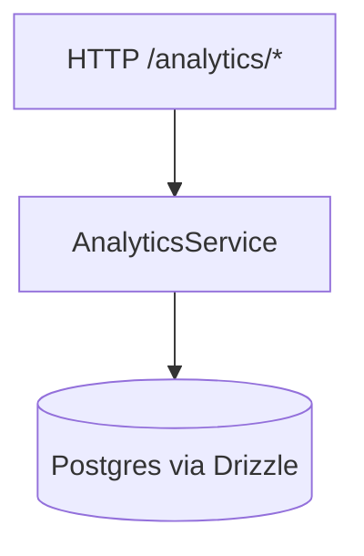

# 📈 Analytics

**Status:** ✅ Active (mounted in `apps/api/src/index.ts`) | Modular Split April 2026  
**Base Path:** `/analytics`  
**Last Updated:** 2026-06-20  
**Última actualización:** 2026-06-20

---

## Overview

Read-only analytics endpoints for dashboards and KPIs:
- `/dashboard` (composed)
- `/financial`
- `/operational`
- `/tax`
- `/customers`

All endpoints require a `companyId` and may accept date range and currency.

---

## Quickstart

```bash
curl "http://localhost:3000/analytics/dashboard?companyId=00000000-0000-0000-0000-000000000000&currency=PEN"
```

---

## Architecture (Mermaid)



---

## Edge cases (expected)

- **Missing/invalid date range**  
  **Handling:** treat as “all time” or validation failure (verify in service)  
  **Tests:** TODO

- **Currency mismatch**  
  **Handling:** service-level normalization  
  **Tests:** TODO

---

## Testing

No dedicated test suite exists for this feature yet.

```bash
bun run --cwd apps/api test

---

- [Gentleman Philosophy](../../../../docs/meta/gentleman-philosophy.md)
```

