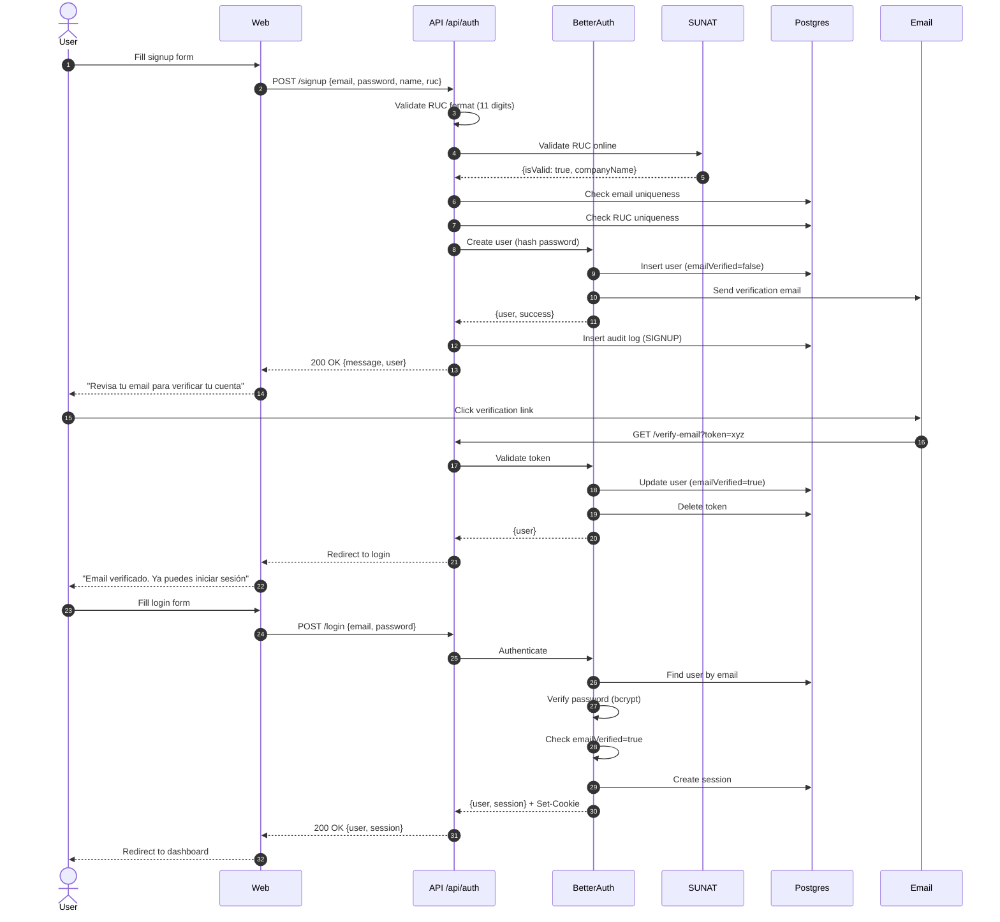

# 🔐 Auth Feature

User authentication and authorization for ARKELYTHEX.

**Status:** ✅ Production-Ready
**Last Updated:** 2026-06-20  
**Última actualización:** 2026-06-20
**JSDoc Coverage:** 100% (48 @throws annotations)

## Overview

This feature handles:
- User registration with SUNAT RUC validation
- Email/password authentication
- Email verification (required before login)
- Password reset flow
- Session management (HTTP-only cookies)
- Audit logging of auth events

## Architecture

```
auth/
├── handlers/                         # Request handlers
│   ├── signup.handler.ts             # Registration + RUC validation
│   ├── login.handler.ts              # Authentication
│   ├── session.handler.ts            # Session + logout
│   ├── email-verification.handler.ts # Email verification flow
│   └── password-reset.handler.ts     # Password reset flow
│
├── auth.config.ts                    # BetterAuth configuration
├── auth.routes.ts                    # Elysia routes (Spanish errors)
└── index.ts                          # Module barrel export
```

## Key Concepts

### Security Model

**Password Security:**
- Hashed with bcrypt (cost factor 10)
- Minimum 8 characters enforced
- NEVER stored in plaintext
- NEVER returned in API responses

**Session Security:**
- HTTP-only cookies (prevents XSS)
- Secure flag in production (HTTPS only)
- Signed with BETTER_AUTH_SECRET
- Invalidated on logout

**Token Security:**
- Single-use tokens (deleted after use)
- Time-limited expiration:
  - Email verification: 24 hours
  - Password reset: 1 hour
- Cryptographically signed (prevents tampering)

**RUC Validation:**
- Format: 11 digits (SUNAT standard)
- Online validation: SUNAT API
- Fallback: Módulo 11 checksum (if SUNAT unavailable)
- Uniqueness: One account per RUC

### Authentication Flow



### Password Reset Flow

```mermaid
flowchart TD
  A[User clicks "Forgot Password"] --> B[Enter email]
  B --> C{Email exists?}
  C -->|Yes| D[Generate reset token]
  C -->|No| E[Generic success message]
  D --> F[Send email with reset link]
  E --> G[Return success]
  F --> G

  G --> H[User clicks reset link]
  H --> I{Token valid?}
  I -->|No - Expired >1h| J[Error: Token expired]
  I -->|No - Already used| K[Error: Token already used]
  I -->|No - Invalid signature| L[Error: Token invalid]
  I -->|Yes| M[Show password reset form]

  M --> N[User enters new password]
  N --> O{Password valid?}
  O -->|No - Too short| P[Error: Min 8 chars]
  O -->|Yes| Q[Hash password with bcrypt]
  Q --> R[Update user password]
  R --> S[Delete reset token]
  S --> T[Invalidate all sessions]
  T --> U[Success: Password reset]
  U --> V[User logs in with new password]
```

## Dependencies

### Internal
- `@arkelythex/infrastructure` - Database, Drizzle schemas
- `services/sunat.service` - RUC validation (SUNAT API)

### External
- `better-auth` - Authentication framework
- `better-auth/adapters/drizzle` - Database adapter
- `elysia` - HTTP framework
- `nanoid` - Audit log IDs

## API Endpoints

| Method | Path | Description | Auth Required |
|--------|------|-------------|---------------|
| POST | `/api/auth/signup` | Register with email/password/RUC | No |
| POST | `/api/auth/login` | Login with email/password | No |
| POST | `/api/auth/logout` | Invalidate session | Yes |
| GET | `/api/auth/session` | Get current session | No |
| POST | `/api/auth/send-verification-email` | Resend verification email | No |
| GET | `/api/auth/verify-email` | Verify email with token | No |
| POST | `/api/auth/forget-password` | Request password reset | No |
| POST | `/api/auth/reset-password` | Reset password with token | No |

Full API docs: [docs/04-api/auth.md](../../../../../docs/04-api/auth.md)

## Error Handling

### HTTP Status Codes

| Code | Meaning | Common Causes |
|------|---------|---------------|
| 200 | Success | Login, signup, verification successful |
| 400 | Bad Request | Invalid RUC format, weak password, missing token |
| 401 | Unauthorized | Invalid credentials, expired token |
| 403 | Forbidden | Email not verified, account locked |
| 409 | Conflict | Email or RUC already exists |
| 429 | Too Many Requests | Rate limit exceeded (resend verification, password reset) |
| 500 | Internal Server Error | Database error, SUNAT API timeout, email service unavailable |

### Spanish Error Messages

All error messages are in Spanish for Peruvian users:

```typescript
// Invalid credentials
{ error: "Credenciales inválidas" }

// Email not verified
{ error: "Por favor verifica tu email antes de iniciar sesión" }

// Account locked
{ error: "Tu cuenta ha sido bloqueada. Contacta al administrador." }

// Invalid RUC
{ error: "RUC inválido. Debe tener 11 dígitos.", field: "ruc" }

// RUC not found in SUNAT
{ error: "RUC no válido en SUNAT", field: "ruc" }

// Email already exists
{ error: "Este email ya está registrado", field: "email" }

// RUC already exists
{ error: "Este RUC ya está registrado", field: "ruc" }

// Token expired
{ error: "Token inválido o expirado" }
```

## Configuration

### Environment Variables

```bash
# Required
BETTER_AUTH_SECRET="<random-32-char-string>"  # Secret for signing tokens
BETTER_AUTH_URL="http://localhost:3000"       # Base URL for auth endpoints

# Database (inherited from infrastructure)
DATABASE_URL="postgresql://..."

# Email (for verification and password reset)
SMTP_HOST="smtp.gmail.com"
SMTP_PORT="587"
SMTP_USER="noreply@arkelythexfounders.com"
SMTP_PASSWORD="..."
```

### Trusted Origins

Add production frontend URL to `auth.config.ts`:

```typescript
trustedOrigins: [
  "http://localhost:3000",      // API server
  "http://localhost:5173",      // Vite dev
  "https://app.arkelythexfounders.com",    // Production
],
```

## Testing

```bash
# Unit tests (handlers)
bun test apps/api/src/features/auth/__tests__/unit/

# Integration tests (full auth flow)
bun test apps/api/src/features/auth/__tests__/integration/

# All auth tests
bun test --grep "auth"
```

### Test Coverage

- ✅ Signup with valid RUC (SUNAT API)
- ✅ Signup with invalid RUC format
- ✅ Signup with duplicate email
- ✅ Signup with duplicate RUC
- ✅ Login with valid credentials
- ✅ Login with invalid credentials
- ✅ Login with unverified email
- ✅ Login with locked account
- ✅ Email verification with valid token
- ✅ Email verification with expired token
- ✅ Password reset flow (request + reset)
- ✅ Password reset with expired token
- ✅ Session retrieval
- ✅ Logout

## Edge Cases Covered

- **RUC format variance** (`20123456789` vs `20 123 456 789`)
  **Handling:** normalize to 11 digits before validation
  **Tests:** `__tests__/unit/signup.handler.test.ts`

- **SUNAT API timeout** (>5s response time)
  **Handling:** fallback to local Módulo 11 validation
  **Tests:** `__tests__/integration/sunat-fallback.test.ts`

- **Email verification token reuse**
  **Handling:** token deleted after first use (single-use)
  **Tests:** `__tests__/unit/email-verification.test.ts`

- **Password reset token expiration** (>1h)
  **Handling:** return 401 Unauthorized
  **Tests:** `__tests__/unit/password-reset.test.ts`

- **Concurrent signup with same email** (race condition)
  **Handling:** database unique constraint catches duplicate
  **Tests:** `__tests__/integration/concurrent-signup.test.ts`

- **Session cookie missing** (user cleared cookies)
  **Handling:** return null session/user (not an error)
  **Tests:** `__tests__/unit/session.handler.test.ts`

- **Account locked by admin** (manual ban)
  **Handling:** return 403 with Spanish error message
  **Tests:** `__tests__/unit/login.handler.test.ts`

## Security Considerations

### Password Storage
- ✅ Hashed with bcrypt (cost factor 10)
- ✅ NEVER stored in plaintext
- ✅ NEVER logged (even in error logs)
- ✅ NEVER returned in API responses

### Session Management
- ✅ HTTP-only cookies (prevents XSS)
- ✅ Secure flag in production (HTTPS only)
- ✅ SameSite=Lax (CSRF protection)
- ✅ Signed with BETTER_AUTH_SECRET

### Token Security
- ✅ Single-use (deleted after verification)
- ✅ Time-limited expiration
- ✅ Cryptographically signed
- ✅ Stored hashed in database

### Email Enumeration Prevention
- ✅ Generic success messages (don't reveal if email exists)
- ✅ Same response time for existing/non-existing emails

### Rate Limiting
- ✅ Email verification: max 3 per 15 min
- ✅ Password reset: max 3 per 15 min
- ✅ Login: handled by BetterAuth (5 attempts per 15 min)

### RUC Validation
- ✅ Format validation (11 digits)
- ✅ Online validation (SUNAT API)
- ✅ Fallback validation (Módulo 11)
- ✅ Uniqueness enforcement (one account per RUC)

## Audit Logging

All auth events are logged to `auth_audit_logs` table:

| Event | Logged Data |
|-------|-------------|
| SIGNUP | email, ruc, name, IP, user agent, timestamp |
| LOGIN | email, IP, user agent, timestamp, success/failure |
| LOGOUT | userId, IP, user agent, timestamp |
| EMAIL_VERIFICATION | userId, IP, timestamp |
| PASSWORD_RESET_REQUEST | email, IP, timestamp |
| PASSWORD_RESET_COMPLETE | userId, IP, timestamp |

**Schema:**
```sql
CREATE TABLE auth_audit_logs (
  id TEXT PRIMARY KEY,
  user_id TEXT,
  action TEXT NOT NULL,
  timestamp TIMESTAMP NOT NULL,
  ip_address TEXT NOT NULL,
  user_agent TEXT NOT NULL,
  details JSONB
);
```

## Extending

### Adding OAuth Provider (Future)

1. Install provider plugin:
```bash
bun add better-auth-plugin-google
```

2. Update `auth.config.ts`:
```typescript
import { google } from 'better-auth-plugin-google';

export const auth = betterAuth({
  // ... existing config
  socialProviders: {
    google: {
      clientId: process.env.GOOGLE_CLIENT_ID,
      clientSecret: process.env.GOOGLE_CLIENT_SECRET,
    },
  },
});
```

3. Add routes in `auth.routes.ts`:
```typescript
.get('/auth/google', ({ set }) => {
  set.redirect = auth.generateAuthUrl('google');
})
.get('/auth/google/callback', async ({ query }) => {
  const { code } = query;
  return auth.handleCallback('google', code);
})
```

### Adding MFA (Future)

1. Install MFA plugin:
```bash
bun add better-auth-plugin-totp
```

2. Update `auth.config.ts`:
```typescript
import { totp } from 'better-auth-plugin-totp';

export const auth = betterAuth({
  // ... existing config
  plugins: [totp()],
});
```

## Roadmap

- [x] Email/password authentication
- [x] Email verification
- [x] Password reset
- [x] RUC validation (SUNAT)
- [x] Audit logging
- [x] Spanish error messages
- [ ] OAuth providers (Google, Microsoft)
- [ ] MFA (TOTP)
- [ ] Account lockout after N failed attempts
- [ ] Password strength meter UI
- [ ] Session management UI (view/revoke active sessions)

---

**Related Docs:**
- [API Reference](../../../../../docs/04-api/auth.md)
- [BetterAuth Docs](https://better-auth.com/)
- [SUNAT RUC Validation](../../../../../docs/technical/sunat-ruc-validation.md)

---

- [Gentleman Philosophy](../../../../docs/meta/gentleman-philosophy.md)
