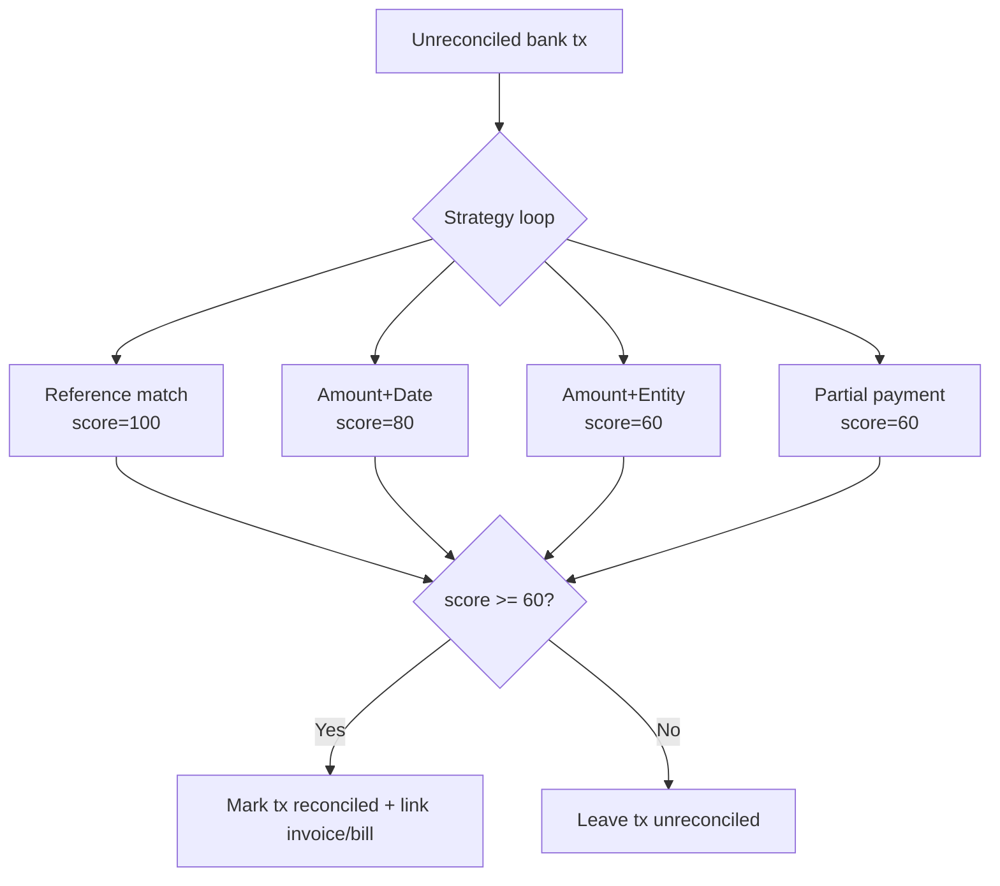
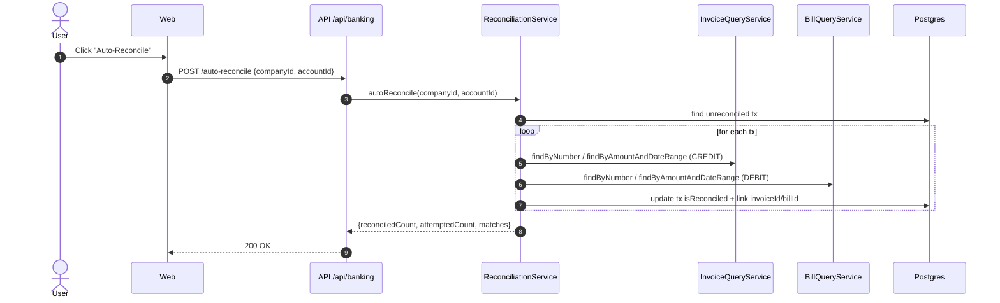

# 🏦 Banking Feature

Bank account management and transaction reconciliation for ARKELYTHEX.

**Status:** ✅ Migrated (Vertical Slice) | Modular Split April 2026  
**Last Updated:** 2026-06-20  
**Última actualización:** 2026-06-20

## Overview

This feature handles:
- Bank account CRUD (PEN/USD)
- Transaction recording and listing
- Manual and automatic reconciliation
- Bulk import (normalized transactions; CSV parsing is client-side)
- Balance summaries

## Architecture

```
banking/
├── api/                          # HTTP layer
│   ├── banking.routes.ts         # Elysia routes
│   ├── banking.handlers.ts       # Request handlers
│   └── banking.schemas.ts        # Zod validation schemas
│
├── application/                  # Use cases (services)
│   └── services/
│       ├── banking.application-service.ts
│       ├── account.service.ts
│       ├── transaction.service.ts
│       ├── reconciliation.service.ts
│       └── summary.service.ts
│
├── domain/                       # Business logic
│   ├── entities/
│   │   ├── bank-account.entity.ts
│   │   └── bank-transaction.entity.ts
│   ├── value-objects/
│   │   ├── account-number.vo.ts
│   │   ├── transaction-reference.vo.ts
│   │   └── match-score.vo.ts
│   └── services/
│       └── matching-strategy.ts  # Strategy Pattern (4 strategies)
│   └── types.ts
│
├── infrastructure/               # External concerns
│   └── banking.repository.ts     # Drizzle implementation
│
└── index.ts                      # Feature barrel export
```

## Key Concepts

### Auto-Reconciliation

Transactions are matched against invoices/bills using multiple strategies:

| Strategy | Score | Description |
|---

- [Gentleman Philosophy](../../../../docs/meta/gentleman-philosophy.md)

------

- [Gentleman Philosophy](../../../../docs/meta/gentleman-philosophy.md)

------

- [Gentleman Philosophy](../../../../docs/meta/gentleman-philosophy.md)

----|---

- [Gentleman Philosophy](../../../../docs/meta/gentleman-philosophy.md)

------

- [Gentleman Philosophy](../../../../docs/meta/gentleman-philosophy.md)

----|---

- [Gentleman Philosophy](../../../../docs/meta/gentleman-philosophy.md)

------

- [Gentleman Philosophy](../../../../docs/meta/gentleman-philosophy.md)

------

- [Gentleman Philosophy](../../../../docs/meta/gentleman-philosophy.md)

------

- [Gentleman Philosophy](../../../../docs/meta/gentleman-philosophy.md)

----|
| Reference | 100 | Exact match on invoice/bill number |
| Amount+Date | 80 | Same amount within ±3 days of due date |
| Amount+Entity | 60 | Same amount + customer/vendor name in description |
| Partial Payment | 60 | Multiple transactions summing to invoice/bill amount |

Threshold: `MIN_MATCH_SCORE = 60`

### Flow (Mermaid)





### Money Handling

All monetary values use `Money` from `@arkelythex/domain`:

```typescript
import { Money } from '@arkelythex/domain';

const balance = new Money('15000.00', 'PEN');
const newBalance = balance.add(new Money('500.00', 'PEN'));
```

## Dependencies

### Internal
- `@arkelythex/domain` - Money value object
- `@arkelythex/shared` - SecureLogger
- `@arkelythex/infrastructure` - Database, Drizzle schemas
- `features/invoice` - Invoice queries for reconciliation
- `features/bill` - Bill queries for reconciliation

### External
- None (no external bank APIs yet)

## API Endpoints

| Method | Path | Description |
|---

- [Gentleman Philosophy](../../../../docs/meta/gentleman-philosophy.md)

------

- [Gentleman Philosophy](../../../../docs/meta/gentleman-philosophy.md)

-----|---

- [Gentleman Philosophy](../../../../docs/meta/gentleman-philosophy.md)

------

- [Gentleman Philosophy](../../../../docs/meta/gentleman-philosophy.md)

---|---

- [Gentleman Philosophy](../../../../docs/meta/gentleman-philosophy.md)

------

- [Gentleman Philosophy](../../../../docs/meta/gentleman-philosophy.md)

------

- [Gentleman Philosophy](../../../../docs/meta/gentleman-philosophy.md)

------

- [Gentleman Philosophy](../../../../docs/meta/gentleman-philosophy.md)

----|
| GET | `/api/banking/accounts` | List accounts |
| GET | `/api/banking/accounts/:id` | Get account |
| GET | `/api/banking/accounts/:id/balance` | Get balances |
| POST | `/api/banking/accounts` | Create account |
| DELETE | `/api/banking/accounts/:id` | Soft delete |
| GET | `/api/banking/accounts/:id/transactions` | List transactions |
| POST | `/api/banking/transactions` | Create transaction |
| POST | `/api/banking/transactions/:id/reconcile` | Manual reconcile |
| POST | `/api/banking/auto-reconcile` | Auto-reconcile all |
| POST | `/api/banking/import` | Import (normalized transactions) |
| GET | `/api/banking/summary` | Get summary |

Full API docs: [docs/04-api/banking.md](../../../../../docs/04-api/banking.md)

## Extending

### Adding a New Matching Strategy

1. Create strategy class:

```typescript
// domain/services/my-matching.strategy.ts
import { MatchingStrategy, MatchCandidate, MatchContext } from './matching-strategy.interface';
import { BankTransaction } from '../entities/bank-transaction.entity';

export class MyMatchingStrategy implements MatchingStrategy {
  readonly priority = 2.5; // Between existing strategies
  readonly criteria = 'MY_CRITERIA' as const;

  async match(tx: BankTransaction, ctx: MatchContext): Promise<MatchCandidate | null> {
    // Your matching logic
    return null;
  }
}
```

2. Register in `ReconciliationService`:

```typescript
// application/services/reconciliation.service.ts
import { MyMatchingStrategy } from '../../domain/services/my-matching.strategy';

private strategies: MatchingStrategy[] = [
  new ReferenceMatchingStrategy(),
  new MyMatchingStrategy(), // Add here
  new AmountDateMatchingStrategy(),
  // ...
];
```

3. Add tests in `__tests__/unit/my-matching.strategy.test.ts`

### Adding Bank Format for Import

1. Create parser in `infrastructure/parsers/`:

```typescript
// infrastructure/parsers/scotiabank.parser.ts
export class ScotiabankParser implements BankStatementParser {
  parse(csv: string): ParsedTransaction[] {
    // Parse Scotiabank-specific format
  }
}
```

2. Register in format map

## Testing

```bash
# Unit tests
bun test apps/api/src/features/banking/__tests__/unit/

# Integration tests
bun test apps/api/src/features/banking/__tests__/integration/

# All banking tests
bun test --grep "banking"
```

### Test Fixtures

Located in `__tests__/fixtures/banking.fixtures.ts`:
- `createTestAccount()` - Factory for BankAccount
- `createTestTransaction()` - Factory for BankTransaction
- `TestIds` - Consistent UUIDs for testing

## Configuration

Environment variables:
```bash
# None specific to banking yet
```

## ADRs

- [ADR-008: Banking Reconciliation Strategy Pattern](../../../../../docs/02-adr/adr-008-banking-reconciliation.md)

## Edge Cases Covered

- **Reference format variance** (`F001-123`, `f001 123`, `F001/123`)  
  **Handling:** normalization to uppercase + separator unification before matching  
  **Tests:** `apps/api/src/features/banking/__tests__/unit/matching-strategy.test.ts`

- **Multiple candidates, same score**  
  **Handling:** deterministic “first candidate” per strategy; highest score wins overall  
  **Tests:** `apps/api/src/features/banking/__tests__/unit/reconciliation.service.test.ts`

- **Timezone/date window boundaries (±3 days)**  
  **Handling:** date window computed using `Date` and compared against stored transaction date  
  **Tests:** `apps/api/src/features/banking/__tests__/integration/auto-reconcile.integration.test.ts`

- **Partial payment rounding (cents)**  
  **Handling:** sum with cent rounding; compare as integer cents  
  **Tests:** `apps/api/src/features/banking/__tests__/unit/reconciliation.service.test.ts`

- **Already reconciled tx**  
  **Handling:** filtered at query time (`isReconciled=false`)  
  **Tests:** `apps/api/src/features/banking/__tests__/integration/banking.repository.test.ts`

## Migration from Legacy

This feature migrates from:
- `apps/api/src/services/banking.service.ts` (481 lines)
- `apps/api/src/types/banking.types.ts`

See: [Vertical Slice Migration Guide](../../../../../docs/technical/vertical-slice-migration-guide.md)

## Roadmap

- [x] Account management
- [x] Transaction CRUD
- [x] Manual reconciliation
- [x] Auto-reconciliation (4 strategies)
- [x] Partial payment detection (basic sum matching)
- [ ] Bank API integration (BCP, BBVA)
- [ ] Scheduled reconciliation jobs
- [ ] Reconciliation dashboard UI

---

- [Gentleman Philosophy](../../../../docs/meta/gentleman-philosophy.md)

---
