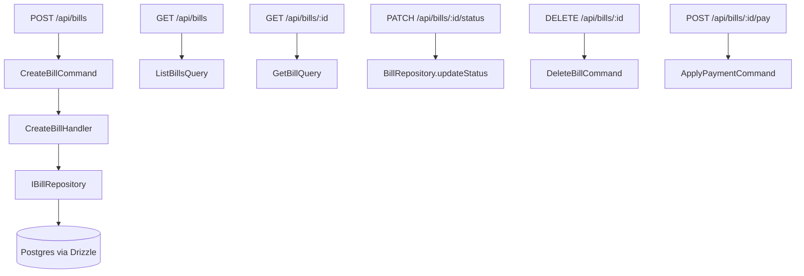

# 🧾 Bill (Vertical Slice)

**Status:** ✅ Migrated (CQRS + REST)  
**Base Path:** `/api/bills`  
**Last Updated:** 2026-06-20  
**Última actualización:** 2026-06-20

---

## Overview

This feature is a vertical slice implementing:
- Bill domain aggregate (IGV 18% for compras)
- CQRS (Commands + Queries) for write/read
- REST API endpoints (`/api/bills`)
- Query service used by Banking reconciliation
- Repository interface + Drizzle implementation

## Endpoints

- POST   `/api/bills`          - Create
- GET    `/api/bills`          - List (filters: status, vendorId, dates, search)
- GET    `/api/bills/:id`      - Get single
- PATCH  `/api/bills/:id/status` - Update status (with transition rules)
- DELETE `/api/bills/:id`      - Delete **DRAFT only**
- POST   `/api/bills/:id/pay`  - Apply payment

## Mounting

Routes are mounted by default in the main API app:

`apps/api/src/app.ts`

Legacy controller routes may still exist under `apps/api/src/routes/bills.routes.ts`, but they are outside the canonical API surface and should not be extended for new work.

---

## Architecture (Mermaid)



---

## Edge cases

- Duplicate bill number per company → rejected on create.
- Due date before issue date → rejected on create.
- Delete rule → only `DRAFT` bills can be deleted.
- Payments:
  - Currency mismatch rejected.
  - Overpayment rejected.
  - Persistence currently updates only `status` when fully paid (no partial-payment tracking yet).

---

## Testing

```bash
bun run --cwd apps/api test
```

---

## References

- Banking reconciliation uses the query service: `../banking/README.md`

---

- [Gentleman Philosophy](../../../../../docs/meta/gentleman-philosophy.md)
