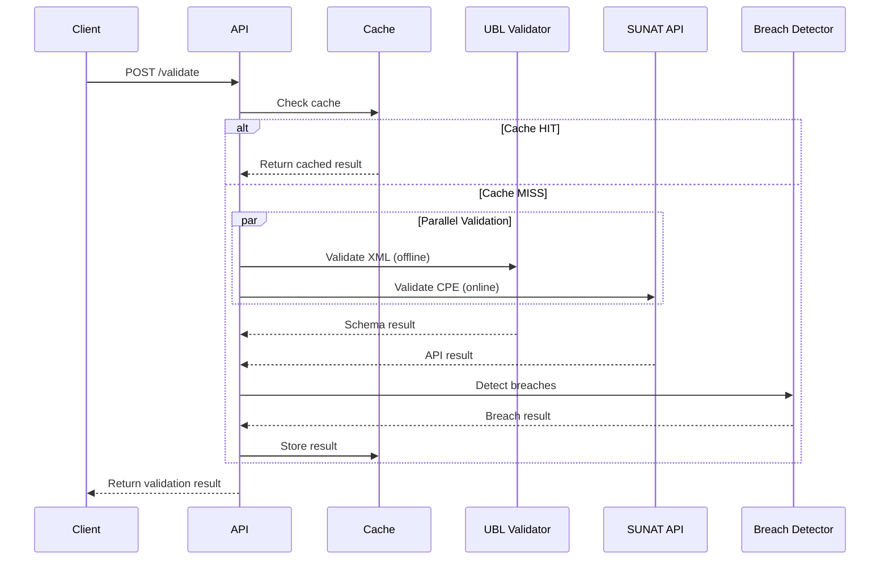

# 📋 CPE Validator (Real-Time)

**Status:** ✅ Active (Task 2.1.1)
**Base Path:** `/cpe-validator`
**Last Updated:** 2026-06-20  
**Última actualización:** 2026-06-20
**Breach Detection:** < 10s

---

## Overview

Real-time CPE (Comprobante de Pago Electrónico) validation with breach detection in under 10 seconds.

**Features:**
- **UBL 2.1 XML Validation** (offline) - Schema validation before SUNAT submission
- **RUC Validation** - Módulo 11 algorithm per SUNAT specs
- **SUNAT API Integration** - Real-time CPE status validation
- **Breach Detection** - RUC mismatch, schema errors, rejections in < 10s
- **Smart Caching** - LRU cache (1000 entries, 1h TTL) to avoid re-validation
- **Parallel Validation** - UBL + SUNAT validated concurrently

**Reglas SUNAT (baseline actual):**
- SUNAT indica “Reglas de Validación” actualizadas al **2026-02-09**.
- Arkelythex ya expone esa baseline en `GET /cpe-validator/rules-meta`.
- La cobertura actual sigue siendo **parcial**: validación estructural + estados SUNAT; la matriz completa/XSD aún está pendiente.

---

## Architecture

```
cpe-validator/
├── domain/
│   ├── value-objects/
│   │   ├── ruc.vo.ts               # RUC with módulo 11
│   │   ├── cpe-number.vo.ts        # CPE format (F001-00001234)
│   │   └── validation-result.vo.ts # Validation outcome
│   └── services/
│       ├── ubl-validator.service.ts      # Offline XML validation
│       ├── breach-detector.service.ts    # < 10s breach detection
│       └── validation-cache.service.ts   # LRU cache
├── infrastructure/
│   └── sunat-cpe-client.ts        # SUNAT API client
├── application/
│   └── commands/
│       └── validate-cpe.command.ts # Orchestration
└── api/
    └── routes.ts                   # Elysia routes
```

---

## API Endpoints

### POST /cpe-validator/validate

Validate CPE XML with breach detection.

**Request:**
```json
{
  "companyRuc": "20100070970",
  "cpeNumber": "F001-00001234",
  "xmlContent": "<?xml version=\"1.0\"...>",
  "issueDate": "2026-02-15",
  "totalAmount": 1000.00,
  "skipCache": false
}
```

**Response (Valid):**
```json
{
  "success": true,
  "data": {
    "isValid": true,
    "status": "VALID",
    "errors": [],
    "warnings": [],
    "durationMs": 1234,
    "breachDetected": false,
    "cacheHit": false
  }
}
```

**Response (Validation Failure / Breach):**
```json
{
  "success": false,
  "code": "SUNAT_OBSERVED",
  "supportMessage": "Revisar tributos, totales y datos del comprobante antes de reenviar.",
  "runbook": {
    "id": "RB-CPE-INCIDENT-2026-02",
    "title": "Runbook de Incidentes CPE SUNAT/OSE"
  },
  "data": {
    "isValid": false,
    "status": "BREACH_DETECTED",
    "errors": [{
      "code": "BREACH",
      "message": "RUC mismatch: company 20100070970 ≠ document 20987654326"
    }],
    "durationMs": 45,
    "breachDetected": true,
    "breachType": "RUC_MISMATCH",
    "cacheHit": false,
    "incident": {
      "isIncident": true,
      "category": "SUNAT_OBSERVED",
      "severity": "medium",
      "summary": "SUNAT returned observations that must be reviewed before final submission.",
      "supportMessage": "Revisar tributos, totales y datos del comprobante antes de reenviar."
    }
  }
}
```

**HTTP status:** `400` when validation fails or an operational incident is detected.

### GET /cpe-validator/cache-stats

Get validation cache statistics.

### GET /cpe-validator/rules-meta

Returns the current SUNAT rules baseline date and Arkelythex coverage status.

### GET /cpe-validator/error-catalog

Returns a stable catalog of common SUNAT error codes mapped to:
- `incidentCategory`
- `severity`
- `summary`
- `supportMessage`
- `recommendedActions`

Useful for frontend UX and support triage without hardcoding mappings in multiple places.

---

## RUC Validation (Módulo 11)

Peru RUC uses módulo 11 algorithm for check digit validation:

```typescript
const FACTORS = [5, 4, 3, 2, 7, 6, 5, 4, 3, 2];

function validateRuc(ruc: string): boolean {
  const digits = ruc.split('').map(Number);
  const checkDigit = digits[10];

  let sum = 0;
  for (let i = 0; i < 10; i++) {
    sum += digits[i] * FACTORS[i];
  }

  const remainder = sum % 11;
  let expected = 11 - remainder;

  if (expected === 10) expected = 0;
  if (expected === 11) expected = 1;

  return checkDigit === expected;
}
```

**Example:** `20100070970` (Supermercados Peruanos)

Sources:
- [validate-ruc npm](https://www.npmjs.com/package/validate-ruc)
- [RUC Peru Validator Gist](https://gist.github.com/robertoandres24/c8df5cd740e01a78adbe54af4a032d29)

---

## Breach Detection Scenarios

| Breach Type | Severity | Detection Time | Example |
|-------------|----------|----------------|---------|
| RUC_MISMATCH | CRITICAL | < 50ms | Company RUC ≠ Document RUC |
| SCHEMA_INVALID | HIGH | < 100ms | Missing UBL required elements |
| SUNAT_REJECTED | HIGH | ~5s | SUNAT API returns rejection |
| TIMEOUT | MEDIUM | > 10s | Validation exceeds 10s threshold |

---

## Validation Pipeline



---

## Environment Variables

```bash
# SUNAT CPE Validation Mode
SUNAT_CPE_VALIDATION_MODE=simulation  # or "production"

# SUNAT API Configuration
SUNAT_API_BASE_URL=https://api.sunat.gob.pe
SUNAT_API_TIMEOUT_MS=15000
```

---

## Testing

```bash
# Run all tests
bun test apps/api/src/features/cpe-validator/__tests__/cpe-validator.test.ts

# Run specific scenario
bun test --grep "Breach Detection"
```

**Test Coverage:** 14/14 tests passed

- ✅ RUC módulo 11 validation
- ✅ CPE number format parsing
- ✅ Valid UBL XML (< 10s)
- ✅ Invalid schema detection
- ✅ Malformed XML detection
- ✅ RUC mismatch breach (< 10s)
- ✅ LRU cache eviction
- ✅ TTL expiration

---

## Performance

- **UBL Validation:** ~3ms (offline)
- **SUNAT API:** ~5s (online, MVP simulation)
- **Breach Detection:** < 50ms
- **Total (cache miss):** ~5s
- **Total (cache hit):** < 10ms

**Target:** 95% of validations < 10s ✅

---

## Production Roadmap

- [x] RUC módulo 11 validation
- [x] CPE number parsing
- [x] UBL offline validation (basic)
- [x] Breach detection (< 10s)
- [x] LRU cache
- [x] SUNAT API integration (simulation mode)
- [ ] Full UBL 2.1 XSD validation (required for full parity with SUNAT rules updated 2026-02-09)
- [ ] Real SUNAT API integration (OAuth)
- [ ] Retry logic with exponential backoff
- [ ] Circuit breaker for SUNAT API
- [ ] Metrics & observability

---

## References

**SUNAT Documentation:**
- [CPE Web Service Manual](https://cpe.sunat.gob.pe/sites/default/files/inline-files/Manual-de-Consulta-Integrada-de-Comprobante-de-Pago-por-ServicioWEB_v2_0.pdf)
- [UBL 2.1 OASIS Standard](https://docs.oasis-open.org/ubl/UBL-2.1.html)

**Libraries:**
- [libxmljs2-xsd](https://www.npmjs.com/package/libxmljs2-xsd) - XSD validation
- [validate-ruc](https://www.npmjs.com/package/validate-ruc) - RUC validation

**Related Features:**
- [SIRE Feature](../sire/README.md) - SUNAT SIRE integration
- [Agent Audit Trail](../agent-audit-trail/README.md) - Immutable decision logs

---

- [Gentleman Philosophy](../../../../docs/meta/gentleman-philosophy.md)
