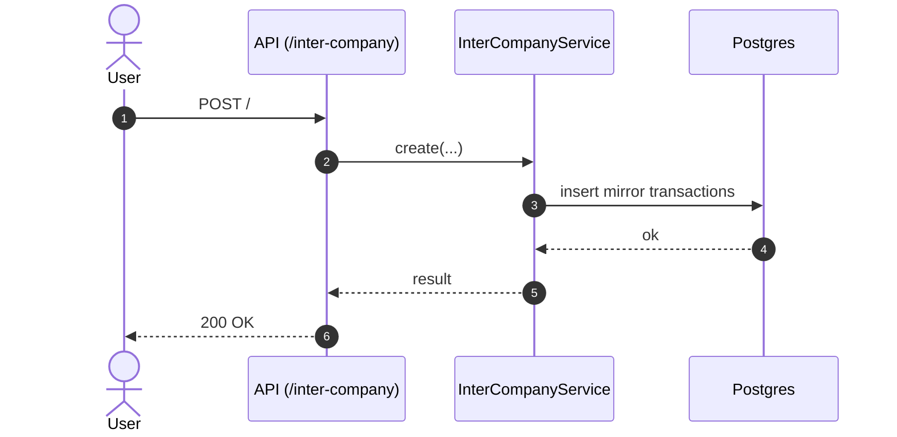

# 🔁 Inter-Company

**Status:** ✅ Active (mounted in `apps/api/src/index.ts`)  
**Base Path:** `/inter-company`  
**Last Updated:** 2026-06-20  
**Última actualización:** 2026-06-20

---

## Overview

Inter-company (within an economic group) transaction logic:
- Create mirror transactions between two companies
- List historical inter-company movements for a group
- Generate SPOT PDF for a transaction
- Group-level stats

---

## Quickstart

### Create an inter-company movement
```bash
curl -X POST http://localhost:3000/inter-company \
  -H "Content-Type: application/json" \
  -d '{
    "economicGroupId": "group-123",
    "fromCompanyId": "company-a",
    "toCompanyId": "company-b",
    "concept": "Préstamo intercompany",
    "amount": 1000,
    "taxType": "GRAVADO"
  }'
```

---

## Architecture (Mermaid)



---

## Edge cases (expected)

- **Same company used as source and destination**  
  **Handling:** reject (business rule)  
  **Tests:** TODO

---

- [Gentleman Philosophy](../../../../docs/meta/gentleman-philosophy.md)

- **Amount <= 0**  
  **Handling:** request validation fails  
  **Tests:** TODO

---

- [Gentleman Philosophy](../../../../docs/meta/gentleman-philosophy.md)

