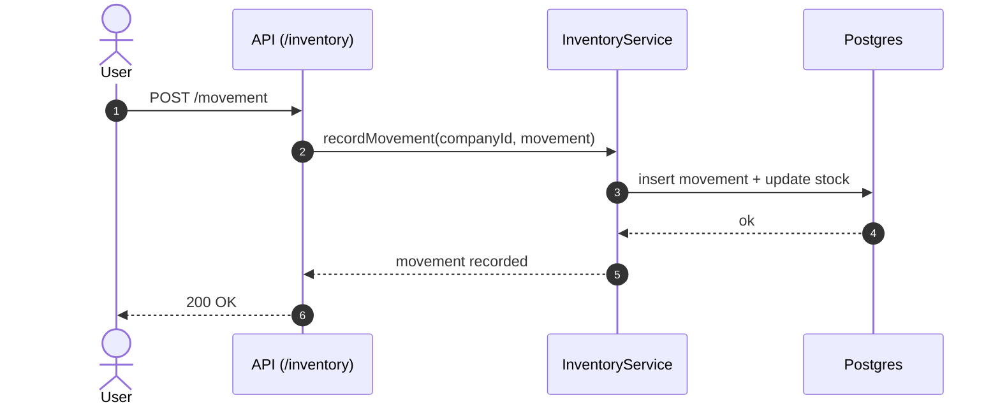

# 🧮 Inventory

**Status:** 💤 Dormant / unmounted inventory surface  
**Base Path:** `/inventory`  
**Runtime Status:** Not mounted in `apps/api/src/app-core.ts`  
**Last Updated:** 2026-06-20  
**Última actualización:** 2026-06-20

---

## Overview

This module is **not part of the active runtime baseline** because it is not mounted in `app-core.ts`.

Inventory operations:
- List inventory for a company (optionally by warehouse)
- Record stock movements (`IN`, `OUT`, `TRANSFER`, `ADJUSTMENT`)
- Kardex query (SUNAT-style movement history)
- Warehouses management (list/create)
- Movement write path runs under a single database transaction (movement + balance update)
- Zod-backed request validation at route boundaries
- Route-level response contract validation before envelope serialization
- Inventory costing uses fixed-scale decimal arithmetic (no float-based balance updates)

---

## Quickstart

### Record a movement
```bash
curl -X POST "http://localhost:3000/inventory/movement?companyId=00000000-0000-0000-0000-000000000000" \
  -H "Content-Type: application/json" \
  -d '{
    "productId": "00000000-0000-0000-0000-000000000000",
    "type": "IN",
    "quantity": 10,
    "unitCost": 25.50,
    "reference": "INVOICE",
    "referenceNumber": "F001-00000001"
  }'
```

### Kardex
```bash
curl "http://localhost:3000/inventory/kardex/00000000-0000-0000-0000-000000000000?startDate=2026-01-01&endDate=2026-02-03"
```

---

## Architecture (Mermaid)



---

## Edge cases (expected)

- **Negative stock (OUT > available)**  
  **Handling:** should be rejected by business rules (verify in service)  
  **Tests:** Add dedicated service + route negative-stock scenarios before runtime promotion.

- **TRANSFER without `warehouseId`**  
  **Handling:** validation or rule enforcement  
  **Tests:** Add dedicated validation tests before runtime promotion.

---

## Testing

Current baseline unit coverage exists at:

- `apps/api/src/features/inventory/__tests__/unit/inventory-service.test.ts`
- `apps/api/src/features/inventory/__tests__/unit/inventory-routes.test.ts`

```bash
bun test apps/api/src/features/inventory/__tests__/unit/inventory-service.test.ts apps/api/src/features/inventory/__tests__/unit/inventory-routes.test.ts

---

- [Gentleman Philosophy](../../../../docs/meta/gentleman-philosophy.md)
```
