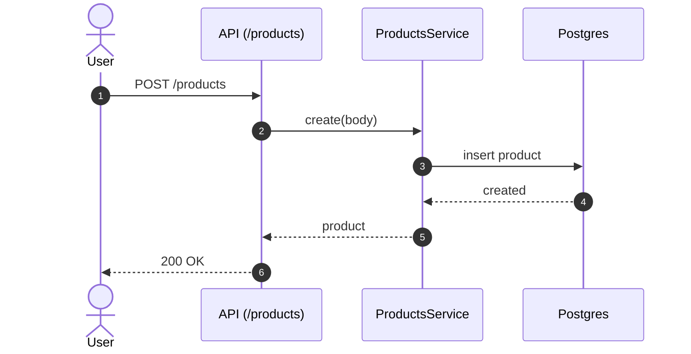

# 📦 Products

**Status:** 💤 Dormant / unmounted products surface  
**Base Path:** `/products`  
**Runtime Status:** Not mounted in `apps/api/src/app-core.ts`  
**Last Updated:** 2026-06-20  
**Última actualización:** 2026-06-20

---

## Overview

This module is **not part of the active runtime baseline** because it is not mounted in `app-core.ts`.

Product catalog management:
- Create / list / get / update / delete
- Optional stock + pricing fields for inventory workflows
- Zod-backed request validation at route boundaries
- Route-level response contract validation before envelope serialization

---

## Quickstart

### Create a product
```bash
curl -X POST http://localhost:3000/products \
  -H "Content-Type: application/json" \
  -d '{
    "companyId": "00000000-0000-0000-0000-000000000000",
    "sku": "SKU-001",
    "name": "Laptop HP",
    "unitPrice": "1500.00",
    "taxType": "GRAVADO",
    "unit": "NIU",
    "stockQuantity": "0"
  }'
```

### List products
```bash
curl "http://localhost:3000/products?companyId=00000000-0000-0000-0000-000000000000"
```

---

## Architecture (Mermaid)



---

## Edge cases (expected)

- **Invalid `taxType`**  
  **Handling:** request validation fails  
  **Tests:** Add explicit route-validation tests before runtime promotion.

- **Negative stock / pricing values**  
  **Handling:** should be rejected by validation/business rules (verify in service)  
  **Tests:** Add dedicated service tests for monetary and stock constraints.

---

## Testing

Current baseline unit coverage exists at:

- `apps/api/src/features/products/__tests__/unit/products-service.test.ts`
- `apps/api/src/features/products/__tests__/unit/products-routes.test.ts`

```bash
bun test apps/api/src/features/products/__tests__/unit/products-service.test.ts apps/api/src/features/products/__tests__/unit/products-routes.test.ts

---

- [Gentleman Philosophy](../../../../docs/meta/gentleman-philosophy.md)
```
