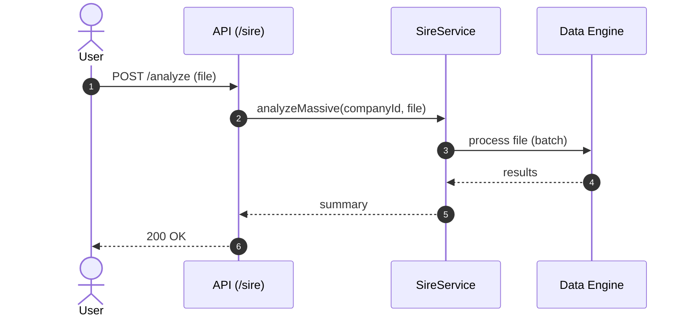

# 🧾 SIRE (Analysis + Submission)

**Status:** ✅ Active (mounted in `apps/api/src/index.ts`)  
**Base Path:** `/sire`  
**Last Updated:** 2026-06-20  
**Última actualización:** 2026-06-20
**Compliance Deadline:** June 2026

---

## Overview

SIRE (Sistema Integrado de Registros Electrónicos) feature provides:
- **Batch Analysis** (`/sire/analyze`): File validation and processing
- **Submission Service** (`/sire/submit`): API-first strategy with simulation fallback
- **Conciliation** (`/sire/conciliation`): Reproducibility SIRE vs ledger
- **Operational Dashboard** (`/sire/dashboard`): Deadline + compliance + issues
- **Application Layer**: Clean architecture with CQRS patterns
- **API Standard**: Uses `ok()/fail()` pattern (ADR-012)

### Recent Updates (2026-02-13)
- ✅ Application layer with commands/queries structure
- ✅ Submission service with API-first + simulation fallback
- ✅ Unit tests for submission route and service
- ✅ Integration with ok()/fail() pattern
- ✅ OAuth 2.0 (SOL) authentication flow for SUNAT API
- ✅ Token cache in memory (refresh with safety margin)

---

## Quickstart

### Analyze (file upload)
```bash
curl -X POST "http://localhost:3000/sire/analyze?companyId=00000000-0000-0000-0000-000000000000" \
  -F "file=@./path/to/sire-file.txt"
```

### Submit (SUNAT API or simulation fallback)
```bash
curl -X POST "http://localhost:3000/sire/submit" \
  -H "Content-Type: application/json" \
  -d '{
    "companyId":"cmp_123",
    "period":"2026-02",
    "ledgerType":"ventas",
    "payloadFormat":"txt",
    "payloadBase64":"dGVzdA==",
    "dryRun":false,
    "governance":{
      "objective":"submit_february_sales_book",
      "estimatedAmountPen":3500,
      "riskScore":0.12
    }
  }'
```

Governance behavior (`/sire/submit`):
- Returns `403` when policy thresholds are breached without approval override.
- Returns `503` when `AUTONOMY_GLOBAL_KILL_SWITCH=true`.
- Persists governance trace in SIRE audit storage (`warnings/errors` JSON fields).

### Conciliation (SIRE vs ledger)
```bash
curl "http://localhost:3000/sire/conciliation?companyId=cmp_123&period=2026-02"
```

### Operational dashboard
```bash
curl "http://localhost:3000/sire/dashboard?companyId=cmp_123&period=2026-02"
```

## Configuration

Environment variables for `/sire/submit`:
- `SIRE_SUBMISSION_MODE`: `api` or `simulation` (default: `simulation`)
- `SIRE_AUTH_MODE`: `auto` | `token` | `oauth-sol` (default: `auto`)
- `SIRE_API_TOKEN`: Bearer token directo (si usas `token` o `auto` con token fijo)
- `SIRE_API_BASE_URL`: default `https://api-sire.sunat.gob.pe`
- `SIRE_API_SUBMISSION_PATH`: ruta legacy común para ambos libros (compatibilidad)
- `SIRE_API_SALES_SUBMISSION_PATH`: ruta de ventas (default: upload preliminar v22)
- `SIRE_API_PURCHASES_SUBMISSION_PATH`: ruta de compras (default: upload preliminar v22)
- `SIRE_API_TIMEOUT_MS`: default `15000`
- `SIRE_API_UPLOAD_MODE`: `json-base64` o `multipart-zip`
- `SIRE_API_UPLOAD_FIELD_NAME`: nombre de campo multipart para ZIP (default `archivo`)
- `SIRE_ALLOW_API_SIMULATION_FALLBACK`: `true`/`false` (default `true`)
- `COMPANY_RUC`: optional, included in outbound payload when present

OAuth SOL (cuando `SIRE_AUTH_MODE=oauth-sol` o `auto` sin `SIRE_API_TOKEN`):
- `SUNAT_OAUTH_BASE_URL`: default `https://api-seguridad.sunat.gob.pe`
- `SUNAT_OAUTH_TOKEN_PATH_TEMPLATE`: default `/v1/clientessol/{clientId}/oauth2/token/`
- `SUNAT_OAUTH_SCOPE`: default `https://api-sire.sunat.gob.pe`
- `SUNAT_CLIENT_ID`
- `SUNAT_CLIENT_SECRET`
- `SUNAT_SOL_USERNAME` (sin o con RUC; el servicio soporta ambos)
- `SUNAT_SOL_PASSWORD`

Referencias oficiales:
- https://cpe.sunat.gob.pe/node/158
- https://cpe.sunat.gob.pe/sites/default/files/inline-files/Manual%20de%20servicios%20Web%20Api%20Ventas%20v22_Parte%20I.pdf
- https://cpe.sunat.gob.pe/sites/default/files/inline-files/Manual%20de%20servicios%20Web%20Api%20-%20SIRE_Compras%20v22.pdf

---

## Architecture (Mermaid)



---

## Edge cases (expected)

- **Invalid file format / encoding**  
  **Handling:** reject with error and report line/field details (verify in service)  
  **Tests:** TODO

- **Large files (memory/time limits)**  
  **Handling:** streaming or chunked processing (verify in service)  
  **Tests:** TODO

---

## Testing

Dedicated unit tests:

```bash
bun run --cwd apps/api test:run src/features/sire/__tests__/unit/sire-submit-route.test.ts
bun run --cwd apps/api test:run src/features/sire/__tests__/unit/sire-submission.service.test.ts
bun run --cwd apps/api test:run src/features/sire/__tests__/unit/sire-dashboard-routes.test.ts

---

- [Gentleman Philosophy](../../../../docs/meta/gentleman-philosophy.md)
```
