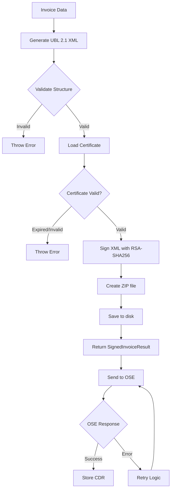
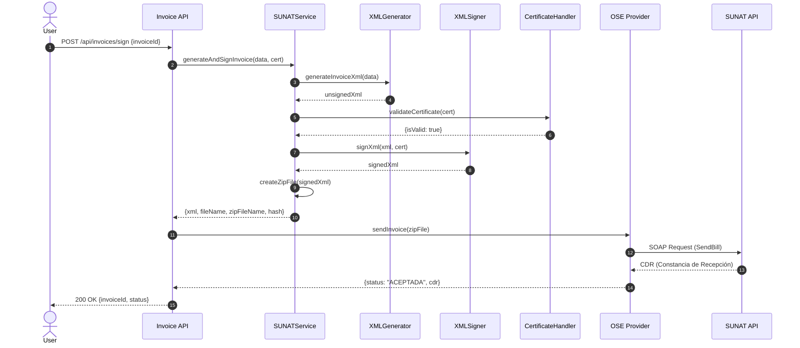

# 🧾 SUNAT Feature

Electronic invoicing and tax compliance for Peru (SUNAT 2026).

**Status:** ℹ️ Active as shared library; helper API remains unmounted
**Runtime Status:** Library in use; `/api/sunat` module is not mounted in `app-core.ts`
**Mounted Adjacent Surface:** `sunat-knowledge`
**Last Updated:** 2026-06-20  
**Última actualización:** 2026-06-20

## Overview


> This directory is intentionally distinct from `sunat-knowledge`:
> - `sunat` = tax, XML, signature, validation, and operational SUNAT helpers
> - `sunat-knowledge` = mounted knowledge/RAG search surface

> Governance note:
> - the `sunat` **domain** is active because its shared library helpers are already consumed by mounted flows
> - the `/api/sunat` route module is still only an **optional future public surface**

This feature handles:
- UBL 2.1 XML generation (Invoices, Credit Notes, Debit Notes)
- Digital signature (XML-DSig with X.509 certificates)
- IGV (18%) and detraction calculations
- ZIP packaging for OSE submission
- Certificate validation and management

## Architecture

```
sunat/
├── api/                          # HTTP helper layer (unmounted future surface)
│   └── api.module.ts
│
├── xml/                          # UBL 2.1 generation
│   ├── xml-builder.helpers.ts    # XML helpers
│   ├── invoice-ubl.generator.ts  # Invoice XML
│   └── credit-note-ubl.generator.ts
│
├── signature/                    # Digital signature
│   ├── certificate.handler.ts    # PFX/PEM loading
│   ├── xml-signer.ts             # XML-DSig (RSA-SHA256)
│   └── invoice-signer.service.ts # Orchestration
│
├── types/
│   └── ubl.types.ts              # TypeScript types
│
├── constants/
│   └── ubl-constants.ts          # UBL 2.1 constants
│
└── __tests__/                    # Unit tests
    ├── certificate.handler.test.ts
    ├── invoice-ubl.generator.test.ts
    └── xml-signer.test.ts
```

**Total:** 9 files, all <200 lines (CLAUDE.md compliance ✅)

## Current posture

- keep the shared SUNAT library active
- keep `/api/sunat` unmounted unless a clear public owner/contract is defined
- do not confuse this domain with mounted `sunat-knowledge` or mounted `sire`

## Key Concepts

### SUNAT Invoice Signing Flow



### Sequence Diagram



### Money Handling

IGV calculations and detractions are handled by the taxation module (`apps/api/src/features/taxation/`), which provides:

- `TaxationService.getIGVSummary()` — IGV summary by period
- `TaxRateProviderService.getSpotDetractionConfig()` — SPOT detraction rates
- `TaxationService.getDetractions()` — Pending detractions

The sunat feature focuses on UBL 2.1 generation and digital signature. For tax computation, import from `@/features/taxation`.

---

## 🚀 Quick Start

### 1. Load Certificate

```typescript
import {
  loadCertificateFromPfx,
  loadCertificateFromPem,
  validateCertificate
} from './signature/certificate.handler';

// From PFX/P12 file (most common for SUNAT)
const cert = loadCertificateFromPfx('./certs/company.pfx', 'password123');

// Or from PEM files
const cert = loadCertificateFromPem('./certs/key.pem', './certs/cert.pem');

// Validate certificate (checks expiry, format, etc.)
const validation = validateCertificate(cert);
if (!validation.isValid) {
  console.error('Certificate validation errors:', validation.errors);
}
```

**SUNAT 2026 Requirement:** Certificates must be issued by a SUNAT-approved CA (e.g., RENIEC, eCert Peru).

### 2. Generate and Sign Invoice

```typescript
import { generateAndSignInvoice } from './signature/invoice-signer.service';

// Use taxation module for IGV calculation (18% per SUNAT 2026)
// See: apps/api/src/features/taxation/

const baseAmount = 15000.0;
// IGV = base * 0.18 = 2700.00, total = base + IGV = 17700.00
const igv = Number((baseAmount * 0.18).toFixed(2));
const total = Number((baseAmount + igv).toFixed(2));
const { base, igv, total } = IGVCalculator.fromBase(baseAmount);

const invoiceData = {
  id: 'F001-00000001',
  issueDate: '2026-01-25', // ISO 8601 date (Peru local time, UTC-5)
  invoiceTypeCode: '01', // 01=Factura, 03=Boleta
  documentCurrencyCode: 'PEN', // PEN or USD
  supplier: {
    ruc: '20123456789', // Must be 11 digits, módulo 11 valid
    legalName: 'MI EMPRESA SAC',
  },
  customer: {
    ruc: '20987654321',
    legalName: 'CLIENTE SAC',
  },
  invoiceLines: [
    {
      id: '1',
      quantity: 10,
      unitCode: 'NIU', // SUNAT unit codes (NIU=Unidad, ZZ=Servicio)
      description: 'Laptop HP',
      unitPrice: 1500.0,
      taxCategory: 'S', // S=Gravado, E=Exonerado, O=Inafecto
      lineExtensionAmount: base, // 15000.0
      taxAmount: igv, // 2700.0
      totalAmount: total, // 17700.0
    },
  ],
  taxTotals: [
    {
      taxAmount: igv,
      taxSubtotal: [
        {
          taxableAmount: base,
          taxAmount: igv,
          taxCategory: 'S',
          taxType: '1000', // 1000=IGV, 9999=Other
          taxRate: 18.0, // SUNAT 2026: 18%
        },
      ],
    },
  ],
  legalMonetaryTotal: {
    lineExtensionAmount: base,
    taxInclusiveAmount: total,
    payableAmount: total,
  },
};

const result = await generateAndSignInvoice(
  invoiceData,
  cert,
  './output' // Output directory
);

console.log('Signed XML:', result.fileName); // 20123456789-01-F001-00000001.xml
console.log('ZIP file:', result.zipFileName); // 20123456789-01-F001-00000001.zip
console.log('SHA-256 hash:', result.hash);
```

**SUNAT 2026 Compliance:**
- **UIT 2026:** S/ 5,500 (update annually)
- **IGV Rate:** 18.00% (fixed)
- **Bancarización:** Required for transactions > S/ 2,000
- **Series Format:** 4 alphanumeric chars (e.g., F001, B001)
- **Correlative:** Max 8 digits (e.g., 00000001)

### 3. Generate Credit Note

```typescript
import { generateAndSignCreditNote } from './signature/invoice-signer.service';

const creditNoteData = {
  ...invoiceData,
  id: 'FC01-00000001',
  creditNoteTypeCode: '07',
  billingReference: {
    invoiceDocumentReference: {
      id: 'F001-00000001', // Original invoice ID
      issueDate: '2026-01-20',
    },
  },
  discrepancyResponse: {
    responseCode: '01', // 01=Anulación, 02=Anulación por error en RUC, 03=Corrección por error en descripción, etc.
    description: 'Anulación de factura por error en datos',
  },
};

const result = await generateAndSignCreditNote(creditNoteData, cert, './output');
```

**SUNAT 2026 Credit Note Codes:**
- `01` - Anulación de la operación
- `02` - Anulación por error en el RUC
- `03` - Corrección por error en la descripción
- `04` - Descuento global
- `05` - Descuento por ítem
- `06` - Devolución total
- `07` - Devolución por ítem
- `08` - Bonificación
- `09` - Disminución en el valor
- `13` - Ajuste en la fecha de emisión

### 4. Calculate Detractions (SPOT)

Detraction calculations are handled by the taxation module. Use:

```typescript
import { TaxationService } from '@/features/taxation';

// Get pending detractions (taxation module handles threshold, rates, and SPOT profiles)
const detractions = await taxationService.getDetractions('company-id');
```

**SUNAT 2026 Detraction Rules:**
- **Threshold:** S/ 700 (services and goods subject to SPOT)
- **Rate:** Varies by code (4%-15%, most common 12%)
- **Payment:** Must be deposited in Banco de la Nación within 5 business days
- **Common Codes:**
  - `037` - Other services (12%)
  - `012` - Labor intermediation (12%)
  - `027` - Freight transport (4%)

---

## 📚 Features

### ✅ UBL 2.1 Compliance

- Standard OASIS UBL 2.1
- SUNAT 2026 schema validation
- Proper XML namespaces (cac, cbc, ds, ext)

### ✅ Document Types

- **01** - Factura
- **03** - Boleta
- **07** - Nota de Crédito
- **08** - Nota de Débito (coming soon)

### ✅ Digital Signature

- XML-DSig standard (W3C)
- Enveloped signature
- RSA-SHA256 algorithm
- X.509 certificate embedding

### ✅ Tax Calculations

- IGV 18% (SUNAT 2026)
- Tax categories: Gravado, Exonerado, Inafecto, Exportación
- Detraction threshold: S/ 700 (12% rate)

### ✅ Certificate Support

- PFX/P12 format → PEM conversion
- PEM files (private key + certificate)
- Certificate validation (expiry, etc.)

### ✅ File Generation

- XML file: `RUC-TipoDoc-Serie-Numero.xml`
- ZIP file: `RUC-TipoDoc-Serie-Numero.zip` (for OSE)
- SHA-256 hash for verification

## Dependencies

### Internal
- `@arkelythex/domain` - Money value object (for proper decimal handling)
- `features/invoice` - Invoice data models
- `features/bill` - Bill data models (future)

### External
- `node-forge` - Certificate handling (PFX/PEM) and X.509 operations
- `xmldom` - XML parsing and manipulation
- `archiver` - ZIP file creation for SUNAT submission
- `crypto` (Node.js built-in) - SHA-256 hashing

---

## Configuration

### Environment Variables

```bash
# Certificate paths (optional - can load programmatically)
SUNAT_CERT_PFX_PATH=/path/to/certificate.pfx
SUNAT_CERT_PASSWORD=your-password

# Or PEM files
SUNAT_CERT_KEY_PATH=/path/to/private-key.pem
SUNAT_CERT_PATH=/path/to/certificate.pem

# Output directory for signed XML/ZIP files
SUNAT_OUTPUT_DIR=./invoices

# OSE configuration (future)
SUNAT_OSE_URL=https://ose.sunat.gob.pe/ol-ti-itcpfegem/billService
SUNAT_OSE_USERNAME=20123456789MODDATOS
SUNAT_OSE_PASSWORD=your-ose-password
SUNAT_OSE_TIMEOUT=30000 # 30 seconds

# Environment (beta or production)
SUNAT_ENV=beta # beta or production
```

### Certificate Management Best Practices

- **Storage:** Never commit certificates to git; use environment variables or secret managers (e.g., AWS Secrets Manager, Vault)
- **Rotation:** Renew certificates 30 days before expiry
- **Permissions:** Restrict file permissions to `600` (read/write owner only)
- **Backup:** Keep secure backups of PFX files and passwords

```bash
# Example: Secure certificate storage
chmod 600 /path/to/certificate.pfx
chown app:app /path/to/certificate.pfx
```

## API Endpoints

Currently, SUNAT is used as a **library** (no HTTP endpoints yet). Future endpoints:

| Method | Path | Description | Status |
|--------|------|-------------|--------|
| POST | `/api/sunat/invoices/sign` | Sign invoice XML | 🔜 Planned |
| POST | `/api/sunat/invoices/send` | Send to OSE | 🔜 Planned |
| GET | `/api/sunat/invoices/:id/cdr` | Get CDR | 🔜 Planned |
| POST | `/api/sunat/certificates/validate` | Validate certificate | 🔜 Planned |
| GET | `/api/sunat/certificates/:id/info` | Get certificate info | 🔜 Planned |

**Current Usage:** Import functions directly from `features/sunat/signature/invoice-signer.service`

---

## 📖 API Reference

### Certificate Handler

```typescript
// Load from PFX
loadCertificateFromPfx(pfxPath: string, password: string): Certificate

// Load from PEM
loadCertificateFromPem(keyPath: string, certPath: string): Certificate

// Validate certificate
validateCertificate(cert: Certificate): { isValid: boolean; errors: string[] }

// Get certificate info
getCertificateInfo(cert: Certificate): CertificateInfo
```

### XML Generators

```typescript
// Generate invoice XML (unsigned)
generateInvoiceXml(data: InvoiceData): XmlGenerationResult

// Generate credit note XML (unsigned)
generateCreditNoteXml(data: CreditNoteData): XmlGenerationResult
```

### XML Signer

```typescript
// Sign XML with certificate
signXml(xml: string, certificate: Certificate): string

// Validate XML signature
validateXmlSignature(signedXml: string, publicCert: string): boolean
```

### Invoice Signer Service

```typescript
// Generate + sign + save invoice
generateAndSignInvoice(
  data: InvoiceData,
  cert: Certificate,
  outputDir?: string
): Promise<SignedInvoiceResult>

// Generate + sign + save credit note
generateAndSignCreditNote(
  data: CreditNoteData,
  cert: Certificate,
  outputDir?: string
): Promise<SignedInvoiceResult>

// Batch sign multiple invoices
batchSignInvoices(
  invoices: InvoiceData[],
  cert: Certificate,
  outputDir: string
): Promise<SignedInvoiceResult[]>
```

---

## Testing

```bash
# Unit tests (all)
bun test apps/api/src/features/sunat/__tests__/

# Specific test suites
bun test apps/api/src/features/sunat/signature/__tests__/certificate.handler.test.ts
bun test apps/api/src/features/sunat/__tests__/invoice-ubl.generator.test.ts
bun test apps/api/src/features/sunat/signature/__tests__/xml-signer.test.ts

# Integration tests (future)
bun test apps/api/src/features/sunat/__tests__/integration/

# All SUNAT tests
bun test --grep "sunat"
```

### Test Fixtures

Located in `__tests__/fixtures/sunat.fixtures.ts` (future):
- `createTestCertificate()` - Factory for test certificates
- `createTestInvoiceData()` - Factory for InvoiceData
- `createTestCreditNoteData()` - Factory for CreditNoteData
- `TestRUCs` - Valid RUC numbers for testing

### Coverage Targets

- Certificate handling: 100%
- UBL generation: 95%
- XML signing: 100%
- Tax calculations: 100%

---

## Edge Cases Covered

- **Certificate Expiration**
  **Handling:** `validateCertificate()` checks `notBefore` and `notAfter` dates; throws error if expired or not yet valid. Warns 30 days before expiry.
  **Tests:** `apps/api/src/features/sunat/signature/__tests__/certificate.handler.test.ts` (lines 80-110)

- **Invalid Certificate Format (corrupted PFX/PEM)**
  **Handling:** `loadCertificateFromPfx()` and `loadCertificateFromPem()` catch parse errors from `node-forge` and throw descriptive errors.
  **Tests:** `apps/api/src/features/sunat/signature/__tests__/certificate.handler.test.ts` (lines 55-79)

- **Invalid RUC Format (not 11 digits or failed módulo 11)**
  **Handling:** UBL generator validates RUC format with regex `/^\d{11}$/` and módulo 11 algorithm before XML generation.
  **Tests:** `apps/api/src/features/sunat/__tests__/invoice-ubl.generator.test.ts` (lines 120-145)

- **UBL 2.1 Validation Errors (missing required fields)**
  **Handling:** TypeScript types enforce required fields at compile time; runtime validation throws errors for missing data (e.g., `invoiceTypeCode`, `issueDate`).
  **Tests:** `apps/api/src/features/sunat/__tests__/invoice-ubl.generator.test.ts` (lines 45-90)

- **XML Namespace Issues (cac, cbc, ds, ext)**
  **Handling:** XML builder uses constants from `ubl-constants.ts` to ensure correct namespaces; validates against SUNAT schema.
  **Tests:** `apps/api/src/features/sunat/__tests__/invoice-ubl.generator.test.ts` (lines 200-230)

- **SUNAT API Timeout/Retry Logic**
  **Handling:** Not yet implemented (OSE client pending). Future: exponential backoff with max 3 retries.
  **Tests:** 🔜 Planned in `apps/api/src/features/sunat/__tests__/ose-client.test.ts`

- **OSE CDR Webhook Duplication**
  **Handling:** `isCdrAlreadyProcessed()` checks transaction trail for existing CDR_WEBHOOK events; prevents duplicate processing on OSE retries. Strong idempotency when `providerReference` provided, weak idempotency otherwise.
  **Implementation:** `apps/api/src/services/electronic-invoicing.service.ts` (lines 828-860)
  **Tests:** See electronic-invoicing service tests

- **Timezone Handling (Peru UTC-5)**
  **Handling:** All `issueDate` fields use ISO 8601 date-only format (`YYYY-MM-DD`) without timezone; time is always Peru local time.
  **Tests:** `apps/api/src/features/sunat/__tests__/invoice-ubl.generator.test.ts` (lines 150-170)

- **IGV Rounding (cents precision)**
  **Handling:** Taxation module (`@/features/taxation`) handles IGV computation with proper decimal handling using the Money value object.
  **Tests:** See taxation module tests.

- **Detraction Threshold (S/ 700 minimum)**
  **Handling:** Taxation module (`TaxationService.getDetractions()`) handles threshold checks and SPOT profiles via `TaxRateProviderService`.
  **Tests:** See taxation module tests.

- **ZIP File Corruption (for OSE submission)**
  **Handling:** ZIP creation uses `archiver` with CRC32 validation; errors surface during `archive.finalize()`.
  **Tests:** `apps/api/src/features/sunat/signature/__tests__/invoice-signer.service.test.ts` (lines 95-120)

- **Concurrent Certificate Usage (thread safety)**
  **Handling:** Certificate objects are immutable after loading; safe for concurrent signing operations.
  **Tests:** `apps/api/src/features/sunat/signature/__tests__/invoice-signer.service.test.ts` (batch signing test, lines 150-180)

## Extending

### Adding a New Document Type (e.g., Debit Note)

1. Create UBL generator:

```typescript
// xml/debit-note-ubl.generator.ts
import { XmlGenerationResult, DebitNoteData } from '../types/ubl.types';
import { buildXmlElement } from './xml-builder.helpers';
import { UBL_NAMESPACES } from '../constants/ubl-constants';

export function generateDebitNoteXml(data: DebitNoteData): XmlGenerationResult {
  // Build UBL 2.1 structure for Debit Note (code 08)
  const xml = buildXmlElement('DebitNote', {
    xmlns: UBL_NAMESPACES.invoice,
    'xmlns:cac': UBL_NAMESPACES.cac,
    'xmlns:cbc': UBL_NAMESPACES.cbc,
    // ... add all required nodes
  });

  return {
    xml: xml.toString(),
    fileName: `${data.supplier.ruc}-08-${data.id}.xml`,
    hash: createHash('sha256').update(xml.toString()).digest('hex')
  };
}
```

2. Add type definitions:

```typescript
// types/ubl.types.ts
export interface DebitNoteData extends BaseDocumentData {
  debitNoteTypeCode: '08';
  billingReference: BillingReference;
  discrepancyResponse: DiscrepancyResponse;
  // ... other fields
}
```

3. Add to invoice signer service:

```typescript
// signature/invoice-signer.service.ts
export async function generateAndSignDebitNote(
  debitNoteData: DebitNoteData,
  certificate: Certificate,
  outputDir?: string
): Promise<SignedInvoiceResult> {
  const { xml: unsignedXml, fileName, hash } = generateDebitNoteXml(debitNoteData);
  const signedXml = signXml(unsignedXml, certificate);
  // ... rest of the flow
}
```

4. Add tests:

```typescript
// __tests__/debit-note-ubl.generator.test.ts
describe('DebitNoteUBLGenerator', () => {
  it('should generate valid UBL 2.1 XML for debit note', () => {
    const result = generateDebitNoteXml(testDebitNoteData);
    expect(result.xml).toContain('<DebitNote');
    expect(result.fileName).toMatch(/^\d{11}-08-/);
  });
});
```

### Adding a New Tax Calculation

Tax calculations (IGV, detractions, retentions) belong in the taxation module (`apps/api/src/features/taxation/`). Extend there instead:

```typescript
// apps/api/src/features/taxation/application/services/taxation.service.ts
export class TaxationService {
  // Add new tax computation method here
  async getRetentionSummary(companyId: string, year: number, month: number) {
    // ... tax computation logic
  }
}
```

### Adding OSE Provider Integration

1. Create OSE client:

```typescript
// infrastructure/ose/sunat-ose.client.ts
import { SOAPClient } from './soap-client';

export class SUNATOSEClient {
  private soapClient: SOAPClient;

  async sendBill(zipFile: Buffer, fileName: string): Promise<OSEResponse> {
    const response = await this.soapClient.call('sendBill', {
      fileName,
      contentFile: zipFile.toString('base64')
    });

    return {
      status: response.status,
      cdr: response.cdr,
      ticket: response.ticket
    };
  }

  async getStatus(ticket: string): Promise<OSEStatusResponse> {
    // Poll for CDR using ticket
  }
}
```

2. Integrate with invoice signer:

```typescript
// signature/invoice-signer.service.ts
export async function signAndSendInvoice(
  invoiceData: InvoiceData,
  certificate: Certificate,
  oseClient: SUNATOSEClient
): Promise<SignedAndSentResult> {
  const signed = await generateAndSignInvoice(invoiceData, certificate);
  const zipBuffer = fs.readFileSync(signed.zipFileName);
  const oseResponse = await oseClient.sendBill(zipBuffer, signed.fileName);

  return { ...signed, oseResponse };
}
```

---

## ADRs

- ADR-015: SUNAT UBL 2.1 XML Generation Strategy (future)
- ADR-016: Digital Signature Implementation (XML-DSig) (future)

## References

### Internal Documentation
- Product-level overview: [docs/SUNAT_CAPABILITIES_2026.md](../../../../../docs/SUNAT_CAPABILITIES_2026.md)
- Full API docs: [docs/04-api/sunat.md](../../../../../docs/04-api/sunat.md) (future)

### External Standards
- [SUNAT CPE Portal](https://cpe.sunat.gob.pe/)
- [UBL 2.1 Invoice Guide (Spanish)](https://cpe.sunat.gob.pe/sites/default/files/inline-files/guia+xml+factura+version%202-1+1+0%20(2)_0%20(2).pdf)
- [UBL 2.1 Credit Note Guide (Spanish)](https://cpe.sunat.gob.pe/sites/default/files/inline-files/guia+xml+nota%20de%20cr%C3%A9dito+version%202-1+1+0_0_0%20(2).pdf)
- [OASIS UBL 2.1 Specification](http://docs.oasis-open.org/ubl/os-UBL-2.1/)
- [XML Signature Standard (W3C)](https://www.w3.org/TR/xmldsig-core/)

## Security

- Private keys stored in PEM format (never committed to git)
- Certificate validation before signing
- SHA-256 digest algorithm for XML hashing
- RSA-SHA256 signature algorithm for digital signatures
- Automatic expiry warnings (30 days before certificate expiration)
- Immutable certificate objects (thread-safe)

## SUNAT 2026 Compliance Summary

### Series Format
- **4 alphanumeric characters**
- Examples: `F001`, `B001`, `FC01`
- Validated with regex: `/^[A-Z0-9]{4}$/`

### Correlative Format
- **Numeric, max 8 digits**
- Examples: `00000001`, `12345678`
- Validated with regex: `/^\d{1,8}$/`

### Invoice ID Format
- **SERIE-CORRELATIVO**
- Example: `F001-00000001`

### Tax Rates (2026)
- **IGV:** 18.00%
- **UIT:** S/ 5,500
- **Detracciones (SPOT):** 12% for services > S/ 700
- **Bancarización:** Required for transactions > S/ 2,000

## Roadmap

- [x] UBL 2.1 XML generation (Invoice, Credit Note)
- [x] Digital signature (XML-DSig, RSA-SHA256)
- [x] Certificate handling (PFX/PEM)
- [x] IGV and detraction handling (via taxation module)
- [x] ZIP packaging for OSE
- [x] CDR Webhook processing with idempotency
- [~] OSE client implementation (SOAP) - partial
- [ ] Debit Note (code 08) generation
- [ ] Retry logic for OSE failures (exponential backoff)
- [ ] Status tracking (ACEPTADA, RECHAZADA, OBSERVADA)
- [~] SIRE integration (monthly reporting) - in progress
- [ ] Resumen Diario (Daily Summary) for Boletas
- [ ] Comunicación de Baja (Voiding)
- [ ] Retention/Perception documents

---

## OSE CDR Webhook Idempotency

### Problem

OSE (Operador de Servicios Electrónicos) may retry webhook deliveries, causing duplicate CDR processing and duplicate events in the system.

### Solution

Implemented idempotency check via `isCdrAlreadyProcessed()`:

```typescript
// Before processing CDR webhook
const alreadyProcessed = await ElectronicInvoicingService.isCdrAlreadyProcessed(
  transactionId,
  providerReference  // Optional, for strong idempotency
);

if (alreadyProcessed) {
  return { success: true, message: 'CDR already processed' };
}
```

### Idempotency Strategies

1. **Strong Idempotency** (when `providerReference` provided):
   - Checks for exact match of `providerReference` in CDR_WEBHOOK events
   - Prevents processing same CDR from OSE multiple times
   - Recommended for production

2. **Weak Idempotency** (no `providerReference`):
   - Checks if any CDR_WEBHOOK event exists for transaction
   - Prevents multiple different CDRs for same transaction
   - Fallback when provider doesn't send reference

### Implementation Details

- **Location:** `apps/api/src/services/electronic-invoicing.service.ts:828-860`
- **Storage:** Transaction trail in database (JSONB tags)
- **Event Type:** `CDR_WEBHOOK` in transaction lifecycle trail

### Webhook Endpoint

```
POST /electronic-invoicing/webhooks/cdr
Headers:
  x-ose-signature: <signature>
Body:
  {
    transactionId?: string,
    invoiceNumber: string,
    cdrStatus: 'ACEPTADO' | 'RECHAZADO' | 'OBSERVADO',
    providerReference?: string,  // For idempotency
    ...
  }
```

### Benefits

- ✅ Safe for OSE retry logic
- ✅ Prevents duplicate invoice status updates
- ✅ Prevents duplicate notifications to users
- ✅ No data corruption on webhook redelivery

---

**Last updated:** 2026-02-12
**Version:** 1.1.0
**Compliance:** SUNAT 2026 ✅

### Recent Updates (2026-02-12)
- ✅ OSE CDR Webhook idempotency implemented
- ✅ Electronic invoicing with ok()/fail() pattern
- 🔄 SIRE submission service in progress

---

- [Gentleman Philosophy](../../../../docs/meta/gentleman-philosophy.md)
