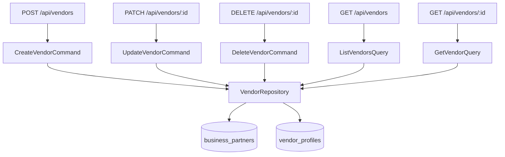

# 🧾 Vendors (Proveedores) — Vertical Slice

**Status:** ✅ Implemented (CQRS + REST)  
**Base Path:** `/api/vendors`  
**Last Updated:** 2026-06-20  
**Última actualización:** 2026-06-20

---

## Overview

Vendors are suppliers used by Bills (Facturas de Compra). This feature follows the same vertical-slice pattern as Customers:

- Rich domain entity (`Vendor`)
- CQRS: Commands + Queries
- REST API mounted in `apps/api/src/app.ts`
- Persistence: `business_partners` + `vendor_profiles`

---

## Endpoints

- POST   `/api/vendors`         - Create vendor
- GET    `/api/vendors`         - List (filters: `minRating`, `category`, `includeInactive`)
- GET    `/api/vendors/:id`     - Get vendor
- PATCH  `/api/vendors/:id`     - Update vendor (partial)
- DELETE `/api/vendors/:id`     - Soft delete (sets `sunatCondition=INACTIVO`)

---

## Business rules

- RUC validation: SUNAT Módulo 11 (`RUC.isValid`)
- Good rating: `vendorRating >= 80`
- Payment overdue: `billDate + paymentTermDays < today`
- Soft delete: never physically delete vendor records

---

## Architecture (Mermaid)



---

## Testing

```bash
bun run --cwd apps/api test

---

- [Gentleman Philosophy](../../../../docs/meta/gentleman-philosophy.md)
```
