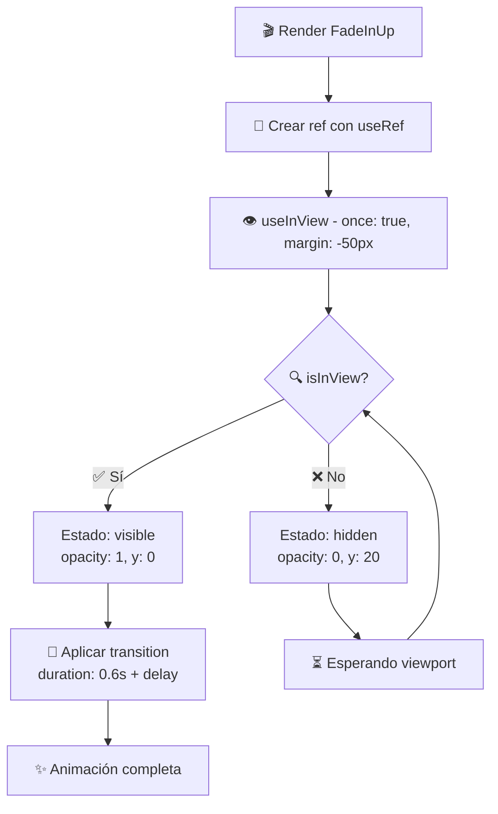
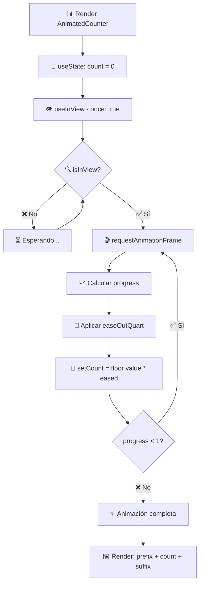

# Motion Wrappers

> Componentes de animación reutilizables basados en Framer Motion.

---

## 📍 Ubicación

```
components/motion-wrappers.tsx
```

---

## 📋 Componentes Exportados

| Componente | Descripción |
|------------|-------------|
| [`FadeInUp`](#fadeinup) | Animación de entrada con fade + slide up |
| [`StaggerContainer`](#staggercontainer) | Contenedor para animaciones escalonadas |
| [`StaggerItem`](#staggeritem) | Elemento hijo para stagger |
| [`AnimatedCounter`](#animatedcounter) | Contador numérico animado |
| [`HoverScale`](#hoverscale) | Efecto hover con escala |

---

## FadeInUp

### JSDoc

```typescript
/**
 * FadeInUp Animation Wrapper
 * 
 * Envuelve contenido y lo anima con fade-in + slide-up cuando entra al viewport.
 * Usa Intersection Observer internamente para activar la animación.
 * 
 * @component
 * @param {FadeInUpProps} props - Propiedades del componente
 * @param {ReactNode} props.children - Contenido a animar
 * @param {string} [props.className] - Clases CSS adicionales
 * @param {number} [props.delay=0] - Delay en segundos antes de iniciar animación
 * 
 * @returns {JSX.Element} Contenido envuelto en motion.div animado
 * 
 * @example
 * // Uso básico
 * <FadeInUp>
 *   <h1>Título que aparece animado</h1>
 * </FadeInUp>
 * 
 * @example
 * // Con delay escalonado
 * <FadeInUp delay={0.2}>
 *   <p>Este aparece 200ms después</p>
 * </FadeInUp>
 */
```

### Diagrama de Flujo



---

## StaggerContainer

### JSDoc

```typescript
/**
 * StaggerContainer - Contenedor para animaciones escalonadas
 * 
 * Orquesta la animación de múltiples hijos con efecto stagger.
 * Los hijos deben usar StaggerItem para heredar las variantes.
 * 
 * @component
 * @param {StaggerContainerProps} props - Propiedades
 * @param {ReactNode} props.children - StaggerItem elements
 * @param {string} [props.className] - Clases CSS adicionales
 * 
 * @returns {JSX.Element} Contenedor con animación orquestada
 * 
 * @example
 * <StaggerContainer className="grid grid-cols-3 gap-4">
 *   <StaggerItem><Card /></StaggerItem>
 *   <StaggerItem><Card /></StaggerItem>
 *   <StaggerItem><Card /></StaggerItem>
 * </StaggerContainer>
 */
```

---

## StaggerItem

### JSDoc

```typescript
/**
 * StaggerItem - Elemento hijo para animación escalonada
 * 
 * Debe usarse dentro de un StaggerContainer.
 * Hereda las variantes de animación del contenedor padre.
 * 
 * @component
 * @param {StaggerItemProps} props - Propiedades
 * @param {ReactNode} props.children - Contenido a animar
 * @param {string} [props.className] - Clases CSS adicionales
 * 
 * @returns {JSX.Element} Elemento con variantes fadeInUp
 * 
 * @example
 * <StaggerContainer>
 *   {items.map(item => (
 *     <StaggerItem key={item.id}>
 *       <ItemCard data={item} />
 *     </StaggerItem>
 *   ))}
 * </StaggerContainer>
 */
```

---

## AnimatedCounter

### JSDoc

```typescript
/**
 * AnimatedCounter - Contador numérico con animación
 * 
 * Anima el conteo desde 0 hasta el valor objetivo cuando
 * el elemento entra al viewport. Usa easing easeOutQuart.
 * 
 * @component
 * @param {AnimatedCounterProps} props - Propiedades
 * @param {number} props.value - Valor objetivo del contador
 * @param {number} [props.duration=2] - Duración de la animación en segundos
 * @param {string} [props.prefix=''] - Texto antes del número (ej: "$")
 * @param {string} [props.suffix=''] - Texto después del número (ej: "%", "+")
 * @param {string} [props.className] - Clases CSS adicionales
 * 
 * @returns {JSX.Element} Span con contador animado
 * 
 * @example
 * // Contador simple
 * <AnimatedCounter value={1500} />
 * // Resultado: "1,500"
 * 
 * @example
 * // Con prefijo y sufijo
 * <AnimatedCounter 
 *   value={99} 
 *   prefix="+" 
 *   suffix="%" 
 *   duration={1.5}
 * />
 * // Resultado: "+99%"
 * 
 * @example
 * // Precio
 * <AnimatedCounter value={199} prefix="S/ " suffix="/mes" />
 * // Resultado: "S/ 199/mes"
 */
```

### Diagrama de Flujo



---

## HoverScale

### JSDoc

```typescript
/**
 * HoverScale - Wrapper con efecto de escala al hover
 * 
 * Aplica una animación de escala suave cuando el usuario
 * pasa el cursor sobre el elemento. Usa spring physics.
 * 
 * @component
 * @param {HoverScaleProps} props - Propiedades
 * @param {ReactNode} props.children - Contenido a escalar
 * @param {string} [props.className] - Clases CSS adicionales
 * @param {number} [props.scale=1.02] - Factor de escala (1.02 = 2% más grande)
 * 
 * @returns {JSX.Element} Contenido con efecto hover
 * 
 * @example
 * // Escala por defecto (1.02)
 * <HoverScale>
 *   <Card>Contenido</Card>
 * </HoverScale>
 * 
 * @example
 * // Escala personalizada
 * <HoverScale scale={1.05}>
 *   <Button>Hover me</Button>
 * </HoverScale>
 */
```

---

## 🧪 Edge Cases Cubiertos

| # | Edge Case | Componente | Manejo |
|---|-----------|------------|--------|
| 1 | Elemento nunca visible | Todos | `once: true` previene re-animación |
| 2 | `value = 0` | AnimatedCounter | Muestra "0" sin animación |
| 3 | `duration = 0` | AnimatedCounter | Muestra valor inmediatamente |
| 4 | `scale = 1` | HoverScale | No hay efecto visible |
| 5 | Children undefined | Todos | Renderiza motion.div vacío |
| 6 | Desmontaje durante animación | AnimatedCounter | `cancelAnimationFrame` en cleanup |
| 7 | SSR | Todos | `"use client"` - solo cliente |

---

## 🔧 Variantes Reutilizables Exportadas

```typescript
// Variante fadeInUp
export const fadeInUpVariants: Variants = {
  hidden: { opacity: 0, y: 20 },
  visible: {
    opacity: 1,
    y: 0,
    transition: {
      duration: 0.6,
      ease: [0.25, 0.46, 0.45, 0.94],
    },
  },
}

// Variante stagger container
export const staggerContainerVariants: Variants = {
  hidden: {},
  visible: {
    transition: {
      staggerChildren: 0.1,
      delayChildren: 0.1,
    },
  },
}
```

---

## 📦 Dependencias

| Dependencia | Versión | Uso |
|-------------|---------|-----|
| `framer-motion` | ^10.x | Core animation library |
| `react` | ^18.x | useRef, useEffect, useState |

---

[← Volver a componentes](./README.md) | [← Volver al índice](../README.md)
