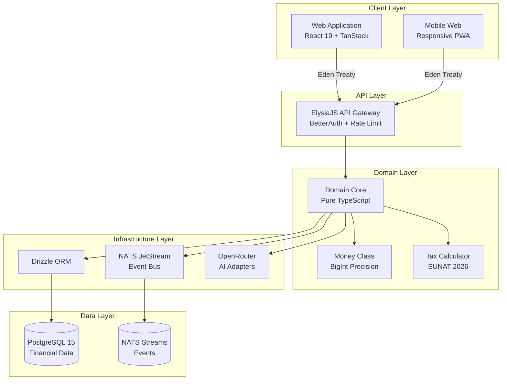
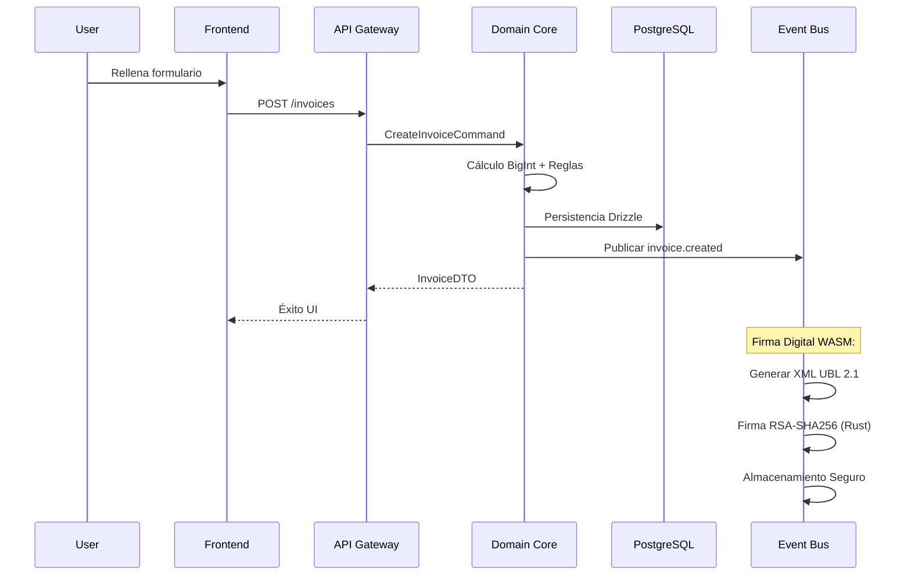

# Arquitectura del Sistema

Arkelythex utiliza una arquitectura de vanguardia diseñada para la soberanía financiera y el cumplimiento automatizado.

## High-Level Architecture

Nuestra estructura divide claramente las responsabilidades para asegurar escalabilidad y seguridad total:

## Flujo de Facturación Electrónica

El proceso de creación y firma de documentos sigue un flujo asíncrono y seguro:

## Decisiones Técnicas (ADRs)

Operamos bajo el principio de **Liderazgo Técnico Documentado**:

1.  **Firma XML Nativa**: Implementación propia en Rust/WASM para eliminar la dependencia de PSEs externos y reducir costos transaccionales a cero.
2.  **Bun vs Node**: Migramos a Bun para obtener un 3x de rendimiento en el runtime y una gestión de dependencias ultraveloz.
3.  **Vertical Slicing**: Organizamos el código por funcionalidades (features) en lugar de capas técnicas, mejorando la mantenibilidad a largo plazo.

---
> [!TIP]
> Esta arquitectura permite a Arkelythex manejar picos de facturación de fin de mes sin degradación de servicio, gracias a su motor asíncrono basado en eventos.
