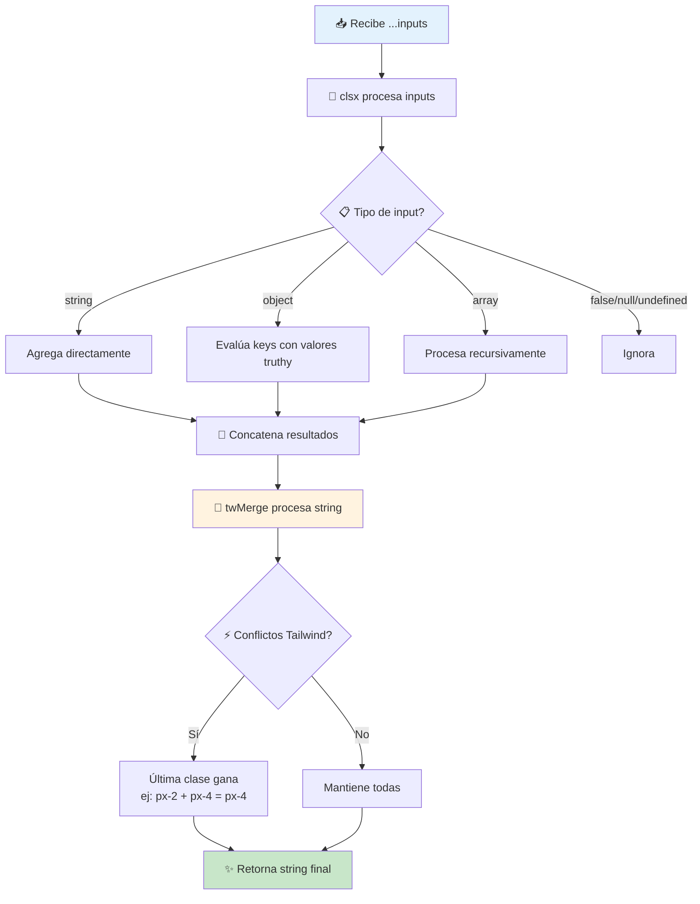

# Utils

> Funciones utilitarias del proyecto.

---

## 📍 Ubicación

```
lib/utils.ts
```

---

## cn()

### JSDoc Completo

```typescript
/**
 * Utility function to merge and deduplicate CSS class names
 * 
 * Combina múltiples valores de clases CSS en una sola cadena,
 * resolviendo conflictos de Tailwind CSS automáticamente.
 * Usa clsx para lógica condicional y tailwind-merge para deduplicación.
 * 
 * @function cn
 * @param {...ClassValue} inputs - Valores de clases a combinar
 *   - string: "px-4 py-2"
 *   - array: ["px-4", "py-2"]
 *   - object: { "bg-primary": isActive }
 *   - undefined/null: ignorado
 *   - false: ignorado
 * 
 * @returns {string} Cadena de clases combinadas y deduplicadas
 * 
 * @example
 * // Uso básico - concatenar clases
 * cn("px-4 py-2", "bg-primary")
 * // => "px-4 py-2 bg-primary"
 * 
 * @example
 * // Clases condicionales con objeto
 * cn("base-class", { "active": isActive, "disabled": isDisabled })
 * // Si isActive=true, isDisabled=false
 * // => "base-class active"
 * 
 * @example
 * // Clases condicionales con operador &&
 * cn("btn", isLarge && "btn-lg", variant === "primary" && "btn-primary")
 * // => "btn btn-lg btn-primary" (si condiciones son true)
 * 
 * @example
 * // Resolución de conflictos Tailwind
 * cn("px-2 py-1", "px-4")
 * // => "py-1 px-4" (px-2 es reemplazado por px-4)
 * 
 * @example
 * // Con className prop de componente
 * function Button({ className, children }) {
 *   return (
 *     <button className={cn("btn btn-primary", className)}>
 *       {children}
 *     </button>
 *   );
 * }
 * // <Button className="mt-4" /> => "btn btn-primary mt-4"
 * 
 * @example
 * // Arrays de clases
 * cn(["flex", "items-center"], "gap-4")
 * // => "flex items-center gap-4"
 */
export function cn(...inputs: ClassValue[]) {
  return twMerge(clsx(inputs))
}
```

---

## 🔄 Diagrama de Flujo



---

## 🧪 Edge Cases Cubiertos

| # | Edge Case | Input | Output | Manejo |
|---|-----------|-------|--------|--------|
| 1 | Sin argumentos | `cn()` | `""` | Retorna string vacío |
| 2 | Valores falsy | `cn(false, null, undefined)` | `""` | clsx ignora falsy |
| 3 | Conflicto padding | `cn("px-2", "px-4")` | `"px-4"` | twMerge resuelve |
| 4 | Conflicto margin | `cn("mt-2 mb-4", "mt-8")` | `"mb-4 mt-8"` | Última gana |
| 5 | Clases duplicadas | `cn("flex flex", "flex")` | `"flex"` | Deduplica |
| 6 | Objeto vacío | `cn({})` | `""` | Ignora objeto vacío |
| 7 | Array anidado | `cn([["a", "b"]])` | `"a b"` | Procesa recursivamente |
| 8 | Espacios extra | `cn("  px-4  ", " py-2 ")` | `"px-4 py-2"` | Normaliza espacios |

---

## 📦 Dependencias

| Paquete | Versión | Propósito |
|---------|---------|-----------|
| `clsx` | ^2.x | Lógica condicional de clases |
| `tailwind-merge` | ^2.x | Resolución de conflictos Tailwind |

---

## 🔧 Implementación

```typescript
import { clsx, type ClassValue } from 'clsx'
import { twMerge } from 'tailwind-merge'

export function cn(...inputs: ClassValue[]) {
  return twMerge(clsx(inputs))
}
```

---

## 🎯 Casos de Uso Comunes

### 1. Componente con className prop
```tsx
interface ButtonProps {
  className?: string;
  variant?: 'primary' | 'secondary';
  children: React.ReactNode;
}

function Button({ className, variant = 'primary', children }: ButtonProps) {
  return (
    <button 
      className={cn(
        "px-4 py-2 rounded-lg font-medium transition-colors",
        variant === 'primary' && "bg-primary text-white hover:bg-primary/90",
        variant === 'secondary' && "bg-secondary text-foreground hover:bg-secondary/80",
        className
      )}
    >
      {children}
    </button>
  );
}
```

### 2. Estados condicionales
```tsx
<div className={cn(
  "border rounded-lg p-4",
  isActive && "border-primary bg-primary/5",
  isDisabled && "opacity-50 cursor-not-allowed",
  hasError && "border-destructive"
)} />
```

### 3. Responsive overrides
```tsx
<div className={cn(
  "grid grid-cols-1",
  "md:grid-cols-2",
  "lg:grid-cols-3",
  fullWidth && "lg:grid-cols-1"
)} />
```

---

[← Volver a lib](./README.md) | [← Volver al índice](../README.md)
