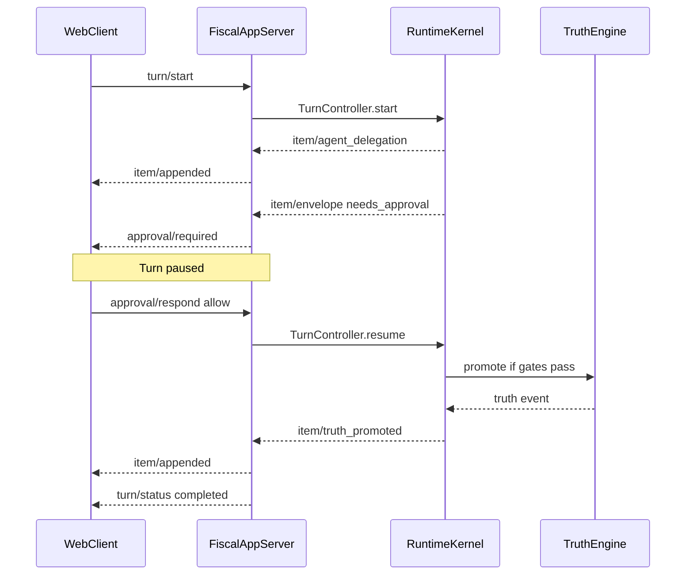
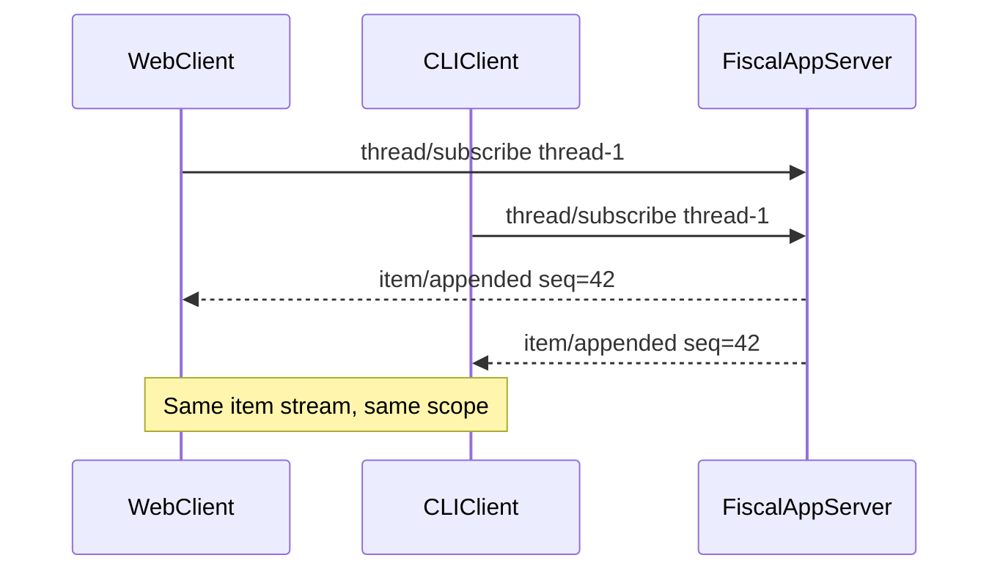

# Drenyra Fiscal App Server (DFAS) 2026

## Purpose

DFAS is Drenyra's answer to the OpenAI Codex App Server — adapted for **governed fiscal decisions**, not code diffs.

**Governing principle:**

> One fiscal thread, one scope, one item stream, one deterministic truth.

Canonical domain types: `packages/domain/src/drenyra/dfas-protocol-types.ts`  
Decision record: [ADR-034](../02-adr/adr-034-drenyra-fiscal-app-server.md)

## Why not MCP as primary transport

Codex evaluated MCP as the client protocol and rejected it for the App Server because MCP cannot support:

- bidirectional streaming item diffs;
- server-initiated approval requests that pause a turn;
- multi-client subscription to the same thread;
- persistent thread/turn state with replay.

MCP remains for **external fiscal connectors** (SUNAT SOL, ERPNext, bank APIs) under the capability matrix. DFAS is for **Drenyra clients** (Web, CLI, automations).

## Protocol overview

| Property | Value |
|---|---|
| Wire format | JSON-RPC 2.0 |
| Version constant | `DFAS_PROTOCOL_VERSION = "1.0.0"` |
| Primary transport | WebSocket `wss://host/api/drenyra/v1/ws` |
| Fallback transport | SSE `GET /api/drenyra/v1/threads/:threadId/events` |
| CLI transport | HTTP long-poll or NDJSON over stdio relay |
| Auth | Same session/Bearer as REST API + fiscal scope headers |

### Required fiscal scope

Every client request MUST include complete scope:

```json
{
  "organizationId": "org_abc",
  "companyId": "cmp_xyz",
  "companyRuc": "20123456789",
  "period": "2026-05",
  "countryCode": "PE"
}
```

Incomplete scope → `error.code = DRENYRA_SCOPE_INVALID` (fail-closed).

## Message catalog

### Client → Server (requests)

| Method | Params | Description |
|---|---|---|
| `thread/create` | `{ title, fiscalScope, sourceSurface, linkedCaseId? }` | Create scoped fiscal thread |
| `thread/resume` | `{ threadId, fiscalScope }` | Resume existing thread (scope must match) |
| `thread/subscribe` | `{ threadId, fiscalScope }` | Subscribe to item stream (multi-client) |
| `thread/unsubscribe` | `{ threadId, subscriptionId }` | Remove subscription |
| `turn/start` | `{ threadId, prompt, skillId?, orchestrationMode? }` | Start turn; optional Lexori skill |
| `turn/cancel` | `{ threadId, turnId, reason? }` | Cancel in-flight turn |
| `approval/respond` | `{ approvalId, decision, reason?, fiscalScope }` | `allow` \| `deny` \| `cancel` |

### Server → Client (notifications)

| Method | Payload | Description |
|---|---|---|
| `item/appended` | `DfasItemStreamEntry` | New item on thread stream |
| `turn/status` | `{ turnId, status, fiscalScope }` | Turn lifecycle update |
| `thread/status` | `{ threadId, status, fiscalScope }` | Thread lifecycle update |

### Server → Client (server-initiated requests)

| Method | Payload | Description |
|---|---|---|
| `approval/required` | `{ approvalId, turnId, riskLevel, summary, evidenceRefs }` | Pauses turn until client responds |

Client MUST respond to `approval/required` with `approval/respond` or `turn/cancel`.

## Item stream types

DFAS items extend Brain items with fiscal-native types:

| Item type | Payload | UI zone |
|---|---|---|
| `user_message` | `{ text }` | Center workspace |
| `assistant_message` | `{ text }` | Center workspace |
| `evidence` | `DrenyraCommandEvidenceRef[]` | Right inspector |
| `gate` | `{ phaseId, passed, reason, evidence? }` | Agent dock |
| `envelope` | `DrenyraCommandEnvelope` | Review mode |
| `capability_decision` | `DrenyraCapabilityEvaluation` | Audit panel |
| `approval_required` | `{ approvalId, riskLevel, summary }` | Review mode |
| `approval_resolved` | `{ approvalId, status, decidedBy }` | Review mode |
| `truth_promoted` | `{ eventId, evidenceRootHash, validatorVersion }` | Audit trail |
| `agent_delegation` | `{ agentId, tier, status, summary }` | Agent dock |
| `error` | `{ code, message, recoverable }` | Center workspace |

Surfaces MUST NOT drop evidence, checks, risk, approval, diff or trace when rendering envelopes.

## JSON Schema (core messages)

### FiscalScope (required on all scoped messages)

```json
{
  "$schema": "https://json-schema.org/draft/2020-12/schema",
  "$id": "https://drenyra.dev/schemas/dfas/fiscal-scope.json",
  "type": "object",
  "required": ["companyId", "companyRuc", "period", "countryCode"],
  "properties": {
    "organizationId": { "type": "string" },
    "companyId": { "type": "string", "minLength": 1 },
    "companyRuc": { "type": "string", "pattern": "^[0-9]{11}$" },
    "period": { "type": "string", "pattern": "^\\d{4}-(0[1-9]|1[0-2])$" },
    "countryCode": { "type": "string", "enum": ["PE"] }
  },
  "additionalProperties": false
}
```

### thread/create

```json
{
  "$id": "https://drenyra.dev/schemas/dfas/thread-create.json",
  "type": "object",
  "required": ["title", "fiscalScope", "sourceSurface"],
  "properties": {
    "title": { "type": "string", "minLength": 1, "maxLength": 200 },
    "fiscalScope": { "$ref": "fiscal-scope.json" },
    "sourceSurface": {
      "type": "string",
      "enum": ["cli", "tui", "web", "api", "automation"]
    },
    "linkedCaseId": { "type": "string" },
    "linkedMissionId": { "type": "string" }
  }
}
```

### turn/start

```json
{
  "$id": "https://drenyra.dev/schemas/dfas/turn-start.json",
  "type": "object",
  "required": ["threadId", "prompt", "fiscalScope"],
  "properties": {
    "threadId": { "type": "string", "minLength": 1 },
    "prompt": { "type": "string", "minLength": 1 },
    "fiscalScope": { "$ref": "fiscal-scope.json" },
    "skillId": { "type": "string", "description": "Optional Lexori skill id" },
    "orchestrationMode": {
      "type": "string",
      "enum": ["transaction", "period", "auto"],
      "default": "auto"
    },
    "traceId": { "type": "string", "format": "uuid" }
  }
}
```

### approval/respond

```json
{
  "$id": "https://drenyra.dev/schemas/dfas/approval-respond.json",
  "type": "object",
  "required": ["approvalId", "decision", "fiscalScope"],
  "properties": {
    "approvalId": { "type": "string", "minLength": 1 },
    "decision": { "type": "string", "enum": ["allow", "deny", "cancel"] },
    "reason": { "type": "string", "maxLength": 2000 },
    "fiscalScope": { "$ref": "fiscal-scope.json" }
  }
}
```

### item/appended (notification payload)

```json
{
  "$id": "https://drenyra.dev/schemas/dfas/item-appended.json",
  "type": "object",
  "required": ["entry"],
  "properties": {
    "entry": {
      "type": "object",
      "required": [
        "id",
        "threadId",
        "sequence",
        "itemType",
        "fiscalScope",
        "createdAt",
        "protocolVersion"
      ],
      "properties": {
        "id": { "type": "string" },
        "threadId": { "type": "string" },
        "turnId": { "type": "string" },
        "sequence": { "type": "integer", "minimum": 0 },
        "itemType": {
          "type": "string",
          "enum": [
            "user_message",
            "assistant_message",
            "evidence",
            "gate",
            "envelope",
            "capability_decision",
            "approval_required",
            "approval_resolved",
            "truth_promoted",
            "agent_delegation",
            "error"
          ]
        },
        "fiscalScope": { "$ref": "fiscal-scope.json" },
        "payload": { "type": "object" },
        "traceId": { "type": "string" },
        "protocolVersion": { "type": "string", "const": "1.0.0" },
        "createdAt": { "type": "string", "format": "date-time" }
      }
    }
  }
}
```

## Sequence diagrams

### Turn with approval pause



### Multi-client thread subscribe



## Error codes

| Code | HTTP equiv | Meaning |
|---|---|---|
| `DRENYRA_SCOPE_INVALID` | 400 | Incomplete or invalid fiscal scope |
| `DRENYRA_SCOPE_MISMATCH` | 403 | Thread scope ≠ request scope |
| `DRENYRA_THREAD_NOT_FOUND` | 404 | Thread id unknown in scope |
| `DRENYRA_TURN_IN_PROGRESS` | 409 | Cannot start turn while another runs |
| `DRENYRA_CAPABILITY_DENIED` | 403 | Capability matrix denied tool |
| `DRENYRA_APPROVAL_EXPIRED` | 410 | Approval window closed |
| `DRENYRA_PROTOCOL_VERSION` | 400 | Unsupported protocol version |

## Transport mapping

| Surface | Primary | Fallback |
|---|---|---|
| Web Command Center | WebSocket | SSE |
| Go CLI | NDJSON stdio relay or HTTP | REST compat v0 |
| Automations | WebSocket | REST |
| Partner API | WebSocket + scoped API key | — |

## Compat layer v0

Existing REST endpoints remain until all surfaces migrate:

| Legacy | DFAS equivalent |
|---|---|
| `POST /api/drenyra/brain/threads` | `thread/create` |
| `POST /api/drenyra/brain/threads/:id/turns` | `turn/start` |
| `GET /api/drenyra/runs/:id/events` | `thread/subscribe` + `item/appended` |
| `POST /api/drenyra/commands/*` | `turn/start` with command envelope items |

Kernel v0 MUST delegate legacy routes to the same TurnController instance used by DFAS v1.

## Related docs

- [Drenyra Dual-Surface Brain](./drenyra-dual-surface-brain.md)
- [Drenyra Command Envelope](./drenyra-command-envelope-2026.md)
- [Drenyra Runtime Contract](../08-ai-automation/drenyra-runtime-contract.md)
- [Kernel Module Design](../../apps/api/src/features/drenyra/kernel/README.md)
- [SDD Tasks](../superpowers/specs/drenyra-fiscal-app-server-tasks-2026.md)
