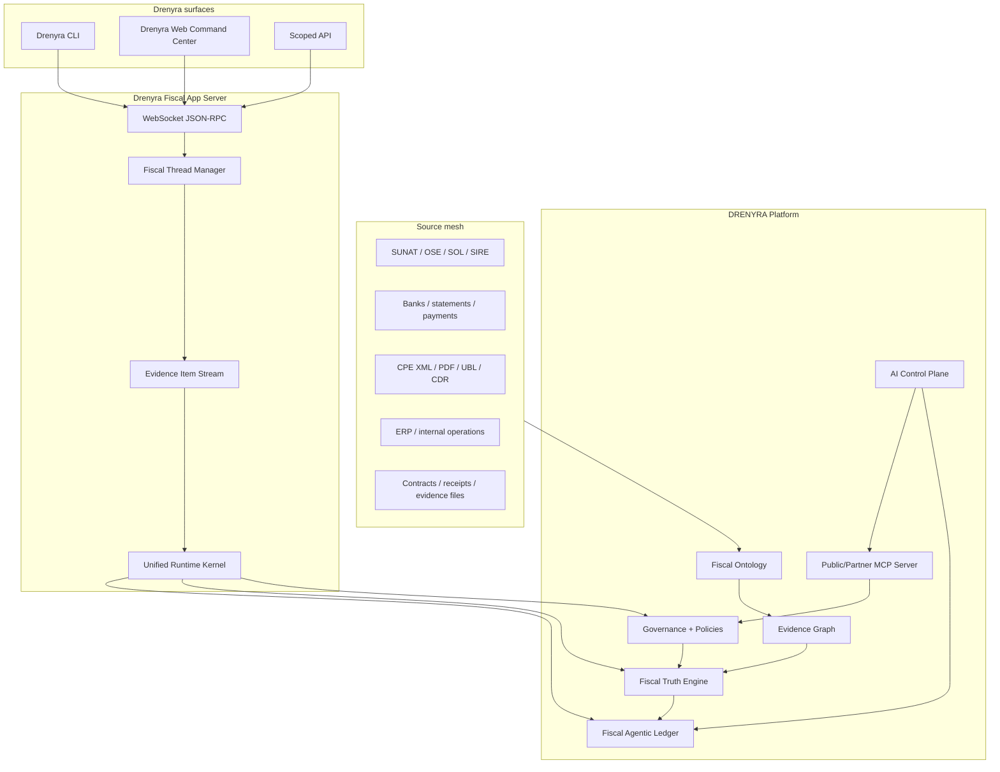
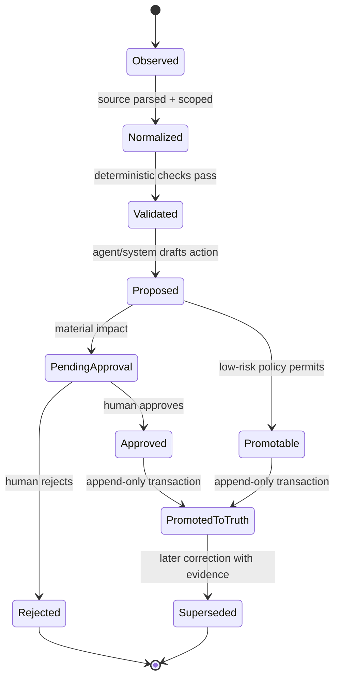
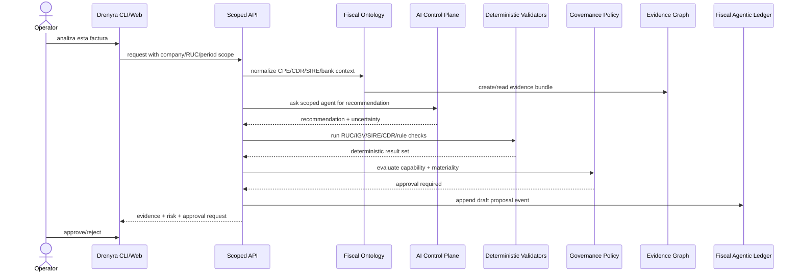

# Fiscal Intelligence Platform Architecture 2026

## Purpose

This document translates the strategic doctrine into an executable architecture.

DRENYRA is the platform. Drenyra is the command center. The Fiscal Agentic Ledger (FAL) is the governed operating model where agents prepare fiscal/accounting actions, deterministic systems validate them, humans approve material changes, and the Fiscal Truth Engine promotes only evidenced, scoped, replayable state.

## Architecture invariants

1. **AI is advisory, not fiscal authority.**
2. **Fiscal truth is deterministic, scoped, append-only and replayable.**
3. **Every read/write/job/tool call is scoped by organization, company, RUC, period and country pack where applicable.**
4. **Every material fiscal action requires evidence and approval.**
5. **Money and tax calculations use value objects/integer math, not floats.**
6. **MCP and third-party agent access are least-privilege, auditable and deny-by-default.**

## System map



## Core components

### 1. Fiscal Ontology

Semantic layer for fiscal-operational concepts. It prevents the system from treating SUNAT concepts as generic rows.

Canonical v0 contract: [Fiscal Ontology v0 2026](./fiscal-ontology-v0-2026.md), implemented in `packages/domain/src/fiscal-ontology`.

Canonical concepts:

- organization, company, RUC, taxpayer profile;
- fiscal period and country pack;
- CPE, UBL, CDR, series/correlative and document lifecycle;
- SIRE RVIE/RCE record;
- IGV, detraccion, retencion, percepcion and obligation primitives;
- bank transaction, payment evidence and bancarizacion rule context;
- accounting entry, ledger impact and close artifact;
- evidence node, evidence edge, approval, policy decision and truth event.

Implementation direction:

- keep framework-free contracts in `packages/domain`;
- use branded IDs/value objects for RUC, money, fiscal periods and evidence identifiers;
- store versioned legal rules outside UI copy;
- map country-specific rules through country packs, not forks.

### 2. Fiscal Truth Engine

Authoritative promotion boundary. AI recommendations cannot directly create truth.

Promotion requires:

1. valid scope: `organizationId`, `companyId`, `companyRuc`, period and country;
2. evidence root with source hashes and provenance;
3. deterministic validator results;
4. policy evaluation and governance bundle;
5. human approval for material/irreversible actions;
6. transactional append of evidence + truth event;
7. replay metadata: validator version, policy version, model/tool context where relevant.



### 3. Evidence Graph

Links all claims and actions back to source artifacts.

Required edge chain for material actions:

```text
source artifact -> normalized fiscal object -> deterministic validation -> agent recommendation -> policy decision -> human approval -> truth event -> ledger impact
```

If any required edge is missing, promotion fails closed.

### 4. Fiscal Agentic Ledger (FAL)

FAL is not just journal entries. It is the fiscal operating ledger of proposed, approved and promoted fiscal work.

FAL event envelope:

| Field | Purpose |
|---|---|
| `eventId` | immutable event identity |
| `scope` | organization/company/RUC/period/country |
| `kind` | classification, reconciliation, ledger entry, SIRE action, CPE/CDR status, risk finding |
| `sourceEvidence` | evidence node references and hashes |
| `proposedBy` | human/system/agent identity |
| `deterministicChecks` | validator IDs, versions and results |
| `policyDecision` | risk level, approval requirement, allowed/blocked state |
| `approval` | approver, role, timestamp, snapshot hash |
| `ledgerImpact` | journal/fiscal impact using Money/value objects |
| `audit` | trace ID, model/tool context, replay metadata |

Allowed state transitions:

```text
draft_by_agent -> validated_by_rules -> needs_human_review -> approved_by_human -> posted_to_fiscal_ledger
validated_by_rules -> auto_allowed_by_policy -> posted_to_fiscal_ledger
needs_human_review -> rejected
posted_to_fiscal_ledger -> superseded_by_correction
```

### 5. Drenyra Agent Governance

Drenyra agents are governed operators. They do not own fiscal authority.

Capability matrix:

| Capability | Default | Approval needed | Examples |
|---|---:|---:|---|
| Read scoped summary | Denied until scoped | No | RUC health, period blockers |
| Explain evidence | Denied until scoped | No | Explain CPE/CDR/SIRE chain |
| Draft recommendation | Denied until scoped | Maybe | Match invoice to bank transaction |
| Prepare ledger action | Denied until scoped | Yes if material | Proposed journal entry |
| Promote truth | Denied | Always or explicit low-risk policy | Truth event append |
| Submit/send external fiscal action | Denied | Always | SUNAT/OSE/SIRE submission |
| Access secrets/credentials | Denied | Never via agent | SUNAT credentials |

Risk levels:

| Risk | Meaning | Required controls |
|---|---|---|
| Low | read/explain only | scope + audit |
| Medium | recommendation or draft | scope + evidence + audit |
| High | fiscal/material state change | validators + approval + audit |
| Critical | SUNAT submission, posting, tax/payment impact | explicit policy + human approval + replay packet |

### 6. Drenyra CLI and Web

Drenyra is dual-surface by design.

- **CLI** is the expert/power-user surface for fiscalistas, automations and rapid command execution.
- **Web** is the visual command center for timelines, agents, diffs, evidence and approvals.

Both call the same scoped API and must show the same fiscal context.

### 6.1 Drenyra Fiscal App Server (DFAS)

DFAS is the unified transport layer inspired by the OpenAI Codex App Server, adapted for governed fiscal decisions. See [ADR-034](../02-adr/adr-034-drenyra-fiscal-app-server.md) and [DFAS Protocol Spec](./drenyra-fiscal-app-server-2026.md).

| Component | Role |
|---|---|
| WebSocket JSON-RPC | Primary bidirectional transport for Web, CLI, automations |
| Fiscal Thread Manager | Brain thread + run metadata unification |
| Item Stream | Evidence-native events: gates, envelopes, approvals, truth promotions |
| Unified Runtime Kernel | Composes harness, orchestrator, capability guard, truth boundary |
| Fiscal Guardian | Auto-approve low-risk read/explain/draft; material always human |

Protocol version: `DFAS_PROTOCOL_VERSION = "1.0.0"` in `packages/domain/src/drenyra/dfas-protocol-types.ts`.

REST endpoints (`/brain`, `/runs`, `/commands`) remain compat v0 until all surfaces migrate to DFAS v1.

Required command response envelope:

```json
{
  "scope": {
    "organizationId": "org_...",
    "companyId": "cmp_...",
    "companyRuc": "20123456789",
    "period": "2026-04",
    "countryCode": "PE"
  },
  "summary": "Recommendation prepared; approval required before posting.",
  "evidenceRefs": ["ev_..."],
  "deterministicChecks": [{ "id": "ruc-checksum", "status": "passed" }],
  "risk": "high",
  "approval": { "required": true, "state": "pending_approval" },
  "auditTraceId": "trace_..."
}
```

### 7. Public MCP architecture

A public MCP server is a strategic AI-native API, not a bypass around the platform.

Initial tool classes:

| Tool class | Examples | Mutability | Gate |
|---|---|---:|---|
| Profile/read | `get_company_fiscal_profile`, `list_period_blockers` | read-only | scope + auth |
| Evidence | `get_evidence_pack`, `explain_truth_claim` | read-only | scope + redaction |
| Proposal | `propose_reconciliation`, `draft_ledger_entry` | draft-only | policy + audit |
| Tasking | `create_agent_task`, `get_agent_task_status` | workflow | scoped capability |
| Material action | `request_approval_for_posting` | no direct execute | human approval |

MCP server rules:

- read-only by default;
- explicit scope in every request;
- no credential exposure;
- no cross-tenant memory;
- redaction before response;
- tool calls append audit events;
- mutable tools produce proposals/approval requests, not direct fiscal truth.

### 8. Multi-model control plane

Provider choice is a governed routing decision.

| Workload | Model class | Gate |
|---|---|---|
| UI summary / navigation | fast general model | low-risk scoped context |
| OCR/table extraction | document-specialized model | evidence retention + redaction |
| fiscal reasoning | strong reasoning model | deterministic validator comparison |
| sensitive client data | approved/local model | policy + data residency rule |
| public MCP answer | tool-safe model | redaction + response policy |

Every material recommendation records model/provider/tool/prompt metadata sufficient for audit without storing secrets.

## End-to-end flow: invoice risk review



## Phase implementation plan

### Phase 0 — Canon and language

- Add strategic thesis, architecture, ADR and roadmap docs.
- Make FAL terminology consistent with Fiscal Truth and Drenyra docs.
- Update navigation indices.

### Phase 1 — Fiscal Ontology contracts

- Identify existing domain contracts for RUC, Money, documents, evidence and Drenyra types.
- Add missing framework-free types only through SDD.
- Define country-pack boundary for Peru and LATAM expansion.

### Phase 2 — FAL event envelope

- Define event states, transition policy and evidence requirements.
- Add tests for immutable-style envelope creation, scope and approval transitions.
- Canonical contract: [Fiscal Agentic Ledger Event Envelope 2026](./fiscal-agentic-ledger-event-envelope-2026.md), implemented in `packages/domain/src/fiscal-agentic-ledger`.

### Phase 3 — Agent capability matrix

- Implement deny-by-default tool capability policy.
- Attach risk level and approval requirement to every fiscal tool.
- Canonical contract: [Drenyra Agent Capability Matrix 2026](./drenyra-agent-capability-matrix-2026.md), implemented in `packages/domain/src/drenyra/capabilities.ts`.

### Phase 4 — Drenyra CLI/Web command loops

- CLI commands return evidence-rich envelopes.
- Web displays same trace, diffs and approval state.

### Phase 5 — MCP read-only pilot

- Expose read-only fiscal profile/evidence tools.
- Verify redaction, scoping and audit events.

### Phase 6 — Benchmarks

- Build reproducible synthetic/anonymized datasets.
- Publish only verified, claim-register-approved metrics.

## Related canon

- [Frontier Fiscal Intelligence Platform Thesis](../business/frontier-fiscal-intelligence-platform-thesis-2026.md)
- [Fiscal Truth Engine + Evidence Graph](./fiscal-truth-engine-evidence-graph-phase-1.md)
- [Fiscal Ontology v0 2026](./fiscal-ontology-v0-2026.md)
- [Fiscal Agentic Ledger Event Envelope 2026](./fiscal-agentic-ledger-event-envelope-2026.md)
- [Drenyra Agent Capability Matrix 2026](./drenyra-agent-capability-matrix-2026.md)
- [ADR-019: Fiscal Truth Boundary](../02-adr/adr-019-fiscal-truth-boundary.md)
- [ADR-020: Evidence Graph Relational Model](../02-adr/adr-020-evidence-graph-relational-model.md)
- [ADR-021: AI Control Plane Governance Boundaries](../02-adr/adr-021-ai-control-plane-governance-boundaries.md)
- [ADR-025: Fiscal Intelligence Platform and FAL](../02-adr/adr-025-fiscal-intelligence-platform.md)
- [Drenyra CLI](../05-development/drenyra-cli.md)
- [Drenyra Agentic Fiscal Command Center Vision](../products/drenyra-agentic-fiscal-command-center-vision-2026.md)
