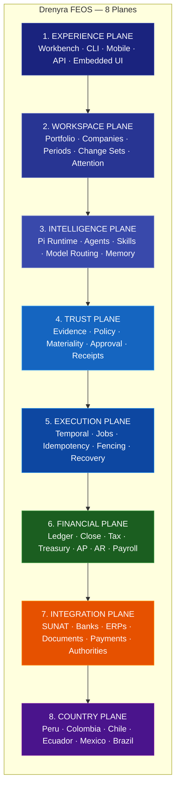

# 01 — Foundation

**Última actualización:** 2026-08-01
**Propósito:** Documentación fundacional del programa Drenyra FEOS
**Audiencia:** Todos los contribuyentes — desarrolladores, producto, fiscal, dirección

---

## Propósito

Esta sección contiene la documentación canónica que define qué es Drenyra, cómo se construye, cómo se clasifica su documentación y cuál es el estado actual del programa.

Todo documento en las demás secciones se alinea con estos principios fundacionales.

---

## Documentos

| Documento                                           | Descripción                                             | Tipo         |
| --------------------------------------------------- | ------------------------------------------------------- | ------------ |
| [Product Philosophy](./product-philosophy.md)       | Tesis definitiva: Drenyra como Financial Engineering OS | Conceptual   |
| [Strategic Positioning](./strategic-positioning.md) | Elevator pitch, moat, competencia, estrategia de cuña   | Estratégico  |
| [Drenyra-AI — Accounting Agent OS](./drenyra-ai-aos.md) | Ecosistema y protocolo contable: RDA, candidatos, autoridad | Conceptual   |
| [Drenyra-Pi — Pi-Native Harness](./drenyra-pi-harness.md) | Harness Pi-native que convierte Pi en operador contable  | Conceptual   |
| [Drenyra-Engram — Institutional Memory](./drenyra-engram.md) | Memoria institucional contable: procedencia, vigencia, aislamiento | Conceptual   |
| [Canonical Stack](./canonical-stack.md)             | Stack técnico multi-lenguaje y arquitectura hexagonal   | Arquitectura |
| [Program Taxonomy](./program-taxonomy.md)           | Clasificación documental: SDD, ADR, FSD, WSD, ASD       | Canónico     |
| [Capability Map](./capability-map.md)               | 90+ capacidades del programa por dominio                | Canónico     |
| [SDD Audit](./sdd-audit.md)                         | Estado actual de 79 SDDs contra la taxonomía            | Canónico     |

---

## Arquitectura FEOS

Drenyra se organiza en **8 planos arquitectónicos** que ninguna capa superior puede saltarse:



### Flujo de operación material

Un agente no puede llamar directamente a SUNAT. Debe atravesar cada plano:


### Mapa de navegación

Un agente no puede llamar directamente a SUNAT. Debe atravesar:

```
Agent proposal
→ Typed tool
→ Capability policy
→ Tenant scope
→ Deterministic validator
→ Approval gate
→ Durable workflow
→ External adapter
→ Evidence receipt
```

---

## Mapa de navegación

| Si buscas...                   | Ve a...                                             |
| ------------------------------ | --------------------------------------------------- |
| Entender qué es Drenyra        | [Product Philosophy](./product-philosophy.md)       |
| Entender el ecosistema Drenyra-AI | [Drenyra-AI AOS](./drenyra-ai-aos.md)            |
| Entender el harness Drenyra-Pi | [Drenyra-Pi Harness](./drenyra-pi-harness.md)       |
| Entender la memoria contable    | [Drenyra-Engram](./drenyra-engram.md)              |
| Conocer el stack técnico       | [Canonical Stack](./canonical-stack.md)             |
| Ver el roadmap de capacidades  | [Capability Map](./capability-map.md)               |
| Clasificar un documento nuevo  | [Program Taxonomy](./program-taxonomy.md)           |
| Evaluar el estado del programa | [SDD Audit](./sdd-audit.md)                         |
| Presentar Drenyra a inversores | [Strategic Positioning](./strategic-positioning.md) |

---

## Relación con otras secciones

| Sección                                                       | Dependencia                                 |
| ------------------------------------------------------------- | ------------------------------------------- |
| [10 — Development](../10-development/README.md)               | Hereda guías de desarrollo y engram          |
| [11 — ADR](../11-adr/README.md)                               | Registro de decisiones arquitectónicas      |
| [12 — Security](../12-security/README.md)                     | Controles de seguridad y secretos           |
| [13 — Operations](../13-operations/README.md)                 | Operación, observabilidad y runbooks        |
| [14 — Design](../14-design/README.md)                         | Diseño de producto y protocolos (RED, RDA)  |

---

## Documentos antiguos migrados

Los siguientes documentos de la estructura anterior han sido migrados a esta sección:

| Anterior                                      | Nueva ubicación              |
| --------------------------------------------- | ---------------------------- |
| `docs/products/drenyra-product-philosophy.md` | `./product-philosophy.md`    |
| `docs/products/drenyra-positioning.md`        | `./strategic-positioning.md` |
| `docs/architecture/canonical-stack.md`        | `./canonical-stack.md`       |
| `docs/architecture/program-taxonomy.md`       | `./program-taxonomy.md`      |
| `docs/architecture/capability-map.md`         | `./capability-map.md`        |
| `docs/architecture/sdd-audit.md`              | `./sdd-audit.md`             |
