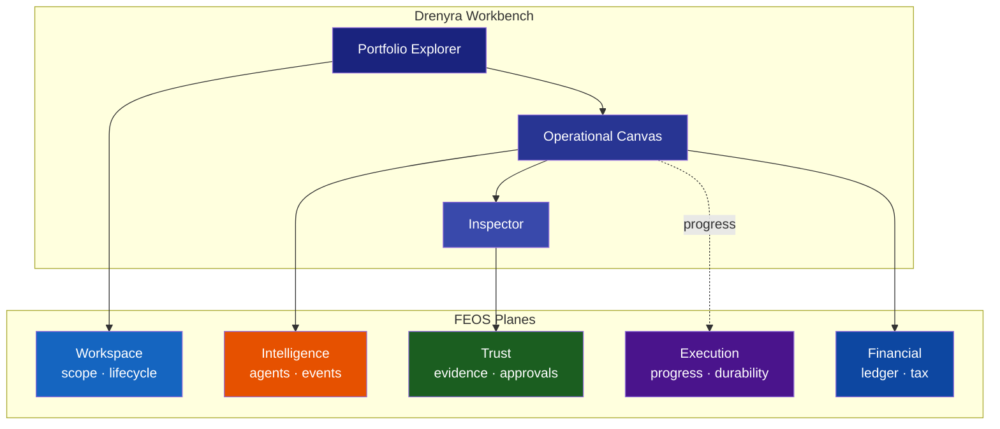

# 02 — Experience Plane

**Última actualización:** 2026-07-27
**FEOS Plano:** 1 de 8 — Experiencia
**Propósito:** convertir la complejidad financiera en una superficie profesional rápida, clara y controlable.

---

## Qué es

El Experience Plane es el punto de contacto entre la persona profesional y el Financial Engineering Operating System. Reúne Drenyra Workbench, CLI, Command Palette, experiencias móviles, API y UI embebida bajo una misma regla: la interfaz revela contexto, estado y autoridad sin obligar a la persona a navegar un ERP opaco.

Su filosofía se inspira en Ghostty: **instantáneo, nativo, configurable y con profundidad opcional**. Una persona que revisa una excepción debe poder entenderla sin aprender comandos; quien opera decenas de empresas debe poder usar atajos, layouts y automatizaciones sin que la interfaz se convierta en una barrera. La simplicidad inicial no elimina capacidad: la hace descubrible en el momento adecuado.

## Qué no es

No es el lugar donde se decide la validez contable, se ejecuta una presentación ante una autoridad ni se almacena la evidencia canónica. El plane proyecta decisiones y estados de los demás planos; no los sustituye. Un botón de “presentar” no concede autoridad por sí mismo: sólo inicia la revisión y ejecución definida por Trust y Execution.

## Drenyra Workbench

El Workbench es el centro de comando financiero. Su layout base combina tres panes persistentes:

1. **Portfolio Explorer:** organización, portfolios, compañías, períodos y workspaces.
2. **Operational Canvas:** la vista activa, por ejemplo ledger, conciliación, SIRE o cierre.
3. **Inspector:** evidencia, impacto, política, aprobaciones, receipt y actividad del objeto seleccionado.

Los panes se pueden dividir, redimensionar y guardar como layouts nombrados. Un contador puede conservar “Cierre mensual” con conciliación y variaciones lado a lado; un gerente puede abrir “Atención de portfolio” con indicadores y aprobaciones. La persistencia guarda preferencias de composición, no altera el alcance financiero ni la autoridad de los datos.

La densidad es una decisión operativa. El modo **compacto** favorece portafolios grandes y tablas de excepciones; el modo **cómodo** privilegia lectura y revisión; el modo **enfocado** reduce ruido para una aprobación o investigación. Los datos, permisos y acciones disponibles permanecen iguales: la densidad cambia presentación, no control.

## CLI, Command Palette y teclado

La Command Palette es el índice de acciones y objetos del Workbench. Debe abrirse en menos de 100 ms, buscar por entidad, comando o documento, y mostrar alcance antes de ejecutar. Por ejemplo, “conciliar movimientos de junio” abre el workspace correcto y explica qué workflow se iniciará; no despacha una acción irreversible desde texto libre.

La CLI ofrece el mismo modelo para profesionales expertos e integradores: comandos tipados, salida estructurada y referencias a workspace, candidate y receipt. Es complementaria a la UI, no un canal privilegiado que evada políticas. El modelo de teclado prioriza navegación predecible: `⌘K` para comandos, foco visible, atajos documentados, reversibilidad de la navegación y confirmaciones explícitas para acciones materiales.

## Ejemplo operativo

Durante un cierre, la conciliación detecta un movimiento bancario sin comprobante. El Canvas muestra la excepción; el Inspector expone la transacción, la política aplicable y la evidencia faltante. La persona abre la palette, crea una solicitud de documento y deja el workflow en espera. Cuando llega la evidencia, el estado proyectado cambia a verificación. Si se propone un asiento, la interfaz muestra su impacto y el candidato congelado; la aprobación ocurre bajo el [Trust Plane](../05-trust-plane/README.md), no por haber abierto el panel.

## Reglas operativas

### Hacer

- Usar la Command Palette como entrada principal para acciones — `⌘K` desde cualquier pane.
- Mostrar evidencia, política y receipt en el Inspector antes de cada decisión material.
- Respetar los modos de densidad como preferencia de la persona, no como estado global.
- Diseñar cada vista para que revele contexto sin obligar a abrir otra pantalla.

### No hacer

- No ejecutar acciones irreversibles desde la Command Palette sin confirmación explícita.
- No permitir que la UI oculte evidencia, riesgo o autoridad por razones estéticas.
- No simular progreso — el plane proyecta el estado real reportado por [Execution](../06-execution-plane/README.md).
- No tratar la CLI como un canal privilegiado — debe atravesar las mismas políticas que la UI.

---

## Diagrama de experiencia

## Relación con los demás planos

- [Workspace](../03-workspace-plane/README.md) aporta alcance, lifecycle y rollups que el Workbench proyecta.
- [Intelligence](../04-intelligence-plane/README.md) convierte eventos de agentes en actividad, hallazgos y propuestas legibles.
- [Trust](../05-trust-plane/README.md) abastece evidencia, políticas, aprobaciones y receipts al Inspector.
- [Execution](../06-execution-plane/README.md) provee progreso durable, esperas y recuperación para que la UI no simule éxito.
- [Financial](../07-financial-plane/README.md) define los objetos que se visualizan; [Integration](../08-integration-plane/README.md) y [Country](../09-country-plane/README.md) condicionan las capacidades visibles por conector y jurisdicción.

El Experience Plane mide presupuestos de UX: restauración de workspace menor a 300 ms, primer evento de agente menor a 500 ms y respuesta visual menor a 100 ms. La velocidad es una propiedad de confianza: una interfaz lenta o ambigua empuja a operar sin comprender.
