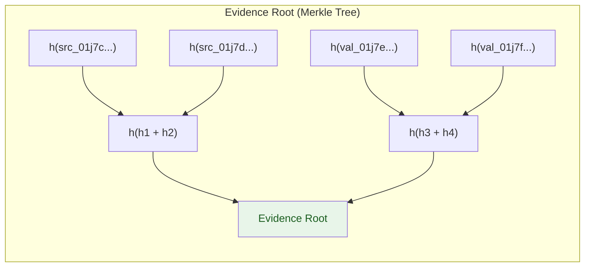

# Canonical Hashing

**Last updated:** 2026-07-29
**FEOS Planes:** [Trust](../05-trust-plane/README.md) · [Execution](../06-execution-plane/README.md)

---

## What It Is

Canonical Hashing is the mechanism that ensures every piece of evidence, candidate, and receipt in Drenyra can be deterministically hashed — and that the same input always produces the same hash, regardless of system, language, or environment.

Without canonical hashing, two systems could disagree on whether a receipt is valid because they serialized the same data differently (different field order, whitespace, encoding). Canonical hashing eliminates that ambiguity.

---

## Why It Matters

```text
Without canonical hashing:
  System A: hash({"amount":1000,"account":"4211"}) = "4a8f..."
  System B: hash({"account":"4211","amount":1000}) = "b3c1..."
  → Same data, different hashes → receipt verification FAILS

With canonical hashing:
  System A: hash(canonical({"amount":1000,"account":"4211"})) = "7d9e..."
  System B: hash(canonical({"account":"4211","amount":1000})) = "7d9e..."
  → Same data, same hash → receipt verification PASSES
```

---

## Canonicalization Rules

Drenyra uses a strict canonical serialization format for all hashed content:

### 1. Deterministic Field Order

All fields are sorted **lexicographically by key name** before serialization:

```json
// Input
{"account": "4211", "amount": 1250, "period": "2026-06"}

// Canonical form (sorted by key)
{"account":"4211","amount":1250,"period":"2026-06"}

// Hash input
account=4211|amount=1250|period=2026-06
```

### 2. No Optional Whitespace

No spaces, newlines, or indentation in serialized content. Compact representation only.

### 3. Explicit Types

| Type | Canonical representation | Example |
|---|---|---|
| String | UTF-8, quoted | `"hello"` |
| Number | Decimal, no leading zeros | `1250`, `0.50` |
| Boolean | lowercase | `true`, `false` |
| Null | `null` | `null` |
| Array | Sorted elements, compact | `[1,2,3]` |
| Object | Sorted keys, compact | `{"a":1,"b":2}` |

### 4. UTF-8 Normalization

All strings are NFC-normalized before hashing:

```text
Input: "café" (NFD: cafe + combining accent)
Canonical: "café" (NFC: single é character)
```

### 5. SHA-256

All content hashes use SHA-256. The hash is always represented as a lowercase hex string (64 characters).

---

## What Gets Hashed

| Concept | What is hashed |
|---|---|
| **Evidence node** | Content + type + parent hash + timestamp |
| **Candidate** | Payload + scope + evidence references + policy version |
| **Receipt** | Candidate hash + evidence root + policy version + approver + execution output |
| **Change Set** | All changes + base snapshot hash |
| **Evidence Root** | Merkle tree of all evidence node hashes |

---

## Evidence Root (Merkle Tree)

The Evidence Root is a Merkle tree that aggregates multiple evidence hashes into a single root hash. This allows a receipt to prove which evidence was considered without including the full evidence content.



The receipt includes the Evidence Root but not the individual evidence hashes. To verify, the verifier recomputes the Merkle tree from the evidence items and checks that the root matches.

---

## Hash Structure

```typescript
interface CanonicalHash {
  // Raw content (canonicalized)
  content: string

  // Hash
  algorithm: 'sha-256'
  hash: string                    // 64 hex characters

  // Verification
  verified: boolean
  verifiedAt?: string
  verifier?: string               // Offline verifier ID
}

// Example
const evidenceHash = canonicalHash({
  type: 'source-document',
  content: bankStatementXml,
  parentHash: null,
  timestamp: '2026-06-30T23:59:59Z',
})
// evidenceHash.hash → '4a8f3b2c...'
```

---

## Offline Verification

A verifier binary (Rust) can independently verify any hash without a Drenyra server:

```bash
# Verify a receipt
drenyra receipt verify receipt.json
# ✅ Receipt hash: 7d9e...
# ✅ Evidence root matches linked evidence
# ✅ Candidate hash matches approved candidate
# ✅ Merkle proof valid

# Compute hash of any content
drenyra hash canonicalize --input data.json
# SHA-256: 4a8f3b2c...

# Verify evidence root
drenyra evidence verify-root --evidence evidence.json --root 7d9e...
# ✅ Evidence root is valid
```

---

## Do / Don't

### Hacer

- Always canonicalize before hashing — never hash raw JSON or XML directly.
- Use the canonicalization library for all hash computations — do not implement your own.
- Include the algorithm identifier with every hash for forward compatibility.
- Verify receipts offline as part of audit procedures.

### No hacer

- Don't modify a hashed artifact after creation — any byte change invalidates the hash.
- Don't truncate or abbreviate hashes in evidence references — use the full 64-character string.
- Don't assume JSON.stringify output is canonical — it is not guaranteed to be deterministic.
- Don't skip Merkle proof verification for evidence roots — trust but verify.

---

## References

- [Evidence Graph](./evidence-graph.md) — how hashes connect in the evidence trail
- [RED — Receipt-Driven Execution](./receipt-driven-execution.md) — how receipts use hashes
- [Trust Plane](../05-trust-plane/README.md) — how candidate hashes are used in approval
- [Engines — Canonicalization](../../engines/canonicalization/) — Rust canonicalization engine
