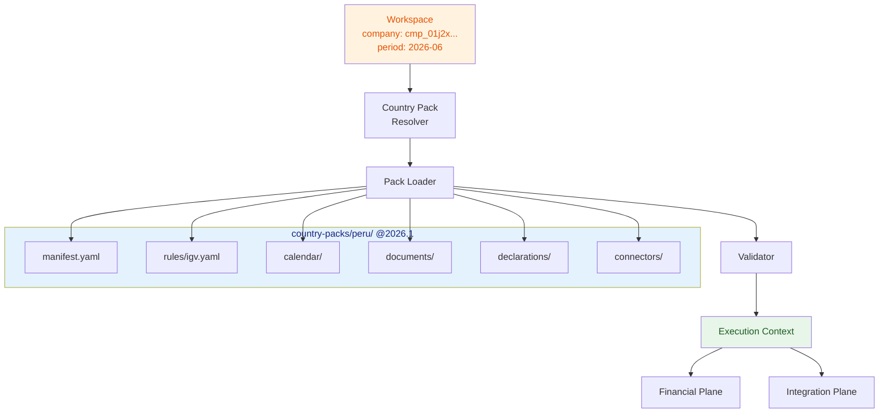

# Country Pack Runtime

**Last updated:** 2026-07-29
**FEOS Planes:** [Country](../09-country-plane/README.md) · [Financial](../07-financial-plane/README.md) · [Integration](../08-integration-plane/README.md)

---

## What It Is

The Country Pack Runtime is the system that loads, resolves, and executes fiscal rules for a specific jurisdiction. It converts a universal financial core into a country-correct operation without forking the platform.

```
Universal Core (Ledger, Evidence, Identity, Workflows)
    ↑        ↑        ↑        ↑        ↑
    │        │        │        │        │
    └────────┴────────┴────────┴────────┴── Country Pack Runtime
         │         │         │         │
    ┌────┴────┐┌───┴────┐┌───┴────┐┌──┴──────┐
    │   PE    ││   CO   ││   CL   ││   MX    │
    │  Perú   ││Colombia││ Chile  ││ México  │
    └─────────┘└────────┘└────────┘└─────────┘
```

---

## How It Works

### 1. Resolution

When a workspace is created for a company, the runtime resolves the applicable country pack:

```text
Company profile
  → country code: PE
  → period: 2026-06
  → tax regime: GENERAL
  → Resolved pack: country-packs/peru/ @ v2026.1
```

### 2. Loading

The runtime loads the pack's components:

| Component | Loaded from | Purpose |
|---|---|---|
| Manifest | `manifest.yaml` | Metadata, codes, currencies, timezone |
| Rules | `rules/*.yaml` | Tax rates, exemptions, validation logic |
| Calendar | `calendar/*.yaml` | Deadlines, periods, frequency |
| Documents | `documents/*.yaml` | Document types, schemas, required fields |
| Declarations | `declarations/*.yaml` | Obligations and filing requirements |
| Connectors | `connectors/*.yaml` | External integrations (SUNAT, DIAN) |
| Vocabulary | `localization/*.json` | Labels, terminology, formatting |

### 3. Execution

The runtime exposes the pack's capabilities to the rest of the system:

```typescript
interface CountryPack {
  code: string                    // 'PE'
  version: string                 // '2026.1'
  effectiveFrom: string           // '2026-01-01'
  validUntil?: string             // '2026-12-31'

  // Capabilities
  currencies: string[]            // ['PEN']
  timezone: string                // 'America/Lima'
  authority: string               // 'SUNAT'

  // Resolved rules
  taxRules: TaxRule[]
  calendar: FiscalCalendar
  documents: DocumentType[]
  declarations: Declaration[]
  connectors: ConnectorConfig[]

  // Validation
  validators: ValidationRule[]
  invariants: Invariant[]
}
```

---

## Rule Versioning

Fiscal rules change. The runtime handles this via **versioned packs**:

```text
country-packs/peru/
├── rules/
│   ├── igv.yaml            → Current (2026)
│   ├── igv.2025.yaml       → Historical (IGV 16% + IPM 2%)
│   └── igv.2026.yaml       → Current (IGV 15.5% + IPM 2.5%)
├── calendar/
│   └── monthly.yaml        → Calendar updated yearly
└── manifest.yaml
```

Each rule file declares its effective period:

```yaml
# rules/igv.2026.yaml
rule: igv
version: 2026
effective: 2026-01-01
valid_until: 2026-12-31
composition:
  igv: 15.5
  ipm: 2.5
  total: 18.0
legal_basis: Ley 32387
```

When an operation targets period `2026-06`, the runtime selects the 2026 version. A December 2025 operation uses the 2025 version. This guarantees that historical operations can always be explained with the rules that were in effect.

---

## Execution Context



---

## Sandboxing

Rules can run in a sandboxed environment for determinism and safety:

```yaml
# manifest.yaml
runtime:
  sandbox: wasm          # Rules execute in WASM sandbox
  memory_limit: 64MB
  cpu_limit: 1
  network: deny          # Rules cannot access network
  filesystem: deny       # Rules cannot access filesystem
```

This ensures that a fiscal rule computation cannot affect the system or access data beyond its input scope.

---

## Testing

Every country pack includes a test suite:

```bash
# Validate pack structure
bun run country-packs:validate --country=PE

# Run fiscal rule tests
bun run test --filter=@drenyra/country-packs

# Test against known cases
bun run test --filter=@drenyra/country-packs -- -t "IGV calculation 2026"
bun run test --filter=@drenyra/country-packs -- -t "Detracciones percentage"

# Compliance gate
bun run compliance:sire-gate
```

---

## Do / Don't

### Hacer

- Version every rule change with explicit effective and valid_until dates.
- Test each rule with known input/output pairs from the authority's documentation.
- Keep packs self-contained — no cross-pack dependencies.
- Sandbox rule execution for determinism and safety.

### No hacer

- Don't modify the core ledger to accommodate a country-specific rule — use the pack's override.
- Don't deploy a pack without passing its compliance gate.
- Don't allow rules to access network, filesystem, or other non-deterministic sources.
- Don't mix rule versions — an operation must use a single consistent version.

---

## References

- [Country Plane](../09-country-plane/README.md) — the architecture plane
- [Configure a Country Pack guide](../02-guides/how-to-configure-a-country-pack.md) — practical setup
- [FEOS Program: SDD-FEOS-014](../01-foundation/feos-program.md#sdd-feos-014) — Country Pack Runtime specification
- [Add a Fiscal Obligation guide](../02-guides/how-to-add-a-fiscal-obligation.md) — creating obligations within a pack
