# Evidence Graph

**Last updated:** 2026-07-29
**FEOS Planes:** [Trust](../05-trust-plane/README.md) · [Financial](../07-financial-plane/README.md)

---

## What It Is

The Evidence Graph is the directed acyclic graph that records **every stage of every material operation** in Drenyra. It connects source documents, normalizations, validations, proposals, approvals, and receipts into a traversable, versioned, and independently verifiable structure.

A receipt does not just say "this happened" — it points to a node in the Evidence Graph where you can trace back to the original source document, see every transformation, and verify each decision.

---

## Diagrama del Evidence Graph

```mermaid
flowchart LR
    S["📄 Source Document
Bank Statement PDF"]
    N["📊 Normalized
bank_statement.csv"]
    V["✅ Validated
reconciliation_report.json"]
    C["📋 Candidate
cs-2026-06-042"]
    A["✍️ Approval
user_jperez"]
    E["⚙️ Execution
je_202606_042 posted"]
    R["📜 Receipt
rct_01j5a..."]

    S -->|ingested| N
    N -->|validated| V
    V -->|proposed| C
    C -->|approved| A
    A -->|revalidated| E
    E -->|receipt| R

    style S fill:#e3f2fd,color:#1a237e
    style V fill:#e8f5e9,color:#1b5e20
    style C fill:#fff3e0,color:#e65100
    style R fill:#f3e5f5,color:#4a148c
```



## Why It Exists

Traditional accounting systems have a fundamental trust problem:

> "Trust me, this journal entry is correct because our system says so."

The Evidence Graph replaces that with:

> "Here is the source document. Here is how it was normalized. Here is the validation. Here is the proposal. Here who approved it. Here is the receipt. Verify any step independently."

---

## Graph Structure

```
┌──────────────┐
│  Source      │  ← Original document (invoice PDF, bank CSV, SUNAT XML)
│  Document    │
└──────┬───────┘
       │ ingested
       ▼
┌──────────────┐
│  Normalized  │  ← Canonical representation with consistent schema
│  Document    │
└──────┬───────┘
       │ validated
       ▼
┌──────────────┐
│  Validated   │  ← Invariants checked, fiscal rules applied
│  Record      │
└──────┬───────┘
       │ proposed
       ▼
┌──────────────┐
│  Candidate   │  ← Frozen proposal for review
│  (Change Set)│     Contains: payload, evidence refs, policy
└──────┬───────┘
       │ approved
       ▼
┌──────────────┐
│  Executed    │  ← Material operation completed
│  Operation   │
└──────┬───────┘
       │ receipt
       ▼
┌──────────────┐
│  Receipt     │  ← Immutable proof of the entire chain
│  (RED)       │     Hash-linked to every ancestor
└──────────────┘
```

Each edge is **versioned** and **timestamped**. Each node has a **canonical hash** that can be recomputed from its content.

---

## Properties

### Deterministic

Given the same input document and the same rules, the Evidence Graph produces the same chain of hashes. No randomness, no ambiguity.

### Traversable

From any node, you can navigate forward (to see what was produced from it) or backward (to see what produced it). Given a receipt, you can always find the original source document.

### Verifiable Offline

The hash chain is self-contained. You do not need a running Drenyra server to verify that a receipt's evidence trail is intact.

### Immutable

Once written, a node cannot be modified. Corrections are represented as new nodes with edges pointing back to the corrected node. The original remains for audit.

---

## Example

```
Source: Bank statement Jun 2026 (PDF)
  → Normalized: bank_statement_202606.csv
    → Validated: reconciliation_report_202606.json
      → Candidate: cs-2026-06-042 (bank adjustment: S/ 1,250)
        → Approval: user_jperez_approval (hash-signed)
          → Execution: je_202606_042 posted
            → Receipt: rct_01j5a...
```

You can start at `rct_01j5a...` and trace back to the original bank statement PDF, verifying each step's hash.

---

## In Drenyra

```typescript
interface EvidenceNode {
  id: string // evi_01j...
  type:
    | 'source'
    | 'normalized'
    | 'validated'
    | 'candidate'
    | 'approval'
    | 'execution'
    | 'receipt'
  hash: string // SHA-256 of content
  parentHash: string | null // Previous node in the chain
  children: string[] // Derived nodes
  content: any // The actual data
  timestamp: string
  version: string // Rules version used
}

// Traverse from receipt to source
const receipt = await getReceipt('rct_01j5a...')
const chain = await evidenceGraph.traceToSource(receipt.evidenceRoot)
// chain[0] = receipt
// chain[1] = execution
// ...
// chain[n] = source document
```

---

## Do / Don't

### Do

- Store every stage of every material operation as an evidence node.
- Hash-link each node to its parent.
- Preserve the raw original document as the first node in each chain.
- Use the Evidence Graph as the source of truth for audits.

### Don't

- Don't modify a node once committed — create a new node with a correction edge.
- Don't skip intermediate stages (e.g., going from source directly to execution).
- Don't rely on external links that can change — the evidence graph must be self-contained.

---

## References

- [Trust Plane](../05-trust-plane/README.md) — how evidence integrates with approval
- [RED Spec](../14-design/red-spec.md) — Receipt-Driven Execution protocol
- [Receipt Guide](../02-guides/how-to-interpret-a-receipt.md) — how to read and verify receipts
