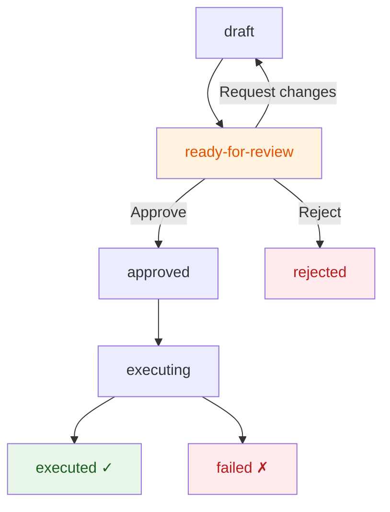

# Financial Change Sets

**Last updated:** 2026-07-29
**FEOS Planes:** [Workspace](../03-workspace-plane/README.md) · [Trust](../05-trust-plane/README.md) · [Financial](../07-financial-plane/README.md)

---

## What It Is

A Financial Change Set is Drenyra's equivalent of a Git branch for financial changes. It isolates proposed modifications — journal entries, document updates, classification changes — until a professional reviews and approves the exact candidate. No change reaches the published ledger without going through a Change Set.

```
Ledger (published)        Change Set (proposed)
┌──────────────────┐      ┌──────────────────┐
│ Published state  │      │ Isolated changes │
│ Period closed    │      │ Pending review   │
│ Immutable        │      │ Candidate frozen │
└──────────────────┘      └────────┬─────────┘
                                   │ approval
                                   ▼
                            ┌──────────────────┐
                            │ Execution +      │
                            │ Receipt          │
                            └──────────────────┘
```

---

## Why Change Sets?

Traditional accounting systems apply changes directly: open a journal entry, post it, done. This works for simple cases but breaks down when:

- **Multiple people work on the same period** — conflicts, overwrites, lost data
- **Changes need review** — hard to tell what changed between "before" and "after"
- **Changes are rejected** — manual reversal, error-prone
- **Audit needs to know what was proposed vs what was approved** — the line is blurry

Change Sets solve all four by borrowing from Git's model:

| Git concept | Drenyra equivalent |
|---|---|
| Branch | Change Set |
| Commit | Atomic financial change |
| Diff | Financial diff (before/after) |
| Pull request | Review workflow |
| Merge | Post to ledger |
| Revert | Compensating entry |
| Conflict | Policy violation or invariant break |

---

## Change Set Structure

```typescript
interface ChangeSet {
  id: string                    // cs_01j4z...
  workspaceId: string           // Parent workspace
  status: ChangeSetStatus

  // Scope
  companyId: string
  period: string

  // Content
  baseSnapshot: string          // Hash of the published state before changes
  changes: FinancialChange[]    // Proposed modifications
  diff: FinancialDiff           // Computed before/after

  // Authority
  riskLevel: R0 | R1 | R2 | R3
  materiality: number
  policyVersion: string

  // Review
  candidateHash: string         // Frozen hash for review
  reviewedBy?: string
  approvedAt?: string

  // Execution
  executionReceipt?: string     // Receipt ID after posting
}

type ChangeSetStatus =
  | 'draft'           // Being worked on
  | 'ready-for-review' // Frozen, waiting for approval
  | 'changes-requested' // Reviewer asked for changes
  | 'approved'         // Reviewed and approved
  | 'executing'        // Being posted to ledger
  | 'executed'         // Posted successfully
  | 'rejected'         // Rejected, discarded
  | 'failed'           // Execution error
```

---

## Lifecycle



### Draft

The Change Set is being populated with proposed changes. It is not yet frozen. Only the author and assigned reviewers can see it.

### Ready for Review

The author freezes the Change Set. A candidate hash is computed from the exact payload, evidence references, and scope. From this point, any modification changes the hash and invalidates the review.

### Approved / Rejected

A reviewer inspects the frozen candidate and decides. If approved, the Change Set is queued for execution. If rejected, it is discarded with a note.

### Executed

The approved changes are posted to the ledger atomically. An execution receipt is generated. The period's published state advances to include this Change Set's effects.

---

## Financial Diff

The diff is not a text comparison — it is a structured financial difference:

```json
{
  "changeSetId": "cs_01j4z...",
  "accountMovements": [
    {
      "account": "4211",
      "name": "Bco. Scotiabank CTE",
      "before": 125000.00,
      "after": 123750.00,
      "delta": -1250.00
    },
    {
      "account": "5911",
      "name": "Gastos bancarios",
      "before": 8500.00,
      "after": 9750.00,
      "delta": 1250.00
    }
  ],
  "taxImpact": {
    "igv": 0,
    "detracciones": 0,
    "note": "Service charge — IGV exempt"
  },
  "evidenceReferences": [
    "src_01j7c... (Bank statement)",
    "src_01j7d... (Reconciliation report)"
  ],
  "balanceCheck": {
    "debits": 1250.00,
    "credits": 1250.00,
    "balanced": true
  }
}
```

---

## In Drenyra

```typescript
// Create a Change Set
const cs = await createChangeSet({
  workspaceId: 'ws_01j3y...',
  companyId: 'cmp_01j2x...',
  period: '2026-06',
})

// Add changes
await cs.addJournalEntry({
  account: '4211',
  amount: -1250,
  description: 'Bank service charge June',
})
await cs.addJournalEntry({
  account: '5911',
  amount: 1250,
  description: 'Bank service charge June',
})

// Freeze for review
await cs.freeze()
// cs.status → 'ready-for-review'
// cs.candidateHash → '4a8f3b2c...'

// After review and execution
// cs.status → 'executed'
// cs.executionReceipt → 'rct_01j5a...'
```

---

## Do / Don't

### Hacer

- Create a Change Set for every isolated financial change — one per workspace, period, and objective.
- Freeze the Change Set before requesting review — never review a moving target.
- Include evidence references for every material change.
- Use the diff to verify balance and tax impact before approving.

### No hacer

- Don't apply changes directly to the ledger without a Change Set.
- Don't approve a Change Set without comparing the diff against the evidence.
- Don't merge changes from different periods or companies into the same Change Set.
- Don't reuse a rejected Change Set — create a new one with corrected data.

---

## References

- [Change Set Review Guide](../02-guides/how-to-review-a-change-set.md) — practical review workflow
- [Workspace Plane](../03-workspace-plane/README.md) — how Change Sets relate to workspaces
- [Trust Plane](../05-trust-plane/README.md) — how candidates are approved
- [FEOS Program: SDD-FEOS-004](../01-foundation/feos-program.md#sdd-feos-004) — Financial Change Sets specification
