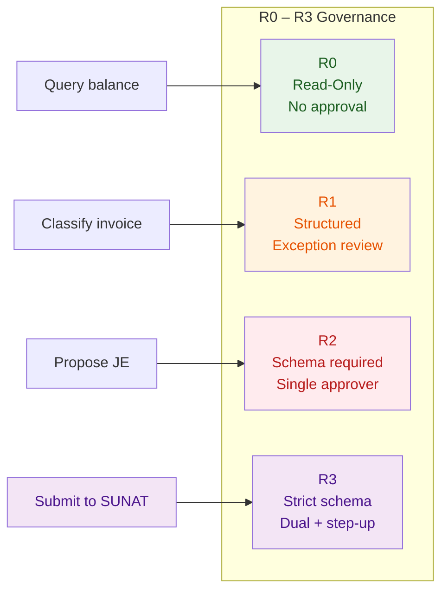

# R0–R3 Governance

**Last updated:** 2026-07-29
**FEOS Planes:** [Trust](../05-trust-plane/README.md) · [Intelligence](../04-intelligence-plane/README.md)

---

## What It Is

R0–R3 is Drenyra's risk-based governance model. It classifies every action an agent or person can take into one of four levels, each with increasing controls: from read-only queries (R0) to irreversible financial operations requiring dual approval with step-up authentication (R3).

The model ensures that **the level of control matches the risk of the action** — no more, no less.

---

## The Levels

### R0 — Read, High Autonomy

| Aspect            | Detail                                                                    |
| ----------------- | ------------------------------------------------------------------------- |
| **Examples**      | Read a document, query a ledger balance, list workspaces, search evidence |
| **Validation**    | None (or minimal schema check)                                            |
| **Approval**      | None — the model executes directly                                        |
| **Output format** | Flexible                                                                  |
| **Audit**         | Logged but no evidence node required                                      |

**Principle:** Reading never changes state. No material risk.

---

### R1 — Structured, Exception Review

| Aspect            | Detail                                                                   |
| ----------------- | ------------------------------------------------------------------------ |
| **Examples**      | Categorize a transaction, suggest a classification, summarize a document |
| **Validation**    | Preferred JSON Schema, not enforced                                      |
| **Approval**      | Exception-based — only if confidence is low or the result is ambiguous   |
| **Output format** | Structured output preferred                                              |
| **Audit**         | Logged with confidence score                                             |

**Principle:** Suggestions and proposals that inform human decisions. The model proposes; the system may accept if confidence exceeds threshold.

---

### R2 — Mandatory Schema, Deterministic Validation

| Aspect            | Detail                                                                             |
| ----------------- | ---------------------------------------------------------------------------------- |
| **Examples**      | Propose a journal entry, classify an invoice for ledger, prepare a tax declaration |
| **Validation**    | Mandatory JSON Schema, deterministic validation                                    |
| **Approval**      | Required — one approver with matching role                                         |
| **Output format** | Strict JSON Schema                                                                 |
| **Audit**         | Full evidence trail: candidate, validation, approval, execution                    |

**Principle:** Actions that affect financial state. The model proposes a structured candidate; a professional reviews and approves the exact frozen candidate.

---

### R3 — Strict Schema, Dual Control, Step-Up Auth

| Aspect            | Detail                                                                                                           |
| ----------------- | ---------------------------------------------------------------------------------------------------------------- |
| **Examples**      | Submit a tax declaration to SUNAT, post a journal entry to a closed period, approve a payment                    |
| **Validation**    | Strict JSON Schema, deterministic validation, revalidation before execution                                      |
| **Approval**      | Required — dual approval with step-up authentication (MFA, second approver)                                      |
| **Output format** | Strict JSON Schema + candidate hash + approval token                                                             |
| **Audit**         | Full evidence trail: source → normalized → validated → candidate → approval → revalidation → execution → receipt |

**Principle:** Irreversible or high-materiality actions. Every step is frozen, hashed, validated, and independently verifiable.

---

## Decision Matrix



| Risk → | Read-only | Suggestion | Financial impact | Irreversible |
| --- | --- | --- | --- | --- |
| **Materiality** | None | None | Low-Medium | High |
| **Level** | R0 | R1 | R2 | R3 |
| **Schema**      | None      | Preferred        | Mandatory        | Strict                     |
| **Validation**  | None      | Exception        | Deterministic    | Deterministic + Revalidate |
| **Approval**    | None      | Exception        | Single approver  | Dual + step-up auth        |
| **Evidence**    | Log       | Log + confidence | Full chain       | Full chain + receipt       |

---

## How It Works in Practice

### Tool Contract Declaration

Every agent tool declares its R level at design time:

```typescript
interface ToolContract {
  name: string
  riskLevel: R0 | R1 | R2 | R3
  schema: JSONSchema // R2+ required
  validation: ValidationRule[]
  approvalRequired: boolean
  dualControl: boolean
  stepUpAuth: boolean
}

// Example: proposing a journal entry
const proposeJournalEntry: ToolContract = {
  name: 'propose-journal-entry',
  riskLevel: 'R2',
  schema: journalEntrySchema, // Mandatory
  validation: [validateDebitCredit, validatePeriod, validateAccount],
  approvalRequired: true,
  dualControl: false,
  stepUpAuth: false,
}
```

### Runtime Enforcement

The [Intelligence Plane](../04-intelligence-plane/README.md) enforces contracts at runtime:

1. **Before execution**: validate the tool contract matches the action's risk level
2. **After proposal**: freeze the candidate, validate against schema, compute hash
3. **Before approval**: verify the approver has the required role and authority
4. **Before execution**: revalidate the candidate hash against the approved hash
5. **After execution**: store the evidence trail and issue the receipt

If any step fails, the action is blocked and the failure is recorded as evidence.

---

## Examples

| Action                                 | Level | Why                                                                 |
| -------------------------------------- | ----- | ------------------------------------------------------------------- |
| Query company balance                  | R0    | Read-only, no state change                                          |
| Suggest invoice classification         | R1    | Suggestion, human decides                                           |
| Propose bank reconciliation adjustment | R2    | Financial impact, needs professional review                         |
| Submit SIRE replacement to SUNAT       | R3    | Irreversible, external authority, material impact                   |
| Post journal entry to closed period    | R3    | Requires compensating entry, irreversible without explicit reversal |
| Delete evidence                        | R3    | Potential audit impact, irreversible                                |

---

## Do / Don't

### Do

- Assign every tool a risk level at design time — never default to R0.
- Require R2+ for any action that affects financial state.
- Revalidate the candidate hash before R3 execution — do not trust a stale approval.
- Document the risk level in the tool contract and make it visible to reviewers.

### Don't

- Don't allow an agent to escalate its own risk level.
- Don't skip revalidation for R3 actions because "the approval came from the right person."
- Don't treat R0 as "no evidence" — log is not evidence, but it is traceability.
- Don't allow R3 actions without step-up authentication for the second approver.

---

## References

- [Trust Plane](../05-trust-plane/README.md) — the full approval authority model
- [Intelligence Plane](../04-intelligence-plane/README.md) — how agents declare and respect contracts
- [FEOS Program: SDD-FEOS-006](../01-foundation/feos-program.md#sdd-feos-006) — R0–R3 Strict Tool Contracts
- [Change Set Review Guide](../02-guides/how-to-review-a-change-set.md) — practical review workflow
