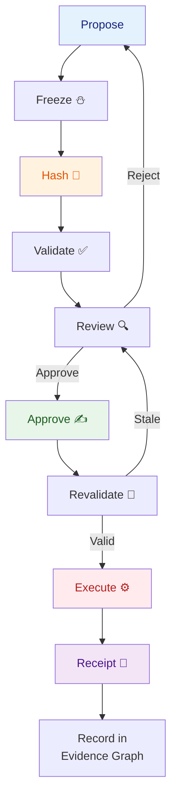

# RED — Receipt-Driven Execution

**Last updated:** 2026-07-29
**FEOS Planes:** [Trust](../05-trust-plane/README.md) · [Execution](../06-execution-plane/README.md)
**Spec:** [RED Spec](../14-design/red-spec.md)

---

## What It Is

RED (Receipt-Driven Execution) is the protocol that governs every material operation in Drenyra. It ensures that:

1. Every action has a **frozen, hashed candidate** approved by a human
2. Every execution is **verified before and after** it happens
3. Every outcome produces an **immutable, independently verifiable receipt**
4. Stale or changed approvals are **automatically invalidated**

RED transforms "trust the system" into "verify the evidence."

---

## The RED Lifecycle

```
Propose
  ↓
Freeze       → candidate_hash = hash(payload + scope + evidence + policy)
  ↓
Validate     → invariants, schemas, fiscal rules
  ↓
Review       → human inspects exact frozen candidate
  ↓
Approve      → approver signs the candidate_hash
  ↓
Revalidate   → candidate_hash still matches? Policy still valid? Period still open?
  ↓
Execute      → perform the operation
  ↓
Receipt      → issue immutable record
  ↓
Record       → store in Evidence Graph
```

## The RED Lifecycle



### Step Details

**1. Propose**
An agent or person creates a candidate — a structured proposal with payload, scope, evidence references, and policy.

**2. Freeze**
The candidate is serialized deterministically and hashed. The hash is the candidate's identity. From this point, any change to the candidate produces a different hash and requires a new review.

**3. Validate**
Deterministic validation runs: schema checks, invariant checks, fiscal rule checks. Any failure returns the candidate for correction.

**4. Review**
A human inspects the frozen candidate: the diff, evidence references, policy compliance, risk level. The reviewer sees the exact hash they are approving.

**5. Approve**
The reviewer signs the candidate hash. The approval is linked to that specific hash — not to the proposal, not to the change set, not to the conversation.

**6. Revalidate**
Before execution, the system recomputes: is the candidate hash still the same? Is the period still open? Is the policy version still current? Is the evidence root still valid? If any check fails, the approval is **invalidated** and the candidate returns to review.

**7. Execute**
The operation is performed: post a journal entry, submit a declaration, send a payment. The execution is wrapped in an idempotency key and fencing token.

**8. Receipt**
An immutable receipt is generated containing: candidate hash, evidence root, policy version, approver signature, execution hash, output, and timestamp.

**9. Record**
The receipt is stored in the Evidence Graph, linked to the candidate, evidence, and workspace.

---

## Why "Receipt-Driven"

The receipt is not a log entry. It is the **proof** that the operation was properly authorized and executed:

```text
RED receipt rct_01j5a...
✓ Candidate hash matches what was approved
✓ Evidence root includes all referenced documents
✓ Approval signature is valid
✓ Execution signature is valid
✓ Policy version is current at time of approval
✓ Period was open at time of execution
✓ Receipt chain is intact
```

A receipt that fails any of these checks is **invalid**. Invalid receipts are not a system error — they are a signal that the operation cannot be trusted and must be investigated.

---

## Key Properties

### Immutable

Once generated, a receipt cannot be modified. Any byte change invalidates the hash chain.

### Independently Verifiable

A receipt can be verified offline without a Drenyra server. The verifier recomputes hashes from the data in the receipt file.

### Self-Contained

A receipt includes enough information to trace back to the evidence root, candidate, and policy. It does not depend on external databases.

### Time-Bound

A receipt references the policy version and period state at the time of approval. If the policy changes or the period closes, the approval becomes stale and must be renewed.

---

## RED vs Traditional Audit

| Aspect              | Traditional                    | RED                                       |
| ------------------- | ------------------------------ | ----------------------------------------- |
| **Proof**           | Database says it happened      | Cryptographic hash chain says it happened |
| **Verification**    | Requires system access         | Independent, offline                      |
| **Approval**        | "Approved in the UI"           | Signed candidate hash                     |
| **Integrity**       | Database admin can modify      | Any modification breaks the chain         |
| **Traceability**    | Requires joining multiple logs | Single receipt traverses full chain       |
| **Stale detection** | Manual review                  | Automatic revalidation before execution   |

---

## In Drenyra

```typescript
interface RedReceipt {
  id: string // rct_01j5a...
  type: string // 'journal-entry-post', 'sire-submission', etc.
  status: 'confirmed' | 'failed' | 'compensated'

  // Identity
  candidateHash: string // Hash of the frozen candidate
  evidenceRoot: string // Merkle root of evidence hashes

  // Authority
  policyVersion: string // Policy version at time of approval
  riskLevel: R0 | R1 | R2 | R3
  materiality: number
  approver: string // Approver ID
  approvedAt: string
  approvalSignature: string // Approver's signature

  // Execution
  workflowId: string
  executedAt: string
  executionSignature: string // System signature

  // Output
  output: {
    journalEntryId?: string
    declarationId?: string
    paymentId?: string
  }
}

// Verify offline
const verification = verifyReceipt(receiptFile)
verification.candidateHashMatch // true
verification.evidenceRootMatch // true
verification.approvalValid // true
verification.executionValid // true
```

---

## Do / Don't

### Do

- Verify receipts after every material operation.
- Store receipts as evidence — they are your proof of compliance.
- Trace from receipt to evidence root when investigating a discrepancy.
- Revalidate before every R3 execution.

### Don't

- Don't accept an operation as "done" without a valid receipt.
- Don't modify a receipt file — any change breaks the chain.
- Don't skip revalidation — a valid approval from yesterday may not be valid today.
- Don't treat the receipt as the only evidence — it is the capstone, but the full Evidence Graph is the canonical trail.

---

## References

- [RED Spec](../14-design/red-spec.md) — the full protocol specification
- [Receipt Guide](../02-guides/how-to-interpret-a-receipt.md) — how to read and verify receipts
- [Evidence Graph](./evidence-graph.md) — how receipts connect to the full evidence trail
- [Change Set Review Guide](../02-guides/how-to-review-a-change-set.md) — what happens before the receipt
