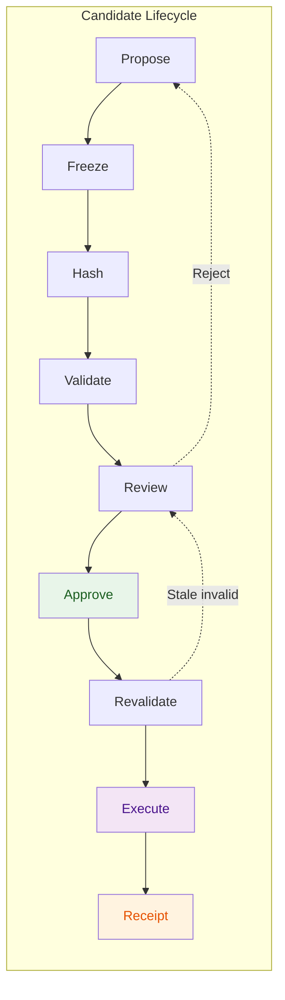

# 05 — Trust Plane

**Última actualización:** 2026-07-27
**FEOS Plano:** 4 de 8 — Confianza
**Propósito:** convertir evidencia, políticas y decisiones profesionales en autoridad verificable para ejecutar.

---

## Qué es

El Trust Plane es el control de autoridad de Drenyra. Implementa Exact Candidate Review Authority, Evidence Root and Receipt Protocol y el Professional Approval Control Plane. Su principio, inspirado en Gentle-AI, es inequívoco:

> **El profesional no aprueba una intención. Aprueba un candidato financiero exacto.**

Una propuesta puede ser correcta en apariencia y aun así no ser ejecutable. Para ser autorizable debe estar congelada, asociada a evidencia y política versionadas, validada, revisada por la persona facultada y revalidada inmediatamente antes de la ejecución. La confianza no se deposita en el modelo, una pantalla ni una promesa de workflow; se deposita en artefactos identificables y verificables.

## Qué no es

No es un registro decorativo de auditoría creado después de operar. Tampoco es una pantalla de “aprobar” que conserve validez si cambia el importe, período, evidencia o regla fiscal. Trust no contabiliza ni llama a SUNAT: controla las condiciones bajo las cuales [Financial](../07-financial-plane/README.md), [Execution](../06-execution-plane/README.md) e [Integration](../08-integration-plane/README.md) pueden hacerlo.

## Exact Candidate Review Authority

Un candidate es la representación canónica completa de la acción propuesta: alcance de compañía y período, payload financiero, cambios, referencias de evidencia, validaciones, política, riesgo, efectos y requisitos de autoridad. El protocolo serializa el candidate de manera determinista y calcula su hash. Ese hash, no una descripción textual, es la identidad que se revisa.

El ciclo de vida es:

```text
propose → freeze → hash → validate → review → receipt → approve
       → revalidate → execute → record outcome
```

Cambiar un asiento, documento, importe, cuenta, período, policy version, evidence root o autoridad invalida la aprobación previa. La ejecución recomputa las identidades y falla cerrada si no coinciden. Un candidate vencido se revisa nuevamente; no se “reutiliza” una firma porque la intención parezca similar.

## Evidence Root y receipts

La evidencia forma un grafo de provenance: fuente, extracción, validación, propuesta, decisión y resultado. El **Evidence Root** es una identidad hash de las evidencias relevantes, incluidas versiones y relaciones. Permite demostrar con qué documentos y hechos se tomó una decisión sin depender de enlaces mutables.

Un receipt inmutable vincula, como mínimo, candidate hash, evidence root, policy version, controles deterministas, modelo o skill cuando corresponda, aprobadores, timestamps, workflow y output hash. Los receipts son verificables por máquina y por profesionales; no son una transcripción de chat. La retención y el acceso respetan tenant, compañía y requisitos regulatorios.

## Professional Approval Control Plane

La aprobación se determina por política, no por conveniencia de la interfaz. Materialidad, tipo de operación, compañía, período, exposición fiscal, segregación de funciones y reversibilidad determinan la puerta aplicable. Acciones R3 pueden requerir autenticación reforzada, dos personas con roles compatibles y validación de estado externo.

Ejemplo: un ajuste de S/ 250 puede autoaprobarse según política si sus checks R2 pasan; una rectificatoria material requiere revisor contable y responsable autorizado; un envío irreversible agrega step-up authentication. El sistema registra el motivo, autoridad y candidate exacto de cada decisión. Rechazar también produce evidencia, para que el workflow no vuelva a proponer silenciosamente el mismo cambio.

## Ejemplo práctico

El agente de conciliación propone un asiento compensatorio para corregir una diferencia bancaria. [Intelligence](../04-intelligence-plane/README.md) entrega una propuesta estructurada y [Workspace](../03-workspace-plane/README.md) la mantiene en un Change Set. Trust congela el candidate, calcula hash y evidence root, aplica la política vigente y muestra el financial diff. La profesional aprueba ese hash. Antes del posteo, Execution vuelve a verificar hash, política, rol, período abierto y estado bancario. Si el banco informa un movimiento nuevo o cambió la evidencia, el candidate queda invalidado y debe revisarse de nuevo.

## Diagrama de autoridad



## Relación con los demás planos

- [Experience](../02-experience-plane/README.md) explica evidencia y autoridad sin ocultar su alcance.
- [Workspace](../03-workspace-plane/README.md) entrega scope y Change Sets aislados.
- [Intelligence](../04-intelligence-plane/README.md) opera con R0–R3, nunca con autoridad implícita.
- [Execution](../06-execution-plane/README.md) revalida y ejecuta de forma durable.
- [Financial](../07-financial-plane/README.md) aporta invariantes e impacto; [Country](../09-country-plane/README.md) aporta las políticas locales versionadas.

Trust es el límite que mantiene a Drenyra profesionalmente defendible: ante duda, no ejecuta.
