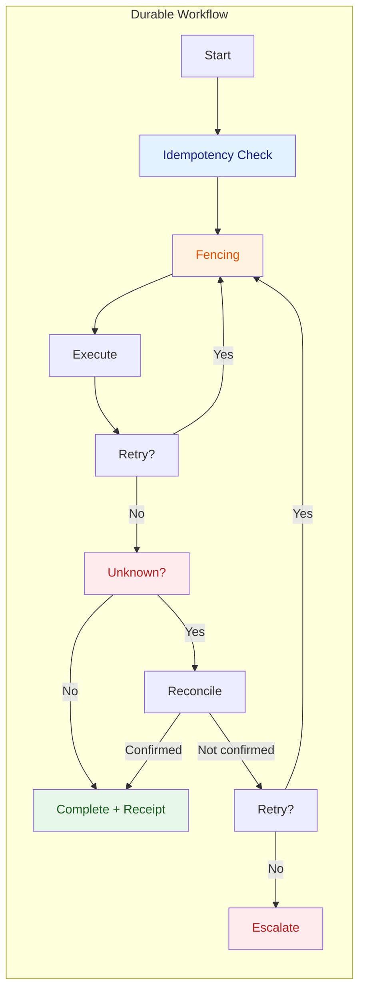

# 06 — Execution Plane

**Última actualización:** 2026-07-27
**FEOS Plano:** 5 de 8 — Ejecución
**Propósito:** asegurar que todo trabajo financiero material sea durable, recuperable y verificable.

---

## Qué es

El Execution Plane es el sistema nervioso de Drenyra. Coordina workflows de larga duración, actividades, colas, señales humanas, reintentos, compensaciones y confirmaciones externas. Temporal inspira el modelo: el proceso conserva memoria duradera aunque un worker, una red o una dependencia fallen; el estado no depende de que una petición HTTP permanezca abierta.

Un cierre mensual, una conciliación bancaria, una presentación ante una autoridad o un pago atraviesan varios sistemas y pueden esperar horas o días por evidencia o aprobación. El Execution Plane convierte ese recorrido en un workflow observable con pasos, deadlines, correlación y recuperación. De este modo Drenyra puede responder “qué ocurrió, qué falta y qué se puede repetir” sin inventar éxito.

## Qué no es

No define reglas fiscales ni el contenido de un asiento: eso pertenece al [Financial Plane](../07-financial-plane/README.md) y a [Country](../09-country-plane/README.md). Tampoco concede aprobación: [Trust](../05-trust-plane/README.md) aporta el candidate y receipt válidos. Execution sólo acepta trabajo autorizado y aplica garantías de proceso al coordinarlo.

## Contratos de durabilidad

Toda operación material requiere una idempotency key ligada a su intención técnica y scope. Una repetición con la misma key devuelve o reconcilia el resultado previo; una key reutilizada con payload distinto es un conflicto, no un reintento. Las actividades externas conservan correlación con candidate, receipt, compañía, período y conector.

El **fencing** evita que dos workers o reintentos actúen simultáneamente sobre el mismo recurso. Un token o versión de lease acompaña cada acción; una ejecución antigua no puede confirmar ni sobrescribir la de quien posee el fence actual. Esto protege, por ejemplo, el posteo de un Change Set cuando un proceso recuperado intenta continuar después de un failover.

Retries son deliberados: clasifican fallos transitorios, aplican backoff, límites y circuit breakers, y registran cada intento. La outbox asegura que un cambio confirmado publique su evento aunque el bus esté caído. Las dead letters no son un cementerio: son una cola con diagnóstico, ownership y ruta de recuperación.

## UNKNOWN y operaciones degradadas

`unknown` es un estado de conocimiento, no un error cosmético. Surge cuando Drenyra no puede probar si una acción externa ocurrió: un timeout después de enviar una solicitud a un banco, una caída antes de leer la respuesta de SUNAT o un worker interrumpido tras una confirmación remota. No se reintenta ciegamente ni se marca completado.

El workflow entra en reconciliación: consulta el estado externo con un identificador correlacionado, verifica la evidencia recibida y compara hashes. Si confirma el resultado, lo cierra con receipt; si confirma que no ocurrió, puede reintentar bajo el mismo contrato; si la incertidumbre persiste, queda bloqueado para intervención humana. La UI del [Experience Plane](../02-experience-plane/README.md) debe mostrar esa incertidumbre de forma explícita.

En modo degradado, Drenyra conserva trabajo localmente, limita capacidades no verificables y prioriza lectura, preparación y evidencia. No degrada “ejecutar sin control”. Por ejemplo, puede preparar la declaración y recolectar documentos si SUNAT no responde, pero no afirma presentación ni destraba el período hasta obtener confirmación.

## Ejemplo práctico

Un workflow de pago recibe un candidate aprobado. Reserva el fence de la instrucción, valida receipt e idempotency key, llama al gateway y pierde conectividad antes de obtener respuesta. El workflow pasa a `unknown`, no crea una segunda transferencia. Un reconciliador consulta el gateway por la referencia externa; si encuentra el pago, publica el resultado y el receipt final. Si no lo encuentra, libera el intento de forma controlada y ejecuta la siguiente actividad. Si nadie puede probarlo, escala a la persona responsable.

## Reglas operativas

### Hacer

- Usar idempotency keys para toda operación material — una key por intención técnica y scope.
- Implementar fencing para toda actividad externa — un token o lease evita doble ejecución.
- Clasificar fallos como transitorios o permanentes antes de reintentar.
- Preservar el estado `unknown` hasta que la reconciliación confirme o descarte el resultado.

### No hacer

- No reintentar ciegamente una operación externa sin verificar si el lado remoto la ejecutó.
- No pasar de `unknown` a `completed` por timeout — requiere reconciliación.
- No permitir que un worker recuperado sobrescriba la ejecución de otro — validar el fence actual.
- No ejecutar en modo degradado sin informar explícitamente al [Experience Plane](../02-experience-plane/README.md) de la incertidumbre.

---

## Relación con los demás planos

- [Workspace](../03-workspace-plane/README.md) consume estados durables y expone lifecycle y atención.
- [Intelligence](../04-intelligence-plane/README.md) corre como actividades acotadas, no como procesos sin supervisión.
- [Trust](../05-trust-plane/README.md) entrega la autorización exacta que se revalida antes de efectos materiales.
- [Integration](../08-integration-plane/README.md) usa retries, fencing y conformance al cruzar fronteras externas.
- [Financial](../07-financial-plane/README.md) recibe resultados confirmados o compensaciones explícitas.

La durabilidad es una propiedad de producto: cuando falla la infraestructura, Drenyra preserva la verdad y la capacidad de recuperar, no una ilusión de continuidad.
