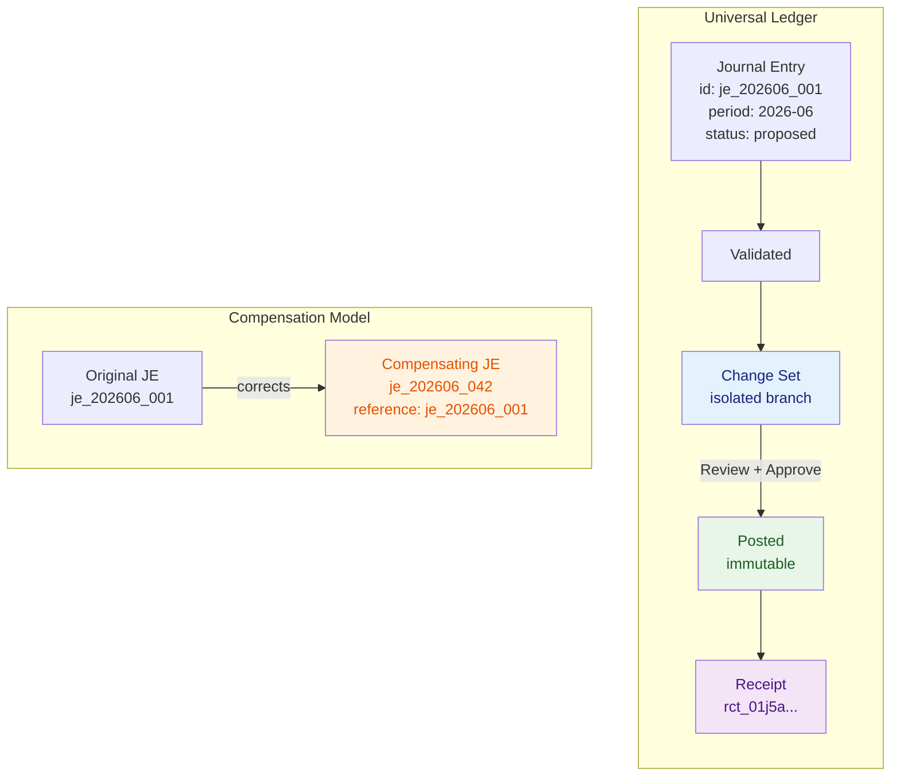

# 07 — Financial Plane

**Última actualización:** 2026-07-27
**FEOS Plano:** 6 de 8 — Financiero
**Propósito:** modelar, validar y explicar los hechos financieros que constituyen el corazón de Drenyra.

---

## Qué es

El Financial Plane es el dominio contable y fiscal de Drenyra: Universal Ledger, close, impuestos, tesorería, cuentas por pagar y cobrar, nómina y reporting. Aquí viven los conceptos que determinan qué ocurrió económicamente, no sólo cómo se mostró, automatizó o transportó una operación.

Su principio es **Ledger-as-Git**. El ledger publicado es un historial inmutable de asientos atómicos; una propuesta vive en un Change Set; el financial diff explica el before/after; la revisión precede al posteo; una corrección se representa con un contraasiento, no reescribiendo el pasado. La analogía no convierte la contabilidad en código: enfatiza lineage, revisión y reversibilidad explícita.

## Qué no es

No es un conjunto de pantallas de facturas ni una base de datos genérica de movimientos. La UI pertenece a [Experience](../02-experience-plane/README.md), la coordinación a [Execution](../06-execution-plane/README.md) y la autorización a [Trust](../05-trust-plane/README.md). El Financial Plane no permite que un modelo “decida” hechos contables: recibe propuestas, valida reglas e invariantes, y sólo acepta resultados autorizados.

## Universal Ledger e invariantes

El Universal Ledger modela entidades, chart of accounts, journal entries, líneas, moneda, tipos de cambio, períodos, dimensiones y provenance. Es neutral respecto del país en su core, pero admite mappings, documentos y reglas locales por medio de [Country Packs](../09-country-plane/README.md).

Sus invariantes son contratos del dominio, no sugerencias:

- cada journal entry balancea débitos y créditos en sus monedas y bases aplicables;
- todo importe usa moneda, precisión y fecha de tipo de cambio explícitas;
- cada asiento tiene compañía, período, identidad y provenance;
- un período bloqueado no recibe posteo ordinario;
- una corrección conserva referencia al hecho corregido y se expresa mediante compensación o rectificación autorizada;
- no existen duplicados lógicos de documentos o posteo bajo la misma identidad de negocio;
- el aislamiento tenant y compañía es absoluto.

## Subdominios conectados

El **close process** reúne checklist, conciliaciones, ajustes, análisis de variaciones, locks y publicación de estados. No es una fecha en el calendario: es la prueba de que los invariantes y dependencias del período alcanzaron el nivel requerido.

El **tax engine** aplica reglas versionadas para impuestos, retenciones, declaraciones y validaciones. Los cálculos deben ser deterministas dado el mismo input, versión de regla y contexto de país. El motor explica su base, tasas y excepciones para que un profesional pueda revisar el resultado.

**Treasury** administra cuentas bancarias, posición de caja, forecasting, pagos y conciliación. **AP/AR** organiza proveedores, comprobantes, cuentas, cobros y vencimientos. **Payroll** calcula nómina, obligaciones y asientos asociados. **Reporting** produce trial balance, P&L, balance sheet, cash flow y reportes regulatorios desde hechos y políticas identificables, no desde agregados opacos.

## Ejemplo práctico

Una factura de proveedor se ingiere y se clasifica como gasto de servicios con IGV. Antes del posteo, el ledger valida balance, período, moneda, proveedor y no duplicidad. El tax engine calcula el impuesto con la versión de regla peruana correspondiente. La propuesta vive en un Change Set y su diff muestra efecto en gasto, crédito fiscal y cuentas por pagar. Tras la aprobación exacta de [Trust](../05-trust-plane/README.md), [Execution](../06-execution-plane/README.md) postea una vez y conserva receipt. El reporte de junio puede rastrear el saldo hasta esa factura y la política que la evaluó.

## Integridad del modelo

FSD, Fiscal Specification-Driven Execution, obliga a declarar objetivo, jurisdicción, período e invariantes antes de un workflow material. Esto permite pruebas, auditoría y cambios de norma sin esconder reglas en prompts o componentes de UI. Los agentes de [Intelligence](../04-intelligence-plane/README.md) pueden proponer clasificación o explicar variaciones, pero sus outputs atraviesan validación de dominio y jamás alteran el ledger publicado directamente.

## Relación con los demás planos

- [Workspace](../03-workspace-plane/README.md) delimita compañía, período y Change Sets.
- [Trust](../05-trust-plane/README.md) congela candidatos y preserva evidencia de cada efecto material.
- [Execution](../06-execution-plane/README.md) hace durable cierre, conciliación, posteo y compensación.
- [Integration](../08-integration-plane/README.md) ingresa documentos, bancos y autoridades mediante contratos.
- [Country](../09-country-plane/README.md) especializa reglas, calendarios y vocabulario sin bifurcar el core.

El Financial Plane es el corazón de Drenyra porque protege la integridad de lo que la organización afirma sobre su realidad económica.
