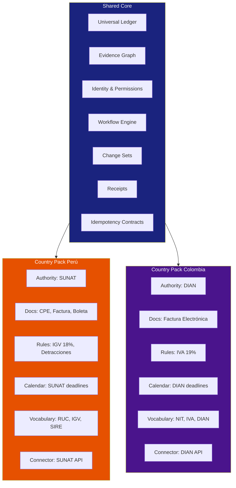

# 09 — Country Plane

**Última actualización:** 2026-07-27
**FEOS Plano:** 8 de 8 — País
**Propósito:** adaptar Drenyra a jurisdicciones latinoamericanas mediante Country Packs componibles, no forks.

---

## Qué es

El Country Plane es el runtime y modelo de composición que convierte un core financiero universal en una operación correcta para una jurisdicción concreta. Drenyra parte de Perú y se expande en esta secuencia: **Perú → Colombia → Chile → Ecuador → México → Brasil**. El orden es estratégico: combina dolor contable, digitalización regulatoria, accesibilidad de integraciones, disponibilidad de partners, atractivo de mercado y costo de localización.

Un **Country Pack** encapsula las diferencias legales y operativas de un país sin duplicar el producto. Declara qué autoridad aplica, qué documentos existen, cómo se calculan reglas, qué calendario fiscal rige, qué declaraciones se presentan, cómo se habla de los conceptos y qué conectores habilitar. El core no debe saber que una regla pertenece a SUNAT o DIAN; consume contratos y capacidades explícitas del pack.

## Qué no es

No es una bandera de idioma, un conjunto de ifs dispersos por la aplicación ni una copia de Drenyra por país. Traducir etiquetas no localiza una plataforma financiera. Tampoco permite que una regla local altere invariantes universales del ledger o el protocolo de evidencia. Cuando una necesidad no es reusable, se aísla como override del pack y se documenta su contrato.

## Shared core y overrides

El core compartido incluye Universal Ledger, Evidence Graph, Identity and Permissions, workflow engine, Change Sets, receipts, idempotencia y contratos de integración. Estos componentes conservan semántica consistente para todas las jurisdicciones.

Cada pack aporta overrides declarativos y ejecutables:
| Área         | Responsabilidad del Country Pack                             |
| ------------ | ------------------------------------------------------------ |
| Authority    | organismos, endpoints, credenciales y estados regulatorios   |
| Documents    | comprobantes, formatos, numeración y requisitos de evidencia |
| Rules        | impuestos, validaciones, tasas, retenciones y excepciones    |
| Calendars    | vencimientos, períodos, feriados y ventanas de presentación  |
| Declarations | formularios, libros, secuencias y confirmaciones             |
| Vocabulary   | términos regulatorios y contables de uso local               |
| Integrations | conectores y capacidades DFP habilitadas                     |

Las reglas se versionan con fecha de vigencia, fuente legal y fixtures. Una ejecución registra la versión exacta de pack y regla, para que una declaración de junio pueda explicarse aun después de una reforma normativa.

## Country Pack Runtime

El runtime carga el pack según jurisdicción, compañía y período, resuelve dependencias compatibles y expone sus capacidades al resto del sistema. Las reglas fiscales pueden ejecutarse en un sandbox —por ejemplo WASM para lógica determinista— y las integraciones se registran a través del [Integration Plane](../08-integration-plane/README.md). El runtime no acepta extensiones con privilegios implícitos: un pack declara permisos, schemas y límites de datos.

La compatibilidad se prueba con casos positivos, negativos y de migración. Al publicar una versión nueva, los workspaces existentes no cambian de regla silenciosamente; una política define si el nuevo período la adopta, si una declaración pendiente debe migrarse o si requiere revisión profesional.

## Ejemplo práctico

Una compañía peruana abre un workspace de cierre de junio. El runtime selecciona `PE`, carga calendario SUNAT, tipos CPE, reglas IGV y capacidades SIRE. El [Financial Plane](../07-financial-plane/README.md) usa el core ledger; el pack aporta la validación y cálculo local. Al preparar un envío, [Integration](../08-integration-plane/README.md) resuelve el conector SUNAT y [Trust](../05-trust-plane/README.md) enlaza la versión de regla, evidence root y candidate a la aprobación.

Al sumar Colombia, no se crea un segundo ledger ni un segundo protocolo de receipts. Se implementa un pack con DIAN, documentos y reglas colombianas, sus fixtures y vocabulario. Los especialistas de [Intelligence](../04-intelligence-plane/README.md) reciben el contexto de jurisdicción versionado en vez de memorizar reglas mezcladas en prompts.

## Estrategia de expansión

Perú es la cuña porque concentra el aprendizaje de CPE, SUNAT, SIRE y operación fiscal local. Colombia valida la capacidad de abstraer otra autoridad y documentación electrónica. Chile y Ecuador prueban variaciones regulatorias adicionales; México exige alcance e integración mayores; Brasil se aborda cuando capital, partners y madurez operativa justifican la complejidad tributaria y subnacional. La secuencia no es una promesa de fechas: cada país requiere evidencia de product-market fit, conformance y cobertura de pruebas antes de activarse.

## Reglas operativas

### Hacer

- Empezar desde el pack de Perú como referencia — tiene la cobertura más completa.
- Versionar las reglas con fecha de vigencia, fuente legal y fixtures.
- Mantener el core compartido independiente de jurisdicción — invariantes universales no se tocan.
- Probar compatibilidad con casos positivos, negativos y de migración antes de activar un pack.

### No hacer

- No crear un ledger, protocolo de evidencia o sistema de receipts por país.
- No permitir que un override del pack altere invariantes universales del core.
- No cambiar la versión de regla de un workspace activo silenciosamente.
- No agregar un país sin evidencia de product-market fit, conformance y cobertura de pruebas.

---

## Relación con los demás planos

- [Workspace](../03-workspace-plane/README.md) asigna compañía, período y jurisdicción al trabajo.
- [Financial](../07-financial-plane/README.md) conserva invariantes universales y consume overrides locales.
- [Trust](../05-trust-plane/README.md) vincula políticas y fuentes legales versionadas a candidatos exactos.
- [Execution](../06-execution-plane/README.md) aplica calendarios, recuperación y presentación durable.
- [Experience](../02-experience-plane/README.md) muestra vocabulario y capacidades locales sin ocultar el core común.

La expansión sostenible ocurre cuando agregar un país significa componer un pack probado, no multiplicar productos que ya no pueden evolucionar juntos.
