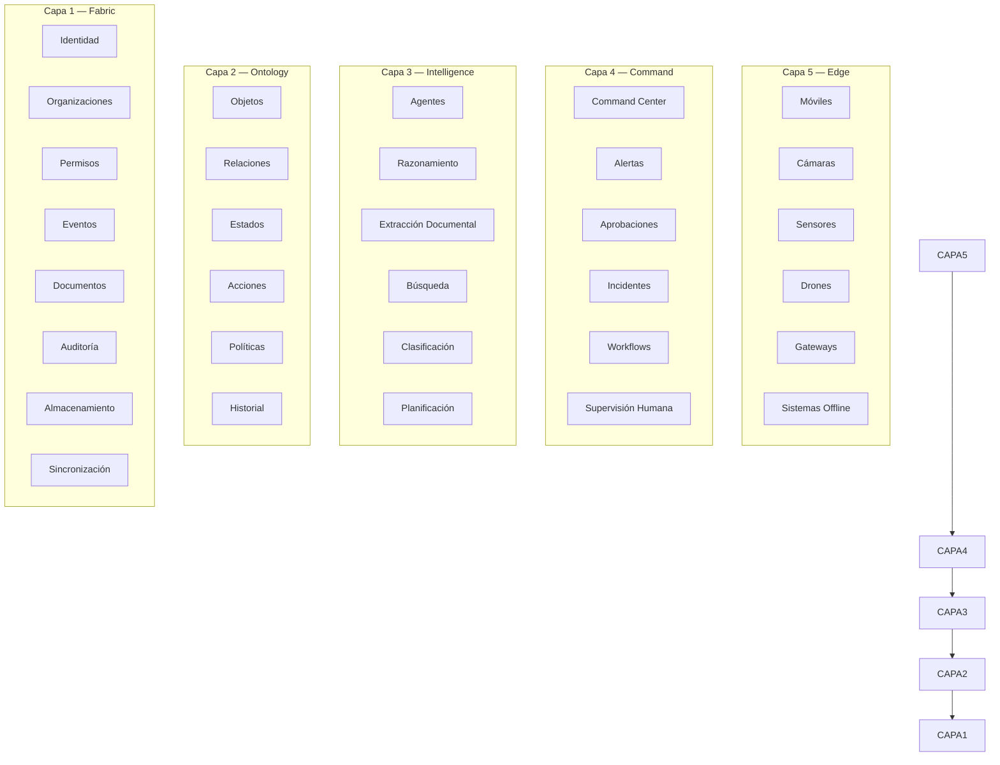
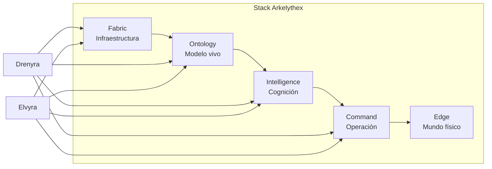

> **Drenyra es una implementación de las capas Fabric, Ontology, Intelligence y Command de la arquitectura Arkelythex.**
>
> Para la arquitectura completa del ecosistema, ver el documento original.

---

# Arkelythex Architecture — 5-Layer Model

> **Última actualización**: 2026-07-17

La arquitectura de Arkelythex está organizada en cinco capas que evolucionan incrementalmente. Cada capa abstrae una preocupación fundamental del sistema y puede operar independientemente.

---

## Vista General



---

## Capa 1 — Arkelythex Fabric

Infraestructura común compartida por todos los productos y capas superiores.

### Componentes

| Componente           | Responsabilidad                                      |
| -------------------- | ---------------------------------------------------- |
| **Identidad**        | Autenticación, MFA, sesiones, OAuth, SSO             |
| **Organizaciones**   | Multi-tenant, jerarquías, unidades de negocio        |
| **Tenant Isolation** | Aislamiento completo de datos por tenant             |
| **Permisos**         | RBAC, políticas granulares, heredabilidad            |
| **Eventos**          | Event bus, streams, suscripciones                    |
| **Workflows**        | Motores de workflow, state machines, BPMN            |
| **Documentos**       | Almacenamiento, versionado, clasificación            |
| **Auditoría**        | Logs inmutables, trazabilidad forense                |
| **Firmas**           | Firmas digitales, sellos de tiempo, blockchain       |
| **Cifrado**          | En reposo, en tránsito, E2EE                         |
| **Almacenamiento**   | Archivos, objetos, blobs, cold storage               |
| **Observabilidad**   | Métricas, tracing, logging, alertas                  |
| **Sincronización**   | Offline-first, sync engines, conflict resolution     |
| **Modo Offline**     | Operación sin conexión, colas locales, sync diferido |

### Tecnología Base

- **Runtime**: Bun 1.x
- **API Gateway**: ElysiaJS
- **Base de datos**: PostgreSQL 15+
- **Event Bus**: NATS JetStream
- **Cache**: Redis
- **Auth**: Better Auth

---

## Capa 2 — Arkelythex Ontology

El modelo vivo del mundo operativo. Es la ventaja competitiva más importante de Arkelythex.

### Conceptos Fundamentales

```text
Objeto     → Entidad del mundo real (Persona, Empresa, Contrato)
Relación   → Conexión semántica entre objetos (emplea, pertenece, regula)
Estado     → Condición de un objeto en un momento (activo, suspendido, cerrado)
Acción     → Operación válida sobre un objeto (crear, modificar, aprobar)
Restricción→ Regla que limita acciones según estado y contexto
Política   → Regla de negocio automatizada
Historial  → Línea de tiempo completa de cambios
Procedencia→ Origen y transformación de cada dato
```

### Ontología Core

```text
Empresa
├── Personas (socios, directores, representantes)
├── Activos (tangibles, intangibles, financieros)
├── Contratos (clientes, proveedores, laborales)
├── Proyectos (obras, servicios, iniciativas)
├── Obligaciones (fiscales, laborales, contractuales)
├── Transacciones (ingresos, egresos, transferencias)
├── Documentos (facturas, contratos, informes)
├── Riesgos (fiscales, operativos, legales)
├── Decisiones (aprobaciones, rechazos, autorizaciones)
└── Evidencias (soportes, comprobantes, audit trails)
```

### Ontologías por Vertical

Ver [DOCTRINE.md](./DOCTRINE.md#ontologías-por-vertical) para las extensiones de minería, construcción y contabilidad.

---

## Capa 3 — Arkelythex Intelligence

Capa cognitiva que provee razonamiento, análisis y capacidades de IA.

### Capacidades

| Capacidad                       | Descripción                                    |
| ------------------------------- | ---------------------------------------------- |
| **Agentes**                     | Agentes de IA especializados por dominio       |
| **Razonamiento**                | Inferencia, análisis, diagnóstico              |
| **Extracción Documental**       | OCR, NLP, extracción de datos estructurados    |
| **Generación**                  | Informes, contratos, comunicaciones            |
| **Búsqueda Semántica**          | RAG, embeddings, búsqueda vectorial            |
| **Clasificación**               | Automática por tipo, riesgo, prioridad         |
| **Simulación**                  | Proyecciones, escenarios, sensitivity analysis |
| **Planificación**               | Scheduling, rutas, asignación de recursos      |
| **Interfaces Conversacionales** | Chat, voice, asistentes                        |

### Principio de Escalado

```text
Reglas deterministas
    ↓
Modelos pequeños especializados
    ↓
Modelos generales
    ↓
Humano experto
```

No usar el modelo más caro para cada tarea. Escalar inteligencia por necesidad, no por moda.

---

## Capa 4 — Arkelythex Command

Capa de operación y control. Donde las decisiones se toman, ejecutan y verifican.

### Componentes

| Componente             | Función                                            |
| ---------------------- | -------------------------------------------------- |
| **Command Center**     | Visión unificada de operaciones, alertas y estado  |
| **Alertas**            | Notificaciones proactivas sobre eventos críticos   |
| **Aprobaciones**       | Flujos de autorización con supervisión humana      |
| **Misiones**           | Objetivos operativos con seguimiento               |
| **Incidentes**         | Gestión de eventos no planificados                 |
| **Workflows**          | Automatización de procesos operativos              |
| **Supervisión Humana** | Override, kill switch, revisión antes de ejecución |
| **Automatización**     | Ejecución autónoma dentro de límites               |

### Ciclo Operativo

```text
Observar → Comprender → Decidir → Autorizar → Ejecutar → Verificar → Aprender
```

---

## Capa 5 — Arkelythex Edge

Capa física que conecta el software con el mundo real. Se construye después de que las capas 1-4 están maduras.

### Componentes

- Dispositivos móviles con capacidades offline
- Cámaras y sistemas de visión
- Sensores IoT
- Drones para inspección y monitoreo
- Gateways industriales
- Sistemas de inferencia local
- Telemetría y control de activos

### Requisitos

- Operación sin conexión a internet
- Sincronización diferida
- Inferencia en dispositivo
- Consumo energético eficiente
- Hardware económico y reemplazable
- Cifrado de extremo a extremo

---

## Mapa de Productos a Capas

| Producto           | Fabric | Ontology | Intelligence | Command | Edge |
| ------------------ | ------ | -------- | ------------ | ------- | ---- |
| **Drenyra**        | ✅     | ✅       | ✅           | ✅      | ❌   |
| **Elvyra**         | ✅     | ✅       | ✅           | ✅      | ❌   |
| **Forge (futuro)** | ✅     | ✅       | ✅           | ✅      | ✅   |

---

## Resumen Visual



---

## Documentos Relacionados

- [Doctrina Arkelythex](./DOCTRINE.md) — Visión estratégica completa
- [README principal](../README.md) — Visión general del repositorio
