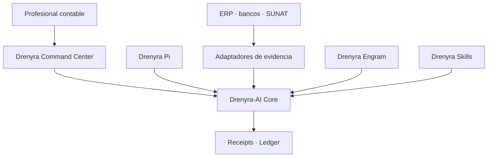

# Ecosystem Boundaries — Drenyra (Accounting Command Center)

> **Last updated:** 2026-08-11 (Design 1 — boundary & authority contract).

> Fiscal convention: monetary values in the Drenyra ecosystem are BigInt cents; no float is ever used for money; version/sequence numbers are JSON integers, never floats.

## Role in the ecosystem

Drenyra is the **Accounting Command Center** and the mature product of the ecosystem. It is the end-user surface where professionals run fiscal workflows, review candidates, approve material decisions, and operate the accounting ledger.

Drenyra **consumes** the ecosystem runtime and memory; it does not re-implement them:

| Consumed      | How                                                                  |
| ------------- | -------------------------------------------------------------------- |
| `drenyra-ai`  | Receipt-Driven Accounting runtime: missions, candidates, reviews, gates, receipts, ledger |
| `drenyra-engram` | Institutional accounting memory: scope-first observations, policies, mission learnings |

## What Drenyra is (in scope)

- The product: workspaces, companies (RUC), fiscal periods, documents, accounts, SUNAT flows.
- Human-in-the-loop fiscal workflows with risk-proportional approval (R0–R3).
- Country packs (Peru first: SUNAT, IGV, SIRE, PLE, CDR, detracciones), then LATAM.
- The evidence graph: `source → normalized → validated → proposed → approved → promoted`.
- Professional UI and product surfaces for the above.

## Explicit non-goals

Drenyra is **not**:

- An independent agent runtime. Missions, candidates, review lenses, gates, receipts, and the ledger core belong to `drenyra-ai`.
- A memory engine. Observations, scope-first search, relations, lifecycle, and provenance belong to `drenyra-engram`.
- A Pi extension. The Pi-native harness belongs to `drenyra-pi`.
- A standalone receipt verifier for external ERPs. That is `drenyra-ai`'s public surface.

## What Drenyra must NOT contain long-term

These are extraction targets. They already live (or are being extracted into) other repos and must not be re-created here:

- **Mission / candidate / review / gate runtime logic** → `drenyra-ai`. Drenyra consumes released, versioned artifacts; it never vendors a checkout.
- **Memory storage and search** → `drenyra-engram`. Drenyra reads memory through its surfaces.
- **Pi-specific operator behavior** → `drenyra-pi`.
- **Duplicated contract types** → contracts are canonical in `drenyra-ai` and `drenyra-engram`; Drenyra imports them, it does not fork them.

## Ecosystem authority contract (Design 1 — approved boundary)

### Responsibility contract

| Component | Responsibility | Must never |
| --- | --- | --- |
| **Drenyra** | Interface, inboxes, visualization, review and approval | Re-implement gates or mutate authoritative states directly |
| **Drenyra-AI** | Missions, candidates, materiality, authority, gates, receipts, ledger and recovery | Depend on the UI or trust agent narratives |
| **Drenyra Pi** | Harness optimized to run specialized agents | Resolve versions from PATH or bypass the Core |
| **Drenyra Engram** | Institutional memory and context retrieval | Authorize actions or treat memories as evidence |
| **Drenyra Skills** | Versioned accounting, fiscal and jurisdictional knowledge | Silently change frozen policies |
| **Adaptadores** | Gather evidence from ERP, banks, SUNAT and files | Claim success without a verifiable response |
| **Guardian Angel** | Independent and adversarial review | Approve its own work or substitute the professional |

### Chain of authority

1. The professional requests an outcome from Drenyra.
2. Drenyra creates a mission through the published Drenyra-AI contract.
3. Agents research, propose and prepare candidates.
4. Drenyra-AI computes identity, scope and materiality.
5. Gates determine which evidence and approval are required.
6. The professional approves when appropriate.
7. An adapter executes or confirms the external action.
8. Drenyra-AI records the result with a signed receipt and verifiable ledger.
9. Drenyra only represents the authoritative state returned by the Core.

### Dependency rule

- Drenyra and Drenyra Pi consume **published versions** of Drenyra-AI. Drenyra-AI never depends on them.
- The UI may go down and rebuild from Core state; a transcript may be lost and the mission recovered from events and evidence.
- **No consumer may convert a Core rejection into an approval.**

> **Agent model (Design 3):** AI interprets, investigates and proposes; deterministic code computes, validates, authorizes and records. The MissionOrchestrator holds no fiscal authority — the Core remains the only component able to accept a transition. See [ADR-011](../11-adr/ADR-011-agent-model-ai-proposes-core-decides.md).

## Consumers and producers

| Direction | Party | Relation |
| --------- | ----- | -------- |
| Consumes  | `drenyra-ai` | released, versioned runtime (missions, receipts, gates) |
| Consumes  | `drenyra-engram` | memory reads/context (memory never authorizes) |
| Produces for | end users | fiscal workflows, approvals, evidence trail |
| Produces for | professionals | candidates to approve, receipts to certify |

## Current state and maturity

- Drenyra is the **mature product**: it carries the production UI, fiscal workflows, and country packs, and it owns the professional experience.
- Its dependency on `drenyra-ai` / `drenyra-engram` is consumption of released artifacts; extraction continues in those repos until Drenyra's internal copies are gone.

## Ownership and accountability

- Product and professional experience: this repo.
- Runtime contracts and gates: `drenyra-ai`.
- Memory contracts and lifecycle: `drenyra-engram`.
- A defect in a consumed artifact is filed in the owning repo, with the consumer's evidence attached.

## Boundary enforcement

- Direction violations are caught in review: a PR that re-implements `drenyra-ai` or `drenyra-engram` logic inside Drenyra is rejected and redirected to the owning repo.
- Drenyra consumes released `drenyra-ai` versions; the extraction direction is one-way (see `dependency-direction.md` and `RELEASING.md`).
