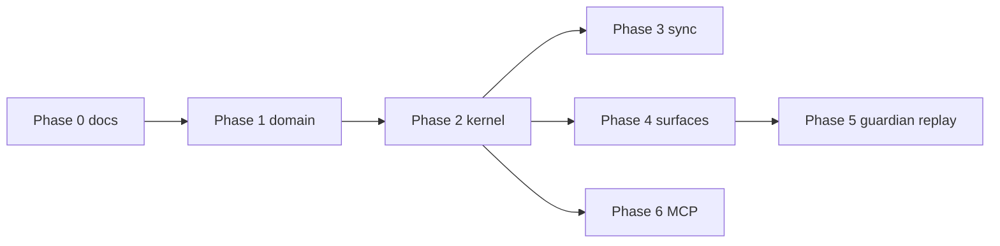

# Drenyra Fiscal App Server — SDD Implementation Tasks

> **Spec:** [drenyra-fiscal-app-server-2026.md](../01-architecture/drenyra-fiscal-app-server-2026.md)  
> **ADR:** [ADR-034](../02-adr/adr-034-drenyra-fiscal-app-server.md)  
> **Kernel design:** [kernel/README.md](../../apps/api/src/features/drenyra/kernel/README.md)  
> **Status:** Phase 0 complete — domain contracts + docs  
> **Last updated:** 2026-06-30

---

## Phase 0 — Consolidación documental ✅

| Task | Acceptance criteria | Status |
|---|---|---|
| ADR-034 accepted | Decision record in `docs/02-adr/` | ✅ |
| DFAS protocol spec | JSON schemas + sequence diagrams in `docs/01-architecture/` | ✅ |
| Domain contracts | `dfas-protocol-types`, `dfas-item-stream`, `guardian-policies`, `skills-types` + tests | ✅ |
| Kernel design doc | `apps/api/src/features/drenyra/kernel/README.md` | ✅ |
| Sync playbook + script | `docs/05-development/drenyra-repo-sync.md` + `scripts/sync-drenyra-standalone.sh` | ✅ |
| FIP architecture updated | DFAS layer in system map + section 6.1 | ✅ |
| Dual-surface Brain updated | References DFAS transport | ✅ |
| Standalone sync | `--apply` run; domain tests pass in Drenyra | ⬜ verify |

---

## Phase 1 — Domain contracts hardening (1-2 weeks)

| Task | Acceptance criteria |
|---|---|
| 1.1 Export `DFAS_PROTOCOL_VERSION` in package.json domain exports | `@drenyra/domain/drenyra` re-exports all DFAS types |
| 1.2 Add `dfas-protocol-contract.test.ts` | Validates sample JSON-RPC messages against TypeScript types |
| 1.3 Wire guardian audit events to `AUDIT_EVENT_TYPES` | Add `GUARDIAN_*` event types to domain `types.ts` |
| 1.4 Lexori YAML loader stub in TS | `packages/drenyra-orchestrator/src/skills/loader.ts` loads 6 canonical skills |
| 1.5 Sync to standalone | `sync-drenyra-standalone.sh --check` exits 0 |

**Verification:**

```bash
cd packages/domain && bun run test -- src/drenyra/__tests__/dfas-*.test.ts
cd packages/domain && bun run test -- src/drenyra/__tests__/guardian-policies.test.ts
```

---

## Phase 2 — Runtime Kernel v0 (2-3 weeks)

| Task | Acceptance criteria |
|---|---|
| 2.1 Create `kernel/types.ts` | Internal deps interface `FiscalAppServerDeps` |
| 2.2 Implement `FiscalThreadManager` | Wraps brain service; scope enforcement via `dfasScopesMatch` |
| 2.3 Implement `TurnController` | Start/cancel/approval pause-resume state machine |
| 2.4 Implement `ItemStreamPublisher` | Monotonic sequence; `createDfasItemStreamEntry` on append |
| 2.5 Implement `OrchestrationRouter` | Routes `transaction` / `period` / `auto` modes |
| 2.6 Implement `DelegationRouter` | Delegates to `@drenyra/harness` |
| 2.7 Implement `CapabilityGuard` + `SkillInjector` | Pre-flight capability + Lexori context |
| 2.8 Implement `TruthPromotionBoundary` | No direct promotion; emits `item/truth_promoted` |
| 2.9 Compose `createFiscalAppServer()` | Factory in `kernel/index.ts` |
| 2.10 Wire REST compat v0 | `/brain/*` and `/runs/*` delegate to kernel |
| 2.11 WebSocket endpoint | `WS /api/drenyra/v1/ws` handles `thread/create`, `turn/start` |
| 2.12 Kernel unit tests | ≥80% coverage on turn-controller, orchestration-router |

**Verification:**

```bash
cd apps/api && bun run test src/features/drenyra/kernel
curl -i -N -H "Connection: Upgrade" -H "Upgrade: websocket" http://localhost:3000/api/drenyra/v1/ws
```

---

## Phase 3 — Sync Drenyra standalone (1 week)

| Task | Acceptance criteria |
|---|---|
| 3.1 Port `phase/` to standalone | `Drenyra/packages/drenyra-orchestrator/src/phase/` identical to canonical |
| 3.2 Port Lexori skills to standalone | `Drenyra/apps/data-engine/src/skills/` with 6 YAML files |
| 3.3 Port kernel module to standalone | After Phase 2 implementation |
| 3.4 Contract tests in CI both repos | GitHub workflow runs `test:contracts` + dfas tests |
| 3.5 Fix standalone doc links | README references local `docs/` not `../../drenyra` |

**Verification:**

```bash
scripts/sync-drenyra-standalone.sh --check  # exit 0
cd Drenyra && bun run dev:check
```

---

## Phase 4 — Surfaces (2 weeks)

| Task | Acceptance criteria |
|---|---|
| 4.1 Web `useDrenyraItemStream` hook | Subscribes to WS/SSE; renders all item types |
| 4.2 Web command center wiring | Inspector shows `item/evidence` + `item/envelope` |
| 4.3 CLI DFAS client | `apps/drenyra-cli/internal/dfas/` NDJSON or HTTP client |
| 4.4 CLI unification | Single client replaces separate brain + runs polling |
| 4.5 Skills UI | Browse/invoke Lexori skills from command palette |
| 4.6 E2E parity test | Same turn visible in Web + CLI with identical envelope fields |

**Verification:**

```bash
cd apps/web && bun run test -- drenyra-command-center
cd apps/drenyra-cli && go test ./internal/dfas/...
cd e2e && bunx playwright test drenyra-command-center
```

---

## Phase 5 — Fiscal Guardian + Replay (2 weeks)

| Task | Acceptance criteria |
|---|---|
| 5.1 Wire `evaluateFiscalGuardian` in TurnController | Auto-allow read/explain/draft low-risk only |
| 5.2 OPA/Rego integration | `drenyra-approval.rego` consulted for high-risk |
| 5.3 Replay API | `GET /api/drenyra/threads/:id/replay` reconstructs from FAL + Engram |
| 5.4 Simulation mode | `turn/start` with `dryRun: true` skips truth promotion |
| 5.5 Replay metadata on promotion | `validatorVersion`, `policyVersion`, `evidenceRootHash` stored |
| 5.6 Guardian audit events persisted | `GUARDIAN_AUTO_ALLOWED` / `GUARDIAN_REQUIRE_HUMAN` in audit trail |

**Verification:**

```bash
cd apps/api && bun run test src/features/drenyra/kernel/__tests__/replay
# Manual: start turn → approve → GET replay → identical item sequence
```

---

## Phase 6 — MCP public surface (1-2 weeks)

| Task | Acceptance criteria |
|---|---|
| 6.1 Partner MCP server scaffold | Read/explain/draft tools only |
| 6.2 Capability matrix on MCP | Same `evaluateDrenyraCapability` as DFAS |
| 6.3 Redaction middleware | No raw secrets in MCP responses |
| 6.4 Rate limits per partner | Configurable per API key |
| 6.5 MCP audit events | Every tool call → FAL audit with partner id |
| 6.6 Documentation | Public MCP tool catalog in `docs/04-api/drenyra-mcp.md` |

**Verification:**

```bash
cd apps/api && bun run test src/features/drenyra/mcp
# MCP inspector: call get_company_fiscal_profile with scoped key → 200
# MCP inspector: call promote_fiscal_truth → denied
```

---

## Success metrics (release gate)

| Metric | Target | How to measure |
|---|---|---|
| Surface parity | 0 dropped envelope fields | E2E diff Web vs CLI item payloads |
| Approval latency | Turn pauses ≤500ms on approval/required | Kernel integration test |
| Audit reconstructability | 100% turns replayable | Replay API golden test |
| Fiscal path coverage | 100% on DFAS + guardian | `packages/domain` test suite |
| Repo drift | 0 between canonical and standalone | `sync-drenyra-standalone.sh --check` |
| Protocol stability | Breaking changes bump `DFAS_PROTOCOL_VERSION` | ADR + changelog |

---

## Dependencies



Phase 4 and Phase 6 can run in parallel after Phase 2 completes.
