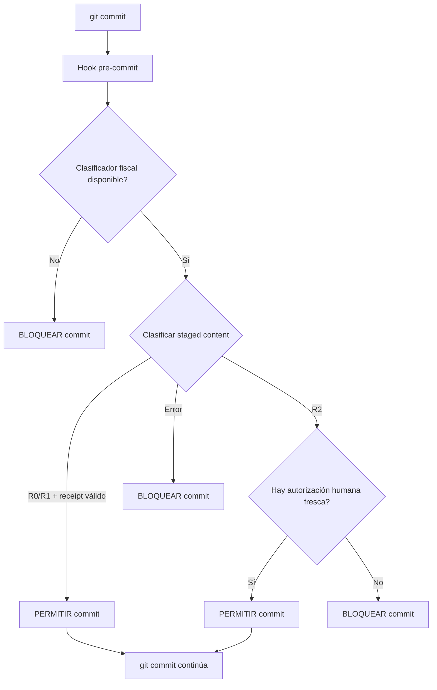

# SDD-009 — Agentic SDD Execution and Context Protocol

**Estado:** APPROVED  
**Depende de:** SDD-005, SDD-019, SDD-020  
**Informa:** SDD-090, SDD-091, SDD-093  
**Aplica a:** toda ejecución agentic bajo SDD — orquestador, subagentes de fase, revisores, gates y hooks pre-commit

---

## Prólogo

Este SDD constituye la carta fundacional del workflow agentic. Define **cómo** se ejecuta SDD cuando el agente tiene autonomía verificable, no si debe ejecutarse. No reemplaza la decisión humana de iniciar SDD ni la revisión humana de merge. Establece los límites dentro de los cuales el agente puede operar sin supervisión momento a momento.

La autoridad no se delega por instrucción textual. Se delega por capas de verificación determinista, gates mecánicos, receipts vinculados al contenido y auditoría medible. Cada nivel de autonomía se gana con evidencia, no con confianza.

---

## 1. Propósito, alcance, invariantes y non-goals

### 1.1 Propósito

Establecer las reglas operativas para la ejecución autónoma verificable de fases SDD por parte de Gentle AI (Pi/el Gentleman), garantizando que:

1. El costo, la latencia y el contexto se mantengan dentro de límites predecibles.
2. El contenido fiscal y sensible nunca quede sujeto exclusivamente a autoridad del modelo.
3. Toda modificación del código vinculada a un receipt revisado y validable.
4. La compacción, delegación y recuperación de sesiones no pierdan reglas ni contratos.
5. La telemetría permita evaluar la calidad del comportamiento agentic sin exponer datos sensibles.

### 1.2 Alcance

Aplica a:

- El orquestador principal (el Gentleman).
- Subagentes de todas las fases SDD (explore, propose, spec, design, tasks, apply, verify, archive).
- Revisores nativos de Gentle AI y revisores humanos.
- Gates pre-commit, push, PR y merge.
- Plugins y scripts que implementen el clasificador fiscal, el hook pre-commit, la inyección de skills y la telemetría.
- Cualquier agente, script o automatización que ejecute código en el repositorio de Drenyra bajo SDD.

### 1.3 Invariantes

Estas condiciones son **siempre verdaderas**. Ninguna instrucción, skill, prompt, compacción o delegación puede relajarlas:

| ID  | Invariante                                                                                                                      | Fundamento                          |
| --- | ------------------------------------------------------------------------------------------------------------------------------- | ----------------------------------- |
| I01 | Ningún cambio llega a `main` sin autorización humana explícita.                                                                 | Soberanía del deploy                |
| I02 | Ninguna autorización humana caduca o se reutiliza para contenido distinto del aprobado.                                         | SDD-005 (gates), SDD-019 (L3)       |
| I03 | El modelo no decide unilateralmente qué constituye un cambio fiscal material. Lo determina un clasificador determinista.        | SDD-019 (tools > model)             |
| I04 | Toda modificación de código ejecutable tiene un receipt vinculado al índice exacto de Git.                                      | Gentle AI 2.1.4 (staged projection) |
| I05 | Los secretos, tokens de API, credenciales y RUCs reales nunca entran al prompt del modelo.                                      | SDD-090 (SECRET classification)     |
| I06 | Las reglas del skill registry se inyectan verificablemente antes de cada delegación; ningún subagente decide qué skills cargar. | Gentle AI #255 (skill loss)         |
| I07 | El sistema sigue funcionando correctamente ante un cache miss de prefix caching.                                                | Robustez operativa                  |
| I08 | Ningún agente puede modificar su propia configuración de autoridad, límites, gates o contratos.                                 | Segregación de poderes              |

### 1.4 Non-goals

1. **No** reemplazar la revisión humana de merge ni la decisión de desplegar.
2. **No** definir el contenido de los SDD de producto, diseño o fiscal (eso es competencia de SDD-005 y los SDD de dominio).
3. **No** implementar un orquestador externo tipo服务工作 (eso sería Arquitectura 3 y se aborda cuando haya evidencia que lo justifique).
4. **No** resolver la pérdida de contexto por compacción mediante ingeniería de prompts — los receipts, hooks y evals son el mecanismo real.
5. **No** especificar la telemetría de producto (SDD-093) ni la observabilidad de usuario — solo la del comportamiento agentic.

---

## 2. Modelo de autoridad B+

### 2.1 Niveles

La autoridad se clasifica en cuatro niveles ordinales. Cada nivel hereda las restricciones del anterior.

| Nivel  | Nombre          | Autonomía                                                                               | Ejemplos                                                                                                                                                                                                                                       |
| ------ | --------------- | --------------------------------------------------------------------------------------- | ---------------------------------------------------------------------------------------------------------------------------------------------------------------------------------------------------------------------------------------------- |
| **R0** | Documental      | Hasta commit en feature branch                                                          | Exploración, especificaciones, diseño, catálogos, documentación, tests contractuales, tests de regresión                                                                                                                                       |
| **R1** | Reversible      | apply → verify → staged review → commit en feature branch                               | UI, componentes, refactors, lógica no fiscal, tests, configuraciones no sensibles                                                                                                                                                              |
| **R2** | Fiscal material | apply → verify → staged review → **pausa humana → commit autorizado** en feature branch | Reglas SIRE/SUNAT, retenciones/detracciones/percepciones, tasas y thresholds, tenant scope y autorización, adaptadores SUNAT/SIRE, migraciones y schemas, código que altera comportamiento fiscal, jobs con efecto fiscal, idempotencia fiscal |
| **R3** | Externo/real    | **Prohibido sin autorización explícita específica**                                     | Ejecutar migraciones de base de datos real, enviar a SUNAT real, acceder a producción, manipular secretos o credenciales reales, operar sobre datos fiscales reales no anonimizados                                                            |

### 2.2 Principio de autoridad mínima

El nivel predeterminado de cualquier operación es el **mínimo necesario**. Un subagente que no necesita tocar archivos fiscales opera en R0 o R1. La escalada a R2 requiere que el clasificador determinista identifique contenido fiscal material en el diff. No hay escalada automática a R3.

### 2.3 El agente no se clasifica a sí mismo

Ningún prompt, skill o instrucción textual puede declarar "esto no es fiscal" como autoridad para omitir el gate. La clasificación la realiza **exclusivamente** el clasificador determinista sobre el diff real, no sobre la intención declarada.

> **Nota informativa:** Esta regla responde al patrón conocido como "sycophancy" en modelos de lenguaje — el modelo tiende a aceptar la caracterización del usuario o de su propio prompt si no encuentra contradicción evidente. El clasificador determinista elimina ese sesgo.

---

## 3. Matriz de operaciones permitidas, condicionadas y prohibidas

| Operación                              | R0  | R1  |   R2    | R3  |
| -------------------------------------- | :-: | :-: | :-----: | :-: |
| Leer código y documentación            | ✅  | ✅  |   ✅    | ✅  |
| Ejecutar tests deterministas           | ✅  | ✅  |   ✅    | ❌  |
| Ejecutar linter/typecheck              | ✅  | ✅  |   ✅    | ❌  |
| Ejecutar lints fiscales                | ✅  | ✅  |  ❌→⚠️  | ❌  |
| Modificar documentación .md            | ✅  | ✅  |   ✅    | ❌  |
| Modificar código R0                    | ✅  | ✅  |   ✅    | ❌  |
| Modificar código R1                    | ❌  | ✅  |   ✅    | ❌  |
| Modificar código R2                    | ❌  | ❌  | ⚠️→✅ * | ❌  |
| Modificar migraciones/schemas          | ❌  | ❌  | ⚠️→✅ * | ❌  |
| Modificar config. de agentes/autoridad | ❌  | ❌  |   ❌    | ❌  |
| Ejecutar native review + receipt       | ✅  | ✅  | ⚠️→✅ * | ❌  |
| Commit en feature branch               | ✅  | ✅  | ⚠️→✅ * | ❌  |
| Push                                   | ❌  | ❌  |   ❌    | ❌  |
| Crear PR                               | ❌  | ❌  |   ❌    | ❌  |
| Merge a main                           | ❌  | ❌  |   ❌    | ❌  |
| Ejecutar migraciones DB reales         | ❌  | ❌  |   ❌    | ❌  |
| Enviar a SUNAT real                    | ❌  | ❌  |   ❌    | ❌  |
| Acceder a producción                   | ❌  | ❌  |   ❌    | ❌  |
| Manipular secretos reales              | ❌  | ❌  |   ❌    | ❌  |

**Leyenda:** ✅ = permitido sin condición; ❌ = prohibido; ⚠️→✅ = permitido tras autorización humana explícita y fresca; ⚠️ = requiere supervisión + autorización humana (nunca commit automático).

> \* R2 operaciones condicionadas requieren: clasificador fiscal → pausa humana → autorización explícita del humano → commit.

---

## 4. Economía de tokens y prefix caching

_Este contrato se especifica formalmente en el **Subcontrato A — Runtime Economics and Prefix Caching**._

### 4.1 Principios

1. El prefix caching de Workers AI se considera una optimización de latencia y costo, no un requisito de funcionamiento. El sistema debe operar correctamente con 0% cache hits.
2. `x-session-affinity` debe ser un identificador **distinto por agente y por sesión**, no un valor global. El orquestador asigna un session ID; cada subagente hereda el mismo o recibe uno propio según el diseño de context packs.
3. El prefijo estable (system prompt + herramientas + skills + contratos normativos) debe preceder al contenido dinámico. Cualquier token variable al inicio del prompt invalida el cache desde ese punto.
4. Se debe medir `cached_tokens` donde la API lo exponga (Workers AI lo expone dentro de `usage`). No se asume cache hit sin evidencia. Si OpenCode no expone `usage.cached_tokens`, la señal se marca como `UNOBSERVABLE` — no se inventa un valor simulado.

### 4.2 Prefijo estable vs. contenido dinámico

| Capa                       | Contenido                                               | ¿En prefijo estable?  |
| -------------------------- | ------------------------------------------------------- | :-------------------: |
| System prompt              | Rol, reglas de comportamiento, instrucciones de formato |      ✅ Siempre       |
| Herramientas               | Tool definitions y schemas                              |      ✅ Siempre       |
| Skill registry             | SKILL.md seleccionados para esta delegación             |      ✅ Siempre       |
| Contratos normativos       | Reglas de SDD-009 aplicables al nivel                   |      ✅ Siempre       |
| Tarea actual               | Instrucción específica de la fase SDD                   |  ❌ Prefijo dinámico  |
| Diff/staged content        | Contenido a modificar o revisar                         |  ❌ Prefijo dinámico  |
| Resultados de herramientas | Outputs de ejecuciones previas                          | ❌ Contenido variable |
| Evidencia reciente         | Resultados de tests, lints, verificaciones              | ❌ Contenido variable |

### 4.3 Session affinity

- **Orquestador:** `session-agentic-{session_id}`
- **Subagente de fase:** `session-agentic-{session_id}-{phase}`
- **Reviewer nativo:** `session-agentic-{session_id}-review`

Cada identificador es único por ejecución, no por branch o tarea. No reutilizar entre sesiones. **Nunca usar un valor global estático** — un `x-session-affinity` fijo mezclaría tráfico de múltiples sesiones y cancelaría el propósito del cache partitioning.

### 4.4 Response caching

- **Desactivado por defecto para toda ejecución SDD, modificación de código y native review.** Una respuesta cached devuelve contenido basado en una request anterior que no refleja cambios posteriores en el código.
- Solo puede activarse para consultas explícitamente inmutables: exploración de documentación, reference lookup, spec drafts sin retroalimentación de tools.
- **Debe desactivarse explícitamente** en configuración del AI Gateway para las fases `apply`, `verify` y cualquier instancia de native review.

---

## 5. Presupuesto operativo de contexto y output

_Este contrato se detalla en el **Subcontrato B — Context Lifecycle and Handoffs**._

### 5.1 Umbrales de contexto del orquestador

Con `limit.context: 128000` en OpenCode:

| Umbral               | Tokens | % del límite | Acción                                                             |
| -------------------- | ------ | :----------: | ------------------------------------------------------------------ |
| Objetivo normal      | ≤76K   |     60%      | Continuar normalmente                                              |
| Advertencia          | 89K    |     70%      | Podar outputs obsoletos y persistir decisiones activas a artifact  |
| Compacción / handoff | 102K   |     80%      | Detener expansión, compactar, persistir estado                     |
| Reserva mínima       | 16K    |    12.5%     | Garantizado para respuesta del modelo, herramientas y recuperación |

El orquestador mide su consumo real y acciona según estos umbrales. Son límites iniciales, no verdades permanentes — se recalibrarán tras los primeros runs con datos reales.

### 5.2 Presupuesto por fase

| Fase            | Contexto máximo          | Output máximo | Notas                                                   |
| --------------- | ------------------------ | ------------- | ------------------------------------------------------- |
| Orquestador     | 128 000 tokens           | 8 192 tokens  | OpenCode compacta antes de 128K                         |
| Explore         | 48–64K                   | 4 096 tokens  | Lectura de código, búsqueda, síntesis de hallazgos      |
| Proposal        | 64–80K                   | 4 096 tokens  | Lectura de exploración + redacción de propuesta         |
| Spec            | 64–80K                   | 8 192 tokens  | Lectura de proposal + drafting detallado                |
| Design          | 64–80K                   | 8 192 tokens  | Lectura de proposal + spec + decisiones de arquitectura |
| Tasks           | 48–64K                   | 4 096 tokens  | Desglose mecánico desde spec + design                   |
| Apply           | 64–80K                   | 4–8K tokens   | Lectura de spec + design + tasks + archivos afectados   |
| Verify          | 48–64K (contexto fresco) | 6 144 tokens  | Contexto fresco, no arrastrar sesión previa             |
| Reviewer nativo | 48–64K (contexto fresco) | 6 144 tokens  | Contexto fresco sobre staged projection                 |
| Archive         | 24–48K                   | 3 072 tokens  | Síntesis de todos los artifacts de fase                 |

**Nota:** verify y review usan contexto fresco siempre. No arrastran contexto de fases previas. Esto evita contaminación y mantiene el enfoque en el diff actual y la spec.

### 5.3 Política de límites

- Los límites de output evitan que una respuesta se trunque silenciosamente. Si el orquestador recibe un output truncado, debe solicitar continuación o delegar nuevamente.
- Los límites de contexto se aplican antes de la delegación. Si el orquestador detecta que el subagente excede el límite, debe compactar o dividir antes de enviar.
- OpenCode gestiona la compacción automática al alcanzar el límite configurado en `opencode.json`.
- Estos límites son iniciales. Debe medirse el uso real por fase durante los primeros 5 runs y recalibrar con p50/p95.

> **Nota informativa:** El límite operativo de 128K para el orquestador es intencional. GLM 5.2 soporta 262K, pero operar cerca del máximo incrementa la latencia del prefill, el costo y el riesgo de degradación por "lost in the middle". La compacción antes de 128K mantiene la señal/ruido alta. Los 262K son capacidad máxima, no objetivo operativo.

---

## 6. Prefijo estable, context packs y contenido dinámico

### 6.1 Estructura del prompt del orquestador

```
[ROLLO: System prompt — siempre primero]
- Identidad (el Gentleman)
- Reglas de comportamiento y respuesta
- Instrucciones de formato

[HERRAMIENTAS: Tool definitions — segundo]
- Definiciones completas de tools disponibles
- Schemas y ejemplos de uso

[CONTRATOS NORMATIVOS: Reglas aplicables — tercero]
- SDD-009 secciones relevantes al nivel de autoridad actual
- Subcontratos A, B, C, D aplicables
- Invariantes activas

[TAREA: Instrucción específica — cuarto]
- Fase SDD a ejecutar
- Contexto del cambio activo
- Entregable esperado

[EVIDENCIA RECIENTE: Resultados de ejecuciones previas — quinto]
- Outputs de herramientas ejecutadas
- Resultados de tests/lints
- Estado de staged changes

[INSTRUCCIÓN FINAL: Cierre — sexto]
- Próximo paso esperado
- Formato de respuesta
```

### 6.2 Context packs por tipo de subagente

Cada subagente recibe solo el contenido mínimo necesario. No se envía el contexto completo del orquestador.

| Fase    | Incluye                                    | Excluye                                          |
| ------- | ------------------------------------------ | ------------------------------------------------ |
| explore | Skills relevantes + paths de búsqueda      | Contratos normativos completos, SDD-009 completo |
| propose | SDD-005 (gates), subcontrato C (autoridad) | Contexto técnico detallado, receipts previos     |
| spec    | Proposal + skills de escritura             | Compacción detallada, telemetría                 |
| design  | Proposal + spec + skills de arquitectura   | Evidencia de tests, telemetría                   |
| tasks   | Spec + design                              | Contexto de ejecución, receipts                  |
| apply   | Spec + design + tasks + archivos afectados | Historia de sesión, decisiones de diseño previas |
| verify  | Spec + tasks + diff real (contexto fresco) | Contexto de sesión, decisiones no vinculadas     |
| archive | Todos los artefactos de fase               | Trazas de ejecución interna                      |

### 6.3 Separación de contenido variable

Las fechas, IDs de ejecución, branch actual, mensajes de commit y cualquier token que cambie entre requests deben ir **al final del prompt dinámico**, nunca en el prefijo estable ni en el contenido dinámico temprano. Workers AI invalida el cache desde el primer token diferente.

---

## 7. Compacción, pruning, reinicio y recuperación de sesiones

### 7.1 Compacción automática

OpenCode gestiona la compacción automática. La configuración actual recomendada es:

```json
{
  "compaction": {
    "auto": true,
    "prune": true,
    "reserved": 12000
  }
}
```

- `auto: true` — OpenCode compacta al alcanzar el límite configurado.
- `prune: true` — elimina mensajes redundantes antes de compactar.
- `reserved: 12000` — reserva tokens para la respuesta del modelo.

### 7.2 Riesgo de compacción

La compacción puede perder:

1. **Reglas del skill registry** que no están en el prompt activo del subagente (Gentle AI #255).
2. **Decisiones de diseño** que no se registraron en artifacts SDD.
3. **Instrucciones específicas** del orquestador al subagente que no están en el contrato normativo.
4. **Evidencia de verificación** que no se guardó en receipt o artifact.

### 7.3 Mitigaciones

1. **Antes de compacción:** el orquestador debe ejecutar `mem_save` con las decisiones activas, el estado del cambio y la evidencia pendiente.
2. **Después de compacción:** el orquestador debe re-leer el skill registry y re-inyectar las reglas antes de la siguiente delegación.
3. **Handoff verificable:** antes de cerrar un subagente, el orquestador verifica que el subagente guardó sus hallazgos (ver sección 8).
4. **Reinicio de sesión:** si la compacción pierde demasiado contexto, el orquestador debe reiniciar la sesión leyendo el cambio desde los artifacts SDD y el estado de Git.

### 7.4 Protocolo de recuperación

```
1. Detectar pérdida de contexto (compacción, error de delegación, timeout)
2. Leer artifacts SDD del cambio activo (espec, diseño, tareas, apply-progress)
3. Leer estado de Git (branch, staged, unstaged, último commit)
4. Leer skill registry desde .atl/skill-registry.md
5. Reconstruir prompt mínimo del orquestador
6. Continuar desde la última fase completada — no repetir desde el inicio
```

> **Nota informativa:** Este protocolo asume que los artifacts SDD están en OpenSpec o Engram. Si no es así, la recuperación requiere intervención humana. Es responsabilidad del orquestador asegurar que los artifacts estén guardados antes de compacción.

---

## 8. Delegación y skill-injection verificable para subagentes

_Este contrato se especifica en el **Subcontrato B — Context Lifecycle and Handoffs** y en el **Subcontrato C — Autonomous Authority and Fiscal Risk**._

### 8.1 Protocolo de delegación

Cada delegación a un subagente sigue estos pasos secuenciales:

```
1. ORQUESTADOR: Resolver skills relevantes
   → Leer .atl/skill-registry.md
   → Seleccionar skills por contexto (paths a tocar + fase SDD)
   → Obtener paths exactos de SKILL.md

2. ORQUESTADOR: Inyectar skills en prompt del subagente
   → BLOQUE "## Skills to load before work"
   → Lista de paths de SKILL.md
   → Instrucción: leer ANTES del trabajo de fase

3. ORQUESTADOR: Incluir contratos normativos aplicables
   → Subcontratos A/B/C/D según nivel de autoridad
   → Invariantes I01-I08

4. ORQUESTADOR: Incluir context pack mínimo
   → Según sección 6.2

5. ORQUESTADOR: Delegar ejecución

6. ORQUESTADOR: Verificar skill-loading post-delegación
   → Confirmar que el subagente cargó los skills
   → Si el subagente reporta skill_resolution=none o fallback, re-ejecutar paso 2

7. SUBAGENTE: Leer skills antes de trabajar

8. SUBAGENTE: Ejecutar fase SDD

9. SUBAGENTE: Guardar hallazgos importantes (mem_save)

10. SUBAGENTE: Retornar resultado (status, artifacts, next_recommended)
```

### 8.2 Gate pre-delegación

Antes de delegar, el orquestador verifica:

- ¿El skill registry es accesible? Si no → abortar delegación, reportar error.
- ¿Hay al menos un skill relevante para la tarea? Si no → continuar sin skills específicos, reportar advertencia.
- ¿Los contratos normativos están inyectados? Si no → inyectar antes de delegar.

### 8.3 Gate post-delegación

Al recibir el resultado del subagente, el orquestador verifica:

- `skill_resolution` debe ser `paths-injected`. Si es `fallback-*` o `none` → re-ejecutar paso 2.
- El artifact de fase debe existir (mem_search o file read).
- El contenido del artifact debe ser coherente con la tarea delegada (no drift evidente).

### 8.4 Prohibiciones

- El subagente **no** decide qué skills cargar ni cuáles omitir.
- El subagente **no** modifica el skill registry.
- El subagente **no** salta el paso de lectura de skills.

---

## 9. Loop autónomo apply → verify → staged review → commit

_Este contrato se detalla en el **Subcontrato C — Autonomous Authority and Fiscal Risk**._

### 9.1 Flujo general (R0, R1)

```
apply → verify → staged review → commit
  │        │
  └─ FAIL ─┘ (reparar y reintentar, máx 3 por candidato congelado)
```

1. **apply:** El subagente modifica archivos según spec + design + tasks.
2. **verify:** El subagente ejecuta tests, lints, typechecks. Si fallan → reparar y reintentar (máximo 3 iteraciones por candidato congelado — ver §9.4).
3. **staged review:** El orquestador ejecuta `git add -A -- <paths-del-cambio>`. Ejecuta native review (Gentle AI) sobre el staged projection. Obtiene receipt.
4. **commit:** Si el receipt es válido y no hay hallazgos críticos → commit con mensaje convencional y referencia al SDD.

### 9.2 Flujo fiscal (R2)

```
apply → verify → staged review → PAUSA HUMANA → commit
                                     │
                                [autorización]
                                     │
                                commit autorizado
```

El flujo es idéntico hasta `staged review`. Luego:

1. El clasificador fiscal determina que hay contenido R2.
2. El flujo se detiene después de obtener el receipt y antes del commit.
3. Se solicita autorización humana explícita.
4. El humano revisa el diff, el receipt y la clasificación fiscal.
5. Si autoriza → commit. Si no → reparar o abortar.
6. La autorización es fresca por candidato exacto. Un approval no autoriza commits posteriores, aunque sean sobre el mismo branch, si el contenido difiere.

### 9.3 Límites del loop

| Parámetro                                 | Límite                      | Comportamiento al exceder                      |
| ----------------------------------------- | --------------------------- | ---------------------------------------------- |
| Iteraciones apply→verify→repair           | 3 por candidato congelado   | ESCALATED — escalar a humano con reporte       |
| Intento de commit tras pausa humana en R2 | 1 (con autorización fresca) | Si falla, re-solicitar autorización            |
| Repeticiones del mismo fallo en verify    | 2                           | Escalar anticipadamente (no esperar las 3)     |
| Tamaño del diff por commit                | 400 líneas                  | Dividir en commits atómicos o escalar a humano |

### 9.4 Repair policy

Si verify encuentra fallos:

1. Registrar el fallo en la evidencia de la iteración.
2. Reparar solo lo necesario para pasar el verify.
3. Re-ejecutar verify completo.
4. Si tras 3 iteraciones no pasa, o el mismo fallo se repite 2 veces → **ESCALATED** con reporte a humano.

**Reglas adicionales:**

- El contador de iteraciones es **por candidato congelado**. Cambiar de subagente no reinicia el contador.
- Un cambio de alcance (nuevos archivos, requisitos no previstos) invalida el candidato actual y exige nueva planificación y review. El contador no se traslada al nuevo candidato.
- Agotar el presupuesto de reparación produce **ESCALATED** — nunca "best effort approved" ni commit sin verify.
- El reporte de escalamiento incluye: fallos encontrados, intentos realizados, diff del candidato, resultado de cada verify.

> **Nota informativa:** El límite de 3 iteraciones por candidato evita loops infinitos donde el modelo corrige un error e introduce otro. Si el modelo no puede resolver en 3 intentos, probablemente el problema requiere juicio humano. Un cambio de alcance exige nueva planificación porque las precondiciones del diseño original ya no son válidas.

---

## 10. Clasificador fiscal determinista

_Este contrato se especifica en el **Subcontrato C — Autonomous Authority and Fiscal Risk**._

### 10.1 Principio

La clasificación de un cambio como fiscal material (R2) la realiza un **script determinista** sobre el diff real, no sobre la intención declarada por el modelo o el usuario.

### 10.2 Configuración versionada y extensible

La lista de paths y patterns del clasificador no es una frontera definitiva. Es un bootstrap que debe:

- Residir en un archivo de configuración versionado (YAML o JSON) dentro del repositorio, no hardcodeado en el script.
- Ser extensible sin modificar el código del clasificador: añadir paths o patterns debe requerir solo editar la configuración.
- Someterse a revisión humana cuando se modifique (cambiar la configuración cambia el comportamiento del gate).

### 10.3 Clasificación por paths (bootstrap inicial)

Un cambio clasifica como R2 si toca archivos en las siguientes rutas. Esta lista debe validarse contra `rg --files`, imports y el grafo de dependencias durante la implementación para asegurar cobertura completa:

| Path/patrón                                    | Razón                                                  |
| ---------------------------------------------- | ------------------------------------------------------ |
| `packages/fiscal/**`                           | Lógica fiscal central                                  |
| `packages/domain/src/fiscal/**`                | Reglas de dominio fiscal                               |
| `packages/domain/src/types/fiscal/**`          | Tipos fiscales                                         |
| `packages/application/src/fiscal/**`           | Casos de uso fiscales                                  |
| `apps/api/src/routes/fiscal/**`                | Endpoints fiscales                                     |
| `apps/data-engine/**/fiscal/**`                | Procesamiento fiscal en data engine                    |
| `**/migrations/**`                             | Migraciones de base de datos (potencialmente fiscales) |
| `**/*.sql`                                     | SQL directo                                            |
| `packages/persistence/**/sunat/**`             | Adaptadores SUNAT                                      |
| `packages/persistence/**/sire/**`              | Adaptadores SIRE                                       |
| `packages/infrastructure/**/external/sunat/**` | Comunicación con SUNAT                                 |
| `packages/infrastructure/**/external/sire/**`  | Comunicación con SIRE                                  |
| `packages/domain/src/rates/**`                 | Tasas, thresholds, vigencia                            |
| `packages/domain/src/compliance/**`            | Reglas de compliance                                   |
| `packages/domain/src/retention/**`             | Retenciones                                            |
| `packages/domain/src/detraction/**`            | Detracciones                                           |
| `packages/domain/src/perception/**`            | Percepciones                                           |
| `packages/application/src/compliance/**`       | Casos de uso de compliance                             |

**Adicionalmente**, el clasificador debe detectar contenido fiscal material fuera de estas rutas: auth/tenant scope, periodos contables, lógica de idempotencia, y servicios/jobs/schemas con efecto fiscal, aunque estén en otros paquetes.

### 10.4 Clasificación por contenido del diff

Además de paths, el clasificador examina el contenido del diff (líneas añadidas/modificadas). Un cambio clasifica como R2 si contiene patrones que indiquen:

- Tasas, porcentajes, thresholds, fechas de vigencia fiscal.
- RUC, número de documento fiscal, serie/comprobante.
- IGV, ISC, IR, detracción, retención, percepción.
- SUNAT, SIRE, UBL 2.1, CDR, SUNAT OSE.
- `tenant_id`, `organization_id`, `company_id` en contexto de scoping.
- Llamadas a adaptadores externos fiscales.
- Idempotencia fiscal (`idempotency_key`, `natural_uniqueness`).
- Estados de job fiscal (`UNKNOWN`, `RECONCILING`, `FAILED_TERMINAL`).
- Operaciones de money o montos con efecto fiscal.

### 10.5 Cobertura adicional requerida

El clasificador debe examinar también:

- **Archivos renombrados:** un rename puede mover código fiscal fuera de los paths monitoreados.
- **Archivos eliminados:** eliminar una regla fiscal sin reemplazo es un cambio material.
- **Archivos generados:** código generado que altera comportamiento fiscal (schemas, tipos, stubs).

### 10.6 Modo fail-closed

Si el clasificador no puede determinar el nivel (p. ej., archivo nuevo en ruta no clasificada, patrón ambiguo, error de parseo del diff), **asume R2**. Es preferible una pausa humana innecesaria a un commit fiscal sin revisión.

### 10.7 Tests requeridos

El clasificador debe tener:

- **Tests positivos:** cambios que DEBEN clasificar como R2 (paths fiscales, patrones fiscales en diff).
- **Tests negativos:** cambios que NO DEBEN clasificar como R2 (UI no fiscal, refactors seguros, documentación).
- **Tests de límite:** archivos nuevos en rutas no clasificadas, renombres, eliminaciones.

### 10.8 Resultado del clasificador

```
{
  "level": "R0" | "R1" | "R2",
  "matched_paths": ["packages/fiscal/src/rates.ts", ...],
  "matched_patterns": ["detracción", "tasa.*18", ...],
  "blocked": true | false,
  "config_version": "1.0.0",
  "reason": "Ruta packages/fiscal/ + patrón 'detracción' en diff"
}
```

---

## 11. Contrato del hook pre-commit y comportamiento fail-closed

### 11.1 Propósito

El hook pre-commit es la **barrera mecánica final**. Ningún prompt, skill o instrucción textual puede desactivarlo. Si el hook falla (error, timeout, clasificador no disponible), el commit se bloquea.

### 11.2 Comportamiento



### 11.3 Reglas del hook

1. El hook se ejecuta **después** de `git add` y **antes** de crear el commit.
2. Evalúa el staged content, no el working tree completo.
3. Verifica que existe un receipt válido para el contenido staged.
4. Ejecuta el clasificador fiscal sobre el staged diff.
5. Si el clasificador reporta R2, verifica que exista una autorización humana fresca y no reutilizada para otro contenido.
6. Si falta receipt, el clasificador falla, o la autorización R2 no es válida → **bloquear el commit**.
7. El hook no tiene bypass. No hay `--no-verify` que lo omita (configurable en `.git/config` para `core.hooksPath` apuntando a hooks gestionados por el orquestador, no a `.git/hooks/` local).

### 11.4 Output del hook

```
DRENYRA FISCAL GATE
────────────────────
Clasificador: R2 — FISCAL MATERIAL
Paths: packages/fiscal/src/rates.ts
Patterns: ["tasa.*18%"]
Autorización humana: NO ENCONTRADA (ausente o inválida)
Acción: BLOQUEADO — se requiere autorización humana para este candidato exacto

Para autorizar: <instrucción para el humano>
```

### 11.5 Instalación

El hook se instala mediante script en el repositorio (`.githooks/pre-commit`) y se configura con:

```bash
git config core.hooksPath .githooks
```

---

## 12. Staging limitado mediante `git add -A -- <paths autorizados>`

### 12.1 Principio

El staged review no examina todo el working tree. Solo incluye los paths que el clasificador fiscal y el contexto del SDD permiten. El scope es **siempre explícito** — nunca se usa `git add -A` sin argumentos.

### 12.2 Procedimiento

1. El orquestador determina los paths afectados por el cambio actual.
2. El clasificador fiscal evalúa el contenido modificado.
3. Se ejecuta exclusivamente:

```bash
git add -A -- <paths-del-cambio>
```

1. Si el contenido es R0/R1 → el staging autoriza commit.
2. Si el contenido es R2 → el staging se realiza pero el commit queda bloqueado hasta autorización humana.
3. Archivos generados, dependencias y artifacts de build se excluyen explícitamente via `.gitignore`.
4. No se añaden archivos fuera del cambio actual, aunque estén modificados.

### 12.3 Paths excluidos del staging automático

```
node_modules/**
dist/**
build/**
.env*
*.log
.git/**
.opencode/**
.engram/**
```

---

## 13. Lifecycle del receipt

_Este contrato se especifica en el **Subcontrato D — Verification, Receipts and Improvement Loop**._

### 13.1 Receipt vinculado al índice exacto

Gentle AI 2.1.4 genera el receipt sobre el **staged projection**: el contenido que Git vería si se commitea en ese momento. El receipt contiene un hash del contenido, no solo del mensaje o metadatos.

### 13.2 Inmutabilidad

- Un receipt es válido **exclusivamente** para el contenido sobre el que se generó.
- Cualquier cambio posterior en los archivos staged invalida el receipt.
- El receipt histórico permanece en el registro de auditoría, pero no autoriza contenido nuevo.
- No existe caducidad temporal inventada. El receipt está vinculado al contenido por el mecanismo nativo de Gentle AI (staged projection + hash). Si el contenido no cambia, el receipt sigue siendo válido para ese candidato exacto.

### 13.3 Corrección

Si el humano o el reviewer detectan un problema después del receipt:

1. El receipt anterior queda invalidado para ese contenido.
2. Se repara el código.
3. Se re-ejecuta la native review sobre el nuevo staged content.
4. Se genera un receipt nuevo.
5. El receipt anterior permanece como evidencia histórica.

### 13.4 Receipt y autorización humana (R2)

En R2, el receipt se genera **antes** de la pausa humana. El humano revisa:

1. El diff del cambio.
2. El receipt (que prueba que el contenido fue revisado por native review).
3. La clasificación fiscal (que prueba que el gate identificó correctamente el nivel).

Si el humano autoriza, el commit se realiza con referencia al receipt. El receipt más la autorización constituyen la evidencia completa. La autorización es válida exclusivamente para el candidato exacto aprobado.

---

## 14. Gates humanos

### 14.1 Gate R2 — Commit fiscal material

- **Cuándo:** Después de staged review y receipt, antes de commit, cuando el clasificador reporta R2.
- **Quién:** Humano con autoridad fiscal (owner funcional del SDD o fiscal domain owner).
- **Qué revisa:** diff, receipt, clasificación fiscal.
- **Formato:** Aprobación explícita (comando o botón en interfaz).
- **Vigencia:** La autorización es válida exclusivamente para el candidato exacto aprobado. No hay caducidad temporal inventada — el receipt está vinculado al contenido por Gentle AI. Si el contenido cambia, la autorización se invalida.

### 14.2 Gate R3 — Operación externa real

- **Cuándo:** Antes de ejecutar migraciones reales, enviar a SUNAT real, acceder a producción.
- **Quién:** Humano con autoridad explícita para la operación específica.
- **Qué revisa:** Plan de ejecución, idempotencia, rollback, impacto fiscal.
- **Formato:** Aprobación específica por operación. No hay autorización general "para todas las R3".
- **Vigencia:** Una operación. No reutilizable.

### 14.3 Gate de push

- **Cuándo:** Antes de hacer push a remoto.
- **Quién:** Humano.
- **Qué revisa:** Commits en el branch, mensajes, receipt.
- **Formato:** Aprobación explícita.

### 14.4 Gate de PR

- **Cuándo:** Antes de abrir un Pull Request.
- **Quién:** Humano.
- **Formato:** Aprobación explícita del contenido del PR.

### 14.5 Gate de merge a main

- **Cuándo:** Antes de mergear a main.
- **Quién:** Humano con autoridad de merge.
- **Qué revisa:** PR completo, CI, receipts de todos los commits, approval fiscal.
- **Formato:** Aprobación explícita + PR approval.

### 14.6 Gate de deploy

- **Cuándo:** Antes de desplegar a cualquier entorno (staging, producción).
- **Quién:** Humano con autoridad de deploy.
- **Formato:** Aprobación explícita + verificación de CI/CD.

---

## 15. Observabilidad

_Ver también SDD-093 (observabilidad de producto). Esta sección cubre exclusivamente la observabilidad del comportamiento agentic._

### 15.1 Señales obligatorias

Cada ejecución agentic (orquestador + subagentes) debe registrar:

| Señal                                                         | Dónde                                              |                                    ¿Sensible?                                    |
| ------------------------------------------------------------- | -------------------------------------------------- | :------------------------------------------------------------------------------: |
| Tokens de entrada (prompt)                                    | Por fase SDD                                       |           Prefijo: no. Contenido dinámico: no contiene datos fiscales            |
| Tokens de salida (completión)                                 | Por fase SDD                                       |                                        No                                        |
| Tokens cacheados (cached_tokens)                              | Por fase SDD                                       | No. **REQUIRED WHEN OBSERVABLE** — si la API no lo expone, marcar `UNOBSERVABLE` |
| TTFT (time to first token)                                    | Por request                                        |                                        No                                        |
| TPS (tokens por segundo)                                      | Por request                                        |                                        No                                        |
| Costo estimado (input normal, cached input, output separados) | Por fase SDD                                       |                                        No                                        |
| Errores (timeout, parse error, API error, validation error)   | Por fase y tipo                                    |                                        No                                        |
| Compacciones                                                  | Cuántas, cuándo, pérdida estimada                  |                                        No                                        |
| Delegaciones                                                  | Cuántas, a quién, resultado                        |                                        No                                        |
| Resultado de verify                                           | Pass/fail por categoría                            |                                        No                                        |
| Clasificación fiscal                                          | Nivel, paths, patterns, config_version             |                                        No                                        |
| Receipt                                                       | Hash, contenido, validez                           |                    Hash del contenido: no expone el contenido                    |
| Autorizaciones humanas                                        | Quién (rol/pseudónimo), cuándo, para qué operación |                                        No                                        |
| Iteraciones del loop apply→verify                             | Número, resultado final, candidato congelado       |                                        No                                        |
| Detección de secretos pre-request                             | Triggered/not triggered                            |                                        No                                        |

### 15.2 Lo que NO se registra

- Contenido fiscal sensible (RUCs reales, montos, documentos).
- Secretos, tokens de API, credenciales.
- Prompts completos (solo métricas agregadas).
- Decisiones humanas de negocio (solo el hecho de que ocurrieron).

### 15.3 Destino

Las señales agentic se almacenan separadas de la telemetría de producto (SDD-093). Comparten correlation ID para trazabilidad, pero tienen diferentes políticas de retención y acceso.

---

## 16. Evals de prompts, skills, handoffs y runs completos

### 16.1 ¿Qué se evalúa?

| Dimensión               | Método                                                                                             | Frecuencia           |
| ----------------------- | -------------------------------------------------------------------------------------------------- | -------------------- |
| Prompts del orquestador | Checklist de completitud: ¿incluye skills? ¿contratos? ¿context pack mínimo?                       | Por cambio de prompt |
| Skills                  | ¿Cubren el comportamiento esperado? ¿Son precisos los triggers?                                    | Trimestral           |
| Handoffs                | ¿El subagente retorna skill_resolution correcto? ¿El artifact existe?                              | Por delegación       |
| Runs completos de SDD   | ¿Costo real vs estimado? ¿Cache hit rate? ¿Iteraciones de reparación? ¿Errores? ¿Receipts válidos? | Por SDD completado   |

### 16.2 Criterios de aprobación de un run

Un run completo de SDD (desde propose hasta archive) se considera exitoso si:

1. Todos los artifacts de fase existen y son coherentes.
2. El verify pasa en ≤ 3 iteraciones (o ESCALATED documentado si no fue posible).
3. El receipt es válido y está vinculado al contenido commitado.
4. Para R2: hubo autorización humana fresca para el candidato exacto.
5. El costo total está dentro del presupuesto estimado ±20%.
6. No hubo errores de API ni degradación por compacción que requirieran intervención humana.

---

## 17. Límites de costo, tiempo, iteraciones y concurrencia

### 17.1 Costo

**Fase de baseline (primeros 5 runs):**

| Parámetro                                       | Límite               | Acción                                                                               |
| ----------------------------------------------- | -------------------- | ------------------------------------------------------------------------------------ |
| Costo máximo por SDD apply→commit               | $2.00 USD            | Soft warning al 80%; sin interrupción salvo runaway (>$5 sin señales de completitud) |
| Costo máximo por SDD completo (propose→archive) | $5.00 USD            | Hard pause al alcanzar el límite                                                     |
| Modo                                            | Baseline con alertas | Registrar costo real por fase para recalibrar                                        |

**A partir del run 6 (recalibración):**

| Parámetro          | Límite                                            | Acción             |
| ------------------ | ------------------------------------------------- | ------------------ |
| Costo apply→commit | p75 + 20% de los primeros 5 runs                  | Hard pause         |
| Costo SDD completo | p75 + 20% de los primeros 5 runs                  | Hard pause         |
| Recalibración      | Cada 10 runs o cuando se añada un proveedor nuevo | Actualizar límites |

**Cálculo de costo:**

El costo debe calcularse separando:

- **Input normal** (tokens de prompt no cacheados)
- **Cached input** (tokens de prompt cacheados, si aplica)
- **Output** (tokens de completión)

Para GLM 5.2 via Workers AI, los precios actuales son:

- Input normal: $1.40 / M tokens
- Cached input: $0.26 / M tokens
- Output: $4.40 / M tokens

**Prohibición:** Ningún agente puede cambiar de modelo o proveedor silenciosamente para evadir el límite de costo. Cualquier cambio de modelo debe ser explícito, aprobado y registrado en telemetría.

### 17.2 Tiempo

| Fase                     | Tiempo máximo     | Notas                                                                                                       |
| ------------------------ | ----------------- | ----------------------------------------------------------------------------------------------------------- |
| apply→verify→repair loop | 15 minutos        | Por iteración                                                                                               |
| Staged review + receipt  | 5 minutos         |                                                                                                             |
| Pausa humana R2          | Sin límite máximo | El receipt permanece válido para el candidato exacto; si el contenido cambia se requiere nueva autorización |
| SDD completo             | 60 minutos        | Desde propose hasta archive                                                                                 |

### 17.3 Iteraciones

| Límite                                | Valor                     | Comportamiento al exceder |
| ------------------------------------- | ------------------------- | ------------------------- |
| Iteraciones apply→verify→repair       | 3 por candidato congelado | ESCALATED (ver §9.4)      |
| Repeticiones del mismo fallo          | 2                         | Escalar anticipadamente   |
| Reintentos de API (error transitorio) | 3 con backoff exponencial | Abortar tras tercer fallo |
| Delegaciones fallidas consecutivas    | 2                         | Escalar a humano          |

### 17.4 Concurrencia

- Un solo SDD activo por orquestador a la vez.
- Un solo subagente activo por fase a la vez (no hay paralelismo entre subagentes del mismo SDD).
- Worktrees aislados: si se requiere trabajo paralelo, cada worktree tiene su propio orquestador y su propio SDD activo.

---

## 18. Failure modes, recuperación, rollback y escape hatch

### 18.1 Failure modes conocidos

| Modo                              | Causa                                        | Detección                                          | Recuperación                                            |
| --------------------------------- | -------------------------------------------- | -------------------------------------------------- | ------------------------------------------------------- |
| API timeout                       | Workers AI lento                             | Timeout > 30s                                      | Reintentar con backoff (máx 3)                          |
| Cache miss total                  | Prefijo cambió                               | `cached_tokens=0`                                  | Continuar sin cache; registrar en telemetría            |
| Skill loss post-compaction        | Compacción eliminó skills del prompt         | `skill_resolution=none` en resultado del subagente | Re-leer registry; re-ejecutar delegación                |
| Clasificador fiscal no disponible | Script roto, dependencia faltante            | Hook pre-commit falla                              | Bloquear commit; escalar a humano                       |
| Verify loop infinito              | 3 iteraciones sin pasar por candidato        | Contador de iteraciones                            | ESCALATED — escalar a humano con reporte                |
| Subagente no retorna              | Timeout de delegación                        | Timeout del orquestador                            | Reiniciar subagente con mismo context pack              |
| Diff muy grande para un commit    | > 400 líneas                                 | Clasificador detecta tamaño                        | Dividir en commits atómicos o escalar                   |
| Error de Git (conflicto, rebase)  | Estado inesperado del repo                   | Git error code                                     | Abortar; escalar a humano                               |
| Secreto detectado en prompt       | Detector pre-request encuentra patrón SECRET | Detector falla el request                          | Bloquear request; registrar incidente; escalar a humano |

### 18.2 Rollback

Si un commit resulta incorrecto:

1. Identificar el commit problemático (por receipt o hash).
2. Crear un nuevo commit de reversión: `git revert <hash>`.
3. El commit de reversión pasa por el mismo flujo (clasificador, review, receipt).
4. No se hace `git reset --hard` remoto. Solo revert.

### 18.3 Escape hatch

En cualquier punto, el humano puede:

- **Interrumpir** la ejecución actual (el orquestador debe responder a una señal de interrupción).
- **Desactivar** la autonomía para una operación específica (bajar un nivel).
- **Tomar control manual** del branch (el orquestador detiene toda actividad hasta nueva instrucción).

El escape hatch debe ser accesible sin tener que modificar configuración ni código.

---

## 19. Privacidad

_Ver también SDD-090 (privacidad, seguridad y datos sensibles)._

### 19.1 Datos que nunca ingresan al prompt

De conformidad con SDD-090 y la clasificación SECRET:

- Tokens de API (Cloudflare, OpenAI, GitHub).
- RUCs reales de empresas o contribuyentes.
- Montos reales de transacciones fiscales.
- Documentos fiscales reales (facturas, boletas, CDR).
- Credenciales de base de datos.
- Claves privadas o certificados digitales (SUNAT).

### 19.2 Detector mecánico pre-request

La prohibición de §19.1 no es suficiente por sí sola. Se requiere un **detector mecánico** que:

1. Analice el prompt ensamblado antes de enviarlo al modelo.
2. Busque patrones de secretos (tokens, credenciales, `sk-*`, `cfut_*`, rutas a archivos `.env`).
3. Si detecta un patrón SECRET → **bloquear el request**, registrar incidente en telemetría, escalar a humano.
4. El detector es determinista y fail-closed: si no puede ejecutarse, el request no se envía.

> **Nota informativa:** Este detector complementa la prohibición escrita. Un modelo no puede "decidir no ver" un secreto si el detector mecánico impide que el secreto llegue al prompt.

### 19.3 Datos que pueden ingresar con contexto controlado

- RUCs de prueba o desarrollo: solo si el entorno explícitamente declara "sandbox".
- Montos de prueba: solo en datasets anonimizados y etiquetados como tales.
- Esquemas de base de datos: sí, sin datos de filas.

### 19.4 Telemetría

- No contiene contenido fiscal sensible (sección 15.2).
- Las autorizaciones humanas se registran por rol, no por identidad personal completa.
- Los correlation IDs son únicos por sesión pero no vinculan a identidad externa.

---

## 20. Rollout incremental y criterios verificables de aceptación

### 20.1 Fases de rollout

| Fase                                    | Contenido                                                                                                      | Gate de avance                                                                                                           |
| --------------------------------------- | -------------------------------------------------------------------------------------------------------------- | ------------------------------------------------------------------------------------------------------------------------ |
| **Fase 1 — Documentación**              | SDD-009 aprobado + subcontratos A-D redactados                                                                 | Approval humano de SDD-009                                                                                               |
| **Fase 2 — Clasificador fiscal**        | Script determinista + config versionada + tests positivos/negativos + validación contra `rg --files` e imports | Tests pasan; clasificador clasifica correctamente 20 cambios de prueba (10 positivos, 10 negativos); inventario validado |
| **Fase 3 — Hook pre-commit**            | Script del hook + instalación + tests                                                                          | Hook bloquea R2 sin autorización; permite R0/R1 con receipt                                                              |
| **Fase 4 — Context packs y delegación** | Context packs por fase + gate pre/post delegación                                                              | Subagentes reciben skills correctamente en 10 delegaciones de prueba                                                     |
| **Fase 5 — Loop autónomo R0/R1**        | apply→verify→staged review→commit completo                                                                     | 3 SDDs R0/R1 ejecutados sin error ni intervención humana                                                                 |
| **Fase 6 — R2 con pausa humana**        | Pausa humana + autorización + commit                                                                           | 3 SDDs R2 ejecutados con autorización humana correcta                                                                    |
| **Fase 7 — Telemetría y evals**         | Registro de señales + dashboard + evaluaciones                                                                 | Telemetría captura todas las señales obligatorias; evals pasan                                                           |
| **Fase 8 — Producción**                 | Rollout completo a todos los cambios SDD                                                                       | 2 semanas sin incidentes de autoridad fiscal                                                                             |

### 20.2 Criterios de aceptación del SDD

1. [ ] SDD-009 describe el modelo de autoridad B+ con niveles R0-R3 y la matriz de operaciones.
2. [ ] Los cuatro subcontratos (A-D) están identificados y esbozados.
3. [ ] El clasificador fiscal está especificado por paths (bootstrap inicial) y contenido del diff, con requisitos de testeo y validación contra el código real.
4. [ ] El lifecycle del receipt cubre generación, staged projection, hash, inmutabilidad, corrección, vinculación con autorización humana y ausencia de caducidad temporal inventada.
5. [ ] Los gates humanos están identificados para R2, R3, push, PR, merge y deploy.
6. [ ] La privacidad está cubierta (sección 19) con detector mecánico pre-request.
7. [ ] El rollout incremental tiene fases y criterios de avance.
8. [ ] Las relaciones con SDD-005, 019, 020, 090, 091 y 093 están documentadas.
9. [ ] Los requisitos normativos están diferenciados de las notas informativas.
10. [ ] Ninguna instrucción textual puede desactivar gates mecánicos.

---

## Subcontratos

Esta sección identifica y esboza los cuatro subcontratos subordinados. Su redacción completa es el próximo paso tras la aprobación de SDD-009.

### Subcontrato A — Runtime Economics and Prefix Caching

**Propósito:** Especificar la economía de tokens, la estrategia de prefix caching, la configuración de session affinity, la medición de cached_tokens y el comportamiento ante cache miss.

**Contenido mínimo:**

- Cálculo de tokens del prefijo estable por rol.
- Configuración de `x-session-affinity` por agente/sesión (dinámico, nunca estático).
- Medición de `cached_tokens` — REQUIRED WHEN OBSERVABLE, UNOBSERVABLE si la API no lo expone.
- Costo por token: input normal, cached input, output separados.
- Precios de GLM 5.2 via Workers AI: $1.40/M input, $0.26/M cached input, $4.40/M output.
- Comportamiento documentado ante cache miss (0% hits → operación normal).
- Política de response caching: desactivado por defecto para SDD, código y review.
- Umbral de alerta por exceso de token no cacheados.

**Dependencias:** SDD-009 §4, SDD-009 §5.

### Subcontrato B — Context Lifecycle and Handoffs

**Propósito:** Especificar context packs por fase, estructura del prompt, protocolo de delegación, gates pre/post delegación, protocolo de compacción, reinicio y recuperación de sesiones, y verificación de skill-loading.

**Contenido mínimo:**

- Context packs detallados para cada fase SDD (qué se incluye y qué se excluye).
- Formato del prompt del orquestador (capas 1-6 según §6.1).
- Protocolo completo de delegación (pasos 1-10 de §8.1).
- Gate pre-delegación y post-delegación.
- Verificación de `skill_resolution`.
- Protocolo de compacción (antes/después).
- Protocolo de reinicio de sesión.
- Formato de handoff verificable.

**Dependencias:** SDD-009 §6, SDD-009 §7, SDD-009 §8.

### Subcontrato C — Autonomous Authority and Fiscal Risk

**Propósito:** Especificar el clasificador fiscal determinista, los niveles R0-R3 con ejemplos concretos, el flujo autónomo apply→verify→repair, el flujo fiscal R2 con pausa humana, los límites del loop, y el contrato del hook pre-commit.

**Contenido mínimo:**

- Implementación del clasificador fiscal (config versionada + paths + patterns).
- Modo fail-closed del clasificador.
- Tests positivos, negativos y de límite.
- Validación del inventario inicial contra `rg --files`, imports y grafo de dependencias.
- Formato del resultado del clasificador.
- Algoritmo del loop apply→verify→repair (por candidato congelado, 3 iteraciones, escalamiento anticipado por fallo repetido).
- Flujo R2 completo con pausa humana.
- Límites de iteraciones, tiempo y tamaño de diff.
- Especificación del hook pre-commit.
- Output del hook y formato de bloqueo.
- Comportamiento de staging limitado.

**Dependencias:** SDD-009 §2, SDD-009 §3, SDD-009 §9, SDD-009 §10, SDD-009 §11, SDD-009 §12, SDD-009 §14.

### Subcontrato D — Verification, Receipts and Improvement Loop

**Propósito:** Especificar el lifecycle del receipt, la integración con Gentle AI 2.1.4, la evidencia de verificación, los criteria de evals, los límites de costo/tiempo, los failure modes, la telemetría agentic y el rollout incremental.

**Contenido mínimo:**

- Lifecycle del receipt (generación, staged projection, hash, inmutabilidad, corrección, sin caducidad temporal inventada).
- Receipt + autorización humana como evidencia completa en R2.
- Receipt histórico vs. receipt activo.
- Evals de prompts, skills, handoffs y runs completos (criterios de §16).
- Límites operativos (§17) con baseline y recalibración.
- Failure modes conocidos y recuperación.
- Señales de telemetría agentic (cached_tokens como REQUIRED WHEN OBSERVABLE).
- Privacidad de la telemetría.
- Plan de rollout incremental con fases y gates de avance.
- Criterios de aceptación del SDD-009.

**Dependencias:** SDD-009 §13, SDD-009 §15, SDD-009 §16, SDD-009 §17, SDD-009 §18, SDD-009 §19, SDD-009 §20.

---

## Relaciones con otros SDD

| SDD                                                   | Relación con SDD-009                                                                                                                                                        | Naturaleza                         |
| ----------------------------------------------------- | --------------------------------------------------------------------------------------------------------------------------------------------------------------------------- | ---------------------------------- |
| **SDD-005** — Product and Design Governance           | SDD-009 implementa operativamente los gates de SDD-005 en el contexto agentic: DRAFT→PROPOSED→APPROVED→IN_PROGRESS→VERIFYING→DONE                                           | SDD-009 ejecuta; SDD-005 gobierna  |
| **SDD-019** — AI Action Safety Contract               | SDD-009 concreta los niveles L0-L3 de SDD-019 en autoridad operativa R0-R3. Las tools declaradas en SDD-019 deben cumplir los niveles de SDD-009                            | SDD-009 refina y operacionaliza    |
| **SDD-020** — Durable Fiscal Execution                | Los jobs, operaciones largas y adaptadores externos de SDD-020 son potencialmente R2 o R3. SDD-009 define qué operaciones de SDD-020 puede ejecutar el agente autónomamente | SDD-009 limita; SDD-020 especifica |
| **SDD-090** — Privacy, Security and Sensitive Data UX | SDD-009 hereda la clasificación de datos de SDD-090 (SECRET/FISCAL_SENSITIVE) y garantiza que esos datos no entren al prompt ni a la telemetría                             | SDD-009 cumple SDD-090             |
| **SDD-091** — Cross-layer Verification Strategy       | SDD-009 usa la matriz de verificación de SDD-091 para sus gates: verify ejecuta los niveles de test apropiados según clasificación                                          | SDD-009 aplica SDD-091             |
| **SDD-093** — Product Observability and UX Telemetry  | SDD-009 define telemetría agentic separada de la telemetría de producto de SDD-093, compartiendo solo correlation IDs                                                       | SDD-009 complementa; no duplica    |

---

## Convenciones de redacción

En este documento:

- **REQUISITO NORMATIVO** (texto sin marker): establece una regla vinculante. Usa "debe", "deberá", "no puede", "requiere", "prohíbe", "es obligatorio".
- **Nota informativa:** proporciona contexto, explicación o fundamento. No crea obligación. Se identifica con el bloque `> **Nota informativa:**`.

Ejemplo:

La clasificación la realiza exclusivamente el clasificador determinista sobre el diff real.

> **Nota informativa:** Esta regla responde al patrón conocido como "sycophancy" en modelos de lenguaje. El clasificador determinista elimina ese sesgo.

---

## Self-review post-cambios

### Cambios incorporados

1. **Presupuesto de contexto (§5):** umbrales 60%/70%/80% con reserva mínima de 16K. Presupuestos por fase recalibrados: explore/proposal/spec/design 48-80K según fase, tasks 48-64K, apply 64-80K, verify/review con contexto fresco 48-64K. Output 8K para spec/design/verify, 4-8K para apply.
2. **Clasificador fiscal (§10):** configuración versionada y extensible; bootstrap inicial debe validarse contra `rg --files`, imports y grafo de dependencias; detección de auth/tenant/idempotencia fuera de packages/fiscal; archivos renombrados, eliminados y generados; tests positivos, negativos y de límite requeridos.
3. **Repair (§9.4):** 3 iteraciones por candidato congelado; cambiar subagente no reinicia contador; 2 repeticiones del mismo fallo = escalado anticipado; cambio de alcance invalida candidato; agotar presupuesto produce ESCALATED.
4. **Costos (§17):** primeros 5 runs en modo baseline con alertas, sin interrupción salvo runaway; recalibración con p75+20% a partir del run 6; input normal / cached input / output separados; precios GLM 5.2 documentados; prohibición de cambio silencioso de modelo.
5. **Response caching (§4.4):** desactivado por defecto para SDD, código y review.
6. **Prefix caching (§4.1, §15.1):** cached_tokens marcado REQUIRED WHEN OBSERVABLE; UNOBSERVABLE si la API no lo expone.
7. **x-session-affinity (§4.3):** prohibición explícita de valor global estático.
8. **Secrets (§19):** detector mecánico pre-request añadido, fail-closed.
9. **Receipt (§13):** eliminada caducidad temporal inventada de 30 minutos. El receipt se vincula al contenido por el mecanismo nativo de Gentle AI (staged projection + hash).
10. **R2 (§9.2, §14.1):** el agente llega hasta staged native review; la autorización humana ocurre antes del commit, para el candidato exacto.
11. **git add (§12):** siempre scope explícito `git add -A -- <paths-del-cambio>`.

### Riesgos abiertos

1. **Complejidad del clasificador fiscal:** la implementación del script determinista (paths + regex + patrones de contenido) es crítica pero no está validada contra el código real. La validación contra `rg --files` e imports mitigará el riesgo de subcobertura.
2. **Dependencia de Gentle AI 2.1.4 staged projection:** si una versión futura cambia este mecanismo, el lifecycle del receipt necesitará revisión.
3. **Límites de costo basados en GLM 5.2:** si se añaden otros proveedores (OpenAI, Anthropic), los límites de costo necesitan factor de ajuste por proveedor. La recalibración a partir del run 6 cubre este escenario.
4. **El hook pre-commit es el punto único de fallo mecánico:** si el hook no se instala correctamente o se omite, la barrera fiscal desaparece. La configuración `core.hooksPath` mitiga pero no elimina el riesgo de error humano.

---

**Última actualización:** 2026-07-14  
**Estado:** APPROVED  
**Próximo paso:** Especificación de los subcontratos A-D
