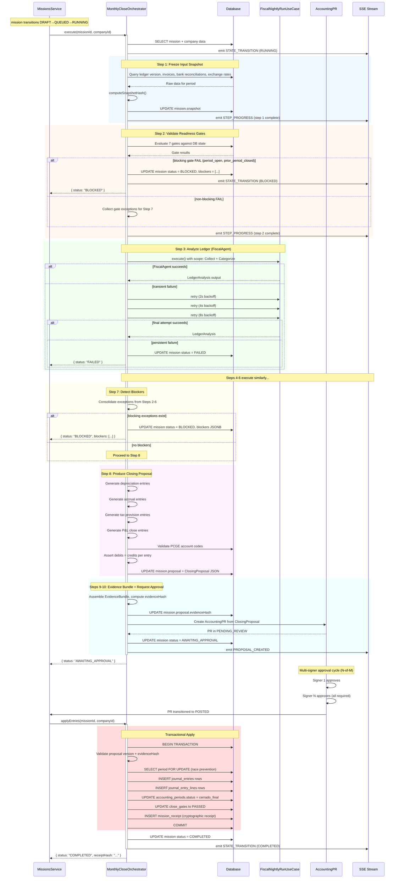
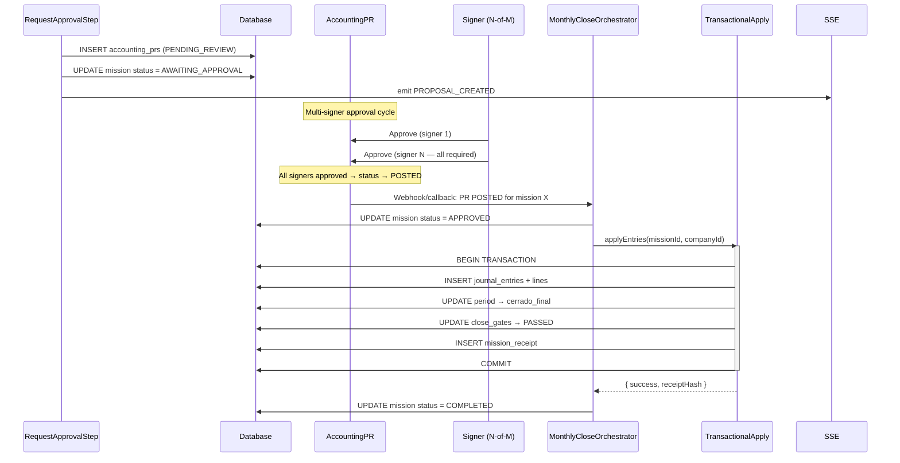
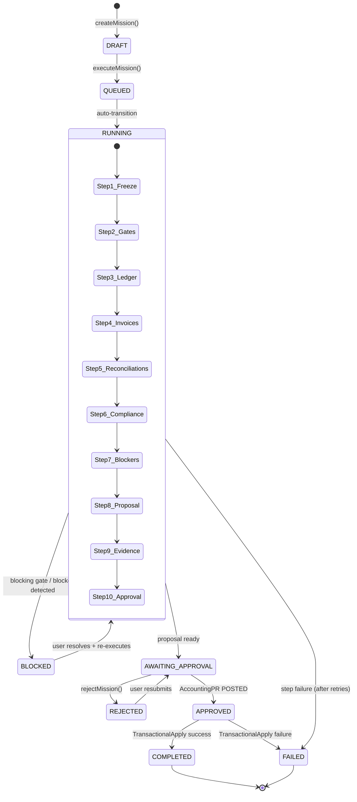

# M2 — Real Monthly Close Execution — Architectural Design

**Change:** M2 — Real Monthly Close Execution  
**Status:** Draft | **Date:** 2026-08-01  
**Inputs:** proposal.md, spec.md, exploration, existing codebase patterns  
**Product Decisions:** Multi-signer AccountingPR | BLOCKED close | Next-period correction | Persistent FiscalAgent failure → FAILED | First period NOT_APPLICABLE

---

## 1. MonthlyCloseOrchestrator Architecture

### 1.1 Package Placement

```
packages/application/src/use-cases/monthly-close/
├── monthly-close-orchestrator.ts       # 10-step pipeline orchestrator
├── monthly-close-orchestrator.types.ts # All M2 domain types
├── steps/
│   ├── freeze-snapshot.step.ts         # Step 1
│   ├── validate-gates.step.ts          # Step 2
│   ├── analyze-ledger.step.ts          # Step 3 (delegates to FiscalAgent)
│   ├── analyze-invoices.step.ts        # Step 4 (delegates to FiscalAgent)
│   ├── analyze-reconciliations.step.ts # Step 5
│   ├── analyze-compliance.step.ts      # Step 6
│   ├── detect-blockers.step.ts         # Step 7
│   ├── produce-proposal.step.ts        # Step 8
│   ├── build-evidence.step.ts          # Step 9
│   └── request-approval.step.ts        # Step 10
├── gates/
│   ├── readiness-gate.interface.ts     # Gate interface + types
│   ├── period-open.gate.ts
│   ├── entries-balanced.gate.ts
│   ├── reconciliations-complete.gate.ts
│   ├── documents-processed.gate.ts
│   ├── min-evidence.gate.ts
│   ├── no-incompatible-missions.gate.ts
│   └── prior-period-closed.gate.ts
├── posting/
│   ├── journal-entry-posting.service.ts
│   ├── period-close.service.ts
│   └── transactional-apply.use-case.ts
├── correction/
│   └── compensating-entry-generator.ts
└── __tests__/
    ├── monthly-close-orchestrator.test.ts
    ├── steps/
    ├── gates/
    └── posting/
```

### 1.2 Orchestrator Class Signature

```typescript
// packages/application/src/use-cases/monthly-close/monthly-close-orchestrator.ts

import type { DrizzleClient } from "@drenyra/persistence";
import type { MissionEventEmitter } from "./monthly-close-orchestrator.types";

export class MonthlyCloseOrchestrator {
  constructor(
    private readonly db: DrizzleClient,
    private readonly fiscalAgent: FiscalNightlyRunUseCase,
    private readonly journalEntryPosting: JournalEntryPostingService,
    private readonly periodClose: PeriodCloseService,
    private readonly transactionalApply: TransactionalApplyUseCase,
    private readonly compensatingGenerator: CompensatingEntryGenerator,
    private readonly eventEmitter: MissionEventEmitter,
  ) {}

  /**
   * Execute the 10-step monthly close pipeline for a mission.
   * Called by MissionsService when a monthly-close mission transitions to RUNNING.
   */
  async execute(missionId: string, companyId: string): Promise<CloseExecutionResult>;

  /**
   * Apply an approved closing proposal atomically.
   * Called when AccountingPR transitions to POSTED (all signers approved).
   */
  async applyEntries(missionId: string, companyId: string): Promise<ApplyResult>;
}
```

### 1.3 Orchestrator Sequence Diagram



### 1.4 How the Orchestrator is Invoked

The `MissionsService.executeMission()` transitions DRAFT→QUEUED. The QUEUED→RUNNING transition is the **harness boundary** where the orchestrator is invoked.

```typescript
// apps/api/src/features/missions/missions.service.ts — extension

async executeMission(missionId: string, companyId: string, opts: { expectedMissionVersion: number }) {
  const mission = await this.getMissionOrThrow(missionId, companyId);
  guardTerminal(mission.status);
  validateTransition(mission.status, AccountingMissionStatus.QUEUED);

  // 1. Transition DRAFT/APPROVED → QUEUED (existing behavior)
  await optimisticUpdate(this.db, missionId, companyId, opts.expectedMissionVersion, {
    status: AccountingMissionStatus.QUEUED,
  });

  // 2. Immediately transition QUEUED → RUNNING (new behavior)
  validateTransition(AccountingMissionStatus.QUEUED, AccountingMissionStatus.RUNNING);
  await optimisticUpdate(this.db, missionId, companyId, opts.expectedMissionVersion + 1, {
    status: AccountingMissionStatus.RUNNING,
  });

  // 3. Dispatch to intent-specific handler (new behavior)
  if (mission.intent === "monthly-close") {
    // Fire-and-forget: orchestrator runs asynchronously, reports via SSE
    this.monthlyCloseOrchestrator.execute(missionId, companyId).catch((err) => {
      this.handleOrchestratorFailure(missionId, err);
    });
  }

  return this.getMission(missionId, companyId);
}
```

**Key design choice:** The orchestrator runs **asynchronously** after the RUNNING transition commits. This avoids holding the HTTP request open for a multi-minute pipeline. Progress is reported via SSE events persisted to `mission_events`.

### 1.5 Progress Reporting

```typescript
interface MissionEventEmitter {
  emitStepProgress(
    missionId: string,
    stepNumber: number,
    stepName: string,
    status: "STARTED" | "COMPLETED" | "FAILED",
    metrics?: StepMetrics,
  ): Promise<void>;

  emitBlockers(missionId: string, blockers: MissionBlocker[]): Promise<void>;

  emitProposalCreated(missionId: string, proposal: ClosingProposal): Promise<void>;

  emitStateTransition(
    missionId: string,
    fromStatus: string,
    toStatus: string,
  ): Promise<void>;
}
```

Events are persisted to `mission_events` (append-only table) and streamed via the existing SSE infrastructure.

---

## 2. 10-Step Pipeline Class Design

### 2.1 Step Interface

```typescript
// packages/application/src/use-cases/monthly-close/monthly-close-orchestrator.types.ts

interface StepMetrics {
  startedAt: string;
  completedAt: string;
  itemsProcessed: number;
  itemsFailed: number;
}

interface StepError {
  code: string;
  message: string;
  itemId?: string;
  retryable: boolean;
}

interface StepResult<TOutput> {
  success: boolean;
  data?: TOutput;
  errors: StepError[];
  warnings: string[];
  exceptions: AccountingException[]; // collected during step execution
  metrics: StepMetrics;
}

type RetryPolicy =
  | { type: "none" }
  | { type: "fixed"; maxRetries: number; delayMs: number }
  | { type: "exponential"; maxRetries: number; baseDelayMs: number };

interface MonthlyCloseStep<TInput, TOutput> {
  readonly name: string;
  readonly retryPolicy: RetryPolicy;
  readonly isBlocker: boolean; // if true, failure halts the pipeline

  execute(input: TInput, context: PipelineContext): Promise<StepResult<TOutput>>;
}
```

### 2.2 PipelineContext

```typescript
interface PipelineContext {
  // Identity
  missionId: string;
  companyId: string;
  fiscalPeriod: string; // "YYYY-MM"
  organizationId: number;

  // Frozen data (populated by Step 1)
  snapshot: InputSnapshot | null;

  // Accumulated outputs (populated as pipeline progresses)
  gateResults: ReadinessGate[] | null;
  ledgerAnalysis: LedgerAnalysis | null;       // Step 3
  invoiceAnalysis: InvoiceAnalysis | null;     // Step 4
  reconciliationAnalysis: ReconciliationAnalysis | null; // Step 5
  complianceAnalysis: ComplianceAnalysis | null; // Step 6
  exceptions: AccountingException[];           // accumulated from all steps
  proposal: ClosingProposal | null;            // Step 8

  // Infrastructure
  db: DrizzleClient;
  eventEmitter: MissionEventEmitter;
  fiscalAgent: FiscalNightlyRunUseCase;
}
```

### 2.3 Step Specifications with Retry Policies

| Step | Name | Input Key | Output Key | Blocker | Retry | Retry Params |
|------|------|-----------|------------|---------|-------|-------------|
| 1 | FreezeSnapshot | `companyId`, `fiscalPeriod` | `snapshot` | No | `none` | — (fail-fast on DB error) |
| 2 | ValidateGates | `snapshot` | `gateResults` | Yes | `none` | — |
| 3 | AnalyzeLedger | `snapshot` | `ledgerAnalysis` | Yes | `exponential` | maxRetries=3, base=2000ms |
| 4 | AnalyzeInvoices | `snapshot` | `invoiceAnalysis` | No | `exponential` | maxRetries=3, base=2000ms |
| 5 | AnalyzeReconciliations | `snapshot` | `reconciliationAnalysis` | No | `none` | — |
| 6 | AnalyzeCompliance | `snapshot` | `complianceAnalysis` | No | `none` | — |
| 7 | DetectBlockers | `exceptions`, `gateResults` | `blockers[]` | Yes | `none` | — (pure logic) |
| 8 | ProduceProposal | All analyses | `proposal` | Yes | `none` | — (pure logic) |
| 9 | BuildEvidence | All outputs | `evidenceBundle` | No | `none` | — (pure logic) |
| 10 | RequestApproval | `proposal` | `AccountingPR` | Yes | `none` | — |

### 2.4 Orchestrator runStep Pattern (matching FiscalNightlyRunUseCase)

```typescript
private async runStep<TInput, TOutput>(
  step: MonthlyCloseStep<TInput, TOutput>,
  input: TInput,
  context: PipelineContext,
): Promise<StepResult<TOutput>> {
  this.eventEmitter.emitStepProgress(
    context.missionId,
    this.currentStepNumber,
    step.name,
    "STARTED",
  );

  let lastError: Error | null = null;
  const maxAttempts = step.retryPolicy.type === "none" ? 1
    : step.retryPolicy.maxRetries + 1;

  for (let attempt = 1; attempt <= maxAttempts; attempt++) {
    try {
      const result = await step.execute(input, context);

      // Update mission step history
      await this.updateMissionSteps(context.missionId, {
        name: step.name,
        status: result.success ? "COMPLETED" : "FAILED",
        metrics: result.metrics,
        exceptions: result.exceptions,
      });

      this.eventEmitter.emitStepProgress(
        context.missionId,
        this.currentStepNumber,
        step.name,
        result.success ? "COMPLETED" : "FAILED",
        result.metrics,
      );

      return result;
    } catch (err) {
      lastError = err instanceof Error ? err : new Error(String(err));

      if (step.retryPolicy.type === "exponential" && attempt < maxAttempts) {
        const delay = step.retryPolicy.baseDelayMs * Math.pow(2, attempt - 1);
        await new Promise((r) => setTimeout(r, delay));
      }
    }
  }

  // All attempts exhausted
  const failed: StepResult<TOutput> = {
    success: false,
    errors: [{ code: "STEP_FAILED", message: lastError?.message ?? "Unknown error", retryable: false }],
    warnings: [],
    exceptions: [],
    metrics: { startedAt: new Date().toISOString(), completedAt: new Date().toISOString(), itemsProcessed: 0, itemsFailed: 1 },
  };

  if (step.isBlocker) {
    await this.transitionMission(context.missionId, "FAILED");
    throw new PipelineBlockedError(step.name, lastError?.message);
  }

  return failed;
}
```

### 2.5 Pipeline Execution Orchestration

```typescript
async execute(missionId: string, companyId: string): Promise<CloseExecutionResult> {
  const mission = await this.loadMission(missionId, companyId);
  const context = this.buildInitialContext(mission);

  // Step 1
  const snapshot = await this.runStep(
    new FreezeSnapshotStep(),
    { companyId, fiscalPeriod: mission.fiscalPeriod },
    context,
  );
  if (!snapshot.success) return { status: "FAILED", missionId };
  context.snapshot = snapshot.data!;

  // Step 2
  const gates = await this.runStep(
    new ValidateGatesStep(),
    { companyId, fiscalPeriod: mission.fiscalPeriod, snapshot: context.snapshot },
    context,
  );

  // Check blocking gates: period_open FAIL or prior_period_closed FAIL → BLOCKED
  const blockingGates = (gates.data?.gates ?? []).filter(
    (g) => g.status === "FAIL" && (g.type === "period_open" || g.type === "prior_period_closed")
  );
  if (blockingGates.length > 0) {
    context.exceptions.push(...gates.exceptions);
    await this.blockMission(context, blockingGates);
    return { status: "BLOCKED", missionId };
  }

  context.gateResults = gates.data?.gates ?? [];
  context.exceptions.push(...gates.exceptions);

  // Step 3: Analyze Ledger (FiscalAgent) — BLOCKER
  const ledger = await this.runStep(
    new AnalyzeLedgerStep(this.fiscalAgent),
    { companyId, fiscalPeriod: mission.fiscalPeriod, ledgerVersion: context.snapshot.ledgerVersion },
    context,
  );
  if (!ledger.success) return { status: "FAILED", missionId };
  context.ledgerAnalysis = ledger.data!;

  // ... Steps 4-6 similarly ...

  // Step 7: Detect Blockers
  const blockerReport = await this.runStep(
    new DetectBlockersStep(),
    { exceptions: context.exceptions, gateResults: context.gateResults },
    context,
  );
  if (blockerReport.data?.hasBlockers) {
    await this.blockMission(context, blockerReport.data.blockers);
    return { status: "BLOCKED", missionId, blockers: blockerReport.data.blockers };
  }

  // Step 8: Produce Proposal
  const proposal = await this.runStep(
    new ProduceProposalStep(),
    { context },
    context,
  );
  if (!proposal.success) return { status: "FAILED", missionId };
  context.proposal = proposal.data!;

  // Step 9: Build Evidence
  await this.runStep(new BuildEvidenceStep(), { context }, context);

  // Step 10: Request Approval — creates AccountingPR, transitions to AWAITING_APPROVAL
  await this.runStep(new RequestApprovalStep(), { context }, context);

  return { status: "AWAITING_APPROVAL", missionId, proposal: context.proposal };
}
```

---

## 3. InputSnapshot Design

### 3.1 Capture Timing

The `InputSnapshot` is captured at the **start of Step 1** execution (the very first thing the orchestrator does after loading the mission). It freezes all external data versions so that:

1. Exchange rate drift during execution can't affect calculations
2. New journal entries posted during close can't change the ledger state
3. An auditor can verify the exact state at close time

### 3.2 Snapshot Type Definition

```typescript
interface InputSnapshot {
  fiscalPeriod: string;                 // "YYYY-MM"
  ledgerVersion: number;                // MAX(entry_number) or total entries for period
  totalLedgerEntries: number;           // COUNT of journal_entries for period
  invoiceDatasetVersion: number;        // MAX(invoice ID) or total invoices for period
  totalInvoices: number;                // COUNT of invoices for period
  bankReconciliationVersion: number;    // MAX(reconciliation ID) or completed count
  completedReconciliationCount: number; // COUNT of COMPLETED reconciliations
  exchangeRates: FrozenExchangeRate[];  // buy/sell rates for each active currency pair
  jurisdictionPackageVersion: string;   // e.g., "PE-2026-v3", derived from company config
  capturedAt: string;                   // ISO 8601 timestamp
  hash: string;                         // SHA-256 of all fields (excluding hash itself)

  // Optional / degraded
  sireSnapshot: SireSnapshot | null;    // null if no SIRE data available
}

interface FrozenExchangeRate {
  currencyFrom: string;  // e.g., "USD"
  currencyTo: string;    // e.g., "PEN"
  buyRate: number;       // integer × 10^4 (matching exchange_rates.buy_rate)
  sellRate: number;      // integer × 10^4
  source: "sunat" | "bcrp" | "manual";
  capturedDate: string;
}

interface SireSnapshot {
  lastRunId: string | null;
  discrepancyCount: number;
  capturedAt: string;
}
```

### 3.3 Capture Implementation

```typescript
// packages/application/src/use-cases/monthly-close/steps/freeze-snapshot.step.ts

class FreezeSnapshotStep implements MonthlyCloseStep<FreezeSnapshotInput, InputSnapshot> {
  readonly name = "FreezeSnapshot";
  readonly retryPolicy: RetryPolicy = { type: "none" };
  readonly isBlocker = false;

  async execute(input: FreezeSnapshotInput, context: PipelineContext): Promise<StepResult<InputSnapshot>> {
    const { companyId, fiscalPeriod } = input;
    const [yearStr, monthStr] = fiscalPeriod.split("-");
    const year = parseInt(yearStr, 10);
    const month = parseInt(monthStr, 10);

    const warnings: string[] = [];

    // 1. Ledger version: last sequence / total entries for this period
    const ledgerVersion = await this.captureLedgerVersion(context.db, companyId, fiscalPeriod);

    // 2. Invoice dataset version
    const invoiceVersion = await this.captureInvoiceVersion(context.db, companyId, year, month);

    // 3. Bank reconciliation version
    const bankReconVersion = await this.captureBankReconVersion(context.db, companyId, fiscalPeriod);

    // 4. Exchange rates: latest rate per currency pair before capture date
    const exchangeRates = await this.captureExchangeRates(context.db, companyId);

    // 5. SIRE snapshot (optional — degraded if unavailable)
    let sireSnapshot: SireSnapshot | null = null;
    try {
      sireSnapshot = await this.captureSireSnapshot(context.db, companyId, fiscalPeriod);
    } catch {
      warnings.push("SIRE snapshot unavailable — continuing without SUNAT discrepancy data");
    }

    // 6. Jurisdiction package version (from company configuration)
    const jurisdictionVersion = await this.captureJurisdictionVersion(context.db, companyId);

    // Build snapshot
    const snapshot: Omit<InputSnapshot, "hash"> = {
      fiscalPeriod,
      ledgerVersion: ledgerVersion.lastEntrySequence,
      totalLedgerEntries: ledgerVersion.totalEntries,
      invoiceDatasetVersion: invoiceVersion.lastInvoiceId ?? 0, // numeric version
      totalInvoices: invoiceVersion.totalInvoices,
      bankReconciliationVersion: bankReconVersion.lastReconciliationId ?? 0,
      completedReconciliationCount: bankReconVersion.completedCount,
      exchangeRates,
      jurisdictionPackageVersion: jurisdictionVersion,
      capturedAt: new Date().toISOString(),
      sireSnapshot,
    };

    // Compute hash
    const hash = this.computeSnapshotHash(snapshot);

    // Store on mission
    await context.db
      .update(accountingMissions)
      .set({ snapshot: { ...snapshot, hash } as any })
      .where(eq(accountingMissions.id, context.missionId));

    return {
      success: true,
      data: { ...snapshot, hash },
      errors: [],
      warnings,
      exceptions: [],
      metrics: this.buildMetrics(1, 0),
    };
  }

  private computeSnapshotHash(snapshot: Omit<InputSnapshot, "hash">): string {
    const { createHash } = require("node:crypto");
    const ordered = JSON.stringify(snapshot, Object.keys(snapshot).sort());
    return createHash("sha256").update(ordered).digest("hex");
  }
}
```

### 3.4 Storage

The snapshot is stored as a **JSONB column** on the `accounting_missions` table. Migration:

```sql
ALTER TABLE accounting_missions
  ADD COLUMN snapshot JSONB,
  ADD COLUMN steps JSONB DEFAULT '[]'::jsonb,
  ADD COLUMN blockers JSONB DEFAULT '[]'::jsonb,
  ADD COLUMN current_step VARCHAR(50) DEFAULT '';
```

### 3.5 Verification on Resume/Reconnect

```typescript
function verifySnapshotIntegrity(snapshot: InputSnapshot): boolean {
  const { hash, ...rest } = snapshot;
  const recomputed = computeSnapshotHash(rest);
  return recomputed === hash;
}
```

When the orchestrator starts, it checks if a snapshot already exists on the mission (resuming after a crash). If it exists and passes integrity verification, the orchestrator skips Step 1 and resumes from the last incomplete step.

---

## 4. ReadinessGates Design

### 4.1 Gate Interface

```typescript
// packages/application/src/use-cases/monthly-close/gates/readiness-gate.interface.ts

type GateStatus = "PASS" | "FAIL" | "WARN" | "UNKNOWN" | "NOT_APPLICABLE";

type GateType =
  | "period_open"
  | "entries_balanced"
  | "reconciliations_complete"
  | "documents_processed"
  | "min_evidence"
  | "no_incompatible_missions"
  | "prior_period_closed";

interface ReadinessGate {
  name: string;
  type: GateType;
  status: GateStatus;
  reason: string;
  evidenceIds: string[];
  evaluatedAt: string;
}

interface GateResult {
  passed: boolean;
  gate: ReadinessGate;
}

interface ReadinessGateEvaluator {
  readonly gateType: GateType;
  readonly isBlocker: boolean;   // FAIL → mission BLOCKED immediately
  readonly isApplicable: (companyId: string, fiscalPeriod: string, db: DrizzleClient) => Promise<boolean>;

  evaluate(
    companyId: string,
    fiscalPeriod: string,
    db: DrizzleClient,
  ): Promise<GateResult>;
}
```

### 4.2 Seven Gates Specification

#### Gate: `period_open` (BLOCKING)

```typescript
class PeriodOpenGate implements ReadinessGateEvaluator {
  readonly gateType = "period_open";
  readonly isBlocker = true;

  async isApplicable(): Promise<boolean> {
    return true; // Always applicable
  }

  async evaluate(companyId: string, fiscalPeriod: string, db: DrizzleClient): Promise<GateResult> {
    const [yearStr, monthStr] = fiscalPeriod.split("-");
    const year = parseInt(yearStr), month = parseInt(monthStr);

    const rows = await db
      .select({ status: accountingPeriods.status })
      .from(accountingPeriods)
      .where(
        and(
          eq(accountingPeriods.companyId, companyId),
          eq(accountingPeriods.year, year),
          eq(accountingPeriods.month, month),
        ),
      )
      .limit(1);

    if (rows.length === 0) {
      return {
        passed: false,
        gate: {
          name: "Periodo Abierto",
          type: "period_open",
          status: "FAIL",
          reason: `No accounting period found for ${fiscalPeriod}`,
          evidenceIds: [],
          evaluatedAt: new Date().toISOString(),
        },
      };
    }

    const isOpen = rows[0].status === "abierto";
    return {
      passed: isOpen,
      gate: {
        name: "Periodo Abierto",
        type: "period_open",
        status: isOpen ? "PASS" : "FAIL",
        reason: isOpen
          ? `Period ${fiscalPeriod} is 'abierto' — ready to close`
          : `Period ${fiscalPeriod} is '${rows[0].status}', expected 'abierto'`,
        evidenceIds: [],
        evaluatedAt: new Date().toISOString(),
      },
    };
  }
}
```

#### Gate: `entries_balanced`

```typescript
class EntriesBalancedGate implements ReadinessGateEvaluator {
  readonly gateType = "entries_balanced";
  readonly isBlocker = false;

  async evaluate(companyId: string, fiscalPeriod: string, db: DrizzleClient): Promise<GateResult> {
    // Query: SUM(debitCents) vs SUM(creditCents) for journal_entry_lines
    // in journal_entries for this (company, periodKey)
    const result = await db
      .select({
        totalDebits: sql<number>`COALESCE(SUM(${journalEntryLines.debitCents}), 0)`,
        totalCredits: sql<number>`COALESCE(SUM(${journalEntryLines.creditCents}), 0)`,
      })
      .from(journalEntryLines)
      .innerJoin(journalEntries, eq(journalEntryLines.journalEntryId, journalEntries.id))
      .where(
        and(
          eq(journalEntries.companyId, companyId),
          eq(journalEntries.periodKey, fiscalPeriod),
        ),
      );

    const { totalDebits, totalCredits } = result[0] ?? { totalDebits: 0, totalCredits: 0 };
    const balanced = totalDebits === totalCredits;

    return {
      passed: balanced,
      gate: {
        name: "Asientos Balanceados",
        type: "entries_balanced",
        status: balanced ? "PASS" : "FAIL",
        reason: balanced
          ? "All entries balance (total debits = total credits)"
          : `Unbalanced: total debits ${totalDebits}, total credits ${totalCredits}`,
        evidenceIds: [],
        evaluatedAt: new Date().toISOString(),
      },
    };
  }
}
```

#### Gate: `prior_period_closed` (BLOCKING, NOT_APPLICABLE for first period)

```typescript
class PriorPeriodClosedGate implements ReadinessGateEvaluator {
  readonly gateType = "prior_period_closed";
  readonly isBlocker = true;

  async isApplicable(companyId: string, fiscalPeriod: string, db: DrizzleClient): Promise<boolean> {
    const prior = this.priorPeriod(fiscalPeriod);
    if (!prior) return false; // January of first year → NOT_APPLICABLE

    // Check if any period row exists prior to this one
    const rows = await db
      .select({ id: accountingPeriods.id })
      .from(accountingPeriods)
      .where(
        and(
          eq(accountingPeriods.companyId, companyId),
          or(
            sql`${accountingPeriods.year} < ${prior.year}`,
            and(
              sql`${accountingPeriods.year} = ${prior.year}`,
              sql`${accountingPeriods.month} <= ${prior.month}`,
            ),
          ),
        ),
      )
      .limit(1);

    return rows.length > 0; // Applicable only if prior periods exist
  }

  async evaluate(companyId: string, fiscalPeriod: string, db: DrizzleClient): Promise<GateResult> {
    const prior = this.priorPeriod(fiscalPeriod);
    if (!prior) {
      // This shouldn't happen if isApplicable returned true, but defensive
      return this.notApplicable("First period — no prior period check needed");
    }

    const rows = await db
      .select({ status: accountingPeriods.status })
      .from(accountingPeriods)
      .where(
        and(
          eq(accountingPeriods.companyId, companyId),
          eq(accountingPeriods.year, prior.year),
          eq(accountingPeriods.month, prior.month),
        ),
      )
      .limit(1);

    if (rows.length === 0) {
      // No prior period row at all → this IS effectively the first period recorded
      return this.notApplicable("No prior accounting period found — treating as first period");
    }

    const priorStatus = rows[0].status;
    const closed = priorStatus === "cerrado_final" || priorStatus === "auditado";

    return {
      passed: closed,
      gate: {
        name: "Período Anterior Cerrado",
        type: "prior_period_closed",
        status: closed ? "PASS" : "FAIL",
        reason: closed
          ? `Prior period ${prior.year}-${String(prior.month).padStart(2, "0")} is '${priorStatus}'`
          : `Prior period ${prior.year}-${String(prior.month).padStart(2, "0")} is '${priorStatus}', must be 'cerrado_final' or 'auditado'`,
        evidenceIds: [],
        evaluatedAt: new Date().toISOString(),
      },
    };
  }

  private priorPeriod(fiscalPeriod: string): { year: number; month: number } | null {
    const [y, m] = fiscalPeriod.split("-").map(Number);
    if (m > 1) return { year: y, month: m - 1 };
    if (y > 2020) return { year: y - 1, month: 12 };
    return null; // January 2020 — no valid prior period
  }

  private notApplicable(reason: string): GateResult {
    return {
      passed: true, // NOT_APPLICABLE does not block
      gate: {
        name: "Período Anterior Cerrado",
        type: "prior_period_closed",
        status: "NOT_APPLICABLE",
        reason,
        evidenceIds: [],
        evaluatedAt: new Date().toISOString(),
      },
    };
  }
}
```

### 4.3 Gate Evaluation Aggregation

```typescript
// packages/application/src/use-cases/monthly-close/steps/validate-gates.step.ts

class ValidateGatesStep implements MonthlyCloseStep<ValidateGatesInput, GateResults> {
  readonly name = "ValidateGates";
  readonly retryPolicy: RetryPolicy = { type: "none" };
  readonly isBlocker = true;

  private readonly evaluators: ReadinessGateEvaluator[] = [
    new PeriodOpenGate(),         // blocking
    new EntriesBalancedGate(),
    new ReconciliationsCompleteGate(),
    new DocumentsProcessedGate(),
    new MinEvidenceGate(),
    new NoIncompatibleMissionsGate(),
    new PriorPeriodClosedGate(),  // blocking
  ];

  async execute(input: ValidateGatesInput, context: PipelineContext): Promise<StepResult<GateResults>> {
    const { companyId, fiscalPeriod } = input;
    const gates: ReadinessGate[] = [];
    const exceptions: AccountingException[] = [];

    for (const evaluator of this.evaluators) {
      const applicable = await evaluator.isApplicable(companyId, fiscalPeriod, context.db);
      if (!applicable) {
        gates.push({
          name: evaluator.gateType,
          type: evaluator.gateType,
          status: "NOT_APPLICABLE",
          reason: "Gate not applicable for this company/period",
          evidenceIds: [],
          evaluatedAt: new Date().toISOString(),
        });
        continue;
      }

      const result = await evaluator.evaluate(companyId, fiscalPeriod, context.db);
      gates.push(result.gate);

      if (!result.passed && !evaluator.isBlocker) {
        exceptions.push({
          id: crypto.randomUUID(),
          missionId: context.missionId,
          code: `GATE_${evaluator.gateType.toUpperCase()}_FAILED`,
          severity: "warning",
          subjectRef: `gate:${evaluator.gateType}`,
          evidenceRefs: result.gate.evidenceIds,
          resolutionStatus: "open",
          description: result.gate.reason,
          suggestedAction: `Resolve ${evaluator.gateType} issues before proceeding`,
          createdAt: new Date().toISOString(),
        });
      }
    }

    const hasBlockingFail = gates.some(
      (g) => g.status === "FAIL" && this.evaluators.find((e) => e.gateType === g.type)?.isBlocker,
    );

    return {
      success: !hasBlockingFail,
      data: { gates, overallStatus: this.computeOverallStatus(gates) },
      errors: [],
      warnings: [],
      exceptions,
      metrics: { startedAt: new Date().toISOString(), completedAt: new Date().toISOString(), itemsProcessed: gates.length, itemsFailed: gates.filter((g) => g.status === "FAIL").length },
    };
  }
}
```

---

## 5. AccountingException Design

### 5.1 Type Definition

```typescript
type ExceptionSeverity = "info" | "warning" | "blocking";
type ResolutionStatus = "open" | "resolved" | "waived";

interface AccountingException {
  id: string;
  missionId: string;
  code: string;
  // e.g., "UNMATCHED_TRANSACTION", "LOW_CONFIDENCE_CATEGORIZATION",
  //      "SUNAT_DISCREPANCY", "MISSING_DOCUMENT", "INVALID_ACCOUNT_CODE",
  //      "UNBALANCED_PROPOSAL", "EXCHANGE_RATE_DEVIATION",
  //      "MISSING_EVIDENCE", "TAX_CALCULATION_ANOMALY"
  severity: ExceptionSeverity;
  subjectRef: string;     // e.g., "bankTx:uuid", "invoice:uuid", "account:code"
  evidenceRefs: string[];
  resolutionStatus: ResolutionStatus;
  description: string;
  suggestedAction: string;
  createdAt: string;
  resolvedAt?: string;
  resolvedBy?: string;
}
```

### 5.2 Collection During Pipeline

Exceptions are accumulated in `PipelineContext.exceptions`. Each step that detects issues appends to this array. Steps that analyze external data (3-6) are the primary producers.

```typescript
// Example: exception collection in Step 5 (AnalyzeReconciliations)
async execute(input: AnalyzeReconciliationsInput, context: PipelineContext): Promise<StepResult<...>> {
  const unmatchedTxns = await this.findUnmatchedTransactions(context.db, input);

  const exceptions: AccountingException[] = unmatchedTxns.map((txn) => ({
    id: crypto.randomUUID(),
    missionId: context.missionId,
    code: "UNMATCHED_TRANSACTION",
    severity: "warning",
    subjectRef: `bankTx:${txn.id}`,
    evidenceRefs: [txn.reconciliationId],
    resolutionStatus: "open",
    description: `Bank transaction ${txn.reference} (${txn.amountCents} cents) has no matching ledger entry`,
    suggestedAction: "Manually match or create journal entry for this transaction",
    createdAt: new Date().toISOString(),
  }));

  context.exceptions.push(...exceptions);

  return {
    success: true,
    data: { /* analysis */ },
    errors: [],
    warnings: [],
    exceptions, // also returned explicitly so the orchestrator can log
    metrics: { /* ... */ },
  };
}
```

### 5.3 Storage

Exceptions are stored on the mission in two ways:

1. **Inline in the `steps` JSONB array** — each step's result includes its `exceptions[]` so you can trace which step generated which exceptions.
2. **Aggregated in the `blockers` JSONB column** when `severity: "blocking"` — these are the exceptions that halted the pipeline.

```typescript
// Mission steps schema extension (JSONB structure)
interface MissionStepRecord {
  id: string;
  name: string;
  status: "PENDING" | "COMPLETED" | "FAILED";
  startedAt: string;
  completedAt: string;
  exceptions: AccountingException[];  // exceptions from this step
  error?: { code: string; message: string };
}
```

### 5.4 Frontend Surface

The `MissionSnapshot` returned via API includes:

- `blockers: MissionBlocker[]` — blocking exceptions surfaced as blockers
- `proposal.unresolvedExceptions: AccountingException[]` — non-blocking exceptions in the proposal
- `steps[].exceptions` — per-step exception details

This allows the frontend to render:
- A blocker banner when the mission is BLOCKED
- A "review exceptions" section in the AWAITING_APPROVAL screen
- Per-step detail panels showing exceptions for each pipeline step

---

## 6. ClosingProposal Design

### 6.1 Generation Architecture

```typescript
// packages/application/src/use-cases/monthly-close/steps/produce-proposal.step.ts

class ProduceProposalStep implements MonthlyCloseStep<ProduceProposalInput, ClosingProposal> {
  readonly name = "ProduceProposal";
  readonly retryPolicy: RetryPolicy = { type: "none" };
  readonly isBlocker = true;

  private readonly generators: ProposalEntryGenerator[] = [
    new DepreciationEntryGenerator(),
    new AccrualEntryGenerator(),
    new TaxProvisionEntryGenerator(),
    new PLCloseEntryGenerator(),
  ];

  async execute(input: ProduceProposalInput, context: PipelineContext): Promise<StepResult<ClosingProposal>> {
    const proposedEntries: ProposedJournalEntry[] = [];
    const errors: StepError[] = [];

    // Run each generator
    for (const generator of this.generators) {
      try {
        const entries = await generator.generate(context);
        proposedEntries.push(...entries);
      } catch (err) {
        errors.push({
          code: `${generator.name.toUpperCase()}_GENERATION_FAILED`,
          message: err instanceof Error ? err.message : String(err),
          retryable: false,
        });
      }
    }

    // ─── VALIDATIONS ──────────────────────────────────────────

    // 1. Debits = Credits per entry
    for (const entry of proposedEntries) {
      const totalDebits = entry.lines.reduce((s, l) => s + l.debitCents, 0);
      const totalCredits = entry.lines.reduce((s, l) => s + l.creditCents, 0);

      if (totalDebits !== totalCredits) {
        throw new ProposalValidationError(
          "UNBALANCED_PROPOSAL",
          `Entry "${entry.description}" is unbalanced: debits=${totalDebits}, credits=${totalCredits}`,
        );
      }

      entry.totalDebits = totalDebits;
      entry.totalCredits = totalCredits;
    }

    // 2. PCGE account validation
    for (const entry of proposedEntries) {
      for (const line of entry.lines) {
        const isValid = await this.validatePCGECode(context.db, context.companyId, line.accountCode);
        if (!isValid) {
          throw new ProposalValidationError(
            "INVALID_ACCOUNT_CODE",
            `Account code "${line.accountCode}" is not a valid active PCGE account`,
          );
        }
      }
    }

    // 3. Tax & financial impact
    const taxImpact = this.calculateTaxImpact(proposedEntries);
    const financialImpact = this.calculateFinancialImpact(proposedEntries);

    // 4. Determine risk level from unresolved exceptions
    const riskLevel = this.determineRiskLevel(context.exceptions);

    const proposal: ClosingProposal = {
      id: crypto.randomUUID(),
      missionId: context.missionId,
      version: 1,
      fiscalPeriod: context.fiscalPeriod,
      generatedAt: new Date().toISOString(),
      proposedEntries,
      entryCount: proposedEntries.length,
      totalDebitCents: proposedEntries.reduce((s, e) => s + (e.totalDebits ?? 0), 0),
      totalCreditCents: proposedEntries.reduce((s, e) => s + (e.totalCredits ?? 0), 0),
      taxImpact,
      financialImpact,
      riskLevel,
      unresolvedExceptions: context.exceptions.filter((e) => e.severity !== "blocking"),
      requiredApprovals: await this.resolveApprovalPolicy(context.db, context.companyId),
      sourceEvidence: [],
      evidenceHash: "",
    };

    // Store on mission
    await context.db
      .update(accountingMissions)
      .set({ proposal: proposal as any })
      .where(eq(accountingMissions.id, context.missionId));

    return {
      success: true,
      data: proposal,
      errors,
      warnings: [],
      exceptions: [],
      metrics: { startedAt: new Date().toISOString(), completedAt: new Date().toISOString(), itemsProcessed: proposedEntries.length, itemsFailed: 0 },
    };
  }
}
```

### 6.2 Proposed Entry Types

```typescript
type ProposedEntryType = "DEPRECIATION" | "ACCRUAL" | "TAX_PROVISION" | "PL_CLOSE" | "CORRECTION";

interface ProposedJournalEntry {
  id: string;
  entryType: ProposedEntryType;
  description: string;
  date: string;            // YYYY-MM-DD (last day of fiscal period)
  lines: ProposalLine[];
  totalDebits: number;     // validated = sum of debitCents
  totalCredits: number;    // validated = sum of creditCents
  sourceEvidence: string[];
}

interface ProposalLine {
  accountCode: string;     // validated PCGE code
  accountName: string;     // resolved from chart of accounts
  description: string;
  debitCents: number;
  creditCents: number;
}

interface ClosingProposal {
  id: string;
  missionId: string;
  version: number;
  fiscalPeriod: string;
  generatedAt: string;

  proposedEntries: ProposedJournalEntry[];
  entryCount: number;
  totalDebitCents: number;
  totalCreditCents: number;

  taxImpact: TaxImpact;
  financialImpact: FinancialImpact;
  riskLevel: "LOW" | "MEDIUM" | "HIGH";

  unresolvedExceptions: AccountingException[];
  requiredApprovals: string[];  // user/role IDs from company policy
  sourceEvidence: EvidenceRef[];
  evidenceHash: string;         // populated in Step 9
}

interface TaxImpact {
  igvPayableCents: number;
  rentaPayableCents: number;
  totalTaxLiabilityCents: number;
}

interface FinancialImpact {
  totalRevenueCents: number;
  totalExpenseCents: number;
  netIncomeCents: number;
}
```

### 6.3 Depreciation Generator

```typescript
class DepreciationEntryGenerator implements ProposalEntryGenerator {
  readonly name = "depreciation";

  async generate(context: PipelineContext): Promise<ProposedJournalEntry[]> {
    const assets = await context.db
      .select()
      .from(fixedAssets)
      .where(and(
        eq(fixedAssets.companyId, context.companyId),
        eq(fixedAssets.isActive, true),
      ));

    const entries: ProposedJournalEntry[] = [];

    for (const asset of assets) {
      const monthlyDep = this.calculateMonthlyDepreciation(asset);
      if (monthlyDep <= 0) continue;

      const lastDay = this.lastDayOfMonth(context.fiscalPeriod);

      entries.push({
        id: crypto.randomUUID(),
        entryType: "DEPRECIATION",
        description: `Depreciación mensual: ${asset.name} (${context.fiscalPeriod})`,
        date: lastDay,
        lines: [
          {
            accountCode: "681",  // Depreciación de activos fijos (Gasto)
            accountName: "Depreciación de Activos Fijos",
            description: `Depreciación ${asset.name}`,
            debitCents: monthlyDep,
            creditCents: 0,
          },
          {
            accountCode: "391",  // Depreciación acumulada (Activo - regularizadora)
            accountName: "Depreciación Acumulada",
            description: `Depreciación acumulada ${asset.name}`,
            debitCents: 0,
            creditCents: monthlyDep,
          },
        ],
        totalDebits: monthlyDep,
        totalCredits: monthlyDep,
        sourceEvidence: [asset.id],
      });
    }

    return entries;
  }

  private calculateMonthlyDepreciation(asset: typeof fixedAssets.$inferSelect): number {
    if (asset.depreciationMethod !== "STRAIGHT_LINE") return 0; // M2 scope
    const purchasePriceCents = Math.round(Number(asset.purchasePrice) * 100);
    const salvageCents = Math.round(Number(asset.salvageValue ?? 0) * 100);
    const usefulLifeMonths = Math.round(Number(asset.usefulLife ?? 5) * 12);
    if (usefulLifeMonths <= 0) return 0;
    return Math.round((purchasePriceCents - salvageCents) / usefulLifeMonths);
  }

  private lastDayOfMonth(fiscalPeriod: string): string {
    const [y, m] = fiscalPeriod.split("-").map(Number);
    const lastDay = new Date(y, m, 0); // day 0 = last day of previous month
    return lastDay.toISOString().split("T")[0];
  }
}
```

### 6.4 How It Triggers AWAITING_APPROVAL

In Step 10 (`RequestApprovalStep`):

```typescript
async execute(input: RequestApprovalInput, context: PipelineContext): Promise<StepResult<AccountingPR>> {
  const proposal = context.proposal!;

  // Create AccountingPR from the ClosingProposal
  const entryIds = proposal.proposedEntries.map((e) => e.id);

  const [pr] = await context.db
    .insert(accountingPrs)
    .values({
      companyId: context.companyId,
      prNumber: await this.nextPRNumber(context.db, context.companyId),
      title: `Cierre Mensual ${context.fiscalPeriod}`,
      description: `Propuesta de cierre generada automáticamente con ${proposal.entryCount} asientos`,
      status: "PENDING_REVIEW",
      entries: entryIds,
      evidenceIds: proposal.sourceEvidence.map((e) => e.id),
      totalDebitCents: proposal.totalDebitCents,
      totalCreditCents: proposal.totalCreditCents,
      approveSignerIds: proposal.requiredApprovals,
      createdById: "system", // or derived from context
    })
    .returning();

  // Update mission: AWAITING_APPROVAL with PR reference
  await context.db
    .update(accountingMissions)
    .set({
      status: "AWAITING_APPROVAL",
      proposal: {
        ...proposal,
        accountingPrId: pr.id, // link to PR
      } as any,
    })
    .where(eq(accountingMissions.id, context.missionId));

  context.eventEmitter.emitProposalCreated(context.missionId, proposal);

  return { success: true, data: pr, errors: [], warnings: [], exceptions: [], metrics: { /* ... */ } };
}
```

---

## 7. Transactional Apply Design

### 7.1 Atomic Transaction Boundary

```typescript
// packages/application/src/use-cases/monthly-close/posting/transactional-apply.use-case.ts

class TransactionalApplyUseCase {
  constructor(
    private readonly db: DrizzleClient,
    private readonly journalEntryPosting: JournalEntryPostingService,
    private readonly periodClose: PeriodCloseService,
  ) {}

  /**
   * Apply an approved ClosingProposal atomically.
   * Called when AccountingPR reaches POSTED (all signers approved).
   */
  async execute(missionId: string, companyId: string): Promise<ApplyResult> {
    const mission = await this.loadMission(missionId, companyId);
    const proposal = mission.proposal as ClosingProposal;

    if (!proposal) {
      throw new MissionError("INVALID_TRANSITION", 400, "No proposal to apply");
    }

    return await this.db.transaction(async (tx) => {
      // ─── 1. Period guard: SELECT FOR UPDATE ─────────────────
      const [y, m] = proposal.fiscalPeriod.split("-").map(Number);
      const [period] = await tx
        .select()
        .from(accountingPeriods)
        .where(
          and(
            eq(accountingPeriods.companyId, companyId),
            eq(accountingPeriods.year, y),
            eq(accountingPeriods.month, m),
          ),
        )
        .for("update")
        .limit(1);

      if (!period || period.status !== "abierto") {
        throw new ApplyError(
          "PERIOD_ALREADY_CLOSED",
          `Period ${proposal.fiscalPeriod} is '${period?.status ?? "not found"}', cannot apply`,
        );
      }

      // ─── 2. Post all journal entries ───────────────────────
      const postedEntryIds: string[] = [];
      for (const proposed of proposal.proposedEntries) {
        const { createHash } = require("node:crypto");

        const posted = await this.journalEntryPosting.post(tx, {
          companyId,
          entryNumber: await this.nextEntryNumber(tx, companyId, proposal.fiscalPeriod),
          periodKey: proposal.fiscalPeriod,
          date: proposed.date,
          gloss: proposed.description,
          status: "mayorizado", // closing entries go directly to mayorizado
          lines: proposed.lines.map((l) => ({
            accountCode: l.accountCode,
            description: l.description,
            debitCents: l.debitCents,
            creditCents: l.creditCents,
          })),
        });

        postedEntryIds.push(posted.id);
      }

      // ─── 3. Update period status ──────────────────────────
      await this.periodClose.closeFinal(tx, {
        companyId,
        year: y,
        month: m,
      });

      // ─── 4. Resolve close gates ───────────────────────────
      await tx
        .update(closeGates)
        .set({ status: "PASSED", updatedAt: new Date() })
        .where(
          and(
            eq(closeGates.companyId, companyId),
            eq(closeGates.period, proposal.fiscalPeriod),
          ),
        );

      // ─── 5. Update mission ────────────────────────────────
      await tx
        .update(accountingMissions)
        .set({
          status: "COMPLETED",
          updatedAt: new Date(),
        })
        .where(eq(accountingMissions.id, missionId));

      // ─── 6. Generate cryptographic receipt ────────────────
      const receiptContent: ReceiptContent = {
        missionId,
        companyId,
        actorId: "system",
        decision: "APPLY",
        proposalVersion: proposal.version,
        evidenceHash: proposal.evidenceHash,
        previousStatus: "APPROVED",
        newStatus: "COMPLETED",
        payloadHash: createHash("sha256")
          .update(JSON.stringify({ postedEntryIds, fiscalPeriod: proposal.fiscalPeriod }))
          .digest("hex"),
        timestamp: new Date().toISOString(),
      };

      const receiptHash = generateReceiptHash(receiptContent);
      const receiptId = receiptHash.substring(0, 36).replace(
        /(.{8})(.{4})(.{4})(.{4})(.{12})/,
        "$1-$2-$3-$4-$5",
      );

      await tx.insert(missionReceipts).values({
        missionId,
        companyId,
        actorId: "system",
        decision: "APPLY",
        proposalVersion: proposal.version,
        evidenceHash: proposal.evidenceHash,
        previousStatus: "APPROVED",
        newStatus: "COMPLETED",
        payloadHash: receiptContent.payloadHash,
        receiptHash,
      });

      return { success: true, receiptHash, postedEntryIds };
    });
  }
}
```

### 7.2 AccountingPR → Mission Flow

The existing AccountingPR lifecycle is reused: DRAFT → PENDING_REVIEW → APPROVED → POSTED.



**Key integration point:** When an AccountingPR transitions to POSTED, the mission system must detect this and invoke `MonthlyCloseOrchestrator.applyEntries()`. This can be done via:

1. **Webhook callback:** The AccountingPR module emits an event when status changes to POSTED.
2. **Polling:** The mission BLOCKED→AWAITING_APPROVAL transition starts a watcher that polls the PR status.
3. **Direct trigger:** The PR POSTED transition handler directly calls `TransactionalApplyUseCase`.

Recommended approach (simplest, matches existing patterns): **Direct trigger** in the PR approval handler.

```typescript
// In AccountingPR approval handler (when last signer approves)
async function onPRFullyApproved(pr: AccountingPR) {
  // Find the mission linked to this PR (via proposal.accountingPrId)
  const mission = await db.query.accountingMissions.findFirst({
    where: sql`proposal->>'accountingPrId' = ${pr.id}`,
  });

  if (mission && mission.intent === "monthly-close") {
    await monthlyCloseOrchestrator.applyEntries(mission.id, mission.companyId);
  }
}
```

### 7.3 Period Status Transition

```typescript
// packages/application/src/use-cases/monthly-close/posting/period-close.service.ts

class PeriodCloseService {
  async closeFinal(
    tx: DrizzleClient,
    params: { companyId: string; year: number; month: number },
  ): Promise<void> {
    const period = AccountingPeriod.create(params.year, params.month, "abierto");

    // Uses the domain VO's closeFinal() for validation
    const closed = period.closeFinal();

    await tx
      .update(accountingPeriods)
      .set({
        status: closed.status,
        updatedAt: new Date(),
      })
      .where(
        and(
          eq(accountingPeriods.companyId, params.companyId),
          eq(accountingPeriods.year, params.year),
          eq(accountingPeriods.month, params.month),
        ),
      );
  }
}
```

---

## 8. Roll-Forward Foundation Design

### 8.1 CorrectionMissionIntent

```typescript
// Added to MissionIntent union:
// packages/mission-domain/src/mission-contracts.ts
export type MissionIntent =
  | "monthly-close"
  | "correction"      // NEW
  | "reconciliation"
  | "invoice-review"
  | "compliance-check";

// packages/application/src/use-cases/monthly-close/correction/compensating-entry-generator.ts

interface CorrectionMissionIntent {
  originalMissionId: string;
  originalPeriod: string;
  entriesToReverse: string[];  // journal entry IDs to correct
  reason: string;
}

interface CompensatingEntry {
  originalEntryId: string;
  correctionOf: string;  // the original journal entry ID
  date: string;          // current open period's date
  description: string;
  lines: CompensatingLine[];
  totalDebits: number;
  totalCredits: number;
}

interface CompensatingLine {
  accountCode: string;
  description: string;
  debitCents: number;   // original credit → new debit
  creditCents: number;  // original debit → new credit
}
```

### 8.2 Generator Implementation

```typescript
class CompensatingEntryGenerator {
  constructor(private readonly db: DrizzleClient) {}

  async generate(
    originalEntryIds: string[],
    currentOpenPeriod: string,
  ): Promise<CompensatingEntry[]> {
    const entries: CompensatingEntry[] = [];

    for (const entryId of originalEntryIds) {
      // Read the original journal entry + its lines
      const [original] = await this.db
        .select()
        .from(journalEntries)
        .where(eq(journalEntries.id, entryId))
        .limit(1);

      if (!original) continue;

      const originalLines = await this.db
        .select()
        .from(journalEntryLines)
        .where(eq(journalEntryLines.journalEntryId, entryId));

      // Invert: debits become credits, credits become debits
      const compensatingLines: CompensatingLine[] = originalLines.map((l) => ({
        accountCode: l.accountCode,
        description: `Corrección: ${l.description}`,
        debitCents: l.creditCents,   // INVERTED
        creditCents: l.debitCents,   // INVERTED
      }));

      const totalDebits = compensatingLines.reduce((s, l) => s + l.debitCents, 0);
      const totalCredits = compensatingLines.reduce((s, l) => s + l.creditCents, 0);

      entries.push({
        originalEntryId: entryId,
        correctionOf: entryId,
        date: this.lastDayOfMonth(currentOpenPeriod),
        description: `Corrección del cierre ${original.periodKey}: ${original.gloss}`,
        lines: compensatingLines,
        totalDebits,
        totalCredits,
      });
    }

    return entries;
  }

  private lastDayOfMonth(period: string): string {
    const [y, m] = period.split("-").map(Number);
    return new Date(y, m, 0).toISOString().split("T")[0];
  }
}
```

### 8.3 Correction Mission Flow

Correction missions follow the **same approve→apply→receipt flow** as monthly-close missions, but with a simpler pipeline:

1. Load the original mission receipt to verify the closed period
2. Generate compensating entries via `CompensatingEntryGenerator`
3. Produce a `ClosingProposal` with `entryType: "CORRECTION"`
4. Route through AccountingPR (Step 10)
5. On approval, `TransactionalApply` posts to the **current open period** (not the closed one)

**No period reopening.** The closed period stays `cerrado_final`. The `correctionOf` field on `journal_entries` traces back to the original entry.

```sql
-- Schema extension for traceability
ALTER TABLE journal_entries
  ADD COLUMN correction_of UUID REFERENCES journal_entries(id);
```

---

## 9. M1 Mission Integration Design

### 9.1 Handler Discovery Pattern

```typescript
// apps/api/src/features/missions/missions.service.ts — extension

// Intent-to-handler registry (could be a Map, config, or injected)
const INTENT_HANDLERS: Record<string, MissionIntentHandler> = {
  "monthly-close": new MonthlyCloseIntentHandler(monthlyCloseOrchestrator),
  "correction": new CorrectionIntentHandler(monthlyCloseOrchestrator),
  // Other intents remain no-op for now
};

interface MissionIntentHandler {
  onRunning(missionId: string, companyId: string): Promise<void>;
  onApproved(missionId: string, companyId: string): Promise<void>;
}

class MonthlyCloseIntentHandler implements MissionIntentHandler {
  constructor(private readonly orchestrator: MonthlyCloseOrchestrator) {}

  async onRunning(missionId: string, companyId: string): Promise<void> {
    // Fire-and-forget — orchestrator reports via SSE
    this.orchestrator.execute(missionId, companyId).catch(async (err) => {
      // If orchestrator completely crashes, mark mission FAILED
      await this.db.update(accountingMissions)
        .set({ status: "FAILED" })
        .where(eq(accountingMissions.id, missionId));
    });
  }

  async onApproved(missionId: string, companyId: string): Promise<void> {
    // Called when AccountingPR reaches POSTED
    await this.orchestrator.applyEntries(missionId, companyId);
  }
}
```

### 9.2 Full State Machine Flow



### 9.3 SSE Event Types for M2

```typescript
// Additional event types beyond M1's STATE_TRANSITION, RECEIPT_GENERATED, etc.

type M2EventType =
  | "STEP_STARTED"        // { stepNumber, stepName }
  | "STEP_PROGRESS"       // { stepNumber, stepName, metrics }
  | "STEP_COMPLETED"      // { stepNumber, stepName, exceptions }
  | "STEP_FAILED"         // { stepNumber, stepName, error }
  | "BLOCKERS_DETECTED"   // { blockers: MissionBlocker[] }
  | "PROPOSAL_CREATED"    // { proposal: ClosingProposal }
  | "PROPOSAL_UPDATED"    // { proposal: ClosingProposal }
  | "GATE_OVERRIDDEN"     // { gateType, overriddenBy, reason }
  | "APPLY_STARTED"       // { proposalVersion }
  | "APPLY_COMPLETED";    // { receiptHash, postedEntryIds }
```

### 9.4 Receipts Capture Full Close Result

The cryptographic receipt for an applied close captures:

```typescript
interface CloseReceiptContent extends ReceiptContent {
  decision: "APPLY";
  fiscalPeriod: string;
  proposalVersion: number;
  evidenceHash: string;
  postedEntryIds: string[];  // all journal entry IDs created
  periodFinalStatus: "cerrado_final";
  gatesResolved: number;     // count of close_gates updated to PASSED
  totalDebitCents: number;
  totalCreditCents: number;
}
```

---

## 10. Package Dependency Diagram

```
┌─────────────────────────────────────────────────────────────┐
│                     apps/api/src/features/                   │
│                                                              │
│  missions/                     fiscal-agent/                 │
│  ├─ missions.service.ts        (unchanged — existing         │
│  │  (invokes orchestrator)      FiscalNightlyRunUseCase)     │
│  ├─ missions.controller.ts                                   │
│  ├─ missions.routes.ts                                       │
│  └─ sse/                                                    │
│     └─ mission-event-store.ts                               │
│                                                              │
│  ─── invokes ───────────────────────────────────────│        │
│          │                                          │        │
│          ▼                                          ▼        │
├─────────────────────────────────────────────────────────────┤
│           packages/application/src/use-cases/                │
│                                                              │
│  monthly-close/                fiscal-agent/                 │
│  ├─ orchestator.ts             (unchanged)                   │
│  ├─ steps/ (10 steps)          ├─ fiscal-nightly-run.ts      │
│  ├─ gates/ (7 gates)           ├─ types.ts                   │
│  ├─ posting/                    └─ steps/ (5 AI steps)       │
│  │  ├─ journal-entry-posting.ts                              │
│  │  ├─ period-close.ts                                       │
│  │  └─ transactional-apply.ts                                │
│  └─ correction/                                              │
│     └─ compensating-entry.ts                                 │
│                                                              │
│  ─── depends on ──────────────────────────────────│         │
│          │                                        │         │
│          ▼                                        ▼         │
├─────────────────────────────────────────────────────────────┤
│              packages/persistence/                           │
│                                                              │
│  schema/                           repositories/            │
│  ├─ mission.schema.ts              ├─ journal-entry.repo.ts │
│  ├─ accounting.schema.ts           ├─ accounting-period     │
│  │  (journal_entries, lines,       ├─ close-checklist.repo │
│  │   periods, pcge, exchange)      ├─ evidence.repo        │
│  ├─ accounting-pr.schema.ts        └─ mission.repo         │
│  ├─ monthly-close.schema.ts                                 │
│  └─ assets.schema.ts                                        │
│                                                              │
│  ─── depends on ──────────────────────────────────│         │
│          │                                                  │
│          ▼                                                  │
├─────────────────────────────────────────────────────────────┤
│                packages/domain/                              │
│                                                              │
│  accounting/                     entities/                  │
│  └─ accounting-period.ts         └─ Account.ts              │
│                                                              │
├─────────────────────────────────────────────────────────────┤
│            packages/mission-domain/                          │
│                                                              │
│  ├─ mission-status.ts       (11-state machine)              │
│  ├─ mission-contracts.ts    (types + MissionIntent)         │
│  ├─ mission-transitions.ts  (guards + recovery)             │
│  ├─ mission-receipts.ts     (crypto receipts)               │
│  └─ mission-events.ts       (SSE format)                    │
│                                                              │
└─────────────────────────────────────────────────────────────┘
```

### Dependency Direction Rules

| Can depend on | Cannot depend on |
|---------------|-----------------|
| `monthly-close/` → `fiscal-agent/` | `fiscal-agent/` → `monthly-close/` |
| `application/` → `persistence/` | `persistence/` → `application/` |
| `application/` → `domain/` | `domain/` → `application/` |
| `application/` → `mission-domain/` | `mission-domain/` → `application/` |
| `api/` → `application/` | `application/` → `api/` |

The `MonthlyCloseOrchestrator` wraps `FiscalNightlyRunUseCase` (Step 3-4) but FiscalAgent remains unchanged and unaware of the close orchestrator. This is a strict unidirectional dependency.

---

## Appendix A: Migration Plan

```sql
-- Migration: M2 mission table extensions
ALTER TABLE accounting_missions
  ADD COLUMN snapshot JSONB,
  ADD COLUMN steps JSONB DEFAULT '[]'::jsonb,
  ADD COLUMN blockers JSONB DEFAULT '[]'::jsonb,
  ADD COLUMN current_step VARCHAR(50) DEFAULT '';

-- Migration: Correction traceability
ALTER TABLE journal_entries
  ADD COLUMN correction_of UUID REFERENCES journal_entries(id);

-- Index for correction lookups
CREATE INDEX journal_entries_correction_of_idx ON journal_entries(correction_of);
```

## Appendix B: Type Exports Index

```typescript
// packages/application/src/use-cases/monthly-close/index.ts
export { MonthlyCloseOrchestrator } from "./monthly-close-orchestrator";
export type {
  InputSnapshot,
  PipelineContext,
  StepResult,
  MonthlyCloseStep,
  RetryPolicy,
  ReadinessGate,
  GateStatus,
  GateType,
  AccountingException,
  ExceptionSeverity,
  ClosingProposal,
  ProposedJournalEntry,
  ProposedEntryType,
  TaxImpact,
  FinancialImpact,
  CorrectionMissionIntent,
  CompensatingEntry,
  CloseExecutionResult,
  ApplyResult,
  MissionEventEmitter,
} from "./monthly-close-orchestrator.types";

export { FreezeSnapshotStep } from "./steps/freeze-snapshot.step";
export { ValidateGatesStep } from "./steps/validate-gates.step";
export { TransactionalApplyUseCase } from "./posting/transactional-apply.use-case";
export { CompensatingEntryGenerator } from "./correction/compensating-entry-generator";
```
