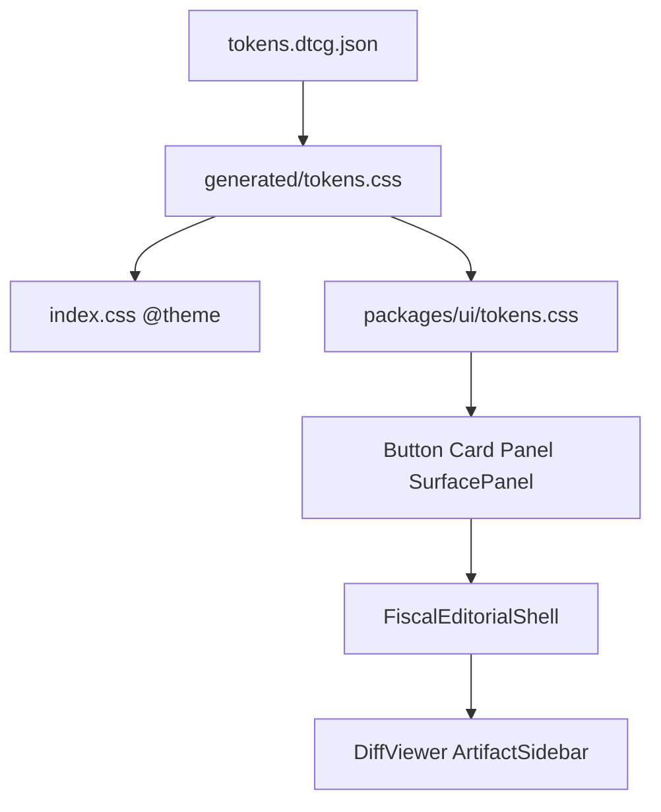

# Design — Drenyra Fiscal Editorial v3

**Última actualización:** 2026-06-30

## Technical approach

Rebrand via DTCG token layer first, then `@arkelythex/ui` parity, then shell unification, then agent surfaces. Operations-first three-zone layout is immutable.

## Architecture

## Decisions

| Decision | Choice | Alternatives | Rationale |
|----------|--------|--------------|-----------|
| Accent | Voltage `#f54e00` | Keep Copper | User-approved rebrand; Cursor editorial clarity |
| Default theme | Dark editorial | Light default | Long fiscal sessions |
| Glass | Deprecated | Keep glass | Competes with data density |
| Shell | Single component | Keep dual layouts | Removes drift CodexShell/MainLayout |

## File changes

| File | Action |
|------|--------|
| `tokens.dtcg.json` | Modify palette v3.0.0 |
| `generated/tokens.css` | Regenerate |
| `packages/ui/src/styles/tokens.css` | Sync from DTCG semantics |
| `packages/ui/src/components/Button.tsx` | Editorial variants |
| `apps/web/src/components/ui/SurfacePanel.tsx` | New |
| `apps/web/src/components/ui/glass-card.tsx` | Deprecate → SurfacePanel |
| `apps/web/src/components/layout/FiscalEditorialShell.tsx` | New |
| `apps/web/src/components/layout/CodexShell.tsx` | Shim |
| `apps/web/src/components/agentic/DiffViewerV3.tsx` | New |
| `apps/web/src/components/agentic/ArtifactSidebar.tsx` | New |
| `apps/web/DESIGN.md` | Rewrite v3 |
| `docs/design/design-influences-2026.md` | New |

## Lanes A–F

### Lane A — Tokens

Rename primitives to espresso/voltage; update semantic accent; sync generated CSS.

### Lane B — DESIGN.md

YAML tokens + anti-patterns for agents.

### Lane C — Primitives

SurfacePanel, Button v3, deprecate glass.

### Lane D — Shell

FiscalEditorialShell operational | command-center.

### Lane E — Agent surfaces

DiffViewerV3, ArtifactSidebar, SIRE diff integration.

### Lane F — Tooling

ESLint, Playwright visual stub, verify-report.

## Testing strategy

- Unit: `contrast.test.ts`, `design-system-adapters.test.tsx`
- Component: FiscalEditorialShell, SurfacePanel, DiffViewerV3
- E2E: existing sire-diff spec smoke

## Migration

1. Tokens + package parity (non-breaking aliases)
2. Primitives + shell
3. Feature pilots
4. Codemod wave + ESLint tighten

## Open questions

- OpenPencil `.pen` file: stub JSON manifest until OpenPencil installed
- Landing parity: deferred to follow-up PR
