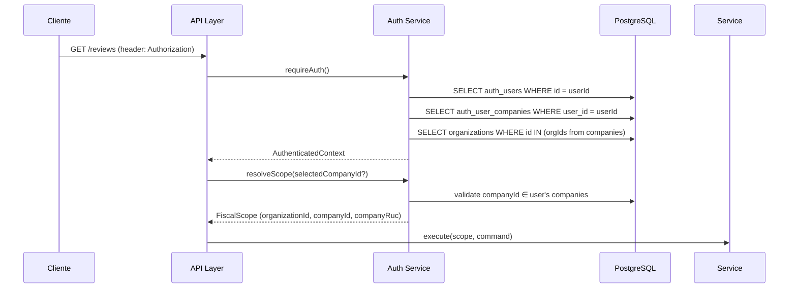

# H02 Design — Tenant Isolation Hardening

> Basado en el código actual del repositorio. Better Auth es el sistema activo (Clerk deprecado).
> `auth_user_companies` es la membership bridge existente. FiscalScope existe pero con `organizationId?` opcional.

---

## 1. Auth Flow

### Estado actual

```
Cliente → Clerk/BetterAuth → requireAuth() → userId: string
                                                ↓
                                         requireOrganization()
                                                ↓
                                         AuthContext { userId, User, Organization }
                                                ↓
                                         organizationId del body del request
```

**Problema:** organizationId es opcional en el scope, no hay validación de company en `requireAuthContext()`, y `requireAuth()` retorna solo un string.

### Estado objetivo

```
Cliente → BetterAuth → requireAuth()
                                ↓
                         extract userId
                                ↓
                         load auth_user_companies + organizations
                                ↓
                         validate selectedCompanyId ∈ memberships
                                ↓
                         build AuthenticatedContext
                                ↓
                         derive FiscalScope
                                ↓
                         application service / repository
```

**Regla fundamental:** organizationId y companyId nunca se confían del body del request. Se derivan exclusivamente del contexto autenticado.

### Diagrama de flujo



### Manejo de selectedCompanyId

- El cliente envía `X-Company-Id` header (una solicitud, no autoridad)
- Backend valida que ese companyId pertenezca a las memberships del usuario
- Si no se envía, se usa la company default (`auth_user_companies.is_default = true`)
- Si no hay default y no se envía, error `400 MULTIPLE_COMPANIES`

---

## 2. Scope Types

### Separación en 3 niveles

```typescript
// packages/domain/src/scope/types.ts

/**
 * Organization-level scope — identifica la organización.
 * Suficiente para entidades que pertenecen a la org pero no a una company específica.
 */
export interface OrganizationScope {
  organizationId: string
}

/**
 * Tenant-level scope — identifica una company dentro de una organización.
 * Necesario para toda entidad tenant-owned.
 */
export interface TenantScope {
  organizationId: string
  companyId: string
}

/**
 * Fiscal scope — extiende TenantScope con período fiscal y país.
 * Necesario para operaciones fiscales (cierres, revisiones, declaraciones).
 */
export interface FiscalScope {
  organizationId: string
  companyId: string
  companyRuc: string
  period: string
  countryCode: 'PE'
}

/**
 * Contexto autenticado completo.
 */
export interface AuthenticatedContext {
  userId: string
  organizationId: string
  memberships: OrganizationMembership[]
}

export interface OrganizationMembership {
  organizationId: string
  companyId: string
  companyRuc: string
  role: MembershipRole
  isDefault: boolean
  permissions: Permission[]
}

export type MembershipRole =
  'OWNER' | 'ADMIN' | 'ACCOUNTANT' | 'REVIEWER' | 'APPROVER' | 'VIEWER'
```

### Matriz entidad → tipo de scope

| Entidad          | Scope requerido     | Ejemplos                            |
| ---------------- | ------------------- | ----------------------------------- |
| Organization     | `OrganizationScope` | settings, billing, members          |
| User             | `OrganizationScope` | profile, preferences                |
| Company          | `OrganizationScope` | company details, config             |
| Document         | `TenantScope`       | invoices, receipts, PDFs            |
| Review           | `FiscalScope`       | cierres, revisiones mensuales       |
| Finding          | `FiscalScope`       | hallazgos SIRE, discrepancias       |
| Evidence         | `TenantScope`       | evidencia fiscal                    |
| Approval         | `FiscalScope`       | aprobaciones de cierre              |
| AgentRun         | `TenantScope`       | ejecuciones de agentes              |
| AuditEvent       | `TenantScope`       | eventos de auditoría                |
| SireSubmission   | `TenantScope`       | declaraciones SUNAT                 |
| JournalEntry     | `FiscalScope`       | asientos contables                  |
| BankTransaction  | `TenantScope`       | movimientos bancarios               |
| FiscalTruthEvent | `FiscalScope`       | eventos de verdad fiscal            |
| Global catalog   | `NONE`              | tipos documentales, reglas públicas |

### Impacto de migración

**organizationId pasa de opcional a obligatorio** en `FiscalScope`.

```diff
- organizationId?: string;
+ organizationId: string;
```

Esto rompe ~20 interfaces que usan `FiscalScope`. Cada sitio debe actualizarse. Se mitiga con una fase de migración por capas (ver sección 4).

---

## 3. Repository Contracts

### Principio

> Todo repository que opere sobre entidades tenant-scoped DEBE exigir scope en TODAS sus firmas públicas.

Ninguna entidad con `organizationId` o `companyId` en su schema puede tener un método público que acepte solo `id`.

### Patrón seguro

```typescript
// ANTES (inseguro)
interface DocumentRepository {
  findById(id: string): Promise<Document | null>
  update(id: string, data: Partial<Document>): Promise<Document>
  delete(id: string): Promise<void>
}

// DESPUÉS (seguro)
interface DocumentRepository {
  findById(scope: TenantScope, id: string): Promise<Document | null>
  update(
    scope: TenantScope,
    id: string,
    data: Partial<Document>
  ): Promise<Document>
  delete(scope: TenantScope, id: string): Promise<void>
}
```

### Repositories inseguros — inventario completo (19 tenant-owned)

**Nota:** El inventario inicial de 7 era una subestimación. Hay **19 repositorios tenant-owned** en total. De ellos 3 ya son scope-safe, 5 tienen interfaz mixta, y 11 tienen `findById(id)` como único método inseguro.

#### Grupo A: Scope-safe (3)

| Repository                | Estado                                         |
| ------------------------- | ---------------------------------------------- |
| `EvidenceGraphRepository` | FiscalTruthScope en TODOS los métodos ✅       |
| `ControlTowerRepository`  | ControlTowerScopeGuard en TODOS los métodos ✅ |
| `FiscalTruthRepository`   | FiscalTruthScope requerido ✅                  |

#### Grupo B: Interfaz mixta — scoped + unscoped coexisten (5)

| Repository               | Método inseguro                    | Scope faltante  | Peligro                                                       |
| ------------------------ | ---------------------------------- | --------------- | ------------------------------------------------------------- |
| `AccountRepository`      | `findById(id)`                     | orgId           | 🔴 **10 callers activos** en application layer                |
| `JournalEntryRepository` | `findById(id)`                     | orgId/companyId | 🔴 **3 callers activos**                                      |
| `InvoiceRepository`      | `findById(id)` + `save(invoice)`   | orgId/companyId | 🟡 scoped methods son OPTIONAL (`?`), implementación insegura |
| `EvidenceRepository`     | `findById(id)`, `findByHash(hash)` | orgId           | 🟡 coexiste con ForOrganization                               |
| `DocumentRepository`     | `findById(id)`                     | companyId       | 🟢 **Implementación THROWS.** Gold standard.                  |

#### Grupo C: Solo `findById(id)` es inseguro (11)

| Repository                   | Método inseguro                           | Criticidad | Callers                     |
| ---------------------------- | ----------------------------------------- | ---------- | --------------------------- |
| `SireSubmissionRepository`   | `findByIdempotencyKey(key)`, `update(id)` | 🔴 CRÍTICO | 0 callers activos           |
| `DetractionRepository`       | `findById(id)`                            | 🔴 ALTO    | 1 (detraction.service.ts)   |
| `CpeLogRepository`           | `findById(id)`                            | 🔴 ALTO    | 1 (cpe-tracking.service.ts) |
| `AccountingPeriodRepository` | `findById(id)`                            | 🔴 ALTO    | 1 (accounting-period.svc)   |
| `ExchangeRateRepository`     | `findById(id)`                            | 🔴 ALTO    | 0-1 callers                 |
| `ClientRepository`           | `findById(id)`                            | 🔴 ALTO    | Pendiente verificar         |
| `ProviderRepository`         | `findById(id)`                            | 🔴 ALTO    | Pendiente verificar         |
| `TransactionRepository`      | `findById(id)`                            | 🔴 ALTO    | Pendiente verificar         |
| `BankAccountRepository`      | `updateBalance(id)` sin companyId         | 🟡 MEDIO   | 0                           |
| `AccountingPrRepository`     | Pendiente verificar                       | 🟡 MEDIO   | —                           |
| `CloseChecklistRepository`   | Pendiente verificar                       | 🟡 MEDIO   | —                           |

#### No tenant-owned (excluidos) (4)

| Repository                    | Razón                        |
| ----------------------------- | ---------------------------- |
| `AISettingsRepository`        | User-scoped, sin org/company |
| `OrganizationRepository`      | La org es el tenant root     |
| `ModelRegistrationRepository` | Global, sin org/company      |
| `ChatRepository`              | User-scoped                  |

### Callers inseguros confirmados en application layer

**AccountRepository.findById(id) — 10 callers en 5 use cases:**

- `toggle-account-status.use-case.ts` (líneas 38, 60, 85, 96, 114)
- `create-account.use-case.ts` (línea 45)
- `get-accounts.use-case.ts` (línea 74)
- `delete-account.use-case.ts` (línea 43)
- `update-account.use-case.ts` (líneas 31, 61)

**JournalEntryRepository.findById(id) — 3 callers:**

- `delete-journal-entry.use-case.ts` (línea 22)
- `update-journal-entry-status.use-case.ts` (línea 27)
- `update-journal-entry.use-case.ts` (línea 42)

**DetractionRepository.findById(id) — 1 caller:**

- `detraction.service.ts` (línea 101)

**CpeLogRepository.findById(id) — 1 caller:**

- `cpe-tracking.service.ts` (línea 57)

**AccountingPeriodRepository.findById(id) — 1 caller:**

- `accounting-period.service.ts` (línea 80)

### Corrección específica: SireSubmissionRepository

```typescript
// ANTES
async findByIdempotencyKey(idempotencyKey: string): Promise<...> {
  return db.select().from(sireSubmissions)
    .where(eq(sireSubmissions.idempotencyKey, idempotencyKey))
    .limit(1)
}

// DESPUÉS
async findByIdempotencyKey(scope: TenantScope, idempotencyKey: string): Promise<...> {
  return db.select().from(sireSubmissions)
    .where(
      and(
        eq(sireSubmissions.idempotencyKey, idempotencyKey),
        eq(sireSubmissions.companyId, scope.companyId)
      )
    )
    .limit(1)
}
```

### Policy de overloads inseguros

No mantener overloads inseguros públicos durante la migración. Estrategia:

1. Renombrar el método inseguro a `_findByIdempotencyKeyLegacy` (privado, prefijo `_`)
2. Crear el nuevo método con scope
3. Migrar todos los callers
4. Eliminar el legacy en el PR siguiente

---

## 4. Migration Strategy

### Olas por criticidad (ajustado por evidencia real)

```
Wave 1: Auth context + FiscalScope canónico + AccountRepository + JournalEntryRepository
Wave 2: DetractionRepository + CpeLogRepository + AccountingPeriodRepository
Wave 3: ExchangeRateRepository + TransactionRepository + ClientRepository + ProviderRepository
Wave 4: EvidenceRepository + InvoiceRepository + SireSubmissionRepository
Wave 5: EvidenceGraphRepository (confirmar consistencia) + DocumentRepository (confirmar)
Wave 6: Workers + SSE + Exports + Signed URLs
Wave 7: RLS

Duración estimada: 14-18 días (vs 14 originales)
```

**Justificación del cambio:** El inventario reveló que AccountRepository tiene 10 callers activos y JournalEntryRepository 3. Son la puerta de entrada más ancha para una fuga cross-tenant. SireSubmissionRepository (el hallazgo original) tiene 0 callers — su riesgo es más bajo en la práctica. El rollout se reordena para eliminar primero los agujeros con más tráfico.

### Para cada repository

El ciclo por repository es:

```
1. Interface → agregar scope a firmas
2. Implementation → actualizar queries
3. Application service → pasar scope desde AuthContext
4. Entry point (API/worker) → derivar scope, pasar al service
5. Test → cross-tenant negativo + happy path
```

### Mecanismo temporal

Solo donde sea imprescindible:

```typescript
// Temporal: wrapper que provee scope desde el contexto actual
// Fecha de eliminación: 2026-08-31
function withCurrentScope(): TenantScope {
  const ctx = getCurrentAuthContext() // async local storage
  if (!ctx) throw new Error('Auth context required')
  return {
    organizationId: ctx.organizationId,
    companyId: ctx.selectedCompanyId,
  }
}
```

Se usa ÚNICAMENTE para entry points que no pueden reestructurarse en el mismo PR. Cada uso tiene `TODO(2026-08-31): remove legacy scope resolution`.

---

## 5. RLS Design

### Principios

- RLS es defensa en profundidad, no sustituto de autorización en aplicación
- Fail closed: sin tenant context, la query retorna 0 filas
- Contexto transaction-local compatible con connection pooling (no `SET SESSION`, usar `SET LOCAL`)

### Políticas por tabla

```sql
-- Configuración base en cada sesión
-- Se ejecuta al inicio de cada request vía middleware
SELECT set_config('app.current_organization_id', $1, true) -- true = local, no session
SELECT set_config('app.current_company_id', $2, true)
SELECT set_config('app.current_user_id', $3, true)
```

### Matriz tabla → policy RLS

| Tabla                 | USING (SELECT)                       | WITH CHECK (INSERT/UPDATE)           | Bypass                       |
| --------------------- | ------------------------------------ | ------------------------------------ | ---------------------------- |
| `documents`           | `organization_id = current_org_id()` | `organization_id = current_org_id()` | workers con rol `app_worker` |
| `evidence_nodes`      | `organization_id = current_org_id()` | `organization_id = current_org_id()` | —                            |
| `evidence_edges`      | `organization_id = current_org_id()` | `organization_id = current_org_id()` | —                            |
| `findings`            | `organization_id = current_org_id()` | `organization_id = current_org_id()` | —                            |
| `approvals`           | `organization_id = current_org_id()` | `organization_id = current_org_id()` | —                            |
| `fiscal_periods`      | `organization_id = current_org_id()` | `organization_id = current_org_id()` | —                            |
| `sire_submissions`    | `company_id = current_company_id()`  | `company_id = current_company_id()`  | —                            |
| `agent_run_states`    | `company_id = current_company_id()`  | `company_id = current_company_id()`  | —                            |
| `agent_run_events`    | `company_id = current_company_id()`  | `company_id = current_company_id()`  | —                            |
| `fiscal_truth_events` | `company_id = current_company_id()`  | `company_id = current_company_id()`  | —                            |
| `auth_user_companies` | `user_id = current_user_id()`        | `user_id = current_user_id()`        | admin con rol `app_admin`    |

### Fail closed

```sql
CREATE POLICY tenant_isolation_fail_closed ON documents
  AS RESTRICTIVE  -- se aplica DESPUÉS de otras policies, fail closed
  FOR ALL
  USING (current_setting('app.current_organization_id', true) IS NOT NULL)
  WITH CHECK (current_setting('app.current_organization_id', true) IS NOT NULL)
```

Sin `app.current_organization_id` seteado, TODAS las queries devuelven 0 filas.

### Roles de aplicación

| Rol                 | Bypass RLS               | Uso                                                     |
| ------------------- | ------------------------ | ------------------------------------------------------- |
| `app_authenticated` | No                       | Usuarios normales                                       |
| `app_worker`        | Sí, tablas específicas   | Workers asíncronos (ya tienen scope validado en código) |
| `app_migration`     | Sí                       | Migraciones y backfills                                 |
| `app_admin`         | Sí, solo tablas de admin | Soporte técnico, debugging                              |

### Organization-level access ≠ company-level access

Un usuario con acceso a la organización NO tiene acceso automático a todas las companies.

```sql
-- Policy que verifica membership específica
CREATE POLICY company_access ON documents
  FOR ALL
  USING (
    company_id IN (
      SELECT company_id FROM auth_user_companies
      WHERE user_id = current_user_id()
        AND membership_role IN ('OWNER', 'ADMIN', 'ACCOUNTANT', 'REVIEWER', 'APPROVER')
    )
  )
```

Esto significa que un `VIEWER` de la compañía A no puede ver documentos de la compañía B aunque ambas estén bajo la misma organización.

---

## 6. Rollout Plan

### Fase 1 — Inventario (Día 1-2)

- [ ] Auditar TODOS los repositorios públicos que aceptan `id` sin scope
- [ ] Auditar TODOS los application services que reciben `organizationId` del body
- [ ] Auditar TODOS los workers que no validan scope antes de procesar
- [ ] Auditar SSE subscribers que no filtran por tenant
- [ ] Auditar signed URL generation sin tenant scope
- [ ] Auditar export endpoints sin tenant filter
- [ ] Producir inventario completo como archivo `INVENTORY.md` en el change

### Fase 2 — Auth context + tipos (Día 2-4)

- [ ] Crear `packages/domain/src/scope/types.ts` con `OrganizationScope`, `TenantScope`, `FiscalScope`, `AuthenticatedContext`
- [ ] Modificar `FiscalScope`: `organizationId` pasa de opcional a obligatorio
- [ ] Modificar `requireAuthContext()` para incluir memberships completas
- [ ] Agregar `resolveScope(selectedCompanyId?)` al auth flow
- [ ] Agregar `getCurrentAuthContext()` con AsyncLocalStorage

### Fase 3 — Repositories scope-first (Día 3-7)

Por ola:

| Ola | Repositories                                       | PRs |
| --- | -------------------------------------------------- | --- |
| 3a  | `SireSubmissionRepository` (CRÍTICO)               | 1   |
| 3b  | `DocumentPersistence`, `PostgresInvoiceRepository` | 1-2 |
| 3c  | Evidence graph, AI settings, MCP audit             | 1   |
| 3d  | Resto de repositories tenant-owned                 | 1-2 |

Cada PR incluye: interface → implementation → service → entry point → tests.

### Fase 4 — Tests negativos (Día 5-10)

Se escriben POR cada repository corregido, no al final.

```typescript
describe("cross-tenant isolation", () => {
  it("returns null when querying another tenant entity by id", ...)
  it("returns null when querying by external key across tenants", ...)
  it("rejects update from different tenant", ...)
  it("rejects delete from different tenant", ...)
  it("rejects create with different tenant scope", ...)
  it("does not reveal existence (returns 404 not 403)", ...)
})
```

### Fase 5 — Workers + SSE + exports (Día 8-12)

- [ ] Workers: validar que `FiscalAgentJobData` (y similares) incluyan scope validado en producción
- [ ] Workers: rechazar jobs sin scope válido
- [ ] SSE: filtrar eventos por `organizationId` del suscriptor
- [ ] SSE: heartbeat con reconexión y `Last-Event-ID`
- [ ] Signed URLs: incluir `organizationId` + `companyId` en la firma
- [ ] Exports: scope en generación y en resultado

### Fase 6 — RLS shadow + activación (Día 10-14)

**Modo shadow:** cada policy RLS se deploya primero como función que LOGEA pero no bloquea:

```sql
CREATE POLICY tenant_isolation_shadow ON documents
  AS PERMISSIVE
  FOR ALL
  USING (true)  -- no bloquea
  WITH CHECK (true)
```

Y una función de logging que registra violaciones:

```sql
CREATE OR REPLACE FUNCTION log_tenant_violation()
RETURNS trigger AS $$
BEGIN
  IF current_setting('app.current_organization_id', true) IS NULL
     OR NEW.organization_id != current_setting('app.current_organization_id', true) THEN
    INSERT INTO tenant_violation_log(organization_id, company_id, table_name, user_id, action)
    VALUES (NEW.organization_id, NEW.company_id, TG_TABLE_NAME, current_setting('app.current_user_id', true), TG_OP);
  END IF;
  RETURN NEW;
END;
$$ LANGUAGE plpgsql;
```

Después de 48h sin violaciones, se activa RLS real.

**Activación gradual por tabla:**

```
Día 10: sire_submissions, agent_run_states
Día 11: evidence_nodes, evidence_edges
Día 12: documents, findings, approvals
Día 13: fiscal_truth_events, fiscal_periods
Día 14: agent_run_events
```

### Rollback documentado

```
Por PR:
  git revert <merge-commit>
  Re-aplicar migración inversa si hay cambios de schema

Por RLS:
  DROP POLICY IF EXISTS tenant_isolation ON documents;
  ALTER TABLE documents DISABLE ROW LEVEL SECURITY;

Por scope types:
  Revertir FiscalScope a organizationId? opcional
  Re-aplicar interfaz anterior en repositories

Por auth:
  Revertir requireAuthContext() a versión anterior
  Eliminar middleware de AsyncLocalStorage
```

---

## 7. Testing

### Cross-tenant tests

```typescript
// Setup: dos tenants con datos
const tenantA = await createTenantFixture({
  organizationId: 'org-a',
  companyId: 'cmp-a',
})
const tenantB = await createTenantFixture({
  organizationId: 'org-b',
  companyId: 'cmp-b',
})

it("returns null when querying another tenant's entity by id", async () => {
  const doc = await repo.findById(tenantA.scope, 'doc-1')
  expect(doc).not.toBeNull()

  // Mismo ID, scope distinto → null
  const cross = await repo.findById(tenantB.scope, 'doc-1')
  expect(cross).toBeNull()
})

it('returns null for idempotency key from another tenant', async () => {
  const sub = await sireRepo.findByIdempotencyKey(tenantA.scope, 'key-1')
  expect(sub).not.toBeNull()

  const cross = await sireRepo.findByIdempotencyKey(tenantB.scope, 'key-1')
  expect(cross).toBeNull()
})

it('rejects update from different tenant', async () => {
  await expect(
    sireRepo.update(tenantB.scope, tenantA.entityId, { status: 'CANCELLED' })
  ).rejects.toThrow() // 0 rows affected
})

it('returns 404 not 403 for cross-tenant queries', async () => {
  // Por seguridad, no revelar existencia
  const result = await service.findReview(tenantB.scope, tenantA.reviewId)
  expect(result).toBeNull()
  // o: expect(result.isLeft() && result.value.code).toBe("NOT_FOUND")
})
```

### SSE isolation

```typescript
it("does not publish SSE events across organizations", async () => {
  const eventsA: AgentEvent[] = []
  const eventsB: AgentEvent[] = []

  const unsubA = await eventBus.subscribe("agent.run.updated", (e) => eventsA.push(e))
  const unsubB = await eventBus.subscribe("agent.run.updated", (e) => eventsB.push(e))

  // Simular evento del tenant A
  await eventBus.publish({ organizationId: "org-a", ... })

  // Solo A recibe el evento
  expect(eventsA).toHaveLength(1)
  expect(eventsB).toHaveLength(0)

  unsubA()
  unsubB()
})
```

### Worker scope validation

```typescript
it("requires worker payload to include validated fiscal scope", async () => {
  const job = { organizationId: "org-a", companyId: "cmp-a", period: "2026-07", ... }
  await expect(processJob(job)).resolves.not.toThrow()

  const badJob = { period: "2026-07", ... } // sin scope
  await expect(processJob(badJob)).rejects.toThrow(/scope required/)
})
```

### Signed URLs

```typescript
it('rejects cross-company signed URL access', async () => {
  const url = await storage.generateSignedUrl(tenantA.scope, 'doc-1.pdf')
  const response = await fetch(url, {
    headers: { 'X-Company-Id': tenantB.companyId },
  })
  expect(response.status).toBe(403)
})
```

### Edge cases

```typescript
it('fails on missing auth context') // sin sesión
it('fails on invalid auth context') // sesión corrupta
it('works with connection pooling reuse') // misma conexión, tenant distinto
it('fails on query outside transaction') // sin scope local
it('fails on organizationId in body') // cliente mintiendo
it('allows default company when no header') // X-Company-Id ausente
it('rejects company not in user memberships') // X-Company-Id válido pero no autorizado
it('works for worker with bypass role') // workers con scope validado en código
```

---

## 8. Migration SQL

### Migración 001: scope types (DDL solo)

```sql
-- No hay cambios de schema en esta migración
-- scope types son TypeScript-only en domain
```

### Migración 002: organización_id NOT NULL en tablas existentes

```sql
-- Para tablas donde organization_id es nullable
ALTER TABLE evidence_nodes ALTER COLUMN organization_id SET NOT NULL;
ALTER TABLE evidence_edges ALTER COLUMN organization_id SET NOT NULL;
ALTER TABLE fiscal_truth_events ALTER COLUMN organization_id SET NOT NULL;
```

Pre-condición: backfill de filas con organization_id NULL.

### Migración 003: RLS en tablas críticas

```sql
-- 1. Crear schema de seguridad (ya existe: arkalythix_security)
-- 2. Función helper para current org id
CREATE OR REPLACE FUNCTION arkalythix_security.current_organization_id()
RETURNS text LANGUAGE SQL STABLE AS
$$ SELECT current_setting('app.current_organization_id', true) $$;

CREATE OR REPLACE FUNCTION arkalythix_security.current_company_id()
RETURNS text LANGUAGE SQL STABLE AS
$$ SELECT current_setting('app.current_company_id', true) $$;

-- 3. RLS por tabla (se genera por tabla)
ALTER TABLE evidence_nodes ENABLE ROW LEVEL SECURITY;
CREATE POLICY tenant_isolation_evidence_nodes ON evidence_nodes
  AS RESTRICTIVE
  FOR ALL
  USING (organization_id = arkalythix_security.current_organization_id());
```

### Migración 004: roles de aplicación

```sql
CREATE ROLE app_authenticated;
CREATE ROLE app_worker;
CREATE ROLE app_migration;
CREATE ROLE app_admin;

-- Workers bypass RLS en tablas específicas
ALTER TABLE evidence_nodes FORCE ROW LEVEL SECURITY;
ALTER TABLE evidence_nodes ENABLE ROW LEVEL SECURITY;
-- (ya está habilitado, se fuerza)

GRANT SELECT, INSERT, UPDATE ON evidence_nodes TO app_worker;
-- Workers tienen su propia validación de scope en código
```

---

## 9. Riesgos y mitigaciones

| Riesgo                                                                        | Probabilidad | Impacto | Mitigación                                                  |
| ----------------------------------------------------------------------------- | ------------ | ------- | ----------------------------------------------------------- |
| `FiscalScope.organizationId` required rompe compilación en múltiples archivos | Alta         | Medio   | Migración por capas, compilar después de cada PR            |
| RLS en shadow detecta violaciones existentes                                  | Media        | Bajo    | Revela bugs existentes, se corrigen antes de activar        |
| Worker con bypass RLS introduce fuga                                          | Baja         | Crítico | Scope validado en código ANTES de bypass; tests específicos |
| Connection pooling reusa contexto de tenant anterior                          | Media        | Crítico | `SET LOCAL` (no `SET SESSION`), verificado en middleware    |
| Rollback de RLS deja policies huérfanas                                       | Baja         | Bajo    | Script `rollback-rls.sql` documentado                       |
| selectedCompanyId cambia entre requests del mismo usuario                     | Alta         | Bajo    | Esperado: cada request resuelve su propio scope             |
| Caché de memberships stale                                                    | Baja         | Medio   | TTL corto (5 min) o sin cache para memberships              |

---

## 10. Deliverables del diseño

- [x] Diagrama del auth flow (sección 1)
- [x] Matriz entidad → tipo de scope (sección 2)
- [x] Inventario de repositorios inseguros (sección 3) — **19 repositorios, 8 con métodos inseguros**
- [x] Inventario de callers inseguros — **15 callers en application layer, AccountRepository domina con 10**
- [x] Matriz tabla → policy RLS (sección 5)
- [x] Orden exacto de rollout (sección 6) — **ajustado por evidencia**
- [x] Estrategia de rollback (sección 6)
- [x] Lista exacta de migraciones (sección 8)
- [x] Riesgos y mitigaciones (sección 9)
