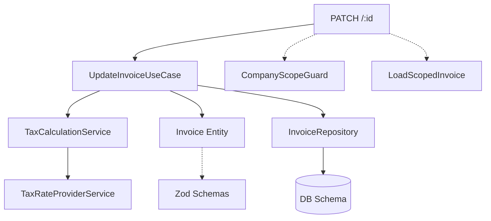

# Spec: Invoice Update Logic Unification

**Creado:** 2026-07-07
**Cambio:** `drenyra-invoice-update-refactor`
**Fase:** Spec

---

## 1. Unified Invoice Entity (`packages/domain/src/entities/Invoice.ts`)

### 1.1 Props

```typescript
export type InvoiceStatus =
  'DRAFT' | 'PENDING' | 'SENT' | 'ACCEPTED' | 'REJECTED' | 'CANCELLED'

export type FiscalStatus =
  | 'DRAFT'
  | 'PENDING_REVIEW'
  | 'SUBMITTED'
  | 'ACCEPTED'
  | 'REJECTED'
  | 'CANCELLED'

export interface InvoiceProps {
  id: string
  series: DocumentSeries
  number: number
  issueDate: Date
  dueDate?: Date
  clientName: string

  // Buyer tax ID (generic)
  buyerTaxId?: TaxIdentifier // RUC | DNI | CE | etc.
  clientAddress?: string

  // Monetary
  baseAmount: Money
  taxAmount: Money // IGV (PE), IVA (MX), VAT (generic)
  totalAmount: Money

  // Status (dual)
  status: InvoiceStatus // legacy
  fiscalStatus: FiscalStatus // generic (preferred)

  items: InvoiceItem[]
  notes?: string

  // SUNAT artifacts
  sunatResponseCode?: string
  sentToSunatAt?: Date
  sunatTicket?: string
  sunatCdrUrl?: string

  // Company / tenancy
  companyId: string

  // Timestamps
  createdAt: Date
  updatedAt: Date
}
```

### 1.2 Factory Methods

```typescript
static create(props: Omit<InvoiceProps, 'createdAt' | 'updatedAt'>): Invoice
static fromPrimitives(data: InvoicePrimitiveData): Invoice
```

### 1.3 Lifecycle Methods

```typescript
canBeModified(): boolean             // DRAFT | PENDING only
isOverdue(): boolean
getFullNumber(): string

markAsSent(ticket: string): Invoice   // PENDING → SENT
markAsAccepted(): Invoice             // SENT → ACCEPTED
markAsRejected(reason: string): Invoice // SENT → REJECTED
cancel(): Invoice                     // DRAFT | PENDING → CANCELLED
```

### 1.4 Item Types

```typescript
export interface InvoiceItem {
  id: string
  description: string
  quantity: number
  unitPrice: Money
  subtotal: Money
  igv: Money
  total: Money
  taxType?: 'GRAVADO' | 'EXONERADO' | 'INAFECTO'
}
```

Eliminar los siguientes tipos obsoletos de `apps/api`:

- `type Currency` de API feature (usar `@drenyra/domain`)
- `type InvoiceItem` de API feature (usar el de domain)
- `type InvoiceStatus` de API feature (usar el de domain)

---

## 2. TaxCalculationService (`packages/application/src/services/tax-calculation.service.ts`)

### 2.1 Interface

```typescript
export interface TaxCalculationService {
  /**
   * Calculate invoice item taxes from raw input.
   * Handles IGV for GRAVADO items, zero tax for EXONERADO/INAFECTO.
   */
  calculateItems(
    input: CreateInvoiceItemInput[],
    currency: Currency,
    issueDate: Date
  ): Promise<InvoiceItemResult[]>

  /**
   * Aggregate item totals into invoice-level amounts.
   */
  aggregateTotals(items: InvoiceItemResult[], currency: Currency): InvoiceTotals
}

export interface CreateInvoiceItemInput {
  productId?: string
  description: string
  quantity: number
  unitPrice: number
  taxType?: 'GRAVADO' | 'EXONERADO' | 'INAFECTO'
}

export interface InvoiceItemResult {
  id: string
  productId?: string
  description: string
  quantity: number
  unitPrice: Money
  taxType: 'GRAVADO' | 'EXONERADO' | 'INAFECTO'
  igvRate: number
  subtotal: Money
  igvAmount: Money
  totalAmount: Money
}

export interface InvoiceTotals {
  baseAmount: Money
  igvAmount: Money
  totalAmount: Money
}
```

### 2.2 Implementation

- Tomar la lógica de `calculateUpdateInvoiceItems()` del `update-invoice.command.ts`
- Usar `TaxRateProviderService.getVatRate()` para la tasa vigente
- Reemplazar `randomUUID()` con un ID opcional desde el input (para compatibilidad con items existentes)
- Soportar los tres taxTypes: GRAVADO, EXONERADO, INAFECTO

---

## 3. UpdateInvoiceUseCase (`packages/application/src/use-cases/invoice/update-invoice.use-case.ts`)

### 3.1 Refactored Interface

```typescript
export class UpdateInvoiceUseCase {
  constructor(
    private readonly invoiceRepository: InvoiceRepository,
    private readonly taxCalculationService: TaxCalculationService
  ) {}

  async execute(input: UpdateInvoiceDTO): Promise<void>
}
```

### 3.2 Input DTO (`packages/application/src/dtos/invoice/update-invoice.dto.ts`)

```typescript
export interface UpdateInvoiceDTO {
  id: string
  organizationId?: number
  series?: string
  number?: number
  dueDate?: Date
  clientName?: string
  clientRUC?: string
  clientDNI?: string
  clientAddress?: string
  items?: UpdateInvoiceItemDTO[]
  status?: InvoiceStatus
}

export interface UpdateInvoiceItemDTO {
  id?: string
  description: string
  quantity: number
  unitPrice: number
  taxType?: 'GRAVADO' | 'EXONERADO' | 'INAFECTO'
}
```

### 3.3 Validation Schema (Zod)

Mantener `UpdateInvoiceSchema` en `packages/application/src/validators/invoice/invoice.validators.ts`:

```typescript
export const UpdateInvoiceSchema = z.object({
  id: z.string().uuid(),
  organizationId: z.number().optional(),
  series: z.string().optional(),
  number: z.number().positive().optional(),
  dueDate: z.date().optional(),
  clientName: z.string().min(1).max(255).optional(),
  clientRUC: z
    .string()
    .regex(/^\d{11}$/)
    .optional(),
  clientDNI: z
    .string()
    .regex(/^\d{8}$/)
    .optional(),
  clientAddress: z.string().max(500).optional(),
  items: z.array(UpdateInvoiceItemSchema).min(1).max(50).optional(),
  status: z
    .enum(['DRAFT', 'PENDING', 'SENT', 'ACCEPTED', 'REJECTED', 'CANCELLED'])
    .optional(),
})

export const UpdateInvoiceItemSchema = z.object({
  id: z.string().uuid().optional(),
  description: z.string().min(3).max(255),
  quantity: z.number().positive(),
  unitPrice: z.number().nonnegative(),
  taxType: z.enum(['GRAVADO', 'EXONERADO', 'INAFECTO']).optional(),
})
```

### 3.4 Flow

```
validate(input)
  → findById(id) → NotFoundError
  → canBeModified() → BusinessRuleError
  → If items provided:
      → taxCalculationService.calculateItems(items, currency, issueDate)
      → taxCalculationService.aggregateTotals(calculatedItems, currency)
      → Crear Invoice.fromPrimitives() con nuevos items + totals
    Else:
      → Preservar items y totals existentes
  → If organizationId: updateForOrganization() else update()
```

### 3.5 Dependencies

- `packages/application` ahora depende de `InvoiceRepository` (type desde domain)
  - Opción A: Agregar `InvoiceRepository` type a `packages/domain/repositories/`
  - Opción B: Extraer interface mínima necesaria
  - **Decisión:** Opción A, ya existe el directorio `packages/domain/src/repositories/`

---

## 4. API Route (`apps/api/src/features/billing/invoice/api/routes/update.route.ts`)

### 4.1 Refactored Route

```diff
- import { updateInvoice } from "../../application/commands/update-invoice.command";
+ import { UpdateInvoiceUseCase } from "@drenyra/application/use-cases/invoice/update-invoice.use-case";
```

La ruta mantiene:

- `companyScopeGuard` (tenancy)
- Validación Zod de body/params
- `loadScopedInvoice()` para verificar tenant
- Error handling con códigos específicos

### 4.2 Body Schema (inline)

Se mantiene el schema Zod inline en la ruta, pero `exchangeRate` se vuelve opcional con default 1 (ya implementado).

---

## 5. Files to Remove

### 5.1 Commands

| File                                                     | Reemplazado por                                  |
| -------------------------------------------------------- | ------------------------------------------------ |
| `apps/api/.../commands/update-invoice.command.ts`        | `UpdateInvoiceUseCase` + `TaxCalculationService` |
| `apps/api/.../commands/update-invoice-status.command.ts` | (debatir si mantener o migrar)                   |

### 5.2 API Feature Domain

| File                                                  | Reemplazado por                                          |
| ----------------------------------------------------- | -------------------------------------------------------- |
| `apps/api/.../domain/invoice.entity.ts`               | `packages/domain/src/entities/Invoice.ts`                |
| `apps/api/.../domain/invoice.repository.interface.ts` | `packages/domain/src/repositories/invoice.repository.ts` |
| `apps/api/src/types/invoice.types.ts`                 | Types en domain package                                  |
| `apps/api/src/validators/invoice.schema.ts`           | Validators en application package                        |

### 5.3 Domain Package Duplicates

| File                                                     | Reemplazado por                                                   |
| -------------------------------------------------------- | ----------------------------------------------------------------- |
| `packages/domain/src/entities/invoice/invoice.entity.ts` | `packages/domain/src/entities/Invoice.ts` (ya existe como target) |
| `packages/domain/src/entities/invoice/types.ts`          | Types en `packages/domain/src/entities/Invoice.ts`                |
| `packages/domain/src/entities/invoice/validators.ts`     | Lógica inline en constructor de Invoice unificada                 |

---

## 6. Migration Plan

### Phase 1: Domain Foundation

1. Unificar entidad Invoice en `packages/domain/src/entities/Invoice.ts`
   - Traer `companyId` desde API entity (campo faltante en domain entity actual)
   - Traer `sunatTicket`, `sunatCdrUrl` desde API entity
   - Mantener `buyerTaxId`, `taxAmount`, `fiscalStatus` (generic)
   - Mantener compatibilidad con `fromPrimitives()` para persistencia actual
2. Eliminar `packages/domain/src/entities/invoice/` directory
3. Actualizar tests de entidad
4. Re-exportar desde `packages/domain/src/index.ts`

### Phase 2: Tax Calculation Service

1. Crear `packages/application/src/services/tax-calculation.service.ts`
2. Mover lógica IGV duplicada (desde ambos comandos al service)
3. Tests unitarios con casos de borde (GRAVADO, EXONERADO, INAFECTO, redondeo)

### Phase 3: Use Case Refactor

1. Refactorizar `UpdateInvoiceUseCase` para usar nueva Invoice entity
2. Integrar `TaxCalculationService`
3. Eliminar `update-invoice.command.ts`
4. Actualizar ruta API para usar use case

### Phase 4: Cleanup

1. Eliminar `update-invoice-status.command.ts` (si aplica)
2. Eliminar entity/repo interface de API feature
3. Verificar que todos los imports están actualizados
4. Typecheck, lint, tests

---

## 7. Test Plan

| Suite                 | Archivo                                                                                | Tipo        | Coverage                                              |
| --------------------- | -------------------------------------------------------------------------------------- | ----------- | ----------------------------------------------------- |
| Invoice entity        | `packages/domain/src/entities/__tests__/Invoice.test.ts`                               | Unit        | Create, fromPrimitives, lifecycle, invariants         |
| TaxCalculationService | `packages/application/src/services/__tests__/tax-calculation.service.test.ts`          | Unit        | Items calculation, aggregation, tax types, edge cases |
| UpdateInvoiceUseCase  | `packages/application/src/use-cases/invoice/__tests__/update-invoice.use-case.test.ts` | Unit        | All existing + new cases for refactored flow          |
| API route             | `apps/api/src/features/billing/invoice/__tests__/unit/update.route.test.ts`            | Integration | Error handling, tenancy, 404/400 codes                |

---

## 8. Dependency Graph



---

## 9. Contrato de No-Regresión

Después del refactor:

- `PATCH /:id` responde con `{ id, invoiceNumber, totalAmount, status }` (sin cambios)
- Errores: `404 INVOICE_NOT_FOUND`, `400 INVOICE_UPDATE_ERROR` (sin cambios)
- Cálculo de IGV para GRAVADO items: `subtotal / (1 + vatRate) * vatRate` (sin cambios)
- Tenancy: RLS transaction en repositorio (sin cambios)
- Tests existentes en `packages/application/__tests__/update-invoice.use-case.test.ts` pasan (asserts de comportamiento)
- Tests existentes en `apps/api/.../invoice.test.ts` migrados al nuevo entity

---

## 10. Próximo paso recomendado

Pasar a fase **Design** para diagramas de clases detallados, secuencia de flujo y plan de archivos exactos.
