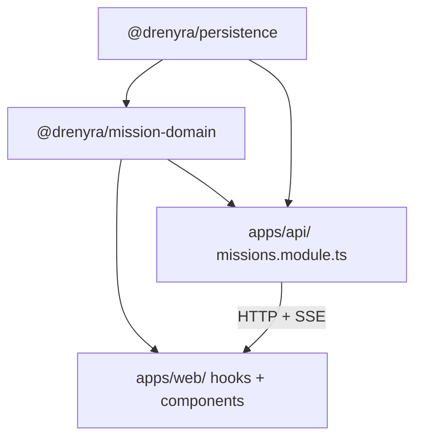
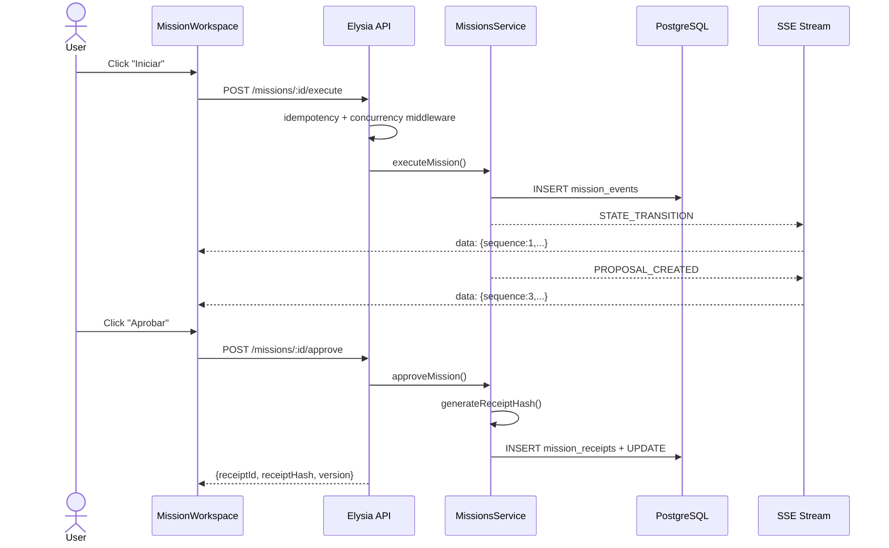
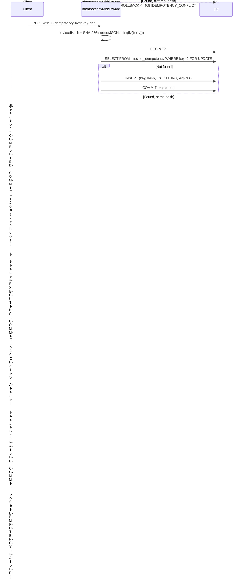
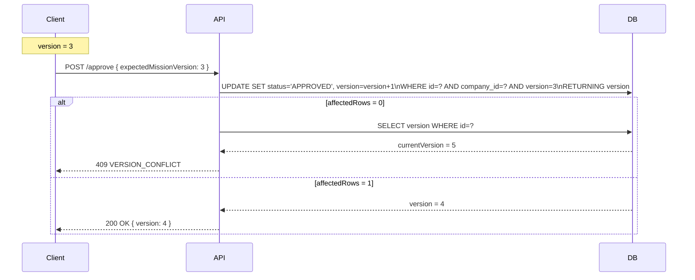

# M1 — Durable Monthly Close Mission — Architectural Design

**Status:** Draft | **Date:** 2026-07-30 | **Inputs:** proposal.md, spec.md

---

## 1. Module Architecture (C4: Container Level)

### 1.1 Package Dependency Graph



### 1.2 Consumption Contract

| Consumer | Consumes | Mechanism |
|----------|----------|-----------|
| apps/api | AccountingMissionStatus, validateTransition, guardTerminal, MissionError, MissionSnapshot, RunIntentCommand, ApproveCommand, RejectCommand, generateReceiptHash, verifyReceiptIntegrity, MissionEvent, parseSSEEvent, isKeepalive | Direct import |
| apps/web | AccountingMissionStatus, isRunnable, isAwaitingApproval, isTerminal, MissionSnapshot, MissionStep, MissionProposal, parseSSEEvent, isKeepalive, MissionError | Direct import |
| packages/persistence | AccountingMissionStatus, MissionIntent, MissionProposal, MissionRejection | Direct import for Drizzle $type |

### 1.3 End-to-End Data Flow



---

## 2. Drizzle Schema Design

All 4 tables in `packages/persistence/src/schema/mission.schema.ts`. Patterns follow existing drizzle schema style.

### 2.1 accounting_missions

```typescript
import {
  index, integer, jsonb, pgTable,
  text, timestamp, uniqueIndex, uuid, varchar,
} from "drizzle-orm/pg-core";
import { companies } from "./core.schema";

export const accountingMissions = pgTable(
  "accounting_missions",
  {
    id: uuid("id").primaryKey().defaultRandom(),
    companyId: uuid("company_id").references(() => companies.id).notNull(),
    fiscalPeriod: varchar("fiscal_period", { length: 7 }).notNull(),
    intent: varchar("intent", { length: 30 }).notNull(),
    status: varchar("status", { length: 25 }).default("DRAFT").notNull(),
    version: integer("version").default(1).notNull(),
    progress: integer("progress").default(0).notNull(),
    input: jsonb("input").$type<{ instruction: string }>(),
    proposal: jsonb("proposal"),
    rejection: jsonb("rejection"),
    receiptId: uuid("receipt_id"),
    receiptHash: text("receipt_hash"),
    lastEventSequence: integer("last_event_sequence").default(0).notNull(),
    createdAt: timestamp("created_at", { withTimezone: true }).defaultNow().notNull(),
    updatedAt: timestamp("updated_at", { withTimezone: true }).defaultNow().notNull(),
  },
  (table) => ({
    companyFiscalIntentUnq: uniqueIndex("acct_missions_company_period_intent_unq")
      .on(table.companyId, table.fiscalPeriod, table.intent),
    companyStatusIdx: index("acct_missions_company_status_idx")
      .on(table.companyId, table.status),
    statusIdx: index("acct_missions_status_idx").on(table.status),
  }),
);
```

**Key decisions:** `fiscalPeriod` varchar(7) matching existing YYYY-MM convention. JSONB with $type. Unique on (company, period, intent). Company-scoped. Progress stored as integer basis points (0-10000).

### 2.2 mission_idempotency

```typescript
export const missionIdempotency = pgTable(
  "mission_idempotency",
  {
    id: uuid("id").primaryKey().defaultRandom(),
    companyId: uuid("company_id").references(() => companies.id).notNull(),
    commandType: varchar("command_type", { length: 30 }).notNull(),
    idempotencyKey: varchar("idempotency_key", { length: 255 }).notNull(),
    payloadHash: text("payload_hash").notNull(),
    missionId: uuid("mission_id"),
    executionStatus: varchar("execution_status", { length: 20 }).notNull(),
    response: jsonb("response"),
    responseStatusCode: integer("response_status_code"),
    createdAt: timestamp("created_at", { withTimezone: true }).defaultNow().notNull(),
    expiresAt: timestamp("expires_at", { withTimezone: true }).notNull(),
  },
  (table) => ({
    companyKeyUnq: uniqueIndex("mission_idempotency_company_key_unq")
      .on(table.companyId, table.idempotencyKey),
    expiresAtIdx: index("mission_idempotency_expires_at_idx").on(table.expiresAt),
  }),
);
```

3-state: EXECUTING, COMPLETED, FAILED. SHA-256 payloadHash. TTL-based expiry (7 days).

### 2.3 mission_events

```typescript
export const missionEvents = pgTable(
  "mission_events",
  {
    id: uuid("id").primaryKey().defaultRandom(),
    missionId: uuid("mission_id")
      .references(() => accountingMissions.id, { onDelete: "cascade" }).notNull(),
    sequence: integer("sequence").notNull(),
    eventType: varchar("event_type", { length: 30 }).notNull(),
    snapshot: jsonb("snapshot").notNull(),
    createdAt: timestamp("created_at", { withTimezone: true }).defaultNow().notNull(),
  },
  (table) => ({
    missionSequenceUnq: uniqueIndex("mission_events_mission_sequence_unq")
      .on(table.missionId, table.sequence),
    missionSequenceIdx: index("mission_events_mission_sequence_idx")
      .on(table.missionId, table.sequence),
  }),
);
```

Full MissionSnapshot per event (~2-5KB). Sequence via COALESCE(MAX(sequence),0)+1 in transaction.

### 2.4 mission_receipts

```typescript
export const missionReceipts = pgTable(
  "mission_receipts",
  {
    id: uuid("id").primaryKey().defaultRandom(),
    missionId: uuid("mission_id").references(() => accountingMissions.id).notNull(),
    companyId: uuid("company_id").references(() => companies.id).notNull(),
    actorId: varchar("actor_id", { length: 255 }).notNull(),
    decision: varchar("decision", { length: 10 }).notNull(),
    proposalVersion: integer("proposal_version").notNull(),
    evidenceHash: text("evidence_hash").notNull(),
    previousStatus: varchar("previous_status", { length: 25 }).notNull(),
    newStatus: varchar("new_status", { length: 25 }).notNull(),
    payloadHash: text("payload_hash").notNull(),
    receiptHash: text("receipt_hash").notNull(),
    createdAt: timestamp("created_at", { withTimezone: true }).defaultNow().notNull(),
  },
  (table) => ({
    missionIdIdx: index("mission_receipts_mission_id_idx").on(table.missionId),
    companyIdIdx: index("mission_receipts_company_id_idx").on(table.companyId),
    receiptHashUnq: uniqueIndex("mission_receipts_hash_unq").on(table.receiptHash),
  }),
);
```

Immutable (no updatedAt). receiptHash unique = content-addressable integrity guard.

### 2.5 Drizzle Relations

```typescript
import { relations } from "drizzle-orm";

export const accountingMissionsRelations = relations(
  accountingMissions, ({ one, many }) => ({
    company: one(companies, {
      fields: [accountingMissions.companyId], references: [companies.id],
    }),
    events: many(missionEvents),
    receipts: many(missionReceipts),
  }),
);

export const missionEventsRelations = relations(missionEvents, ({ one }) => ({
  mission: one(accountingMissions, {
    fields: [missionEvents.missionId], references: [accountingMissions.id],
  }),
}));

export const missionReceiptsRelations = relations(missionReceipts, ({ one }) => ({
  mission: one(accountingMissions, {
    fields: [missionReceipts.missionId], references: [accountingMissions.id],
  }),
  company: one(companies, {
    fields: [missionReceipts.companyId], references: [companies.id],
  }),
}));
```

---

## 3. API Module Structure (Elysia)

Following the monthly-close pattern: controller, routes, module.

```
apps/api/src/features/missions/
├── index.ts
├── missions.module.ts
├── missions.routes.ts
├── missions.controller.ts
├── missions.service.ts
├── schema/
│   └── mission.schema.ts
├── middleware/
│   ├── idempotency.middleware.ts
│   └── concurrency.middleware.ts
└── sse/
    ├── mission-sse.stream.ts
    └── mission-event-store.ts
```

### 3.1 missions.routes.ts (design sketch)

```typescript
import { Elysia } from "elysia";
import { companyScopeGuard } from "../../shared/plugins";
import { MissionsController } from "./missions.controller";

export const createMissionsRoutes = () => {
  const ctrl = new MissionsController();
  return new Elysia({ prefix: "/api/v1/missions" })
    .use(companyScopeGuard({ allowHeaderFallback: false }))
    .post("/", ({ body, set, companyContext }) => ctrl.create(body, companyContext))
    .get("/:id", ({ params, set, companyContext }) => ctrl.get(params.id, companyContext))
    .post("/:id/execute", ({ params, body, headers, companyContext }) =>
      ctrl.execute(params.id, body, headers, companyContext))
    .post("/:id/approve", ({ params, body, headers, companyContext }) =>
      ctrl.approve(params.id, body, headers, companyContext))
    .post("/:id/reject", ({ params, body, companyContext }) =>
      ctrl.reject(params.id, body, companyContext))
    .post("/:id/reconcile", ({ params, body, companyContext }) =>
      ctrl.reconcile(params.id, body, companyContext));
};
```

### 3.2 Elysia Validation Schemas

```typescript
import { t } from "elysia";

export const CreateMissionSchema = t.Object({
  companyId: t.String({ format: "uuid" }),
  fiscalPeriod: t.String({ pattern: "^\\d{4}-\\d{2}$" }),
  intent: t.Enum({ "monthly-close": "monthly-close",
    "reconciliation": "reconciliation",
    "invoice-review": "invoice-review",
    "compliance-check": "compliance-check" }),
  input: t.Object({ instruction: t.String({ minLength: 1 }) }),
});

export const ExecuteMissionSchema = t.Object({
  expectedMissionVersion: t.Number({ minimum: 1 }),
});

export const ApproveMissionSchema = t.Object({
  proposalId: t.String({ format: "uuid" }),
  proposalVersion: t.Number({ minimum: 1 }),
  evidenceHash: t.String({ minLength: 64, maxLength: 64 }),
  expectedMissionVersion: t.Number({ minimum: 1 }),
});

export const RejectMissionSchema = t.Object({
  proposalId: t.String({ format: "uuid" }),
  proposalVersion: t.Number({ minimum: 1 }),
  reason: t.String({ minLength: 1, maxLength: 2000 }),
  expectedMissionVersion: t.Number({ minimum: 1 }),
});

export const ReconcileMissionSchema = t.Object({
  resolution: t.Enum({ "RUNNING": "RUNNING",
    "FAILED": "FAILED",
    "COMPLETED": "COMPLETED" }),
  reason: t.String({ minLength: 1, maxLength: 2000 }),
  expectedMissionVersion: t.Number({ minimum: 1 }),
});
```

---

## 4. Idempotency Flow

### 4.1 Sequence Diagram



### 4.2 Implementation Sketch

```typescript
import { createHash } from "node:crypto";
import { eq, and } from "drizzle-orm";
import { missionIdempotency } from "@drenyra/persistence/schema";

function sha256(input: string): string {
  return createHash("sha256").update(input).digest("hex");
}

function canonicalPayload(body: unknown): string {
  return JSON.stringify(body, Object.keys(body as object).sort());
}

async function resolveIdempotency(
  db: DrizzleDB, companyId: string,
  commandType: string, idempotencyKey: string, body: unknown,
): Promise<"proceed" | { status: number; body: unknown }> {
  const payloadHash = sha256(canonicalPayload(body));

  return await db.transaction(async (tx) => {
    const existing = await tx.select().from(missionIdempotency).where(
      and(
        eq(missionIdempotency.companyId, companyId),
        eq(missionIdempotency.idempotencyKey, idempotencyKey),
      ),
    ).for("update").limit(1);

    if (existing.length === 0) {
      await tx.insert(missionIdempotency).values({
        companyId, commandType, idempotencyKey, payloadHash,
        executionStatus: "EXECUTING",
        expiresAt: new Date(Date.now() + 7 * 24 * 60 * 60 * 1000),
      });
      return "proceed";
    }

    const record = existing[0];
    if (record.payloadHash !== payloadHash) {
      return { status: 409, body: {
        success: false,
        error: "Idempotency key reused with different payload",
        code: "IDEMPOTENCY_CONFLICT",
      }};
    }
    if (record.executionStatus === "COMPLETED") {
      return { status: record.responseStatusCode ?? 200, body: record.response };
    }
    if (record.executionStatus === "EXECUTING") {
      return { status: 202, body: { message: "Operation in progress" } };
    }
    return { status: 409, body: {
      success: false, error: "Previous execution failed",
      code: "IDEMPOTENCY_FAILED",
    }};
  });
}
```

---

## 5. Optimistic Concurrency Flow

### 5.1 Sequence Diagram



### 5.2 Implementation Sketch

```typescript
import { eq, and, sql } from "drizzle-orm";
import { accountingMissions } from "@drenyra/persistence/schema";
import { MissionError, MissionErrorCode } from "@drenyra/mission-domain";

async function optimisticUpdate(
  db: DrizzleDB, missionId: string, companyId: string,
  expectedVersion: number, updates: Record<string, unknown>,
): Promise<number> {
  const result = await db.update(accountingMissions).set({
    ...updates, version: sql`version + 1`, updatedAt: new Date(),
  }).where(and(
    eq(accountingMissions.id, missionId),
    eq(accountingMissions.companyId, companyId),
    eq(accountingMissions.version, expectedVersion),
  )).returning({ newVersion: accountingMissions.version });

  if (result.length === 0) {
    const current = await db.select({ version: accountingMissions.version })
      .from(accountingMissions).where(and(
        eq(accountingMissions.id, missionId),
        eq(accountingMissions.companyId, companyId),
      )).limit(1);
    throw new MissionError(MissionErrorCode.VERSION_CONFLICT, 409, {
      currentVersion: current[0]?.version ?? null, expectedVersion,
    });
  }
  return result[0].newVersion;
}
```

### 5.3 Client on 409

1. Extract currentVersion from error
2. GET /missions/:id to re-fetch
3. Re-render UI
4. User re-initiates (no auto-retry for approvals)

---

## 6. SSE Resume Protocol

### 6.1 Wire Format

```
POST /api/v1/missions/{id}/execute
Accept: text/event-stream
Last-Event-ID: 7

HTTP/1.1 200 OK
Content-Type: text/event-stream
Cache-Control: no-cache
X-Accel-Buffering: no

id: 8
data: {"sequence":8,"eventType":"STATE_TRANSITION","snapshot":{...}}

:keepalive
```

Events: `data: {single-line JSON}\n\n`. Heartbeat: `:keepalive\n\n` every 15s.

### 6.2 MissionEventStore

```typescript
import { eq, and, gt, sql } from "drizzle-orm";
import { missionEvents } from "@drenyra/persistence/schema";

export class MissionEventStore {
  constructor(private readonly db: DrizzleDB) {}

  async appendEvent(
    missionId: string, eventType: string, snapshot: Record<string, unknown>,
  ): Promise<number> {
    return await this.db.transaction(async (tx) => {
      const [row] = await tx
        .select({ maxSeq: sql<number>`COALESCE(MAX(${missionEvents.sequence}), 0)` })
        .from(missionEvents).where(eq(missionEvents.missionId, missionId))
        .for("update");
      const nextSequence = (row?.maxSeq ?? 0) + 1;
      await tx.insert(missionEvents).values({
        missionId, sequence: nextSequence, eventType, snapshot,
      });
      return nextSequence;
    });
  }

  async getEventsSince(missionId: string, fromSequence: number) {
    return await this.db.select().from(missionEvents).where(and(
      eq(missionEvents.missionId, missionId),
      gt(missionEvents.sequence, fromSequence),
    )).orderBy(missionEvents.sequence);
  }

  async getEvent(missionId: string, sequence: number) {
    const [row] = await this.db.select().from(missionEvents).where(and(
      eq(missionEvents.missionId, missionId),
      eq(missionEvents.sequence, sequence),
    )).limit(1);
    return row ?? null;
  }
}
```

### 6.3 Connection Lifecycle

CONNECTING -> CATCHUP -> SUBSCRIBED -> CLOSED

CATCHUP: replays stored events. SUBSCRIBED: 1s polling fallback. HEARTBEAT: 15s. CLOSED: mission continues server-side.

### 6.4 Client Reconnection

```typescript
async function* sseWithReconnect(
  missionId: string, lastSequence: number,
): AsyncGenerator<MissionEvent> {
  let backoff = 1000;
  const maxBackoff = 30000;
  while (true) {
    try {
      const res = await fetch(`/api/v1/missions/${missionId}/execute`, {
        method: "POST",
        headers: {
          "Accept": "text/event-stream",
          "Last-Event-ID": String(lastSequence),
        },
        body: JSON.stringify({ expectedMissionVersion: currentVersion }),
      });
      // parse SSE, update lastSequence, yield events...
      backoff = 1000;
    } catch {
      await new Promise((r) => setTimeout(r, backoff));
      backoff = Math.min(backoff * 2, maxBackoff);
    }
  }
}
```

---

## 7. Receipt Generation (Cryptographic)

### 7.1 Algorithm

```typescript
import { createHash } from "node:crypto";

interface ReceiptContent {
  missionId: string; companyId: string; actorId: string;
  decision: "APPROVE" | "REJECT"; proposalVersion: number;
  evidenceHash: string; previousStatus: string;
  newStatus: string; payloadHash: string; timestamp: string;
}

function sortedStringify(obj: Record<string, unknown>): string {
  return JSON.stringify(obj, Object.keys(obj).sort());
}

export function generateReceiptHash(content: ReceiptContent): string {
  return createHash("sha256")
    .update(sortedStringify(content as unknown as Record<string, unknown>))
    .digest("hex");
}

export function verifyReceiptIntegrity(
  content: ReceiptContent, assertedHash: string,
): boolean {
  const computed = generateReceiptHash(content);
  return computed === assertedHash;
}

export function computeEvidenceHash(
  evidence: Array<{ id: string; label: string; type: string }>,
): string {
  const sorted = [...evidence].sort((a, b) => a.id.localeCompare(b.id));
  return createHash("sha256").update(JSON.stringify(sorted)).digest("hex");
}
```

### 7.2 Content-Addressable Receipts

SHA-256 chosen over DB UUID because any party can recompute and verify without trusting the database. Content-addressable: same inputs always produce same hash.

---

## 8. Evidence Bundle Versioning

### 8.1 Problem

User reviews proposal evidence, clicks Approve. Between review and backend processing, evidence could change. Without versioning, user unwittingly approves evidence they never saw.

### 8.2 Solution

Backend verifies both proposalVersion AND evidenceHash match current state before allowing approval. Mismatch returns 409 EVIDENCE_MISMATCH.

### 8.3 Implementation

```typescript
if (!m.proposal || m.proposal.version !== body.proposalVersion) {
  throw new MissionError(MissionErrorCode.EVIDENCE_MISMATCH, 409, {
    message: "Proposal version mismatch",
    currentVersion: m.proposal?.version ?? null,
    expectedVersion: body.proposalVersion,
  });
}
const currentEvidenceHash = computeEvidenceHash(m.proposal.evidence);
if (currentEvidenceHash !== body.evidenceHash) {
  throw new MissionError(MissionErrorCode.EVIDENCE_MISMATCH, 409, {
    message: "Evidence changed. Re-review before approving.",
    currentHash: currentEvidenceHash,
    expectedHash: body.evidenceHash,
  });
}
```

---

## 9. Frontend Component Tree

### 9.1 Component Hierarchy

```
MissionWorkspace (orchestrator ~80 lines)
  MissionHeader (status icon, mock badge, elapsed timer)
  MissionStateView (switch on status)
    [DRAFT] -> StartPrompt + CierreMensualPage (lazy)
    [QUEUED|RUNNING|BLOCKED] -> MissionProgress + MissionBlockedState
    [AWAITING_APPROVAL] -> MissionApprovalGate + MissionEvidenceBundle
    [APPROVED] -> MissionReceipt + completion animation
    [REJECTED] -> RejectionInfo + requestRevision
    [REVISION_REQUESTED] -> ReexecutePrompt
    [COMPLETED] -> SuccessState + NewMission button
    [FAILED] -> ErrorState + Retry button
    [UNKNOWN] -> MissionUnknownState (reconcile dialog)
  MissionActions (contextual buttons per state)
  [error] -> ErrorOverlay
```

All subcomponents receive props only (no internal hooks). MissionWorkspace is the only component calling useAccountingMission.

### 9.2 Props Interfaces

```typescript
interface MissionHeaderProps {
  status: string; isMockMode: boolean; elapsedMs: number;
}
interface MissionApprovalGateProps {
  proposal: MissionProposal; onApprove: () => void;
  onReject: (reason: string) => void; isSubmitting: boolean;
}
interface MissionBlockedStateProps {
  blockers: Array<{id:string;reason:string;severity:string}>;
  onRetry: () => void;
}
interface MissionEvidenceBundleProps {
  evidence: Array<{id:string;label:string;type:string}>;
  version: number; evidenceHash: string;
}
interface MissionReceiptProps {
  receiptId: string; receiptHash: string; onCopy: () => void;
}
interface MissionUnknownStateProps {
  onReconcile: (resolution:string, reason:string) => void;
  isSubmitting: boolean;
}
interface MissionProgressProps {
  progress: number; steps: MissionStep[]; currentStep: string;
}
interface MissionActionsProps {
  status: string; isReady: boolean; isAwaiting: boolean;
  isFinished: boolean; onStart: () => void;
  onReset: () => void; onRequestRevision: () => void;
}
```

---

## 10. Reducer Design

### 10.1 Action Types

```typescript
type MissionAction =
  | { type: "MISSION_EVENT_RECEIVED"; event: MissionSnapshot }
  | { type: "APPROVAL_COMPLETED"; receiptId: string; receiptHash: string }
  | { type: "REJECTION_COMPLETED"; rejection: MissionRejection }
  | { type: "REVISION_REQUESTED" }
  | { type: "RECONNECT_SUCCEEDED"; snapshot: MissionSnapshot }
  | { type: "RECONNECT_FAILED"; error: string }
  | { type: "RECONCILE_RESOLVED"; status: AccountingMissionStatus }
  | { type: "ERROR_OCCURRED"; error: string; isTimeout: boolean }
  | { type: "RESET" };
```

### 10.2 State Shape

```typescript
interface MissionState {
  status: AccountingMissionStatus; progress: number;
  steps: MissionStep[]; currentStep: string;
  blockers: Array<{id:string;reason:string;severity:string}>;
  proposal: MissionProposal | null; version: number;
  rejection: MissionRejection | null;
  receiptId: string | null; receiptHash: string | null;
  error: string | null; isMockMode: boolean;
  lastEventSequence: number;
}
```

### 10.3 Reducer

```typescript
function missionReducer(state: MissionState, action: MissionAction): MissionState {
  switch (action.type) {
    case "MISSION_EVENT_RECEIVED":
      return { ...state,
        status: action.event.status, progress: action.event.progress,
        steps: action.event.steps, blockers: action.event.blockers,
        proposal: action.event.proposal, version: action.event.version,
        rejection: action.event.rejection ?? null,
        receiptId: action.event.receiptId ?? null,
        lastEventSequence: action.event.lastEventSequence ?? state.lastEventSequence,
        error: null };
    case "APPROVAL_COMPLETED":
      return { ...state, status: "APPROVED",
        receiptId: action.receiptId, receiptHash: action.receiptHash, error: null };
    case "REJECTION_COMPLETED":
      return { ...state, status: "REJECTED",
        rejection: action.rejection, error: null };
    case "REVISION_REQUESTED":
      return { ...state, status: "REVISION_REQUESTED",
        proposal: null, rejection: null };
    case "RECONNECT_SUCCEEDED":
      return { ...state,
        status: action.snapshot.status, progress: action.snapshot.progress,
        steps: action.snapshot.steps, blockers: action.snapshot.blockers,
        proposal: action.snapshot.proposal, version: action.snapshot.version,
        rejection: action.snapshot.rejection ?? null,
        receiptId: action.snapshot.receiptId ?? null,
        lastEventSequence: action.snapshot.lastEventSequence ?? state.lastEventSequence,
        error: null, isMockMode: false };
    case "RECONNECT_FAILED":
      return { ...state, status: "UNKNOWN", error: action.error };
    case "RECONCILE_RESOLVED":
      return { ...state, status: action.status, error: null };
    case "ERROR_OCCURRED":
      return { ...state,
        status: action.isTimeout ? "UNKNOWN" : "FAILED",
        error: action.error };
    case "RESET": return INITIAL_STATE;
    default: return state;
  }
}
```

### 10.4 Hook Architecture

```typescript
export function useAccountingMission() {
  const [state, dispatch] = useReducer(missionReducer, INITIAL_STATE);
  const abortRef = useRef<AbortController | null>(null);
  const missionIdRef = useRef<string | null>(null);

  const { reconnect } = useMissionSnapshot(dispatch);
  const { run, abort } = useMissionExecution(dispatch, abortRef, missionIdRef);
  const { approve, reject } = useMissionDecision(dispatch, missionIdRef, state);
  const { reconcile } = useMissionRecovery(dispatch, missionIdRef);

  const computed = useMemo(() => ({
    isReady: isRunnable(state.status),
    isAwaiting: isAwaitingApproval(state.status),
    isFinished: isTerminal(state.status),
  }), [state.status]);

  return {
    ...state, ...computed, run, approve, reject,
    requestRevision: () => dispatch({ type: "REVISION_REQUESTED" }),
    reconnect, reconcile,
    reset: () => { abort(); dispatch({ type: "RESET" }); },
  };
}
```

### 10.5 Five Focused Hooks

| Hook | Responsibility | Dispatches |
|------|---------------|------------|
| useMissionSnapshot | Poll GET for reconnect | RECONNECT_SUCCEEDED / RECONNECT_FAILED |
| useMissionExecution | SSE stream via AsyncGenerator | MISSION_EVENT_RECEIVED / ERROR_OCCURRED |
| useMissionEventStream | SSE resume, reconnect, dedup | MISSION_EVENT_RECEIVED |
| useMissionDecision | Approve/reject with idempotency | APPROVAL_COMPLETED / REJECTION_COMPLETED |
| useMissionRecovery | Reconcile UNKNOWN | RECONCILE_RESOLVED / ERROR_OCCURRED |

---

## Appendix A: State Machine (Canonical)

```
DRAFT -> QUEUED -> RUNNING -> AWAITING_APPROVAL -> APPROVED -> COMPLETED (terminal)
                  |    |
              BLOCKED UNKNOWN
                  |    |   |   |
              RUNNING RUNNING FAILED COMPLETED

REJECTED -> REVISION_REQUESTED -> QUEUED (retry loop)
```

- COMPLETED/FAILED are terminal. UNKNOWN only resolves via reconcile endpoint.
- REJECTED is NOT terminal (can go to REVISION_REQUESTED).
- AWAITING_APPROVAL can return to RUNNING (if harness regenerates proposal).

## Appendix B: Error Code Mapping

| Code | HTTP | Client Action |
|------|------|---------------|
| INVALID_TRANSITION | 409 | Show error, refresh |
| VERSION_CONFLICT | 409 | Re-fetch, re-render |
| IDEMPOTENCY_CONFLICT | 409 | Duplicate message |
| TENANT_MISMATCH | 403 | Redirect |
| MISSION_NOT_FOUND | 404 | Show not found |
| ALREADY_EXECUTING | 409 | Subscribe existing SSE |
| TERMINAL_STATE_GUARD | 409 | Already complete |
| RECEIPT_VERIFICATION | 500 | Integrity error |
| HARNESS_TIMEOUT | - | UNKNOWN, reconcile |
| UNAUTHORIZED | 401 | Login redirect |
| FORBIDDEN | 403 | Permissions |
| EVIDENCE_MISMATCH | 409 | Re-render evidence |

## Appendix C: Migration Plan

- SQL: 4 net-new tables. Migration file: `0006_missions.sql`.
- Frontend: PR1 publishes mission-domain package, existing mission-status.ts unchanged until PR3.
- API: Additive routes in PR2, frontend updated in PR3.
- No destructive changes to existing tables.

## Appendix D: Outstanding Decisions

1. M1 defaults to 1s polling for SSE subscribe. LISTEN/NOTIFY explicitly excluded to avoid pgbouncer complexity.
2. No TTL on mission_events table. Post-M1 archiving (90-day cold storage).
3. No auto-retry on VERSION_CONFLICT. Auto-retry of approvals is semantically dangerous.
4. Idempotency key format: `{operation}-{missionId}-{timestamp}`. Future transition to UUID v7.
5. `isTerminal(REJECTED)`: current frontend returns true, canonical domain returns false. UI handles independently.
6. progress column uses integer basis points (0-10000, divided by 100 for display).
