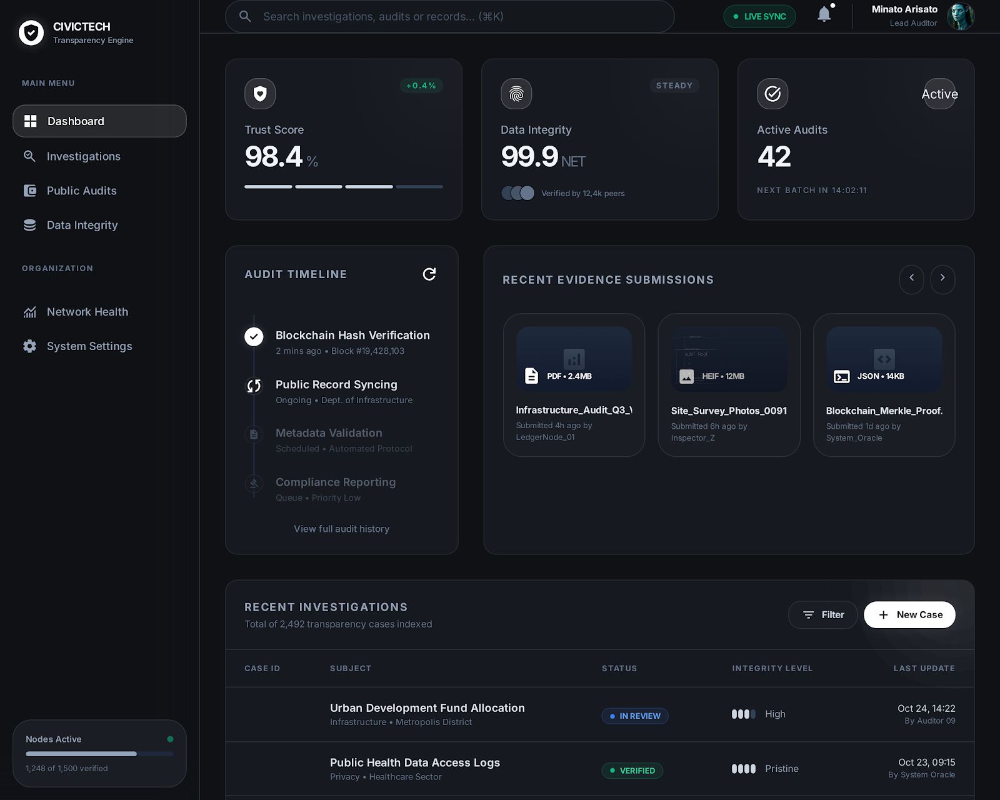

# CivicTech Peru (Working Title)

Civic tech open-source para Peru: transparencia, participacion y servicios publicos audit-first.

  

## Monorepo v5
- Rust (Axum) core API for audit-critical flows
- Next.js apps for public and admin surfaces
- OpenAPI contracts + SQL migrations + OpenTelemetry baseline
- Dual-MVP track: Transparency (A) and Reports/Verification (B)
- Municipality localize pack in `configs/municipalities/demo/`

## Principles
- Non-partisan, public-interest
- Auditability by default
- Privacy and data minimization
- Inclusive access (WhatsApp-first where needed)
- Open standards, open source

## Start here
- Docs: `docs/VISION.md`
- Docs index: `docs/README.md`
- Contributor onboarding: `CONTRIBUTOR_GUIDE.md`
- Architecture: `docs/ARCHITECTURE/OVERVIEW.md`
- Monorepo bootstrap: `docs/ARCHITECTURE/MONOREPO_BOOTSTRAP_v3.md`
- Decisions (ADR): `docs/DECISIONS/`
- RFCs: `docs/RFCS/`
- How to contribute: `CONTRIBUTING.md`
- Governance model: `GOVERNANCE.md`
- Maintainers and ownership: `MAINTAINERS.md`
- Code ownership rules: `.github/CODEOWNERS`

## Inspiration (Japan)
- Brigade model: local volunteer groups with structured support (Code for Japan).
- Replicable municipal services (e.g., 5374.jp pattern).
- Government design system and open repos (Japan Digital Agency).

## Roadmap
See `docs/ROADMAP_v1.md`.
Milestones: `docs/ROADMAP_MILESTONES_v1.md`.

## MVP Program (v2)
- MVP-A: municipal transparency (audit-first)
- MVP-B: report + evidence + verification (anti-corruption workflow)

Specs live in `docs/MVP/`.

## Repo layout
- `apps/`: Next.js product apps (`web`, `admin`)
- `crates/`: Rust core modules (api/domain/usecases/adapters)
- `packages/`: shared tokens and UI packages
- `infra/`: docker-compose, otel collector, SQL migrations
- `openapi/`: API contract (`public-api.yaml`)
- `configs/municipalities/`: per-municipality deployment packs

## Tooling defaults
- JavaScript package manager: `pnpm`
- Rust toolchain: stable (`rust-toolchain.toml`)

## Open-source baseline
- License: `MIT` (`LICENSE`)
- Governance: RFC + ADR + CODEOWNERS required for major changes
- Security handling: `SECURITY.md`
- Auth/RBAC baseline: Keycloak-compatible OIDC + role-protected admin/moderation endpoints
- Local OIDC validation: Keycloak realm import + RBAC smoke script
- Auth observability: Prometheus `/metrics` with HTTP + auth decision counters
- Local observability stack: Prometheus + Grafana provisioned in Docker
- Quality gates: `docs/ENGINEERING_QUALITY.md`
- Supply-chain security: Dependabot + CodeQL + gitleaks + SBOM scan
- Release automation: semantic versioning + `release-please` + `CHANGELOG.md`
- Operations baseline: SLOs + runbooks + alerts + dashboards (`docs/OPERATIONS/`)

## Run locally (v5 scaffold)
1. One-command bootstrap: `pnpm bootstrap`
2. Start API + apps:
   - split terminals: `pnpm api:dev` and `pnpm dev`
   - or one command: `pnpm dev:all`
3. Optional deterministic SQL seed: `pnpm db:seed`
4. Validate end-to-end: `pnpm smoke:e2e`
   - workflow-B focused checks (incl. invalid transitions): `pnpm smoke:workflow-b`
5. Dev auth token defaults:
   - admin: `dev-admin-token`
   - moderator: `dev-moderator-token`
6. OIDC auth test mode (Keycloak local):
   - set `AUTH_MODE=oidc` in `.env`
   - restart API
   - run `pnpm smoke:rbac`
7. Metrics endpoint:
   - `curl http://localhost:8080/metrics | head`
8. Observability stack:
   - `pnpm obs:up`
   - `pnpm obs:smoke`
   - `pnpm obs:validate`

## Golden path checks
- MVP-A ingest demo: `curl -X POST http://localhost:8080/admin/ingest/demo -H 'authorization: Bearer dev-admin-token'`
- MVP-B report flow:
  1. `curl -X POST http://localhost:8080/reports -H 'content-type: application/json' -d '{\"category\":\"OBRAS\",\"description\":\"Demo report\"}'`
  2. `curl -X POST http://localhost:8080/reports/<REPORT_ID>/submit`
  3. `curl -X POST http://localhost:8080/moderation/cases/<REPORT_ID>/triage -H 'authorization: Bearer dev-admin-token'`
  4. `curl -X POST http://localhost:8080/moderation/cases/<REPORT_ID>/verify -H 'authorization: Bearer dev-admin-token'`
  5. `curl -X POST http://localhost:8080/moderation/reports/<REPORT_ID>/publish -H 'authorization: Bearer dev-admin-token' -H 'content-type: application/json' -d '{\"public_text\":\"Reporte publicado (redactado)\"}'`
  6. Or run all checks: `pnpm smoke:e2e`

## OIDC / Keycloak quick commands
- `pnpm keycloak:wait`
- `pnpm keycloak:token:admin`
- `pnpm keycloak:token:moderator`
- `pnpm smoke:rbac`

## Observability quick commands
- `pnpm obs:up`
- `pnpm obs:smoke`
- `pnpm obs:validate`
