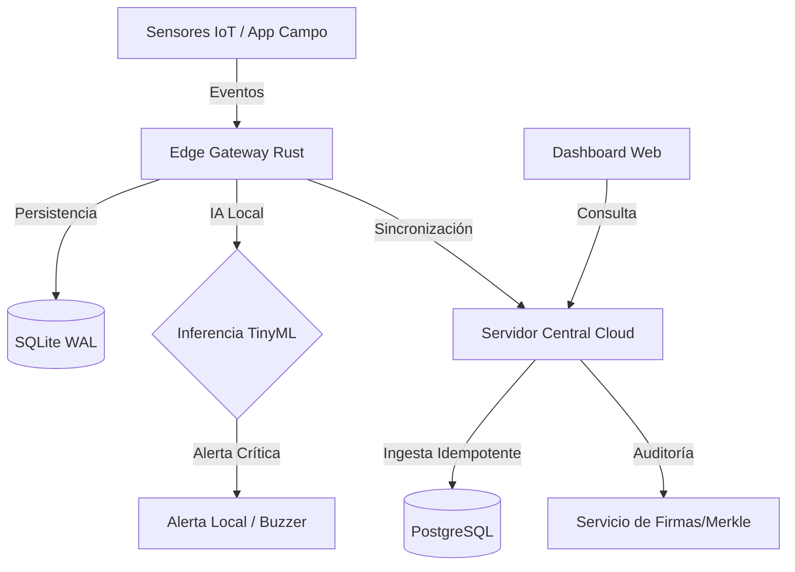

# Arquitectura Técnica - EdgeTraz Agro

Esta sección describe la arquitectura de sistemas, flujos de datos y estándares de codificación para el proyecto.

## 🔄 Flujo de Datos General (Mermaid)



## 🛠 Estándares de Documentación

### JSDoc (Frontend/Backend JS/TS)
Para componentes de la interfaz o microservicios en Node/Bun, se debe seguir este formato:

```javascript
/**
 * Procesa la sincronización de un lote de eventos desde el edge.
 * 
 * @async
 * @param {string} deviceId - Identificador único del dispositivo originador.
 * @param {Array<Object>} batch - Lista de eventos capturados offline.
 * @param {string} signature - Firma digital del lote para verificación.
 * @returns {Promise<Object>} Resultado de la operación con `acked_id`.
 * @throws {AuthError} Si la firma del dispositivo es inválida.
 * @throws {SyncError} Si hay inconsistencia en la cadena de hashes (hash-chain).
 * 
 * @example
 * const result = await syncEvents('DEV-001', [...], 'sig_abc123');
 */
async function syncEvents(deviceId, batch, signature) {
    // Implementación...
}
```

### Rustdoc (Edge Engine / Backend Rust)
Para el núcleo en Rust, utilizar documentación de tres barras `///`:

```rust
/// Representa un evento inmutable de trazabilidad.
///
/// # Fields
/// * `id` - ULID para ordenamiento temporal y unicidad offline.
/// * `prev_hash` - Hash del evento anterior para garantizar la integridad de la cadena.
///
/// # Errors
/// Retorna `IntegrityError` si el hash calculado no coincide con el payload firmado.
pub struct TraceEvent {
    pub id: Ulid,
    pub payload: serde_json::Value,
    pub signature: Vec<u8>,
}
```

## 📡 Protocolo de Sincronización
El protocolo utiliza **mTLS** y un esquema de **Batch-Ack**:
1. El Edge envía un bloque de N eventos.
2. El Servidor valida la integridad del bloque completo.
3. El Servidor responde con el `last_event_id` procesado exitosamente.
4. El Edge marca los eventos como sincronizados localmente.
